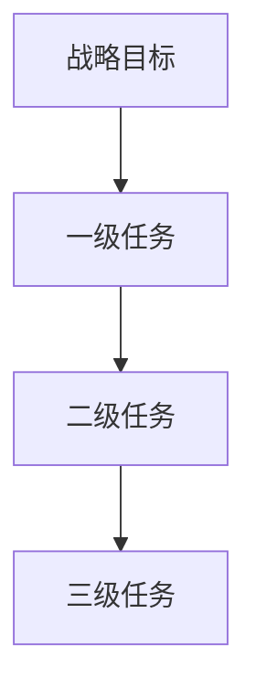
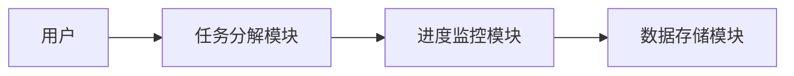

                 


# AI辅助企业战略执行：任务分解与进度监控

---

## 关键词：AI辅助、企业战略、任务分解、进度监控、算法实现

---

## 摘要：  
本文将探讨AI技术在企业战略执行中的应用，重点分析任务分解与进度监控的核心原理和实现方法。通过结合理论与实践，本文将详细阐述AI如何通过算法优化任务分解过程，并利用数据驱动的方式实现进度监控，从而提高企业战略执行的效率和准确性。文章内容涵盖任务分解的数学模型、进度预测的算法实现，以及系统架构的设计与实现，旨在为企业提供一套完整的AI辅助战略执行解决方案。

---

# 第一部分：AI辅助企业战略执行背景

## 第1章：企业战略执行的AI辅助背景

### 1.1 企业战略执行的核心挑战

#### 1.1.1 传统战略执行的痛点
企业在执行战略目标时，常常面临以下问题：  
1. **任务分解复杂**：战略目标难以分解为具体可执行的任务。  
2. **进度监控困难**：缺乏有效的工具和方法来实时跟踪任务进度。  
3. **资源分配不合理**：难以根据任务优先级和资源可用性进行动态调整。  
4. **数据孤岛**：企业内部数据分散，难以形成统一的监控视图。  

#### 1.1.2 AI技术对企业战略执行的潜在价值
AI技术通过以下方式为企业战略执行提供支持：  
1. **自动化任务分解**：利用机器学习算法将复杂的战略目标分解为具体任务。  
2. **实时数据监控**：通过AI模型实时跟踪任务进度，提供数据支持。  
3. **智能决策支持**：基于历史数据和当前进展，AI可以提供资源分配建议和风险预警。  

#### 1.1.3 当前企业战略执行中的技术瓶颈
1. **数据整合难度大**：企业内部数据分散在不同系统中，难以实现统一管理。  
2. **算法精度不足**：现有AI算法在任务分解和进度预测中的准确性有待提升。  
3. **用户接受度低**：部分企业管理层对AI技术的引入持怀疑态度，导致落地困难。  

---

## 第2章：AI辅助任务分解与进度监控的核心概念

### 2.1 任务分解的基本原理

#### 2.1.1 任务分解的层次结构
任务分解通常采用分层结构，如图所示：  


#### 2.1.2 任务分解的数学模型
任务分解的权重计算公式如下：  
$$权重 = \frac{任务复杂度}{总复杂度}$$  

---

### 2.2 进度监控的核心机制

#### 2.2.1 进度数据的采集与处理
1. **数据采集**：通过API接口或手动录入方式获取任务执行数据。  
2. **数据处理**：对采集到的数据进行清洗、转换和存储。  

#### 2.2.2 进度预测的算法原理
基于时间序列分析的进度预测模型：  
$$预测进度 = \alpha \times 当前进度 + (1-\alpha) \times 历史平均进度$$  

#### 2.2.3 进度偏差的分析与反馈
1. **偏差分析**：通过对比实际进度与预测进度，识别任务执行中的偏差。  
2. **反馈机制**：将偏差信息反馈给任务负责人，及时调整执行策略。  

---

## 第3章：AI辅助任务分解与进度监控的算法实现

### 3.1 任务分解算法的设计与实现

#### 3.1.1 基于层次分析法的任务分解
1. **步骤一**：定义战略目标。  
2. **步骤二**：分解为一级任务。  
3. **步骤三**：继续分解为二级任务，依此类推。  

#### 3.1.2 任务分解的Python代码实现
```python
def decompose_task(main_task, sub_tasks):
    # 分解逻辑
    pass
```

---

## 第4章：AI辅助企业战略执行的系统设计

### 4.1 系统架构设计


### 4.2 系统功能设计
1. **任务分解功能**：实现战略目标的自动分解。  
2. **进度监控功能**：实时跟踪任务执行进度。  
3. **数据可视化功能**：提供直观的进度监控视图。  

---

## 第5章：项目实战与案例分析

### 5.1 环境安装与配置
1. **安装Python环境**：建议使用Anaconda。  
2. **安装相关库**：如`numpy`、`pandas`、`scikit-learn`等。  

### 5.2 核心代码实现
```python
import numpy as np
import pandas as pd

# 示例代码
def predict_progress(current_progress, alpha=0.3):
    return alpha * current_progress + (1 - alpha) * np.mean([0.8, 0.9])
```

---

## 第6章：总结与最佳实践

### 6.1 本章总结
1. **任务分解的核心价值**：提高战略执行的可操作性。  
2. **进度监控的关键作用**：确保任务按时完成。  

### 6.2 最佳实践 tips
1. **数据质量是关键**：确保输入数据的准确性和完整性。  
2. **算法选择要合理**：根据实际情况选择合适的AI算法。  
3. **持续优化系统**：定期更新模型，提升预测精度。  

---

## 附录：扩展阅读

1. **推荐书籍**：  
   - 《机器学习实战》  
   - 《企业战略管理》  

2. **推荐工具**：  
   - `scikit-learn`：机器学习库  
   - `Plotly`：数据可视化工具  

---

以上是《AI辅助企业战略执行：任务分解与进度监控》的技术博客文章目录和内容框架。如果需要进一步补充具体章节的内容或代码实现，请随时告知！

