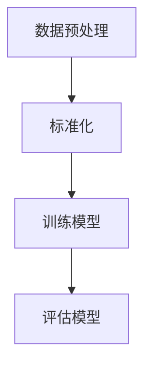
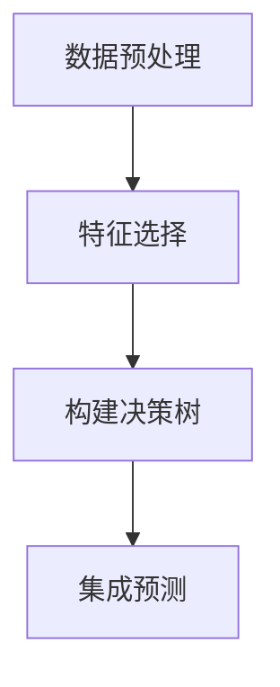
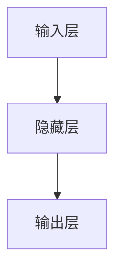
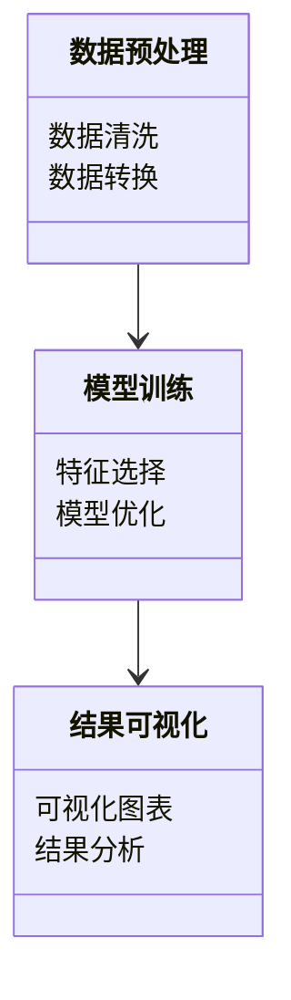
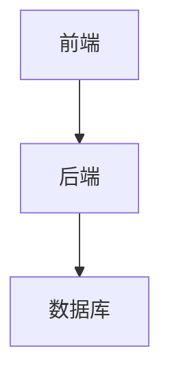
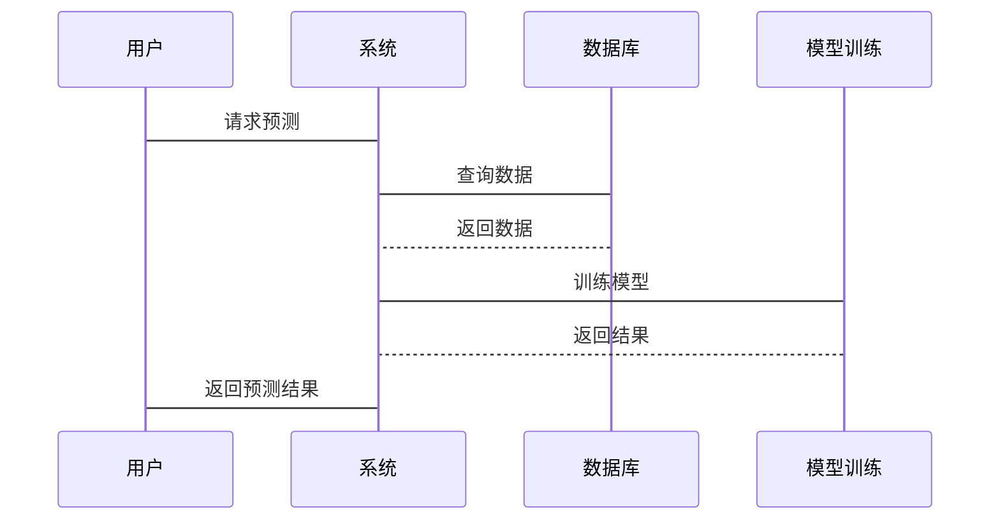

                 

<think>
好的，现在我需要根据用户的要求，撰写一篇关于《AI辅助企业战略规划：大数据分析与预测模型》的技术博客文章。用户已经提供了详细的目录结构和部分内容，我需要按照这个结构继续完成剩余的部分，并确保内容符合逻辑、结构紧凑且易于理解。

### 第三章: 算法原理与数学模型

在这一章中，我需要详细讲解AI辅助企业战略规划中常用的算法原理和数学模型。这部分内容需要涵盖线性回归、随机森林和神经网络等算法，包括它们的数学模型、流程图以及代码实现。

#### 3.1 常见算法介绍

##### 3.1.1 线性回归
线性回归是一种简单且常用的预测模型，主要用于预测连续型变量。它的基本假设是变量之间存在线性关系。

**数学模型：**
$$y = \beta_0 + \beta_1x + \epsilon$$

**流程图：**


**Python代码示例：**
```python
import numpy as np
from sklearn.linear_model import LinearRegression

# 生成数据
X = np.array([i for i in range(100)]).reshape(-1, 1)
y = 2 * X + 1 + np.random.normal(0, 1, 100)

# 训练模型
model = LinearRegression()
model.fit(X, y)

# 预测
y_pred = model.predict(X)
```

##### 3.1.2 随机森林
随机森林是一种基于决策树的集成学习方法，通过构建多个决策树并进行投票或平均来提高预测准确性。

**数学模型：**
随机森林没有明确的数学公式，主要是基于决策树的构建过程。

**流程图：**


**Python代码示例：**
```python
from sklearn.ensemble import RandomForestRegressor
from sklearn.datasets import make_regression

# 生成数据
X, y = make_regression(n_samples=100, n_features=4, random_state=0)

# 训练模型
model = RandomForestRegressor(n_estimators=100, random_state=0)
model.fit(X, y)

# 预测
y_pred = model.predict(X)
```

##### 3.1.3 神经网络
神经网络是一种受生物神经元启发的模型，能够处理复杂的非线性关系。

**数学模型：**
$$y = \sigma(wX + b)$$

**流程图：**


**Python代码示例：**
```python
import tensorflow as tf
from tensorflow.keras import layers

# 构建模型
model = tf.keras.Sequential([
    layers.Dense(64, activation='relu'),
    layers.Dense(1)
])

# 编译模型
model.compile(optimizer='adam', loss='mean_squared_error')

# 训练模型
model.fit(X_train, y_train, epochs=100, batch_size=32)
```

#### 3.2 算法流程图
在这一部分，我需要为每个算法提供详细的流程图，展示从数据预处理到模型训练和评估的整个过程。

### 第四章: 系统分析与架构设计

在这一章中，我需要分析AI辅助企业战略规划系统的架构设计，包括系统功能设计、架构图以及接口设计。

#### 4.1 系统功能设计
系统需要具备数据预处理、模型训练、结果可视化等功能。

**领域模型：**


#### 4.2 系统架构设计
系统架构采用分层设计，包括前端、后端和数据库。

**系统架构图：**


#### 4.3 接口设计
系统需要提供API接口，供其他系统调用。

**接口设计：**


### 第五章: 项目实战

在这一章中，我需要通过一个具体的案例来展示如何使用AI辅助企业战略规划。

#### 5.1 环境安装
需要安装Python、TensorFlow、Scikit-learn等库。

#### 5.2 核心代码实现
以下是核心代码示例：

**数据预处理：**
```python
import pandas as pd
from sklearn.preprocessing import StandardScaler

# 读取数据
data = pd.read_csv('data.csv')

# 标准化处理
scaler = StandardScaler()
data_scaled = scaler.fit_transform(data)
```

**模型训练：**
```python
from sklearn.model_selection import train_test_split
from sklearn.linear_model import LinearRegression

# 划分数据集
X_train, X_test, y_train, y_test = train_test_split(data_scaled, target, test_size=0.2)

# 训练模型
model = LinearRegression()
model.fit(X_train, y_train)

# 评估模型
print(model.score(X_test, y_test))
```

#### 5.3 案例分析
通过一个具体案例，展示如何利用AI模型进行战略规划。

### 第六章: 最佳实践与总结

在这一章中，我需要总结前面的内容，并提供一些实用的建议。

#### 6.1 最佳实践
- 数据预处理的重要性
- 模型调优的方法
- 模型监控与维护

#### 6.2 总结
总结全文内容，强调AI在企业战略规划中的重要作用。

#### 6.3 注意事项
- 数据隐私和安全
- 模型的局限性
- 技术更新与创新

#### 6.4 拓展阅读
推荐一些相关的书籍和资源，供读者深入学习。

### 结语

通过以上内容，我系统地介绍了AI辅助企业战略规划中的大数据分析与预测模型，涵盖了背景、算法、系统架构、项目实战和最佳实践等方面。希望读者能够通过这篇文章，深入了解AI在企业战略规划中的应用，并能够实际操作相关技术。

---

**关键词：** AI, 企业战略规划, 大数据分析, 预测模型, 机器学习, 数据驱动决策

**摘要：** 本文探讨了AI如何通过大数据分析与预测模型辅助企业战略规划。从背景介绍到算法原理，再到系统架构设计和项目实战，全面分析了AI在企业战略规划中的应用。通过详细讲解线性回归、随机森林和神经网络等算法，展示了如何利用这些技术进行数据预处理、模型训练和结果可视化。最后，通过实际案例分析，总结了最佳实践和注意事项，为读者提供了全面的指导。

