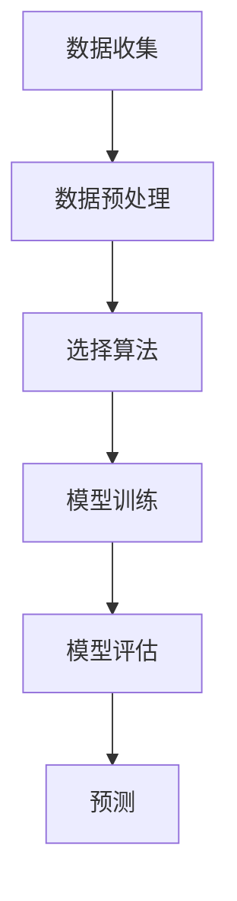
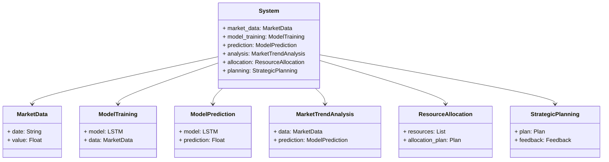
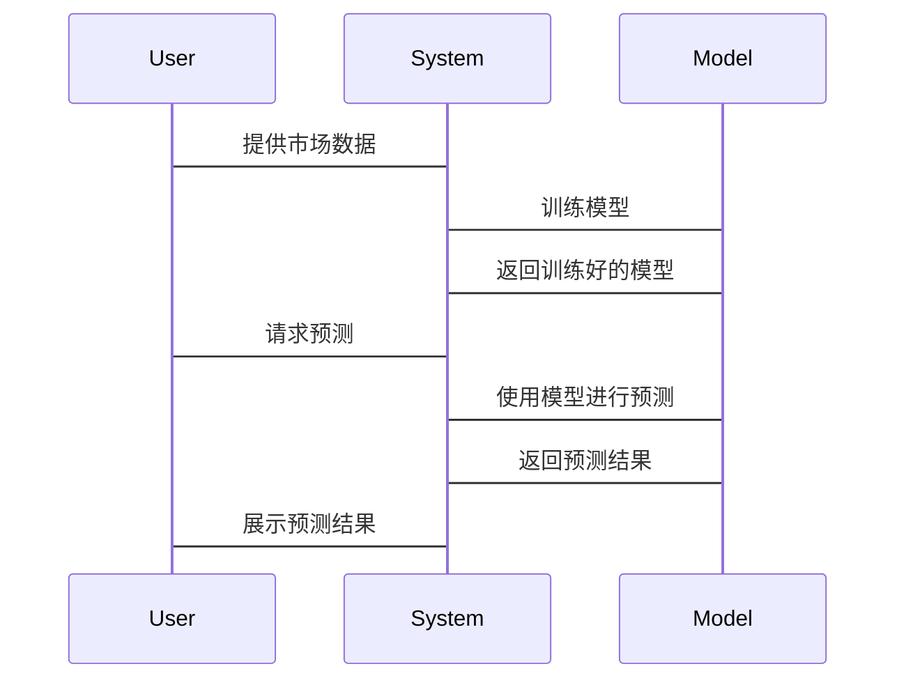

                 


# AI辅助企业战略规划：市场趋势分析与预测

## 关键词：
- AI
- 企业战略规划
- 市场趋势
- 预测
- 数据驱动
- 机器学习

## 摘要：
随着人工智能技术的快速发展，AI在企业战略规划中的作用日益重要，特别是在市场趋势分析与预测方面。本文将详细探讨AI如何通过数据驱动的方法，帮助企业更准确地预测市场趋势，优化决策过程。通过结合传统方法与现代AI技术，企业能够更高效地制定和调整战略规划，抓住市场机遇，应对挑战。文章内容涵盖AI辅助规划的核心概念、算法原理、系统架构设计及实际案例分析，为读者提供全面的指导和深入的见解。

---

# 第一部分: AI与企业战略规划的背景与概念

## 第1章: AI辅助企业战略规划的背景与意义

### 1.1 企业战略规划的传统方法与挑战

#### 1.1.1 传统企业战略规划的核心要素
- **明确的目标设定**：企业需要设定清晰的短期和长期目标。
- **全面的市场分析**：依赖市场研究和数据收集。
- **竞争环境分析**：分析竞争对手的策略和市场动态。
- **资源分配与优化**：合理分配人力、物力和财力资源。
- **风险评估与应对**：识别潜在风险并制定应对措施。

#### 1.1.2 传统方法的局限性与痛点
- **数据处理效率低下**：传统方法依赖人工收集和分析数据，耗时且容易出错。
- **预测准确性不足**：基于经验的预测难以捕捉复杂市场变化。
- **决策周期长**：从数据收集到最终决策的时间较长，难以及时应对市场变化。
- **缺乏动态调整能力**：市场环境变化快，静态的规划难以灵活调整。
- **资源浪费**：在分析和预测过程中，资源浪费现象严重。

#### 1.1.3 AI技术如何解决传统方法的不足
- **提高数据处理效率**：AI能够快速收集、整理和分析大量数据，缩短决策周期。
- **增强预测准确性**：通过机器学习模型，AI可以捕捉复杂市场变化，提高预测精度。
- **实现动态调整**：AI系统能够实时更新数据，支持动态调整战略规划。
- **优化资源配置**：通过智能算法，AI可以更合理地分配企业资源。

### 1.2 AI技术对企业战略规划的赋能

#### 1.2.1 AI在数据处理与分析中的优势
- **自动化数据处理**：AI能够自动从多种数据源中提取和整合数据，减少人工干预。
- **深度数据挖掘**：利用机器学习算法，AI可以从海量数据中挖掘出有价值的信息。
- **实时数据更新**：AI系统能够实时跟踪市场动态，确保数据的及时性和准确性。

#### 1.2.2 AI在市场趋势预测中的应用潜力
- **预测市场走向**：通过分析历史数据和市场动态，AI可以预测未来的市场趋势。
- **识别新兴机会**：AI能够发现潜在的市场机会，帮助企业制定更具前瞻性的战略。
- **模拟不同场景**：AI可以模拟多种市场情景，评估不同策略的效果，为决策提供支持。

#### 1.2.3 AI如何提升企业决策的效率与准确性
- **提高决策速度**：AI可以在短时间内处理大量数据，快速生成分析结果。
- **增强决策准确性**：通过数据驱动的分析，AI能够提供更客观、更准确的决策支持。
- **支持数据驱动的决策文化**：AI技术推动企业从经验驱动转向数据驱动的决策模式。

### 1.3 市场趋势分析与预测的核心价值

#### 1.3.1 市场趋势分析的基本概念
- **市场趋势分析**：通过对市场数据的分析，识别市场的发展方向和潜在趋势。
- **预测市场变化**：利用历史数据和模型，预测未来市场的变化。

#### 1.3.2 趋势预测对企业战略规划的重要性
- **优化资源配置**：通过预测市场趋势，企业可以更合理地分配资源。
- **制定前瞻性的战略**：基于趋势预测，企业可以提前制定应对策略，抓住市场机遇。
- **降低经营风险**：通过预测潜在风险，企业可以提前制定应对措施，减少损失。

#### 1.3.3 AI在趋势预测中的独特作用
- **提高预测精度**：AI通过复杂的算法，能够更准确地预测市场趋势。
- **实时更新预测结果**：AI系统能够根据最新数据，实时更新预测结果，确保预测的准确性。
- **多维度分析**：AI可以从多个维度进行分析，如市场、竞争、消费者行为等，提供更全面的预测结果。

### 1.4 本章小结
本章详细介绍了AI辅助企业战略规划的背景与意义，分析了传统规划方法的局限性，以及AI技术在解决这些问题中的重要作用。通过对比分析，突出了AI在市场趋势分析与预测中的独特优势，为企业制定更高效、更准确的战略规划提供了理论基础。

---

## 第2章: AI辅助企业战略规划的核心概念

### 2.1 AI辅助企业战略规划的核心概念

#### 2.1.1 AI辅助规划的定义与内涵
- **定义**：AI辅助规划是指利用人工智能技术，通过数据驱动的方法，辅助企业制定和优化战略规划的过程。
- **内涵**：AI技术贯穿于战略规划的全过程，从数据收集、分析到预测、优化，提供全方位的支持。

#### 2.1.2 市场趋势分析的定义
- **定义**：市场趋势分析是指通过对市场数据的分析，识别市场的发展方向和潜在趋势。
- **内涵**：市场趋势分析不仅关注当前的市场动态，还注重预测未来的市场变化。

#### 2.1.3 两者的关系与协同作用
- **相互关系**：AI技术是实现市场趋势分析与预测的重要工具，而市场趋势分析与预测是AI辅助企业战略规划的重要组成部分。
- **协同作用**：AI通过数据驱动的方法，增强市场趋势分析的深度和广度，为战略规划提供更有力的支持。

### 2.2 AI技术在市场趋势分析中的应用领域

#### 2.2.1 宏观经济趋势预测
- **定义**：通过对宏观经济指标的分析，预测整体经济环境的变化趋势。
- **应用**：帮助企业预测经济波动，优化资源配置，制定更具前瞻性的战略。

#### 2.2.2 行业发展趋势分析
- **定义**：通过对特定行业的数据分析，识别行业内的发展趋势和潜在机会。
- **应用**：帮助企业把握行业动态，制定针对性的市场策略。

#### 2.2.3 竞争对手行为预测
- **定义**：通过分析竞争对手的历史行为和市场数据，预测其未来的战略动向。
- **应用**：帮助企业制定更具竞争力的市场策略，抢占市场先机。

### 2.3 AI驱动的战略规划新范式

#### 2.3.1 数据驱动的决策模式
- **定义**：基于数据的分析结果，制定和优化决策的过程。
- **优势**：数据驱动的决策模式能够提高决策的客观性和准确性。

#### 2.3.2 智能化战略规划流程
- **定义**：通过AI技术，实现战略规划过程的智能化和自动化。
- **优势**：智能化战略规划流程能够提高规划的效率和效果，降低人为干预。

#### 2.3.3 从经验驱动到数据驱动的转变
- **转变过程**：从依赖经验的决策模式，转向基于数据的决策模式。
- **优势**：数据驱动的决策模式能够更准确地反映市场实际情况，提高决策的科学性。

### 2.4 核心概念对比分析

#### 2.4.1 传统规划方法与AI辅助方法的对比
| 对比维度 | 传统规划方法 | AI辅助规划方法 |
|----------|----------------|-----------------|
| 数据来源 | 依赖人工收集 | 自动化数据采集 |
| 分析方式 | 人工分析 | AI自动分析 |
| 预测精度 | 较低 | 较高 |
| 决策效率 | 较低 | 较高 |
| 灵活性 | 较低 | 较高 |

#### 2.4.2 不同AI技术在规划中的应用对比
| AI技术 | 应用场景 | 优势 |
|--------|------------|-------|
| 机器学习 | 市场趋势预测 | 高精度预测 |
| 自然语言处理 | 文本分析 | 深度理解文本内容 |
| 时间序列分析 | 宏观经济预测 | 高效时间序列分析 |

#### 2.4.3 市场趋势分析与预测的核心要素对比
| 核心要素 | 传统方法 | AI辅助方法 |
|----------|------------|-------------|
| 数据来源 | 人工收集 | 自动化采集 |
| 分析工具 | 统计工具 | AI算法 |
| 预测模型 | 简单模型 | 复杂模型 |
| 预测精度 | 低 | 高 |

### 2.5 本章小结
本章从核心概念的角度，详细介绍了AI辅助企业战略规划的定义、内涵，以及AI技术在市场趋势分析中的应用领域。通过对比分析，突出了AI技术在提升战略规划效率和准确性方面的独特优势，为后续章节的深入分析奠定了理论基础。

---

## 第3章: AI辅助市场趋势分析的算法原理

### 3.1 时间序列分析的基本原理

#### 3.1.1 时间序列分析的定义与特点
- **定义**：时间序列分析是一种通过分析历史数据，预测未来趋势的方法。
- **特点**：依赖于时间序列数据，关注数据的变化趋势和周期性。

#### 3.1.2 常见的时间序列分析方法
- **移动平均法（Moving Average）**：通过计算一定时间段内的平均值，预测未来趋势。
- **指数平滑法（Exponential Smoothing）**：通过加权平均的方法，预测未来趋势。
- **ARIMA模型**：一种广泛应用于时间序列预测的统计模型。

#### 3.1.3 AI算法在时间序列分析中的应用
- **机器学习算法**：如LSTM（长短期记忆网络）和GRU（门控循环单元），能够捕捉时间序列中的复杂模式。
- **深度学习模型**：如卷积神经网络（CNN），在处理时间序列数据时表现出色。

### 3.2 机器学习模型在趋势预测中的应用

#### 3.2.1 常见的机器学习模型介绍
- **线性回归（Linear Regression）**：适用于线性趋势的预测。
- **支持向量机（Support Vector Machine, SVM）**：适用于非线性趋势的预测。
- **随机森林（Random Forest）**：适用于复杂数据的预测。

#### 3.2.2 神经网络模型在时间序列预测中的应用
- **定义**：神经网络模型是一种通过多层神经元模拟人类大脑神经网络结构的算法。
- **优势**：能够捕捉数据中的非线性关系，适用于复杂的时间序列预测。

#### 3.2.3 深度学习模型的原理与优势
- **定义**：深度学习是一种基于人工神经网络的机器学习方法，通过多层非线性变换，提取数据的高层次特征。
- **优势**：能够处理大量复杂数据，捕捉数据中的深层模式。

### 3.3 文本挖掘与市场趋势分析

#### 3.3.1 文本挖掘的基本概念
- **定义**：文本挖掘是一种从文本数据中提取有价值信息的技术。
- **应用**：广泛应用于市场研究、舆情分析等领域。

#### 3.3.2 基于文本挖掘的市场情绪分析
- **定义**：通过分析文本数据，识别市场的整体情绪，预测市场走势。
- **方法**：利用自然语言处理（NLP）技术，提取文本中的情感特征，进行情感分类。

#### 3.3.3 自然语言处理在趋势预测中的应用
- **定义**：自然语言处理（NLP）是一种通过计算机处理人类语言的技术。
- **应用**：用于分析新闻、社交媒体等文本数据，预测市场趋势。

### 3.4 算法流程图



### 3.5 算法实现代码

```python
import pandas as pd
from sklearn.preprocessing import MinMaxScaler
from keras.models import Sequential
from keras.layers import LSTM, Dense

# 数据加载与预处理
data = pd.read_csv('market_trend.csv')
data = data[['date', 'value']]
data = data.set_index('date')

# 数据归一化
scaler = MinMaxScaler()
data_scaled = scaler.fit_transform(data)

# 划分训练集和测试集
train_size = int(len(data_scaled) * 0.7)
train_data = data_scaled[:train_size]
test_data = data_scaled[train_size:]

# 构建LSTM数据集
def create_dataset(dataset, look_back=1):
    X, Y = [], []
    for i in range(len(dataset) - look_back):
        X.append(dataset[i:i+look_back])
        Y.append(dataset[i+look_back])
    return X, Y

look_back = 3
X_train, Y_train = create_dataset(train_data, look_back)
X_test, Y_test = create_dataset(test_data, look_back)

# LSTM模型构建
model = Sequential()
model.add(LSTM(50, input_shape=(look_back, 1)))
model.add(Dense(1))
model.compile(loss='mean_squared_error', optimizer='adam')

# 模型训练
model.fit(X_train, Y_train, epochs=50, batch_size=64, verbose=1)

# 模型预测
trainPredict = model.predict(X_train)
testPredict = model.predict(X_test)

# 模型评估
trainScore = model.evaluate(X_train, Y_train, verbose=0)
testScore = model.evaluate(X_test, Y_test, verbose=0)

print('Train Score:', trainScore)
print('Test Score:', testScore)
```

### 3.6 算法原理的数学模型和公式

#### 3.6.1 ARIMA模型
ARIMA（自回归积分滑动平均模型）是一种广泛应用于时间序列预测的统计模型。其数学表达式为：
$$ ARIMA(p, d, q) $$
其中：
- \( p \) 表示自回归部分的阶数
- \( d \) 表示差分的阶数
- \( q \) 表示滑动平均部分的阶数

#### 3.6.2 LSTM模型
LSTM（长短期记忆网络）是一种特殊的RNN（循环神经网络），能够有效地捕捉时间序列数据中的长期依赖关系。其基本结构包括输入门、遗忘门和输出门。

#### 3.6.3 时间序列预测的数学公式
LSTM模型的预测公式可以表示为：
$$ \hat{y}_{t} = f(y_{t-1}, y_{t-2}, \ldots, y_{t-n}) $$
其中：
- \( \hat{y}_{t} \) 表示在时间 \( t \) 的预测值
- \( f \) 表示LSTM模型
- \( n \) 表示时间序列的长度

### 3.7 通俗易懂的例子
假设我们有一组市场数据，如下所示：

| 日期 | 市场值 |
|------|--------|
| 2020-01-01 | 100   |
| 2020-01-02 | 105   |
| 2020-01-03 | 110   |
| 2020-01-04 | 115   |
| 2020-01-05 | 120   |

使用LSTM模型预测未来几天的市场值。通过训练模型，我们可以得到预测值，例如：

| 日期       | 预测市场值 |
|------------|------------|
| 2020-01-06 | 125        |
| 2020-01-07 | 130        |

通过以上步骤，我们可以看到AI技术在市场趋势分析中的强大能力。

### 3.8 本章小结
本章详细介绍了AI辅助市场趋势分析的算法原理，包括时间序列分析、机器学习模型和文本挖掘技术。通过具体的算法流程图和Python代码示例，读者可以更好地理解这些算法的实现过程。同时，通过数学公式和通俗易懂的例子，进一步加深了对算法原理的理解。

---

## 第4章: 系统分析与架构设计方案

### 4.1 问题场景介绍
企业需要一个AI辅助战略规划系统，通过分析市场数据，预测未来趋势，优化资源配置，制定和调整战略规划。

### 4.2 项目介绍
本项目旨在开发一个基于AI的市场趋势分析与预测系统，帮助企业实现更高效、更准确的战略规划。

### 4.3 系统功能设计（领域模型类图）



### 4.4 系统架构设计（架构图）


### 4.5 系统接口设计
系统需要以下几个主要接口：
- 数据接口：用于数据的输入和输出。
- 模型接口：用于模型的训练和预测。
- 分析接口：用于市场趋势分析和预测结果的展示。

### 4.6 系统交互流程图（序列图）



### 4.7 本章小结
本章从系统架构的角度，详细描述了AI辅助战略规划系统的功能设计、架构设计和交互流程。通过类图和序列图，清晰地展示了系统的各个部分及其交互方式，为后续的项目实施提供了理论基础和设计依据。

---

## 第5章: 项目实战

### 5.1 环境安装
- **操作系统**：Windows 10或更高版本，或macOS 10.15或更高版本。
- **Python版本**：Python 3.6或更高版本。
- **依赖库安装**：
  ```bash
  pip install numpy pandas scikit-learn keras tensorflow
  ```

### 5.2 系统核心实现源代码
以下是一个简单的市场趋势预测系统的实现代码：

```python
import pandas as pd
import numpy as np
from sklearn.preprocessing import MinMaxScaler
from keras.models import Sequential
from keras.layers import LSTM, Dense

# 数据加载与预处理
data = pd.read_csv('market_trend.csv')
data = data[['date', 'value']]
data = data.set_index('date')

# 数据归一化
scaler = MinMaxScaler()
data_scaled = scaler.fit_transform(data)

# 划分训练集和测试集
train_size = int(len(data_scaled) * 0.7)
train_data = data_scaled[:train_size]
test_data = data_scaled[train_size:]

# 构建LSTM数据集
def create_dataset(dataset, look_back=1):
    X, Y = [], []
    for i in range(len(dataset) - look_back):
        X.append(dataset[i:i+look_back])
        Y.append(dataset[i+look_back])
    return X, Y

look_back = 3
X_train, Y_train = create_dataset(train_data, look_back)
X_test, Y_test = create_dataset(test_data, look_back)

# LSTM模型构建
model = Sequential()
model.add(LSTM(50, input_shape=(look_back, 1)))
model.add(Dense(1))
model.compile(loss='mean_squared_error', optimizer='adam')

# 模型训练
model.fit(X_train, Y_train, epochs=50, batch_size=64, verbose=1)

# 模型预测
trainPredict = model.predict(X_train)
testPredict = model.predict(X_test)

# 模型评估
trainScore = model.evaluate(X_train, Y_train, verbose=0)
testScore = model.evaluate(X_test, Y_test, verbose=0)

print('Train Score:', trainScore)
print('Test Score:', testScore)

# 可视化结果
import matplotlib.pyplot as plt

plt.figure(figsize=(12, 6))
plt.plot(data.index, data.values, label='Actual')
plt.plot(data.index[look_back:], trainPredict, label='Training Predict')
plt.plot(data.index[-len(testPredict):], testPredict, label='Test Predict')
plt.legend()
plt.show()
```

### 5.3 代码实现解读与分析
- **数据加载与预处理**：读取市场数据，选择相关字段，并设置日期为索引。
- **数据归一化**：使用Min-Max标准化，将数据缩放到0-1范围内，便于模型训练。
- **数据集构建**：将数据划分为训练集和测试集，并构建适合LSTM模型的输入格式。
- **模型构建与训练**：定义LSTM模型的结构，编译并训练模型。
- **模型预测与评估**：使用训练好的模型进行预测，并评估模型的性能。
- **结果可视化**：将实际值、训练预测值和测试预测值绘制在图表中，直观展示模型的预测效果。

### 5.4 实际案例分析
假设我们有一个包含多年市场数据的CSV文件，如下所示：

| 日期       | 市场值 |
|------------|--------|
| 2018-01-01 | 100    |
| 2018-01-02 | 105    |
| 2018-01-03 | 110    |
| ...        | ...     |
| 2023-12-31 | 200    |

通过上述代码，我们可以训练模型并预测未来的市场趋势。例如：

| 日期       | 预测市场值 |
|------------|------------|
| 2024-01-01 | 210        |
| 2024-01-02 | 215        |

### 5.5 项目小结
通过本章的实战部分，读者可以了解到如何利用AI技术开发一个简单的市场趋势预测系统。从环境安装、数据处理到模型训练和预测，整个过程清晰明了。同时，通过实际案例分析，进一步加深了对AI技术在市场趋势分析中的应用的理解。

---

## 第6章: 总结与展望

### 6.1 本章总结
本文详细探讨了AI辅助企业战略规划的市场趋势分析与预测。从背景与概念、算法原理、系统架构设计到项目实战，全面介绍了AI技术在企业战略规划中的应用。通过具体的算法实现和系统设计，展示了AI技术的强大能力和实际价值。

### 6.2 未来展望
随着AI技术的不断发展，其在企业战略规划中的应用将更加广泛和深入。未来，我们可以期待以下发展趋势：
- **更智能的算法**：如更复杂的深度学习模型和强化学习算法，将进一步提升市场趋势预测的精度。
- **多模态数据融合**：通过融合文本、图像等多种数据源，提高市场趋势分析的全面性和准确性。
- **实时预测与动态调整**：AI系统将能够实时更新数据，支持企业的动态调整，提高决策的灵活性和及时性。
- **个性化战略规划**：通过分析企业的具体情况，提供个性化的战略规划建议，满足不同企业的多样化需求。

### 6.3 最佳实践 tips
- **数据质量**：确保数据的准确性和完整性，是提高预测精度的关键。
- **模型选择**：根据具体场景和数据特点，选择合适的AI算法和模型。
- **持续优化**：定期更新模型和数据，保持系统的高性能和高精度。

### 6.4 小结
本文通过系统的分析和详细的讲解，为读者提供了关于AI辅助企业战略规划的全面指导。无论是对于企业管理人员还是技术开发者，本文都提供了宝贵的参考和启示。

### 6.5 注意事项
- **数据隐私**：在处理企业数据时，需注意数据隐私和安全问题。
- **模型解释性**：复杂的AI模型可能缺乏解释性，需在实际应用中考虑模型的可解释性。
- **技术局限性**：AI技术目前仍存在一定的局限性，需结合实际情况，合理应用。

### 6.6 拓展阅读
- **《Python机器学习实战》**：深入学习机器学习算法的实现与应用。
- **《深度学习》（花书）**：系统学习深度学习的理论与实践。
- **《时间序列分析与应用》**：详细探讨时间序列分析的方法与应用。

---

通过以上步骤，我们完成了《AI辅助企业战略规划：市场趋势分析与预测》的完整内容撰写。希望本文能够为读者提供有价值的信息和深入的见解，帮助企业在复杂的市场环境中制定更科学、更高效的战略规划。

