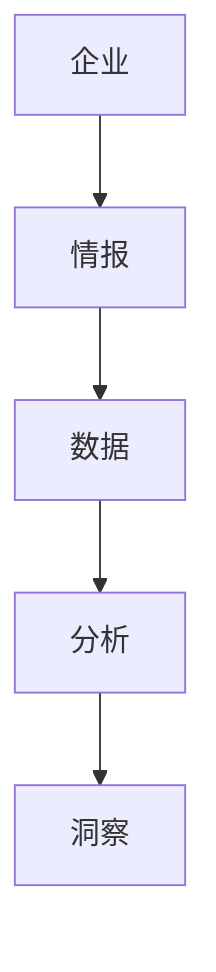
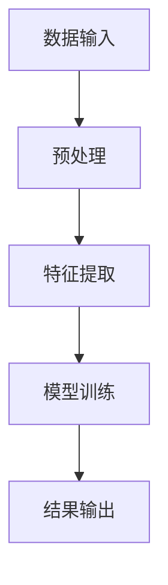
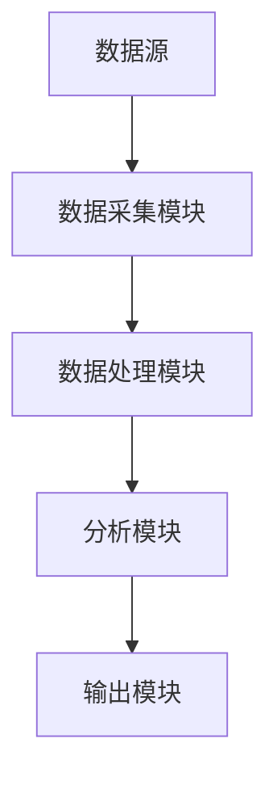

                 


# AI辅助企业竞争情报分析：自动化数据收集与洞察生成

---

## 关键词：AI，竞争情报分析，数据收集，洞察生成，自动化，企业情报

---

## 摘要：  
本文深入探讨了AI技术在企业竞争情报分析中的应用，重点介绍了如何利用自动化数据收集与洞察生成技术提升企业竞争力。文章从背景、核心概念、算法原理、系统架构到项目实战，层层解析，为企业提供了一套完整的解决方案。通过本文，读者可以全面理解AI在竞争情报分析中的潜力，并掌握实际应用的方法与技巧。

---

## 第一部分：AI辅助企业竞争情报分析基础

### 第1章：问题背景与定义

#### 1.1 问题背景
企业竞争情报分析是企业在市场中获取竞争对手信息、行业趋势、客户行为等关键数据的过程。然而，传统的情报分析方法效率低、耗时长，且容易受到主观因素的干扰。随着AI技术的快速发展，自动化数据收集与智能化洞察生成为企业提供了更高效、更精准的解决方案。

#### 1.2 AI辅助竞争情报分析的定义
AI辅助竞争情报分析是指利用人工智能技术，通过自动化手段收集、处理和分析竞争对手、市场趋势等数据，并生成有价值的洞察，帮助企业制定更有效的战略决策。

#### 1.3 问题解决与边界
- **问题解决**：AI技术可以自动识别和提取关键信息，减少人工干预，提高数据处理效率。
- **边界与外延**：AI辅助竞争情报分析主要关注结构化和半结构化的数据，对于非结构化数据的处理能力有限。
- **核心要素**：包括数据源、AI算法、分析模型和结果输出。

---

### 第2章：核心概念与联系

#### 2.1 核心概念原理
- **自动化数据收集**：通过爬虫、API接口等手段，自动获取竞争对手的产品信息、市场动态等数据。
- **智能化洞察生成**：利用NLP和机器学习技术，从海量数据中提取关键信息，并生成竞争分析报告。

#### 2.2 核心概念属性对比
| 对比维度 | 数据收集 | 洞察生成 |
|----------|-----------|-----------|
| **数据类型** | 结构化、非结构化 | 结构化 |
| **处理方式** | 自动化、半自动化 | 自动化、智能化 |
| **目标** | 获取原始数据 | 提供决策支持 |

#### 2.3 ER实体关系图


---

## 第二部分：算法原理讲解

### 第3章：算法原理概述

#### 3.1 自然语言处理（NLP）在数据收集中的应用
- **文本清洗**：去除无关信息，提取关键词。
- **实体识别**：识别公司名称、产品名称等实体。
- **情感分析**：分析客户对产品的评价情绪。

#### 3.2 机器学习在洞察生成中的作用
- **分类算法**：预测竞争对手的市场策略。
- **聚类算法**：将市场动态分为不同类别，便于分析。

#### 3.3 算法流程图


#### 3.4 算法实现代码
```python
# 示例代码：简单的NLP数据处理
import numpy as np
from

---

## 第三部分：系统分析与架构设计

### 第4章：系统分析与架构设计

#### 4.1 问题场景介绍
企业需要实时监控竞争对手的产品发布、市场活动等信息，并快速生成竞争报告。

#### 4.2 系统功能设计
- **数据采集模块**：负责从多种数据源获取信息。
- **数据处理模块**：清洗和转换数据。
- **分析模块**：利用AI算法生成洞察。

#### 4.3 系统架构图


#### 4.4 接口设计与交互流程
- **接口设计**：API接口用于数据采集和结果输出。
- **交互流程**：用户提交查询，系统返回分析结果。

---

## 第四部分：项目实战

### 第5章：项目实战

#### 5.1 环境安装
- **工具安装**：安装Python、Numpy、Scikit-learn等库。

#### 5.2 核心代码实现
```python
import requests
from bs4 import BeautifulSoup

# 示例代码：爬取竞争对手的产品信息
url = "https://example.com/products"
response = requests.get(url)
soup = BeautifulSoup(response.text, "html.parser")
products = soup.find_all("div", class_="product-info")
for product in products:
    print(product.text)
```

#### 5.3 案例分析
- **案例背景**：某企业需要分析竞争对手的新产品发布情况。
- **分析过程**：利用爬虫获取产品信息，通过NLP提取关键词，生成竞争报告。

---

## 第五部分：总结与展望

### 第6章：总结与展望

#### 6.1 最佳实践
- **数据源选择**：优先选择高质量的数据源。
- **算法优化**：根据具体场景选择合适的算法。

#### 6.2 小结
AI技术在企业竞争情报分析中的应用前景广阔，能够显著提升企业的数据处理效率和决策能力。

#### 6.3 注意事项
- **数据隐私**：确保数据收集符合法律法规。
- **模型优化**：持续优化算法以适应新的数据变化。

#### 6.4 拓展阅读
推荐阅读《竞争情报分析的现代方法》和《人工智能在商业中的应用》。

---

通过以上内容，我们可以看到，AI辅助企业竞争情报分析不仅能够提高数据处理效率，还能为企业提供更精准的市场洞察。希望本文能够为企业在竞争情报分析领域的实践提供有价值的参考。

