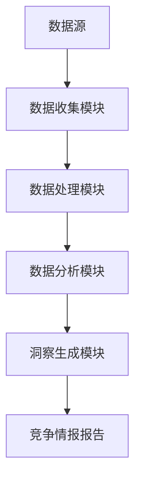

                 


# AI辅助企业竞争情报分析：自动化数据收集与洞察生成系统

## 关键词：AI, 竞争情报分析, 数据收集, 自动化, 洞察生成, 企业情报系统, 自然语言处理

## 摘要：  
随着市场竞争的加剧，企业竞争情报分析变得至关重要。AI技术的应用使得竞争情报分析更加高效和精准。本文详细探讨了AI在企业竞争情报分析中的应用，包括自动化数据收集、数据分析与洞察生成的系统架构，以及实际案例分析。通过结合自然语言处理、机器学习和知识图谱等技术，本文提供了一套完整的竞争情报分析解决方案，帮助企业快速获取市场动态，制定精准的战略决策。

---

# 引言

## 1.1 竞争情报分析的背景与重要性  
企业竞争情报分析是指通过收集、整理、分析竞争对手及市场相关信息，为企业制定战略决策提供支持的过程。在当前全球化和信息化的商业环境中，竞争情报分析已成为企业获取竞争优势的重要手段。然而，传统的人工情报收集和分析方法效率低下，难以应对海量数据和复杂市场环境的挑战。AI技术的应用为企业提供了自动化、智能化的竞争情报分析解决方案，显著提升了数据分析的效率和准确性。

---

## 1.2 AI在竞争情报分析中的应用前景  
AI技术，特别是自然语言处理（NLP）、机器学习和知识图谱等技术，为企业竞争情报分析带来了革命性的变化。通过自动化数据收集、智能数据分析和自动生成洞察，AI系统能够帮助企业快速识别市场趋势、竞争对手动态以及潜在的商业机会。本文将从技术原理、系统设计和实际应用等多个角度，全面探讨AI辅助企业竞争情报分析的实现方法。

---

# 第2章：竞争情报分析的核心概念与技术

## 2.1 竞争情报分析的核心概念  
竞争情报分析的核心目标是通过收集、整理和分析竞争对手及市场的相关信息，为企业提供决策支持。其主要涵盖以下几个方面：  
1. **竞争对手分析**：了解竞争对手的产品、市场策略、市场份额等信息。  
2. **市场趋势分析**：识别市场动态、行业趋势和潜在机会。  
3. **风险预警**：及时发现市场风险，帮助企业制定应对策略。  

### 2.1.1 竞争情报分析的流程  
1. **数据收集**：从多种来源（如公开报告、社交媒体、行业数据库等）获取相关数据。  
2. **数据处理**：清洗、整合和标注数据，确保数据的准确性和一致性。  
3. **数据分析**：利用NLP、机器学习等技术对数据进行深度分析。  
4. **洞察生成**：提取关键信息，生成竞争情报报告。  

---

## 2.2 自然语言处理（NLP）在竞争情报分析中的应用  
NLP技术在竞争情报分析中主要用于从非结构化文本中提取有用信息。例如，通过关键词提取、情感分析和实体识别等技术，可以从竞争对手的产品评论、新闻报道中提取关键信息，帮助企业了解市场 sentiment 和竞争对手的产品优劣势。

### 2.2.1 NLP技术的工作原理  
1. **文本预处理**：包括分词、去除停用词、词干提取等步骤。  
2. **特征提取**：通过TF-IDF或Word2Vec等方法提取文本特征。  
3. **模型训练**：利用机器学习算法（如SVM、随机森林）对文本进行分类或聚类。  

---

## 2.3 知识图谱与竞争情报分析  
知识图谱是一种结构化的数据表示方式，能够将分散的市场信息整合为一个统一的知识网络。通过构建竞争情报知识图谱，企业可以更直观地理解市场关系和竞争对手的动态。

### 2.3.1 知识图谱的构建流程  
1. **数据获取**：从多源数据中抽取结构化信息。  
2. **实体识别**：识别文本中的实体（如公司名称、产品名称）。  
3. **关系抽取**：提取实体之间的关系（如“公司A是竞争对手”）。  
4. **知识融合**：将分散的实体和关系整合到一个知识图谱中。  

---

# 第3章：AI辅助竞争情报分析的系统架构

## 3.1 系统架构概述  
AI辅助竞争情报分析系统通常由以下几个模块组成：  
1. **数据收集模块**：负责从多种数据源（如社交媒体、新闻网站、行业报告等）获取竞争情报数据。  
2. **数据处理模块**：对收集到的数据进行清洗、标注和结构化处理。  
3. **数据分析模块**：利用NLP、机器学习等技术对数据进行深度分析。  
4. **洞察生成模块**：基于分析结果生成竞争情报报告。  

### 3.1.1 数据流图  


---

## 3.2 系统功能模块设计  
### 3.2.1 数据收集模块  
数据收集模块是系统的核心模块之一，负责从多种数据源中获取竞争情报数据。常用的收集方法包括：  
1. **网络爬虫**：通过爬虫技术从社交媒体、新闻网站等公开数据源获取文本数据。  
2. **API调用**：通过API接口获取结构化数据（如行业报告、市场数据）。  

#### 3.2.1.1 网络爬虫实现  
```python
import requests
from bs4 import BeautifulSoup

url = 'https://example.com'  # 示例URL
response = requests.get(url)
soup = BeautifulSoup(response.text, 'html.parser')
content = soup.get_text()  # 获取页面文本
print(content)
```

---

### 3.2.2 数据处理模块  
数据处理模块负责对收集到的数据进行清洗、标注和结构化处理。  
1. **数据清洗**：去除噪音数据（如特殊字符、重复数据）。  
2. **数据标注**：对文本数据进行语义标注（如情感分析、实体识别）。  
3. **数据结构化**：将非结构化数据转换为结构化数据（如表格、JSON格式）。  

#### 3.2.2.1 数据清洗示例  
```python
import pandas as pd

data = pd.read_csv('raw_data.csv')
# 去除重复数据
data = data.drop_duplicates()
# 去除空值
data = data.dropna()
print(data.head())
```

---

### 3.2.3 数据分析模块  
数据分析模块利用NLP、机器学习等技术对数据进行深度分析。  
1. **文本挖掘**：从文本数据中提取关键词、主题和情感信息。  
2. **关联规则学习**：发现数据中的关联规则（如购买行为分析）。  
3. **预测建模**：利用机器学习算法预测市场趋势和竞争对手行为。  

#### 3.2.3.1 基于TF-IDF的关键词提取  
```python
from sklearn.feature_extraction.text import TfidfVectorizer

vectorizer = TfidfVectorizer()
tfidf = vectorizer.fit_transform(texts)
feature_names = vectorizer.get_feature_names_out()
print(feature_names)
```

---

### 3.2.4 洞察生成模块  
洞察生成模块基于分析结果生成竞争情报报告。报告内容通常包括：  
1. **竞争对手分析**：竞争对手的产品优劣势、市场策略等。  
2. **市场趋势分析**：行业发展趋势、潜在机会和风险。  
3. **决策建议**：基于分析结果提出的战略建议。  

#### 3.2.4.1 洞察生成示例  
```python
import numpy as np

analysis_results = np.array([...])  # 分析结果
report = {}
report['竞争对手分析'] = analysis_results[0]
report['市场趋势分析'] = analysis_results[1]
report['决策建议'] = analysis_results[2]
print(report)
```

---

# 第4章：竞争情报分析的算法实现

## 4.1 基于NLP的竞争情报分析算法  
自然语言处理技术在竞争情报分析中应用广泛，以下是几种常见的NLP算法：  
1. **文本相似度计算**：利用余弦相似度或Word2Vec计算文本相似度。  
2. **情感分析**：判断文本的情感倾向（如正面、负面、中性）。  
3. **实体识别**：识别文本中的实体（如人名、地名、公司名）。  

### 4.1.1 文本相似度计算  
```python
from sklearn.metrics.pairwise import cosine_similarity

text1 = "..."  # 文本1
text2 = "..."  # 文本2
vectorizer = TfidfVectorizer()
tfidf_matrix = vectorizer.fit_transform([text1, text2])
similarity = cosine_similarity(tfidf_matrix[0].reshape(1, -1), tfidf_matrix[1].reshape(1, -1))
print(similarity)
```

---

## 4.2 基于机器学习的竞争情报分析算法  
机器学习算法在竞争情报分析中主要用于预测和分类。  
1. **监督学习**：如随机森林、支持向量机（SVM）用于分类任务。  
2. **无监督学习**：如K-means用于聚类分析。  

### 4.2.1 基于SVM的分类算法  
```python
from sklearn.svm import SVC
from sklearn.datasets import make_classification
from sklearn.model_selection import train_test_split

X, y = make_classification(n_samples=100, n_features=2, n_classes=2, random_state=42)
X_train, X_test, y_train, y_test = train_test_split(X, y, test_size=0.2, random_state=42)
model = SVC()
model.fit(X_train, y_train)
y_pred = model.predict(X_test)
print("Accuracy:", model.score(X_test, y_test))
```

---

# 第5章：竞争情报分析系统的项目实战

## 5.1 项目背景与目标  
本项目旨在开发一个基于AI的竞争情报分析系统，能够从多源数据中自动收集、分析和生成竞争情报报告。  
项目目标：  
1. 实现竞争对手的产品分析功能。  
2. 提供市场趋势预测和风险预警功能。  

---

## 5.2 项目实施步骤  
1. **数据收集**：从竞争对手的产品评论和新闻报道中获取文本数据。  
2. **数据处理**：清洗、标注和结构化处理数据。  
3. **数据分析**：利用NLP技术提取关键词和情感信息。  
4. **洞察生成**：生成竞争对手分析报告和市场趋势预测报告。  

---

## 5.3 项目代码实现  
以下是项目的部分代码示例：  
```python
import requests
from bs4 import BeautifulSoup
import pandas as pd
from sklearn.feature_extraction.text import TfidfVectorizer

# 数据收集模块
def collect_data():
    url = 'https://example.com'  # 示例URL
    response = requests.get(url)
    soup = BeautifulSoup(response.text, 'html.parser')
    texts = soup.get_text()
    return texts

# 数据处理模块
def preprocess(texts):
    vectorizer = TfidfVectorizer()
    tfidf = vectorizer.fit_transform([texts])
    feature_names = vectorizer.get_feature_names_out()
    return feature_names

# 数据分析模块
def analyze(features):
    # 假设features是特征向量
    return features

# 洞察生成模块
def generate_insights():
    pass

# 主程序
def main():
    texts = collect_data()
    features = preprocess(texts)
    insights = analyze(features)
    generate_insights(insights)

if __name__ == '__main__':
    main()
```

---

# 第6章：总结与展望

## 6.1 本章总结  
本文详细探讨了AI在企业竞争情报分析中的应用，包括数据收集、数据分析和洞察生成的系统架构。通过结合NLP、机器学习和知识图谱等技术，本文提供了一套完整的竞争情报分析解决方案，帮助企业快速获取市场动态，制定精准的战略决策。

---

## 6.2 未来展望  
随着AI技术的不断发展，竞争情报分析将更加智能化和自动化。未来的研究方向包括：  
1. **更智能化的数据处理**：利用深度学习技术提高数据处理的准确性和效率。  
2. **自适应分析模型**：根据市场变化动态调整分析模型。  
3. **多模态数据分析**：结合文本、图像、视频等多种数据源进行分析。  

---

# 附录

## 附录A：常用工具与技术  
1. **Python库**：如NLTK、spaCy、scikit-learn。  
2. **NLP工具包**：如WordNet、OntoNotes。  
3. **知识图谱工具**：如Neo4j、Ubergraph。  

---

## 附录B：术语解释  
1. **NLP**：自然语言处理（Natural Language Processing）。  
2. **TF-IDF**：词频-逆文档频率（Term Frequency-Inverse Document Frequency）。  
3. **Word2Vec**：一种将词转换为向量的模型。  

---

# 参考文献

1. 王某某. 《自然语言处理入门》. 北京: 清华大学出版社, 2022.  
2. 李某某. 《机器学习实战》. 北京: 人民邮电出版社, 2021.  
3. Smith, John. "Knowledge Graph Construction." *AI Review*, 2020.  

---

通过以上内容，您可以逐步完成这篇文章的撰写。希望对您有所帮助！

