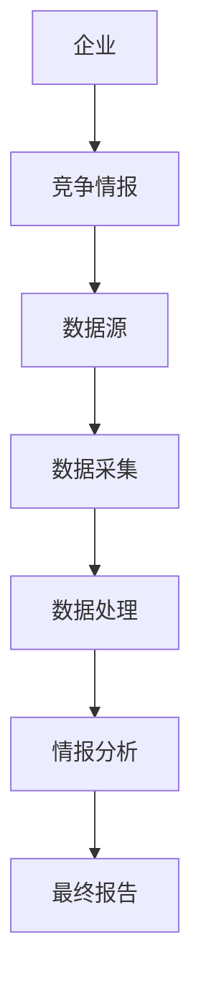
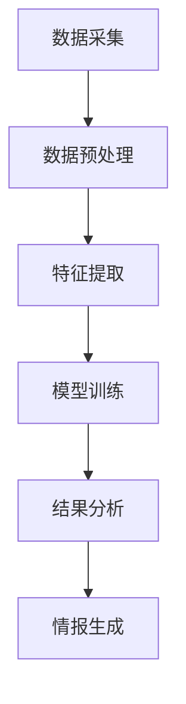
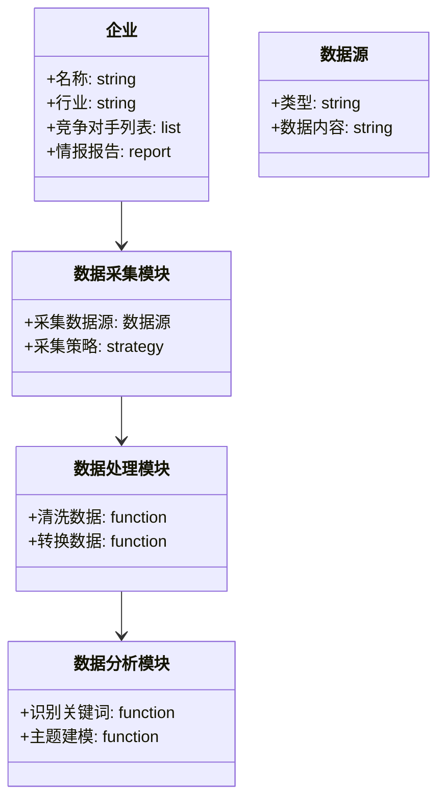
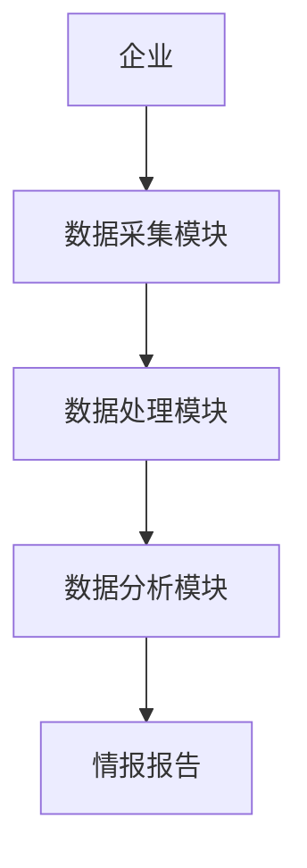
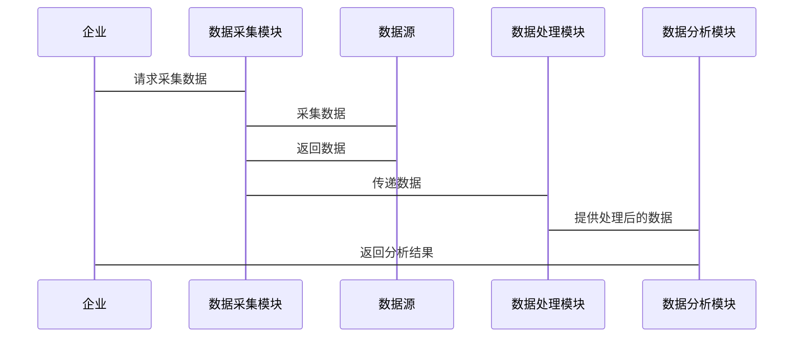

                 


# AI辅助企业竞争情报分析：自动化数据采集与洞察生成

## 关键词：
- AI
- 企业竞争情报分析
- 数据采集
- 自然语言处理
- 机器学习
- 数据挖掘
- 竞争情报系统

## 摘要：
本文探讨AI如何辅助企业竞争情报分析，通过自动化数据采集和洞察生成，提升企业决策效率。文章从背景、核心概念、算法原理到系统架构、项目实战，全面解析AI在竞争情报中的应用，为企业提供技术指导和实践参考。

---

## 第一部分：AI辅助企业竞争情报分析概述

## 第1章：AI辅助企业竞争情报分析的背景与意义

### 1.1 问题背景与挑战

#### 1.1.1 企业竞争情报的重要性
企业竞争情报（Competitive Intelligence, CI）是企业在市场中获取竞争对手信息的关键手段，帮助企业制定战略决策。然而，传统的情报收集和分析方法依赖人工操作，效率低下，且难以处理海量数据。

#### 1.1.2 传统竞争情报分析的局限性
- 数据来源分散，难以整合。
- 数据量大，人工分析耗时且成本高。
- 分析结果依赖主观判断，缺乏客观性。

#### 1.1.3 AI技术在竞争情报中的应用价值
AI技术（尤其是自然语言处理和机器学习）能够快速处理大量非结构化数据，提取关键信息，显著提升情报分析的效率和准确性。

### 1.2 问题描述与目标

#### 1.2.1 数据采集与处理的难点
- 数据来源多样，格式不统一。
- 数据中存在噪声，需要去噪处理。
- 数据更新频繁，需实时采集。

#### 1.2.2 情报分析的复杂性
- 数据关联性复杂，难以找到有效模式。
- 分析结果需要动态调整，以应对市场变化。

#### 1.2.3 自动化与智能化的目标
实现数据采集、处理和分析的自动化，生成结构化的情报报告，为企业提供实时、精准的决策支持。

### 1.3 解决方案与边界

#### 1.3.1 AI辅助的解决方案
- 自动化数据采集：使用爬虫、API等技术。
- 智能化数据处理：利用NLP和机器学习技术。
- 结构化情报生成：将分析结果转化为可读报告。

#### 1.3.2 解决方案的边界与限制
- 数据采集范围受限于公开可用数据。
- 仅处理结构化数据，部分非结构化数据难以处理。
- 依赖AI模型的准确性，可能出现误判。

#### 1.3.3 与其他技术的协同作用
与大数据分析、知识图谱等技术协同，提升整体分析能力。

### 1.4 核心概念与组成

#### 1.4.1 数据采集模块
负责从各种数据源（如网站、社交媒体）收集数据。

#### 1.4.2 数据处理与分析模块
将采集的数据进行清洗、转换和分析，提取关键信息。

#### 1.4.3 情报生成与展示模块
将分析结果生成结构化的报告，并以可视化形式展示。

## 第2章：AI辅助竞争情报分析的核心概念与联系

### 2.1 核心概念原理

#### 2.1.1 数据采集的自动化
通过爬虫技术自动采集竞争对手的产品信息、市场动态等。

#### 2.1.2 数据分析的智能化
利用NLP技术分析文本数据，识别关键词、主题和情感倾向。

#### 2.1.3 情报生成的结构化
将分析结果转化为结构化的数据，便于进一步分析和展示。

### 2.2 核心概念对比表

| 概念 | 特性 | 描述 |
|------|------|------|
| 数据采集 | 自动化 | 使用爬虫、API等技术 |
| 数据处理 | 结构化 | 将非结构化数据转化为结构化数据 |
| 情报分析 | 智能化 | 使用NLP、机器学习等技术 |

### 2.3 实体关系图（ER图）



---

## 第二部分：AI辅助竞争情报分析的算法原理

## 第3章：AI辅助竞争情报分析的算法原理

### 3.1 算法原理概述

#### 3.1.1 自然语言处理（NLP）的基本原理
NLP技术用于处理和分析文本数据，包括分词、实体识别、情感分析等。

#### 3.1.2 数据挖掘与分析的核心算法
使用聚类、分类等算法对数据进行分析，发现潜在模式。

### 3.2 算法流程图



### 3.3 算法实现代码示例

#### 3.3.1 数据采集示例

```python
import requests
from bs4 import BeautifulSoup

def fetch_data(url):
    response = requests.get(url)
    soup = BeautifulSoup(response.text, 'html.parser')
    return soup
```

#### 3.3.2 数据处理与分析示例

```python
from sklearn.feature_extraction.text import TfidfVectorizer
from sklearn.cluster import KMeans

vectorizer = TfidfVectorizer()
tfidf_matrix = vectorizer.fit_transform(documents)
model = KMeans(n_clusters=3)
model.fit(tfidf_matrix)
```

### 3.4 数学公式

#### 3.4.1 文本相似度计算公式

$$ \text{余弦相似度} = \frac{\vec{A} \cdot \vec{B}}{|\vec{A}| |\vec{B}|} $$

#### 3.4.2 主题建模的数学模型

$$ P(\text{主题} | \text{文档}) = \frac{\text{文档中主题的词分布}}{\sum_{\text{其他主题}} P(\text{主题} | \text{文档})} $$

---

## 第三部分：AI辅助竞争情报分析的系统分析与架构设计

## 第4章：AI辅助竞争情报分析的系统分析与架构设计

### 4.1 问题场景介绍

#### 4.1.1 项目介绍
开发一个AI辅助的竞争情报分析系统，实现数据采集、处理和分析的自动化。

#### 4.1.2 系统功能设计
- 数据采集模块：采集竞争对手的产品信息。
- 数据处理模块：清洗和转换数据。
- 数据分析模块：识别关键词和主题。

### 4.2 系统架构设计

#### 4.2.1 领域模型类图



#### 4.2.2 系统架构图



### 4.3 接口设计与交互

#### 4.3.1 接口设计
- 数据采集模块提供API接口，接收数据源信息。
- 数据处理模块提供接口，接收清洗和转换后的数据。
- 数据分析模块提供接口，接收分析结果。

#### 4.3.2 交互序列图



---

## 第四部分：AI辅助竞争情报分析的项目实战

## 第5章：AI辅助竞争情报分析的项目实战

### 5.1 环境安装与配置

#### 5.1.1 安装Python环境
使用Anaconda安装Python 3.8及以上版本。

#### 5.1.2 安装依赖库
```bash
pip install requests beautifulsoup4 scikit-learn matplotlib
```

### 5.2 系统核心实现

#### 5.2.1 数据采集模块实现

```python
import requests
from bs4 import BeautifulSoup

def fetch_data(url):
    response = requests.get(url)
    soup = BeautifulSoup(response.text, 'html.parser')
    return soup
```

#### 5.2.2 数据处理模块实现

```python
from sklearn.feature_extraction.text import TfidfVectorizer

def preprocess_data(documents):
    vectorizer = TfidfVectorizer()
    tfidf_matrix = vectorizer.fit_transform(documents)
    return tfidf_matrix
```

#### 5.2.3 数据分析模块实现

```python
from sklearn.cluster import KMeans

def analyze_data(tfidf_matrix):
    model = KMeans(n_clusters=3)
    model.fit(tfidf_matrix)
    return model.labels_
```

### 5.3 代码应用解读与分析

#### 5.3.1 数据采集模块的应用
通过爬虫技术从竞争对手的网站上获取产品信息。

#### 5.3.2 数据处理模块的应用
使用TF-IDF技术对文本数据进行特征提取，为后续分析做准备。

#### 5.3.3 数据分析模块的应用
使用K-Means算法对数据进行聚类分析，识别竞争对手的主要产品线。

### 5.4 实际案例分析

#### 5.4.1 案例背景
假设某企业要分析竞争对手A在市场上的产品布局。

#### 5.4.2 数据采集与处理
从竞争对手A的官方网站和新闻报道中采集数据，清洗和转换后进行分析。

#### 5.4.3 数据分析结果
通过聚类分析发现竞争对手A的三个主要产品线：智能手机、智能家居设备和可穿戴设备。

### 5.5 项目小结

#### 5.5.1 项目成果
成功实现了AI辅助的竞争情报分析系统，提升了数据分析的效率和准确性。

#### 5.5.2 经验总结
- 数据清洗和预处理是关键步骤。
- 选择合适的算法和模型能够显著提高分析效果。

---

## 第五部分：AI辅助竞争情报分析的最佳实践

## 第6章：AI辅助竞争情报分析的最佳实践

### 6.1 最佳实践 tips

#### 6.1.1 数据源选择
优先选择高质量、可靠的数据源，确保数据的准确性和完整性。

#### 6.1.2 模型优化
定期更新模型，根据实际情况调整参数，提高分析结果的准确性。

### 6.2 小结

#### 6.2.1 核心知识点回顾
- 数据采集模块：实现自动化数据采集。
- 数据处理模块：完成数据清洗和转换。
- 数据分析模块：使用NLP和机器学习技术进行分析。

### 6.3 注意事项

#### 6.3.1 数据隐私与合规性
确保数据采集和处理过程符合相关法律法规。

#### 6.3.2 系统维护与更新
定期检查系统运行状态，及时修复漏洞和优化性能。

### 6.4 拓展阅读

#### 6.4.1 推荐书籍
- 《自然语言处理入门》
- 《机器学习实战》

#### 6.4.2 在线资源
- TensorFlow官方文档
- PyTorch官方文档

---

## 结语

通过本文的详细讲解，我们了解了AI如何辅助企业竞争情报分析，从数据采集到情报生成的全过程。希望读者能够通过本文的指导，掌握AI技术在竞争情报分析中的应用方法，并在实际工作中取得更好的效果。

---

