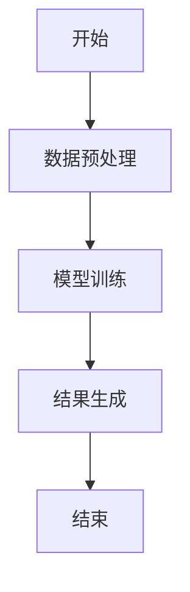
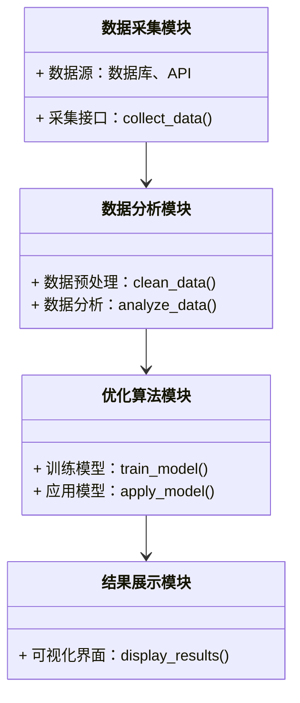
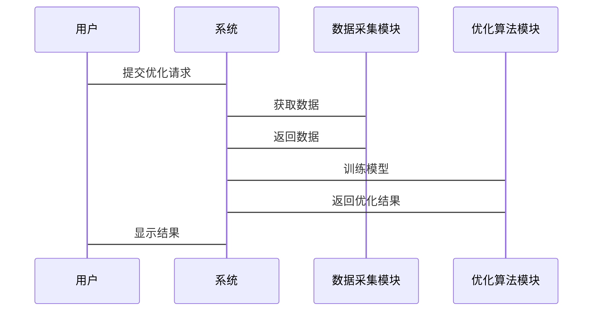

                 


# AI辅助企业组织结构优化与岗位设计

> 关键词：AI技术，组织结构优化，岗位设计，机器学习，数据分析，系统架构

> 摘要：本文探讨了如何利用AI技术辅助企业优化组织结构与岗位设计。通过分析AI算法、数据驱动的方法，结合系统架构设计，展示了如何在企业中实现智能化的组织优化。

---

## 第一部分: AI辅助企业组织结构优化与岗位设计的背景与核心概念

### 第1章: 问题背景与核心概念

#### 1.1 问题背景
- **企业组织结构优化的必要性**：企业需要不断适应市场变化，优化内部结构以提高效率和竞争力。
- **当前企业组织结构设计的痛点**：传统方法依赖经验，主观性强，难以量化和动态调整。
- **AI技术在组织优化中的应用潜力**：AI能够通过数据分析和建模，提供科学的优化建议。

#### 1.2 核心概念与问题描述
- **组织结构优化的定义与目标**：通过调整组织架构和岗位设置，提升企业运营效率。
- **岗位设计的关键要素**：职责、权限、协作关系等。
- **AI辅助优化的核心问题与边界**：如何利用AI技术分析数据，生成优化方案。

#### 1.3 问题解决与外延
- **AI在组织优化中的解决方案**：基于数据的建模与分析，提供动态优化建议。
- **优化方法的外延与应用场景**：适用于各类企业，特别是需要快速响应变化的行业。
- **相关概念的结构化分析**：将AI技术与组织理论相结合，形成新的优化方法。

### 第2章: 核心概念与联系

#### 2.1 核心概念原理
- **AI算法在组织优化中的作用**：通过机器学习分析数据，识别组织结构中的瓶颈。
- **数据驱动的组织结构分析**：利用数据分析技术，量化岗位之间的协作关系。
- **岗位设计的智能化模型**：构建AI模型，预测岗位需求和优化配置。

#### 2.2 核心概念属性对比
- **组织结构与岗位设计的对比分析**：组织结构是整体框架，岗位设计是具体实施。
- **AI辅助与传统方法的对比**：AI方法更高效，传统方法依赖人工经验。
- **不同组织类型的核心要素对比**：矩阵式组织与项目式组织的岗位设计差异。

#### 2.3 ER实体关系图
```mermaid
er
  actor: 企业
  model: 组织结构优化模型
  algorithm: AI算法
  data: 组织数据
  relation: 数据驱动优化
  actor --> data
  data --> model
  model --> algorithm
  algorithm --> relation
```

---

## 第二部分: AI辅助企业组织结构优化与岗位设计的算法原理与实现

### 第3章: 算法原理与实现

#### 3.1 算法原理
- **基于机器学习的组织优化算法**：使用聚类算法分析岗位相似性。
- **深度学习在岗位设计中的应用**：通过神经网络预测岗位需求。
- **算法流程与数学模型**
  - 聚类分析的数学模型：
  $$ D = \{x_1, x_2, ..., x_n\} $$
  $$ \text{目标：} \arg \min \sum_{i=1}^k \sum_{j=1}^n w_{ij} \|x_i - c_j\|^2 $$
  
#### 3.2 算法实现
- **优化算法的代码实现**
```python
import numpy as np
from sklearn.cluster import KMeans

def optimize_organization(data):
    # 数据预处理
    preprocess(data)
    # 模型训练
    model = train_model(data)
    # 算法优化
    result = apply_model(model, data)
    return result

def preprocess(data):
    # 数据清洗和特征提取
    pass

def train_model(data):
    # 训练机器学习模型
    kmeans = KMeans(n_clusters=3).fit(data)
    return kmeans

def apply_model(model, data):
    # 应用模型生成优化结果
    clusters = model.predict(data)
    return clusters
```

#### 3.3 算法流程图


---

## 第三部分: 系统分析与架构设计

### 第4章: 系统分析与架构设计

#### 4.1 问题场景介绍
- **问题场景**：企业需要优化组织结构，但缺乏科学的方法和工具。
- **项目介绍**：开发一个基于AI的组织优化系统。

#### 4.2 系统功能设计
- **领域模型**：用Mermaid类图展示系统模块关系。


#### 4.3 系统架构设计
- **系统架构图**：


#### 4.4 系统接口设计
- **API接口**：定义数据接口和优化结果接口。

#### 4.5 系统交互
- **交互流程**：


---

## 第四部分: 项目实战

### 第5章: 项目实战

#### 5.1 环境安装
- **安装Python和相关库**：
  ```bash
  pip install numpy scikit-learn matplotlib
  ```

#### 5.2 系统核心实现源代码
```python
import numpy as np
from sklearn.cluster import KMeans
import matplotlib.pyplot as plt

def optimize_organization(data):
    # 数据预处理
    data = np.array(data)
    # 模型训练
    kmeans = KMeans(n_clusters=3).fit(data)
    # 可视化结果
    plt.scatter(data[:,0], data[:,1], c=kmeans.labels_)
    plt.show()
    return kmeans.labels_

# 示例数据
data = np.random.rand(100, 2)
optimize_organization(data)
```

#### 5.3 代码应用解读与分析
- **代码解读**：使用KMeans算法对数据进行聚类，生成优化结果。
- **结果分析**：通过可视化展示聚类结果，帮助企业识别岗位之间的潜在关系。

#### 5.4 实际案例分析
- **案例背景**：某企业希望优化其研发部门的岗位结构。
- **数据分析**：收集岗位数据，包括职责、协作频率等。
- **优化结果**：通过AI算法重新设计岗位，提升协作效率。

#### 5.5 项目小结
- **项目总结**：AI辅助优化能够显著提高效率，降低成本。
- **经验分享**：数据质量是关键，模型选择要根据实际需求。

---

## 第五部分: 总结与展望

### 第6章: 总结与展望

#### 6.1 最佳实践 tips
- 数据是关键，确保数据质量和完整性。
- 持续优化模型，适应企业变化。

#### 6.2 小结
- AI技术为组织优化提供了新的可能性。
- 通过数据驱动的方法，企业可以实现更高效的组织结构设计。

#### 6.3 注意事项
- 数据隐私和安全问题需重视。
- 模型的可解释性需要进一步提升。

#### 6.4 拓展阅读
- 推荐阅读《机器学习实战》和《企业架构设计》。

---

通过以上内容，本文详细探讨了AI技术在企业组织结构优化与岗位设计中的应用，从理论到实践，为企业提供了科学的优化方法。

