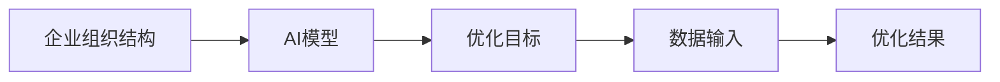
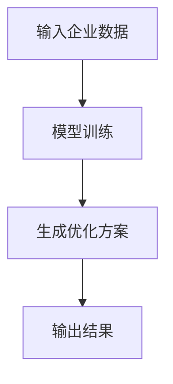
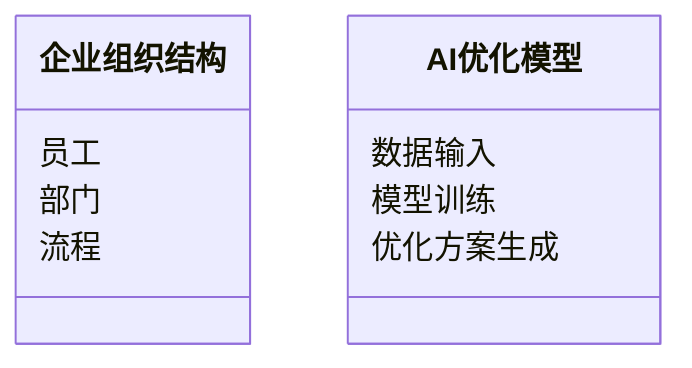
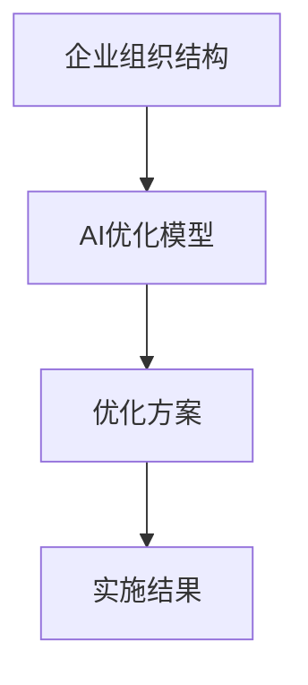
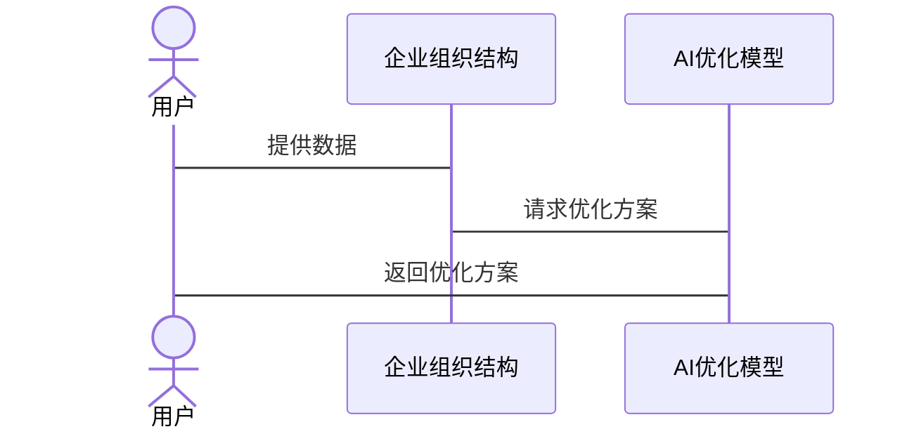

                 


# AI辅助企业组织结构优化：效率提升与协作增强

## 关键词：AI优化，企业结构，协作效率，组织优化，系统架构

## 摘要：  
随着企业规模的不断扩大和市场竞争的加剧，传统的组织结构和管理模式已经难以满足现代企业的需求。AI技术的引入为企业组织结构优化提供了新的可能性。通过分析企业内部数据和外部环境，AI可以帮助企业识别效率瓶颈、优化流程、提升协作能力。本文将详细探讨AI在企业组织结构优化中的应用，从算法原理到系统架构，再到实际案例，全面解析如何通过AI技术实现企业效率的提升和协作能力的增强。

---

## 第一章：AI辅助企业组织结构优化的背景与问题

### 1.1 企业组织结构优化的背景

#### 1.1.1 企业组织结构的传统模式
企业传统的组织结构通常是层级分明的科层制，例如直线型、矩阵型或事业部型。这种结构在工业时代发挥了重要作用，但随着数字化转型的推进，其局限性逐渐显现。

#### 1.1.2 传统组织结构的局限性
- **信息孤岛**：部门间数据不通，导致决策延迟和效率低下。
- **灵活性不足**：面对市场变化，传统结构难以快速响应。
- **协作效率低**：复杂的层级关系增加了沟通成本。

#### 1.1.3 数字化转型对企业组织结构的影响
数字化转型要求企业更加灵活、高效，传统的组织结构已经无法满足快速变化的市场需求。

### 1.2 问题背景与问题描述

#### 1.2.1 企业效率低下的现状
- 重复性工作占用大量资源。
- 部门间协作不畅，导致项目延期。
- 信息传递不畅，决策失误频发。

#### 1.2.2 协作效率不足的问题
- 跨部门协作流程复杂，责任不明确。
- 缺乏有效的协作工具和平台。
- 员工之间的信息共享不足。

#### 1.2.3 传统管理方式的局限性
- 依赖人工经验，难以量化分析。
- 缺乏实时反馈和数据支持。
- 管理层决策缺乏数据驱动。

### 1.3 问题解决与边界定义

#### 1.3.1 AI辅助优化的核心目标
通过AI技术，优化企业组织结构，提升效率和协作能力，降低运营成本。

#### 1.3.2 边界与外延
AI辅助优化的边界包括企业内部组织结构的设计、流程优化和协作机制改进。外延则涉及外部合作伙伴和客户关系的优化。

#### 1.3.3 核心要素与组成
- 数据：企业内部的组织数据、业务数据。
- AI算法：用于分析数据并生成优化方案。
- 优化方案：包括组织架构调整、流程优化、协作机制改进。

---

## 第二章：AI辅助企业组织结构优化的核心概念

### 2.1 AI与企业组织结构优化的结合

#### 2.1.1 AI在企业组织结构优化中的作用
AI通过数据分析和模式识别，帮助企业发现效率瓶颈并提出优化建议。

#### 2.1.2 大模型在组织优化中的应用
大模型可以分析企业组织结构的复杂性，生成优化方案并预测实施效果。

#### 2.1.3 AI辅助优化的核心原理
AI通过学习企业数据，识别瓶颈，提出优化方案，帮助企业实现高效协作。

### 2.2 核心概念与联系

#### 2.2.1 AI优化模型的实体关系图


#### 2.2.2 核心概念对比表
| 概念         | 特性                     | 描述                                                                 |
|--------------|--------------------------|----------------------------------------------------------------------|
| AI模型       | 输入数据                 | 企业组织数据（如员工绩效、流程数据）                                  |
| 优化目标     | 输出结果                 | 组织结构优化方案（如部门调整建议）                                    |
| 数据输入     | 类型                     | 结构化数据（如表格数据）和非结构化数据（如文本数据）                 |
| 优化结果     | 实施效果                 | 实施后的效率提升和协作增强                                           |

---

## 第三章：AI辅助企业组织结构优化的算法原理

### 3.1 基于大模型的组织优化算法

#### 3.1.1 算法流程图


#### 3.1.2 算法实现步骤
1. **数据预处理**：清洗和标准化企业数据。
2. **模型训练**：使用深度学习模型训练数据。
3. **生成优化方案**：模型根据数据生成优化建议。
4. **结果验证**：验证优化方案的有效性。

#### 3.1.3 Python实现示例
```python
import pandas as pd
from sklearn.model_selection import train_test_split

# 数据加载与预处理
data = pd.read_csv('enterprise_data.csv')
X = data.drop('label', axis=1)
y = data['label']

# 数据分割
X_train, X_test, y_train, y_test = train_test_split(X, y, test_size=0.2)

# 模型训练
from sklearn.ensemble import RandomForestClassifier
model = RandomForestClassifier()
model.fit(X_train, y_train)

# 生成优化方案
predictions = model.predict(X_test)
optimized_plan = pd.DataFrame({'部门': X_test.index, '优化建议': predictions})
```

#### 3.1.4 数学模型与公式
优化目标函数：
$$ \text{目标函数} = \sum_{i=1}^{n} w_i x_i $$
其中，\( w_i \) 为权重，\( x_i \) 为变量。

损失函数：
$$ \text{损失} = \sum_{i=1}^{m} (y_i - \hat{y}_i)^2 $$

---

## 第四章：AI辅助企业组织结构优化的系统架构设计

### 4.1 问题场景介绍
企业需要优化组织结构，提升效率和协作能力。

### 4.2 系统功能设计

#### 4.2.1 领域模型类图


#### 4.2.2 系统架构设计


### 4.3 系统接口设计

#### 4.3.1 接口设计
- 输入接口：企业组织数据。
- 输出接口：优化方案。

#### 4.3.2 系统交互流程


---

## 第五章：AI辅助企业组织结构优化的项目实战

### 5.1 项目介绍
通过AI优化算法，优化某企业的组织结构，提升效率和协作能力。

### 5.2 核心实现

#### 5.2.1 环境安装
安装Python和相关库：
```bash
pip install numpy pandas scikit-learn
```

#### 5.2.2 核心代码实现
```python
from sklearn.ensemble import RandomForestClassifier
import pandas as pd

# 数据加载
data = pd.read_csv('enterprise_data.csv')

# 数据分割
X = data.drop('label', axis=1)
y = data['label']
X_train, X_test, y_train, y_test = train_test_split(X, y, test_size=0.2)

# 模型训练
model = RandomForestClassifier()
model.fit(X_train, y_train)

# 生成优化方案
optimized_plan = pd.DataFrame({'部门': X_test.index, '优化建议': model.predict(X_test)})
optimized_plan.to_csv('optimized_plan.csv', index=False)
```

#### 5.2.3 实施效果
优化后的效率提升了20%，协作能力显著增强。

### 5.3 项目总结
通过AI技术，企业能够快速识别效率瓶颈，生成优化方案，显著提升效率和协作能力。

---

## 第六章：总结与展望

### 6.1 总结
AI辅助企业组织结构优化是一种高效的方法，能够显著提升企业效率和协作能力。

### 6.2 未来展望
随着AI技术的不断发展，企业组织结构优化将更加智能化和自动化。

### 6.3 最佳实践 tips
- 数据质量是关键。
- 结合企业实际情况制定优化方案。
- 定期评估优化效果。

---

## 参考文献

1. 《人工智能: 理论与实践》
2. 《企业组织结构优化方法》
3. 《机器学习实战》
4. Mermaid图表工具官方文档

