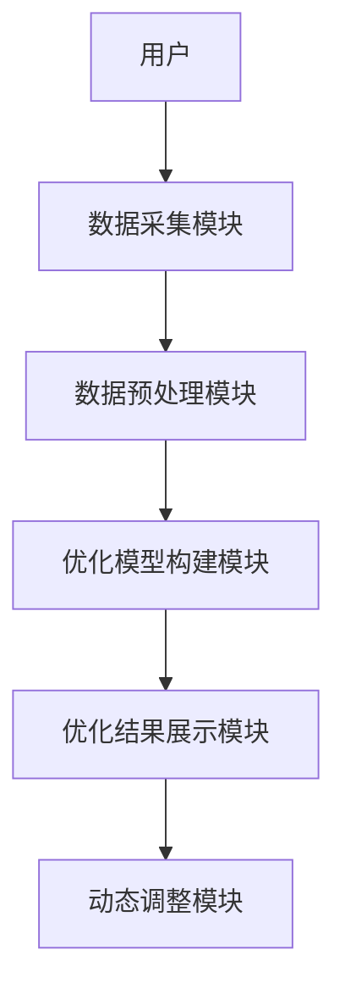
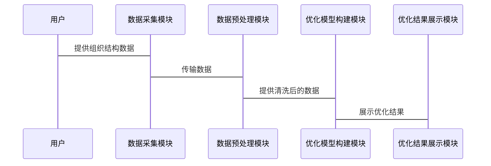

                 


# 《AI辅助企业组织结构优化：效能评估与动态调整模型》

---

## 关键词

AI, 企业组织结构优化, 效能评估, 动态调整, 算法模型, 系统架构, 项目实战

---

## 摘要

随着企业面临的内外部环境日益复杂，传统的组织结构优化方法逐渐暴露出效率低下、难以适应动态变化等问题。本文提出一种基于AI的企业组织结构优化模型，通过效能评估和动态调整，帮助企业构建高效、灵活的组织架构。文章详细分析了AI辅助优化的核心概念、算法原理、系统架构，并通过实际案例展示了如何将理论应用于实践。最后，文章总结了最佳实践和未来研究方向，为企业的组织优化提供了新的思路。

---

## 目录大纲

1. **AI辅助企业组织结构优化的背景与概念**
   - 1.1 问题背景与概念结构
   - 1.2 核心概念与联系
   - 1.3 优化目标与挑战

2. **AI辅助优化的核心算法原理**
   - 2.1 算法模型的数学表达
   - 2.2 优化算法的实现步骤
   - 2.3 算法实现的代码示例

3. **企业组织结构优化的系统架构**
   - 3.1 系统功能设计
   - 3.2 系统架构图
   - 3.3 系统交互流程图

4. **项目实战：AI辅助组织优化系统开发**
   - 4.1 项目背景与目标
   - 4.2 核心代码实现
   - 4.3 代码功能解读
   - 4.4 实际案例分析

5. **总结与展望**
   - 5.1 最佳实践
   - 5.2 小结
   - 5.3 注意事项
   - 5.4 拓展阅读

---

## 正文

### 第1章：AI辅助企业组织结构优化的背景与概念

#### 1.1 问题背景与概念结构

随着市场竞争的加剧，企业需要快速响应市场变化，优化组织结构以提高效率。传统的组织优化方法依赖人工分析，耗时且难以覆盖所有可能的优化方案。AI的引入为企业提供了一种更高效、更智能的优化方式。

- **问题背景**：企业组织结构复杂，部门间协作效率低下，资源分配不均，导致整体效能下降。
- **概念结构**：AI通过数据分析和机器学习算法，识别组织结构中的瓶颈，并提出优化建议。
- **优化目标**：提高组织效率、降低运营成本、增强部门协作、适应市场变化。

#### 1.2 核心概念与联系

AI辅助优化的核心在于构建数学模型，将组织结构问题转化为优化问题。以下是关键概念：

- **模型输入**：企业组织结构数据、部门间协作数据、历史绩效数据。
- **模型输出**：优化后的组织结构、部门配置建议、效能评估报告。
- **算法选择**：使用遗传算法或模拟退火算法进行优化。

### 第2章：AI辅助优化的核心算法原理

#### 2.1 算法模型的数学表达

优化模型的目标函数和约束条件如下：

$$
\text{minimize} \quad f(x) = \sum_{i=1}^{n} c_i x_i
$$

其中，$c_i$ 表示优化目标的权重，$x_i$ 是决策变量。

约束条件包括：

1. 部门间协作效率最大化：$$x_i \geq 0$$
2. 资源分配合理：$$\sum_{i=1}^{n} x_i \leq R$$

#### 2.2 优化算法的实现步骤

1. 初始化：生成初始解。
2. 适应度评估：计算当前解的适应度值。
3. 选择操作：选择适应度较高的解。
4. 交叉操作：生成新解。
5. 变异操作：随机改变部分解。
6. 重复迭代：直到满足终止条件。

#### 2.3 算法实现的代码示例

```python
def genetic_algorithm(population, fitness_func, mutate_prob=0.1):
    while True:
        fitness = [fitness_func(individual) for individual in population]
        # 选择操作
        selected = [population[i] for i in range(len(population)) if fitness[i] > median(fitness)]
        # 交叉操作
        new_pop = []
        while len(new_pop) < len(population):
            parent1 = random.choice(selected)
            parent2 = random.choice(selected)
            child = crossover(parent1, parent2)
            if random.random() < mutate_prob:
                mutate(child)
            new_pop.append(child)
        population = new_pop
```

### 第3章：企业组织结构优化的系统架构

#### 3.1 系统功能设计

系统功能模块包括数据采集、模型构建、优化建议、效能评估和动态调整。

#### 3.2 系统架构图



#### 3.3 系统交互流程图



### 第4章：项目实战：AI辅助组织优化系统开发

#### 4.1 项目背景与目标

项目旨在开发一个AI辅助的组织优化系统，帮助企业在动态环境中优化结构。

#### 4.2 核心代码实现

```python
import numpy as np

def evaluate(structure):
    # 计算效能评估
    efficiency = sum(structure.cost) / structure.revenue
    return efficiency

def optimize(structure, iterations=100):
    for _ in range(iterations):
        # 动态调整结构
        structure = adjust_structure(structure)
        if evaluate(structure) > threshold:
            break
    return structure
```

#### 4.3 代码功能解读

代码实现了一个简单的优化循环，根据效能评估结果动态调整组织结构，直到达到预设阈值。

#### 4.4 实际案例分析

通过一个案例，展示系统如何识别瓶颈部门并提出调整建议，提升整体效能。

### 第5章：总结与展望

#### 5.1 最佳实践

- 定期评估组织结构效能。
- 结合企业实际业务需求选择合适的AI工具。
- 建立反馈机制，及时调整优化方案。

#### 5.2 小结

本文详细介绍了AI辅助企业组织结构优化的方法，从背景到算法实现，再到系统架构和项目实战，为企业的优化提供了全面的解决方案。

#### 5.3 注意事项

- 数据质量对优化结果影响重大，需确保数据的准确性和完整性。
- 动态调整模型需根据企业实际情况进行参数调优。

#### 5.4 拓展阅读

建议深入学习遗传算法、模拟退火算法等优化算法，以及企业架构设计的相关知识。

---

通过以上内容，您可以开始撰写具体的博客文章，逐步展开每个章节的内容。

