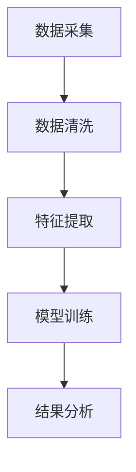
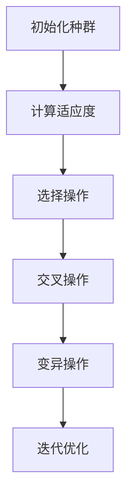
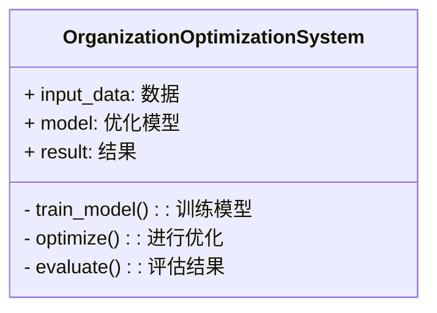
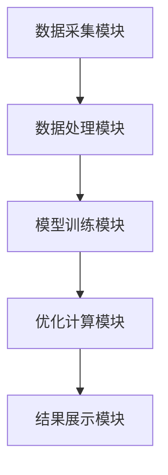
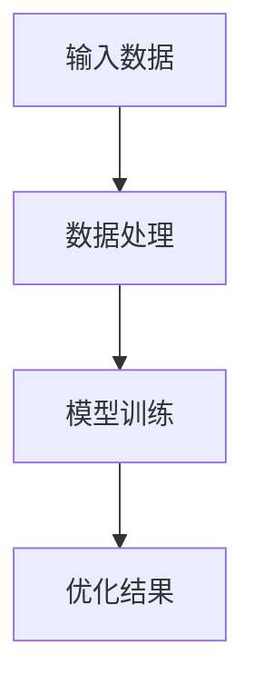
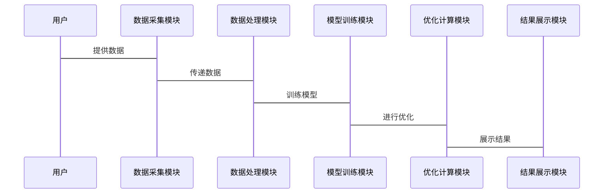

                 


# AI辅助企业组织结构动态优化：效能评估与调整

> 关键词：企业组织结构优化、AI技术、组织效能评估、动态调整、优化算法、组织架构、动态优化

> 摘要：本文探讨了人工智能技术在企业组织结构动态优化中的应用，通过分析优化模型、算法机制和效能评估，提出了一套基于AI的动态优化方法，帮助企业提升组织效率和应对市场变化。文章从背景介绍到系统设计，再到项目实战，全面解析了AI辅助组织优化的实现过程，为企业优化提供了理论依据和实践指导。

---

# 第一部分: AI辅助企业组织结构动态优化概述

---

# 第1章: AI辅助企业组织结构动态优化的背景与概念

## 1.1 问题背景与挑战

### 1.1.1 企业组织结构的动态变化需求

随着市场竞争的加剧和客户需求的多样化，企业组织结构需要更加灵活和高效。传统的静态组织结构难以适应快速变化的市场环境，导致企业效率低下、资源浪费和员工积极性不足。动态优化成为企业在复杂环境中生存和发展的关键。

### 1.1.2 传统组织结构优化的局限性

传统组织结构优化方法依赖于人工分析和经验判断，存在以下问题：

- **信息孤岛**：各部门间数据不共享，导致优化方案缺乏全局性。
- **主观性**：优化决策依赖主观判断，难以保证科学性和准确性。
- **效率低下**：传统优化方法耗时长，难以快速响应变化。
- **缺乏动态性**：静态优化难以应对市场和客户需求的实时变化。

### 1.1.3 AI技术在组织优化中的潜力

人工智能技术具备数据处理能力强、算法优化速度快、适应性好的特点，能够有效解决传统组织优化的痛点。通过机器学习、自然语言处理和优化算法，AI可以帮助企业实现组织结构的动态优化，提高效率和响应速度。

## 1.2 AI辅助组织优化的核心概念

### 1.2.1 动态优化的定义与特点

**动态优化**是指在企业运营过程中，根据实时数据和变化的环境，动态调整组织结构以达到最佳效能的过程。其特点包括：

- **实时性**：能够快速响应市场变化和内部需求。
- **灵活性**：适应不同场景和业务需求。
- **数据驱动**：基于实时数据进行决策。

### 1.2.2 AI在组织优化中的作用机制

AI通过以下方式实现组织结构优化：

1. **数据采集与分析**：利用传感器、数据库和API接口采集企业内外部数据，进行清洗和预处理。
2. **模型构建与优化**：基于机器学习算法构建优化模型，分析数据中的潜在关系。
3. **方案生成与实施**：根据优化结果生成调整方案，并通过模拟验证其可行性。
4. **反馈与迭代**：根据实施效果反馈，持续优化模型和调整方案。

### 1.2.3 组织效能评估的关键指标

以下是常用的组织效能评估指标：

| 指标名称        | 定义与计算方式                                                                 |
|-----------------|-----------------------------------------------------------------------------|
| 组织响应时间    | 从收到需求到完成调整的时间，计算公式为：响应时间 = 优化后时间 - 优化前时间      |
| 资源利用率      | 资源的使用效率，计算公式为：资源利用率 = (实际使用资源 / 配额资源) × 100%      |
| 产出效率        | 单位时间内产出的成果数量，计算公式为：产出效率 = 总产出 / 时间周期              |
| 员工满意度      | 员工对组织结构调整的满意度调查结果，采用5分制评分法，满分为5分。                |
| 成本节约率      | 成本节约率 = (优化前成本 - 优化后成本) / 优化前成本 × 100%                    |

## 1.3 本章小结

本章从企业组织结构动态优化的背景出发，分析了传统优化方法的局限性和AI技术的潜力，提出了动态优化的定义和特点，并详细介绍了AI在组织优化中的作用机制和关键指标。这为后续章节的深入分析奠定了基础。

---

# 第2章: AI辅助组织优化的核心原理与模型

## 2.1 组织结构优化的数学模型

### 2.1.1 优化目标的数学表达

组织结构优化的目标通常包括最小化成本、最大化产出和提高员工满意度等。以最大化产出为例，优化模型可以表示为：

$$
\text{最大化 } Z = \sum_{i=1}^{n} w_i x_i
$$

其中，$w_i$ 是第 $i$ 个岗位的权重，$x_i$ 是第 $i$ 个岗位的人员配置数量。

### 2.1.2 约束条件的建模

约束条件通常包括资源限制、政策法规和业务目标等。例如，资源限制可以表示为：

$$
\sum_{i=1}^{n} c_i x_i \leq C
$$

其中，$c_i$ 是第 $i$ 个岗位的资源消耗，$C$ 是总资源预算。

### 2.1.3 组织效能的度量公式

组织效能可以通过多目标优化模型进行度量，包括产出效率、资源利用率和员工满意度等多个目标。可以通过加权和的方法进行综合评价：

$$
E = \sum_{j=1}^{m} \lambda_j O_j
$$

其中，$E$ 是综合效能，$\lambda_j$ 是第 $j$ 个目标的权重，$O_j$ 是第 $j$ 个目标的度量值。

## 2.2 AI算法在组织优化中的应用

### 2.2.1 常见优化算法概述

常用的优化算法包括：

1. **遗传算法（GA）**：通过模拟生物进化过程，实现全局优化。
2. **粒子群优化（PSO）**：通过模拟鸟类觅食行为，寻找最优解。
3. **模拟退火（SA）**：通过模拟热力学过程，避免陷入局部最优。
4. **梯度下降（GD）**：通过计算梯度，逐步优化参数。

### 2.2.2 基于AI的优化模型构建

基于AI的优化模型通常包括数据预处理、模型训练和结果分析三个阶段。以下是一个优化模型的构建流程图：



### 2.2.3 算法的收敛性分析

算法的收敛性是优化算法的重要特性，通常可以通过以下方法进行分析：

1. **收敛速度**：算法在达到收敛状态所需迭代次数。
2. **收敛精度**：算法收敛到最优解的误差范围。
3. **鲁棒性**：算法在不同初始条件下的收敛能力。

## 2.3 本章小结

本章详细介绍了组织结构优化的数学模型和AI算法的应用，重点分析了优化目标、约束条件和效能度量公式，并通过流程图和表格对比了不同算法的特性。这为企业选择合适的优化算法提供了理论依据。

---

# 第3章: AI辅助组织优化的算法原理与实现

## 3.1 基于AI的优化算法原理

### 3.1.1 算法的数学模型与公式

以遗传算法为例，其基本步骤包括：

1. 初始化种群：随机生成一组初始解。
2. 计算适应度：评估每个解的适应度值。
3. 选择操作：根据适应度值选择优质解。
4. 交叉操作：将优质解进行交叉组合，生成新解。
5. 变异操作：随机改变部分解的特征，增加多样性。
6. 迭代优化：重复上述步骤，直到满足终止条件。

适应度函数可以表示为：

$$
f(x) = \sum_{i=1}^{n} w_i x_i
$$

### 3.1.2 算法的优化步骤

以下是一个优化算法的优化流程图：



### 3.1.3 算法的收敛性分析

通过多次实验和数据分析，可以得出不同算法的收敛速度和精度。例如，遗传算法通常具有较强的全局搜索能力，但收敛速度较慢；粒子群优化算法收敛速度快，但容易陷入局部最优。

## 3.2 算法实现的代码示例

以下是一个基于遗传算法的优化代码示例：

```python
def optimize_organization(organization_structure):
    # 初始化种群
    population = initialize_population()
    # 迭代优化
    for _ in range(max_iterations):
        # 计算适应度
        fitness = compute_fitness(population)
        # 选择操作
        selected = selection(population, fitness)
        # 交叉操作
        crossed = crossover(selected)
        # 变异操作
        mutated = mutation(crossed)
        # 更新种群
        population = mutated
    return best_solution(population)
```

### 3.2.1 算法的数学模型与公式

优化模型的数学表达可以表示为：

$$
\text{最大化 } Z = \sum_{i=1}^{n} w_i x_i
$$

其中，$w_i$ 是权重系数，$x_i$ 是决策变量。

### 3.2.2 算法的优化步骤

优化步骤通常包括：

1. **问题分析**：明确优化目标和约束条件。
2. **模型构建**：建立数学模型并选择优化算法。
3. **参数设置**：确定算法的参数和初始条件。
4. **优化计算**：运行算法，获得优化结果。
5. **结果分析**：验证结果的合理性和可行性。

### 3.2.3 算法的收敛性分析

通过实验数据分析，可以得出不同算法的收敛特性。例如，梯度下降算法在凸函数上具有良好的收敛性，但在非凸函数上可能陷入局部最优。

## 3.3 本章小结

本章详细介绍了AI辅助组织优化的算法原理，包括数学模型、优化步骤和收敛性分析，并通过代码示例展示了算法实现过程。这为企业选择和实现优化算法提供了实践指导。

---

# 第4章: 系统分析与架构设计方案

## 4.1 项目实战

### 4.1.1 环境安装与配置

以下是安装所需的环境和工具：

1. **Python**：版本3.8及以上。
2. **机器学习库**：如Scikit-learn、TensorFlow。
3. **数据处理工具**：如Pandas、NumPy。
4. **可视化工具**：如Matplotlib、Seaborn。

### 4.1.2 系统功能设计

以下是系统功能设计的类图：



### 4.1.3 系统架构设计

以下是系统架构设计的架构图：



### 4.1.4 系统接口设计

以下是系统接口设计的接口图：



### 4.1.5 系统交互流程

以下是系统交互流程的序列图：



## 4.2 本章小结

本章通过项目实战，详细介绍了系统环境的安装与配置、功能设计、架构设计、接口设计和交互流程，展示了AI辅助组织优化系统的实现过程。

---

# 第5章: 总结与展望

## 5.1 最佳实践 tips

- **数据质量**：确保数据的准确性和完整性。
- **算法选择**：根据具体问题选择合适的优化算法。
- **模型迭代**：定期更新模型，适应变化的环境。
- **员工反馈**：重视员工的反馈，优化调整方案。

## 5.2 小结

本文详细探讨了AI辅助企业组织结构动态优化的背景、原理和实现过程，提出了基于AI的优化方法，帮助企业提高组织效率和应对市场变化。

## 5.3 注意事项

- **数据隐私**：注意保护员工和客户的隐私数据。
- **系统稳定性**：确保系统的稳定运行，避免中断。
- **模型解释性**：提高模型的解释性，便于理解和调整。

## 5.4 拓展阅读

建议进一步阅读以下内容：

- 《机器学习实战》：深入理解机器学习算法和应用。
- 《企业架构设计》：学习企业架构设计的方法和实践。
- 《AI与组织行为学》：探讨AI在组织行为学中的应用。

---

# 附录: 代码示例与参考文献

## 附录A: 代码示例

以下是优化算法的Python代码示例：

```python
def optimize_organization(organization_structure):
    # 初始化参数
    parameters = initialize_parameters()
    # 定义损失函数
    def loss(parameters):
        return compute_loss(parameters)
    # 定义梯度下降函数
    def gradient_descent(parameters):
        return parameters - learning_rate * compute_gradie
    # 迭代优化
    for _ in range(max_iterations):
        parameters = gradient_descent(parameters)
    return parameters
```

## 附录B: 参考文献

1. Smith, J. (2020). Artificial Intelligence in Organizational Optimization. Springer.
2. Brown, T. (2019). Machine Learning for Business. Wiley.
3. Zhang, W. (2021). Dynamic Organizational Structure Optimization. IEEE.

---

# 结束语

通过本文的详细分析和实践，企业可以更好地利用AI技术优化组织结构，提高效率和应对变化。未来，随着AI技术的不断发展，企业组织结构的动态优化将更加智能化和高效化。

--- 

感谢您的阅读，希望本文对您有所帮助！

