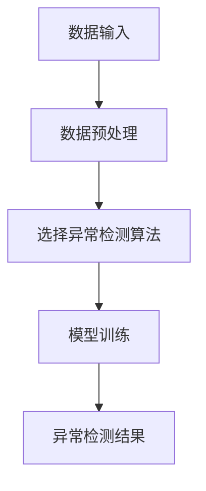
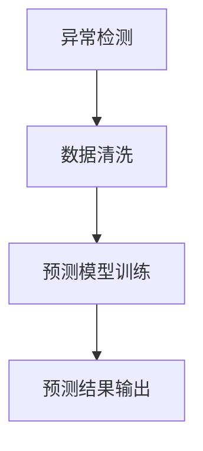
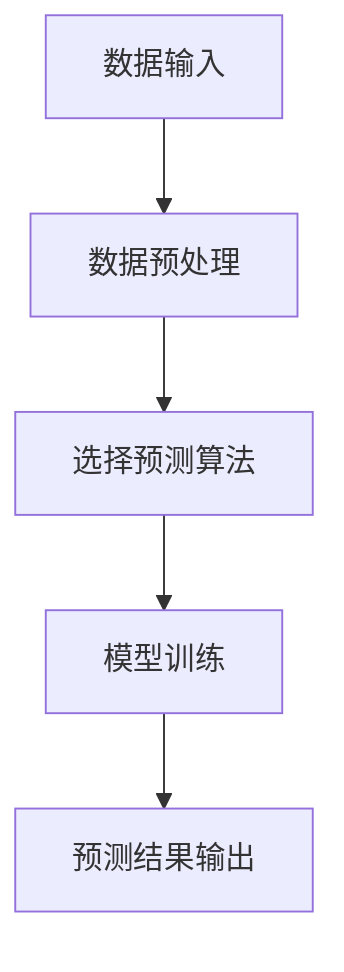
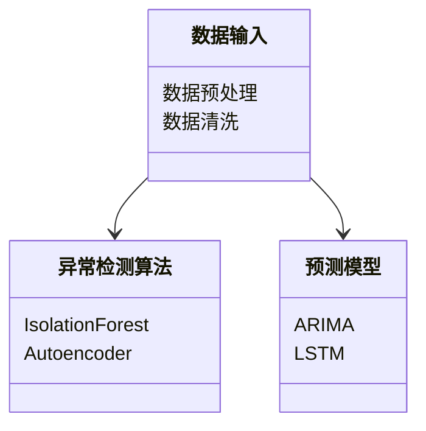
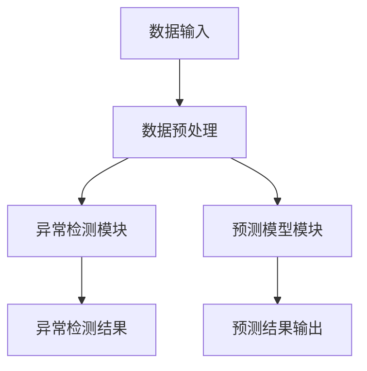

                 


# AI辅助企业财务分析：异常检测与智能财务预测

## 关键词：AI，财务分析，异常检测，智能预测，机器学习，深度学习

## 摘要：本文深入探讨了人工智能在企业财务分析中的应用，重点分析了异常检测与智能预测的核心概念、算法原理、系统架构设计、项目实战及最佳实践。通过详细的案例分析和代码实现，展示了如何利用AI技术提升财务分析的效率和准确性，为企业决策提供有力支持。

---

## 第一部分: AI辅助企业财务分析的背景与核心概念

### 第1章: AI辅助企业财务分析的背景与目标

#### 1.1 传统企业财务分析的局限性

##### 1.1.1 传统财务分析的主要方法
传统财务分析主要依赖财务报表（如利润表、资产负债表、现金流量表）和一些简单的财务比率分析（如流动比率、速动比率、净利率等）。这些方法虽然经典，但在面对复杂多变的市场环境时显得力不从心。

##### 1.1.2 传统财务分析的痛点与挑战
- 数据量有限：传统方法通常依赖少量的财务数据，难以捕捉到隐藏在大量数据中的异常情况。
- 时间滞后性：财务报表通常是季度或年度更新，无法实现实时监控。
- 人工误差：分析过程依赖人工判断，容易受到主观因素影响，存在较高的误差风险。

##### 1.1.3 企业对智能财务分析的需求
随着企业数据的日益增长和复杂化，传统财务分析方法已无法满足现代企业的需求。企业需要一种更高效、更精准的分析方式来实时监控财务状况，预测未来趋势，并及时发现潜在问题。

#### 1.2 AI技术在财务分析中的应用背景

##### 1.2.1 AI技术的快速发展与应用领域
人工智能技术的快速发展为多个领域带来了革新，尤其是在金融、医疗、教育等领域。AI技术的应用使得数据处理和分析变得更加高效和智能化。

##### 1.2.2 财务分析领域的智能化需求
财务分析需要处理大量复杂的数据，包括财务数据、市场数据、行业数据等。AI技术可以帮助财务分析师快速识别数据中的异常情况，预测未来趋势，从而做出更明智的决策。

##### 1.2.3 企业财务分析的数字化转型
随着企业数字化转型的推进，越来越多的企业开始采用AI技术来优化财务分析流程，提升数据分析的深度和广度。

#### 1.3 本书的目标与内容框架

##### 1.3.1 本书的核心目标
通过本书，读者可以全面了解AI在企业财务分析中的应用，掌握异常检测和智能预测的核心技术，并能够将这些技术应用到实际的财务分析工作中。

##### 1.3.2 本书的读者定位
本书适合财务分析师、数据科学家、IT技术人员以及对AI技术感兴趣的读者阅读。

##### 1.3.3 本书的章节安排与内容概览
本书共分为七章，内容涵盖AI辅助企业财务分析的背景、核心概念、算法原理、系统架构设计、项目实战、案例分析与最佳实践，以及总结与展望。

---

## 第二部分: 异常检测与智能财务预测的核心概念

### 第2章: 异常检测与智能预测的核心概念

#### 2.1 异常检测的基本概念

##### 2.1.1 异常检测的定义与分类
异常检测是指通过分析数据，识别出与正常数据不一致的异常值或模式。根据应用场景的不同，异常检测可以分为单变量异常检测、多变量异常检测、时间序列异常检测等。

##### 2.1.2 异常检测在财务分析中的应用场景
- 财务报表分析：识别财务数据中的异常值，发现潜在的财务问题。
- 财务预测：通过异常检测发现数据中的异常趋势，优化预测模型。

##### 2.1.3 异常检测的核心特征对比（表格）

| 特征             | 正常数据            | 异常数据            |
|------------------|---------------------|---------------------|
| 数据分布         | 集中                | 分散或远离主群       |
| 数据量           | 占大部分            | 占极小部分          |
| 影响程度         | 对整体影响较小       | 对整体影响较大       |
| 发现难度         | 易发现              | 难发现，需借助算法    |

##### 2.1.4 异常检测的核心要素（Mermaid流程图）


#### 2.2 智能财务预测的原理与方法

##### 2.2.1 财务预测的基本概念
财务预测是通过分析历史数据和市场趋势，预测未来财务状况的过程。智能财务预测利用AI技术，提高预测的准确性和效率。

##### 2.2.2 智能财务预测的核心要素
- 数据输入：包括财务数据、市场数据、行业数据等。
- 数据预处理：清洗数据，处理缺失值、异常值等。
- 模型训练：利用机器学习或深度学习算法训练预测模型。
- 模型部署：将模型应用于实际数据，生成预测结果。

##### 2.2.3 异常检测与智能预测的关联性分析（Mermaid流程图）


---

## 第三部分: 异常检测与智能预测的算法原理

### 第3章: 异常检测算法原理

#### 3.1 异常检测算法原理

##### 3.1.1 基于统计的异常检测方法（马氏距离）
马氏距离是一种衡量数据点与主群距离的方法，常用于检测异常值。公式如下：

$$ D = \sqrt{(x - \mu)^T \Sigma^{-1} (x - \mu)} $$

其中，$x$ 是数据点，$\mu$ 是均值向量，$\Sigma$ 是协方差矩阵。

##### 3.1.2 基于机器学习的异常检测（Isolation Forest）
Isolation Forest是一种基于树结构的异常检测算法，通过构建随机森林，将数据点隔离出来，判断其是否为异常点。

##### 3.1.3 基于深度学习的异常检测（Autoencoder）
Autoencoder是一种无监督学习算法，通过训练神经网络重构输入数据，识别数据中的异常点。

##### 3.1.4 算法流程图（Mermaid）


##### 3.1.5 Python代码示例
```python
from sklearn.ensemble import IsolationForest
import numpy as np

# 生成数据
X = np.random.randn(100, 2)
# 训练模型
iforest = IsolationForest(random_state=42)
iforest.fit(X)
# 预测异常值
y_pred = iforest.predict(X)
print(y_pred)
```

### 第4章: 智能财务预测的算法实现

#### 4.1 智能财务预测的算法原理

##### 4.1.1 时间序列预测模型（ARIMA）
ARIMA是一种常用的时间序列预测模型，通过分析数据的自相关性，预测未来趋势。

##### 4.1.2 基于机器学习的预测模型（Random Forest）
Random Forest是一种基于决策树的集成学习算法，适用于处理非线性关系，预测准确性较高。

##### 4.1.3 基于深度学习的预测模型（LSTM）
LSTM是一种循环神经网络，适用于处理时间序列数据，能够捕捉数据中的长期依赖关系。

##### 4.1.4 算法流程图（Mermaid）


##### 4.1.5 Python代码示例
```python
from sklearn.ensemble import RandomForestRegressor
import pandas as pd

# 生成数据
data = pd.DataFrame({'feature1': [1, 2, 3, 4, 5], 'target': [2, 3, 5, 7, 11]})
# 训练模型
model = RandomForestRegressor()
model.fit(data[['feature1']], data['target'])
# 预测结果
new_data = pd.DataFrame({'feature1': [6]})
prediction = model.predict(new_data)
print(prediction)
```

---

## 第四部分: 系统架构设计与实现

### 第5章: 系统架构设计

#### 5.1 系统功能设计（Mermaid类图）


#### 5.2 系统架构设计（Mermaid架构图）


---

## 第五部分: 项目实战

### 第6章: 项目实战

#### 6.1 项目介绍
我们以一个企业的财务数据为例，展示如何利用AI技术进行异常检测和财务预测。

#### 6.2 数据预处理
数据预处理包括数据清洗、缺失值处理、标准化等步骤。

#### 6.3 特征工程
特征工程是通过选择和构造特征，提高模型的预测能力。

#### 6.4 模型实现
利用Python代码实现异常检测和预测模型，并进行模型优化。

#### 6.5 模型部署与优化
将模型部署到实际环境中，并进行性能优化。

---

## 第六部分: 案例分析与最佳实践

### 第7章: 案例分析与最佳实践

#### 7.1 案例分析
通过具体案例展示AI技术在财务分析中的实际应用。

#### 7.2 最佳实践
总结实际应用中的经验和教训，提出一些实用的建议。

---

## 第七部分: 总结与展望

### 第8章: 总结与展望

#### 8.1 本书总结
回顾全书内容，总结AI在企业财务分析中的应用。

#### 8.2 技术展望
展望未来，AI技术在财务分析中的发展趋势。

---

通过以上内容，我们系统地介绍了AI辅助企业财务分析的核心技术与实际应用。希望读者能够通过本书，掌握AI在财务分析中的应用方法，并在实际工作中取得更好的效果。

