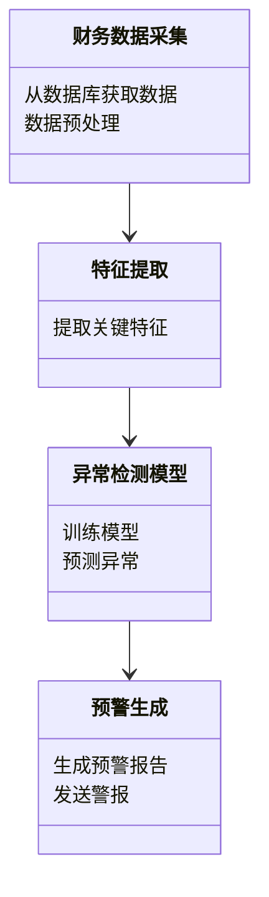
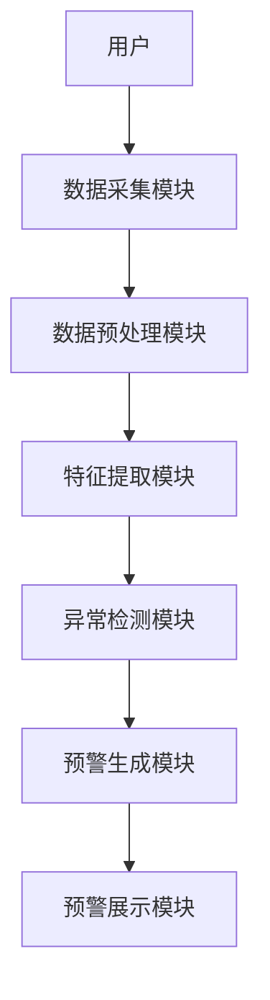
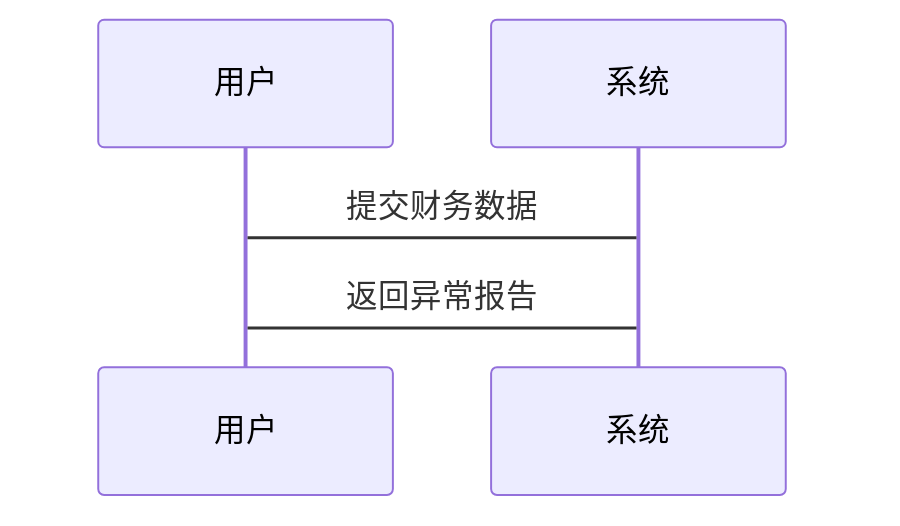

                 


# AI辅助企业财务异常检测：实时监控与智能预警系统

## 关键词：AI、财务异常检测、实时监控、智能预警系统、机器学习、数据分析

## 摘要：本文探讨了利用人工智能技术实现企业财务异常检测的方法，介绍了实时监控与智能预警系统的构建，包括核心算法、系统架构设计及实际应用案例。文章详细分析了AI在财务异常检测中的优势，并通过具体实施步骤展示了如何利用机器学习模型提升财务预警的效率和准确性。

---

# 第1章: 财务异常检测的背景与挑战

## 1.1 企业财务异常检测的背景

### 1.1.1 财务异常检测的定义与重要性

企业财务异常检测是指通过分析企业的财务数据，识别出与正常情况不符的异常行为或趋势。这种检测对于企业内部控制、风险管理以及合规性检查具有重要意义。及时发现财务异常可以有效防止舞弊、优化资源配置、提升企业整体运营效率。

### 1.1.2 传统财务异常检测的局限性

传统财务异常检测主要依赖人工审查和简单的财务比率分析，存在以下问题：

1. **效率低下**：人工审查耗时长，难以实时监控。
2. **主观性强**：依赖审计人员的经验和判断，结果可能不一致。
3. **覆盖面有限**：难以覆盖海量数据，容易遗漏复杂或隐蔽的异常情况。

### 1.1.3 AI技术在财务异常检测中的优势

人工智能技术，尤其是机器学习和深度学习，能够处理海量数据，发现复杂模式，显著提升了财务异常检测的效率和准确性。AI技术的优势包括：

1. **自动化与实时性**：能够实时处理数据，快速识别异常。
2. **高准确性**：通过训练模型，AI能够识别复杂的异常模式，减少人为错误。
3. **可扩展性**：适用于大规模数据，能够处理不同类型和复杂度的财务数据。

## 1.2 企业财务异常检测的核心问题

### 1.2.1 财务数据的特点与挑战

财务数据通常具有以下特点：

- **结构化**：包括收入、支出、利润等指标。
- **多维度**：涉及多个业务单元和时间维度。
- **高维度**：包含大量变量，可能导致维度灾难。

### 1.2.2 异常检测的关键问题与目标

异常检测的关键问题包括：

1. **定义异常**：如何准确定义财务异常的标准。
2. **数据质量**：如何处理缺失值、噪声数据。
3. **模型选择**：如何选择合适的算法。

### 1.2.3 异常检测的边界与外延

财务异常检测的边界在于如何平衡真阳性（正确识别异常）和假阳性（误报）之间的关系。外延则包括从单纯的异常识别到提供解决方案的延伸应用。

---

# 第2章: 异常检测的核心概念与联系

## 2.1 异常检测的基本原理

### 2.1.1 异常检测的定义与分类

异常检测是指识别数据中不符合预期模式或行为的过程。根据应用场景的不同，可以分为：

1. **统计方法**：基于统计分布，如均值、方差。
2. **机器学习方法**：包括监督学习、无监督学习。
3. **深度学习方法**：利用神经网络提取特征。

### 2.1.2 异常检测的主要方法与技术

- **统计方法**：如Z-score、箱线图。
- **机器学习方法**：如逻辑回归、随机森林。
- **深度学习方法**：如自动编码器、变分自编码器。

### 2.1.3 异常检测的评价指标与挑战

常用评价指标包括准确率、召回率、F1分数等。挑战包括如何处理数据不平衡问题、如何解释模型结果。

## 2.2 异常检测的核心要素与关系

### 2.2.1 数据特征与异常检测的关系

数据特征直接影响异常检测的效果。关键特征包括时间戳、金额、交易频率等。

### 2.2.2 模型选择与异常检测的效果

模型选择影响检测的准确性和效率。监督学习适用于有标签数据，无监督学习适用于无标签数据。

### 2.2.3 预警机制与异常检测的结合

预警机制将异常检测结果转化为实际行动，如触发警报、生成报告。

## 2.3 本章小结

---

# 第3章: 基于统计学的异常检测算法

## 3.1 多元回归分析

### 3.1.1 多元回归分析的基本原理

多元回归分析通过建立多个自变量与因变量的关系模型，预测潜在异常。

公式：$$y = \beta_0 + \beta_1x_1 + \beta_2x_2 + \dots + \beta_nx_n + \epsilon$$

### 3.1.2 多元回归模型的构建与应用

步骤包括数据收集、模型训练、评估与验证。

### 3.1.3 多元回归在财务异常检测中的案例分析

例如，预测收入与支出的异常关系。

## 3.2 留一法与异常检测

### 3.2.1 留一法的基本原理

留一法通过逐一排除数据点，评估其对整体分布的影响。

### 3.2.2 留一法在异常检测中的应用

用于检测离群点。

### 3.2.3 留一法的优缺点与适用场景

优点：简单直观；缺点：计算量大。

---

# 第4章: 基于机器学习的异常检测算法

## 4.1 逻辑回归模型

### 4.1.1 逻辑回归的基本原理

逻辑回归适用于二分类问题，常用于判断是否异常。

公式：$$P(y=1|x) = \frac{1}{1 + e^{- (\beta_0 + \beta_1x_1 + \dots + \beta_nx_n)}}$$

### 4.1.2 逻辑回归在异常检测中的应用

例如，识别交易中的欺诈行为。

## 4.2 随机森林与异常检测

### 4.2.1 随机森林的基本原理

随机森林通过集成多个决策树提升准确性和鲁棒性。

### 4.2.2 随机森林在异常检测中的应用

用于识别财务数据中的异常交易。

### 4.2.3 随机森林的优缺点与适用场景

优点：高准确性和鲁棒性；缺点：解释性较差。

---

# 第5章: 系统分析与架构设计方案

## 5.1 问题场景介绍

### 5.1.1 财务数据实时监控的场景描述

实时监控企业财务数据，及时发现异常。

### 5.1.2 异常检测与预警的核心需求

快速、准确地识别异常，并触发预警机制。

### 5.1.3 系统的边界与范围

包括数据采集、特征提取、模型训练、预警生成等模块。

## 5.2 系统功能设计

### 5.2.1 领域模型Mermaid类图



### 5.2.2 系统架构设计Mermaid架构图



### 5.2.3 系统接口设计与交互序列图



## 5.3 本章小结

---

# 第6章: 项目实战与实现

## 6.1 环境安装与配置

### 6.1.1 Python环境的安装与配置

使用Anaconda或虚拟环境。

### 6.1.2 必要库的安装

安装numpy、pandas、scikit-learn等库。

## 6.2 系统核心实现源代码

```python
import pandas as pd
from sklearn.ensemble import IsolationForest
from sklearn.model_selection import train_test_split
from sklearn.metrics import classification_report

# 数据加载
data = pd.read_csv('financial_data.csv')

# 特征提取
X = data[['revenue', 'expenses', 'profit']]

# 数据分割
X_train, X_test = train_test_split(X, test_size=0.2)

# 模型训练
model = IsolationForest(n_estimators=100, contamination=0.05)
model.fit(X_train)

# 预测异常
y_pred = model.predict(X_test)
print(classification_report(y_pred, X_test))
```

---

## 总结

本文详细探讨了AI在企业财务异常检测中的应用，从背景分析到系统设计，再到实际实现，全面展示了如何利用人工智能技术提升财务监控的效率和准确性。通过具体案例和代码实现，读者可以深入了解AI在这一领域的潜力和实际应用价值。未来，随着技术的不断发展，AI在财务异常检测中的应用将更加广泛和深入。

