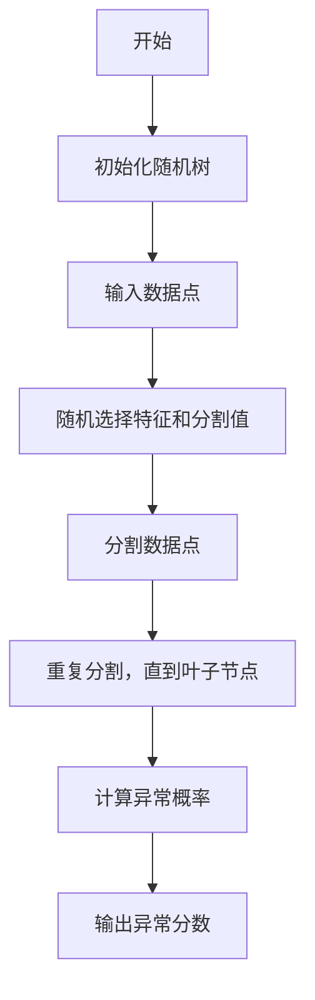
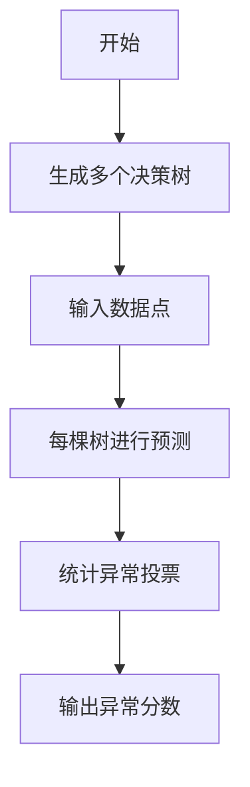
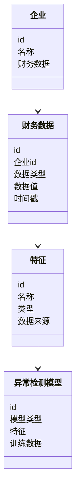
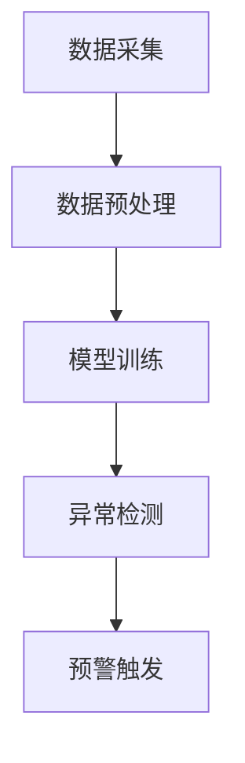
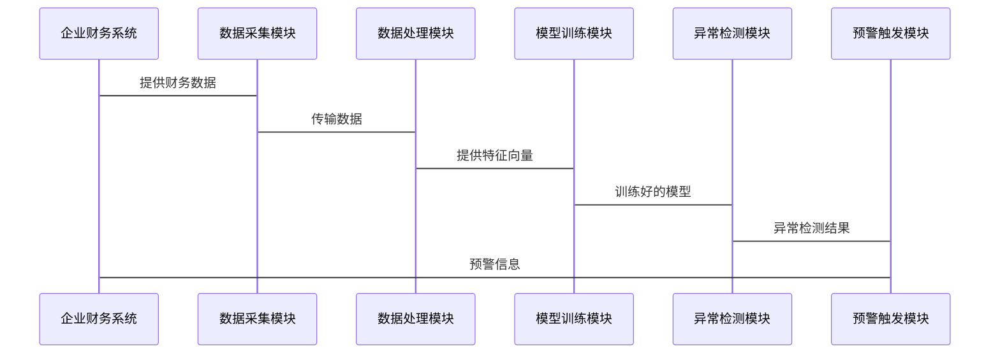

                 


# AI辅助企业财务异常检测：实时监控与风险预警

## 关键词：AI, 企业财务, 异常检测, 实时监控, 风险预警, 数据分析, 机器学习

## 摘要：本文深入探讨了利用人工智能技术辅助企业进行财务异常检测的方法，重点分析了实时监控与风险预警的核心原理、系统架构设计、具体实现方案以及实际应用场景。通过结合机器学习算法和大数据处理技术，构建高效的财务风险预警系统，为企业提供智能化的财务健康评估和风险控制手段。

---

## 第一部分: 背景介绍与核心概念

### 第1章: 问题背景与目标

#### 1.1 企业财务异常检测的背景

##### 1.1.1 传统财务审计的局限性

传统的企业财务审计依赖于人工审查和定期报告，这种方式存在效率低、覆盖面有限、难以实时监控等缺点。企业财务数据的复杂性和多样性使得人工审计难以及时发现潜在的财务异常情况，且容易受到人为因素的影响。

##### 1.1.2 企业财务风险的复杂性

现代企业的财务风险来源多样化，包括市场波动、内部舞弊、供应链中断等多种因素。这些风险往往具有隐蔽性，难以通过传统方法及时发现和预警，可能导致企业蒙受重大损失。

##### 1.1.3 AI技术在财务领域的应用潜力

人工智能技术，特别是机器学习算法，能够通过大量历史数据训练模型，识别数据中的异常模式和潜在风险。AI技术的引入使得企业能够实现财务数据的实时监控和自动化预警，显著提升了财务风险管理的效率和准确性。

#### 1.2 问题描述与目标

##### 1.2.1 财务异常检测的核心问题

财务异常检测的核心问题是如何通过数据分析手段，识别出企业财务数据中的异常模式，从而发现潜在的财务风险。这包括收入异常、支出异常、现金流异常等多种形式。

##### 1.2.2 实时监控与风险预警的目标

实时监控的目标是通过对财务数据的持续分析，及时发现异常情况并触发预警机制。风险预警的目标是根据异常情况的严重程度，评估潜在风险，并为企业提供应对策略建议。

##### 1.2.3 企业的财务健康评估与风险控制

通过AI辅助的财务异常检测，企业能够实现对自身财务健康的全面评估，并采取相应的风险控制措施，降低财务风险对企业经营的影响。

#### 1.3 问题解决思路

##### 1.3.1 数据驱动的异常检测方法

基于机器学习的异常检测方法，通过训练模型识别正常数据的特征，并发现偏离正常模式的异常数据。

##### 1.3.2 AI技术在财务数据处理中的优势

AI技术能够处理大量非结构化数据，发现隐藏在数据中的异常模式，并且能够实时更新模型，适应数据的变化。

##### 1.3.3 实时监控与预警机制的设计思路

设计实时监控系统，包括数据采集、特征提取、模型训练、异常检测、预警触发和风险评估等模块。

#### 1.4 边界与外延

##### 1.4.1 财务异常检测的边界条件

财务异常检测的边界条件包括数据的可获得性、模型的准确性、计算资源的限制等。

##### 1.4.2 与企业风险管理的关系

财务异常检测是企业风险管理的重要组成部分，能够提供及时的风险预警信息，辅助企业进行决策。

##### 1.4.3 与其他财务数据分析技术的区分

与其他财务数据分析技术相比，异常检测更注重识别数据中的异常模式，而不仅仅是进行数据汇总和分析。

#### 1.5 核心概念结构与组成

##### 1.5.1 数据源与特征

数据源包括企业的财务报表、交易记录、现金流数据等。特征包括收入增长率、支出变动率、现金流净额等。

##### 1.5.2 异常检测模型

异常检测模型包括基于统计的模型和基于机器学习的模型。

##### 1.5.3 风险预警系统

风险预警系统包括数据采集、特征提取、模型训练、异常检测、预警触发和风险评估等模块。

### 第2章: 核心概念与联系

#### 2.1 AI辅助财务异常检测的核心原理

##### 2.1.1 数据预处理与特征提取

数据预处理包括数据清洗、标准化和特征选择。特征提取是将原始数据转换为能够反映财务异常情况的特征向量。

##### 2.1.2 异常检测算法的选择与应用

选择合适的异常检测算法，如Isolation Forest、随机森林等，并将其应用于财务数据的分析中。

##### 2.1.3 风险评估与预警机制

根据异常检测结果，评估潜在风险，并制定相应的预警机制，及时通知企业管理人员。

#### 2.2 核心概念属性对比表

| 概念       | 属性               | 描述                                   |
|---------|------------------|----------------------------------------|
| 数据源     | 数据类型           | 包括财务报表、交易记录等结构化数据和非结构化数据 |
| 特征       | 可解释性           | 特征越简单，模型的可解释性越强                   |
| 模型       | 精度               | 模型的预测精度是选择模型的重要指标               |
| 预警机制   | 响应时间           | 预警机制的响应时间越短，越能及时发现异常         |

#### 2.3 ER实体关系图

```mermaid
erd
  title 数据模型
  id: UUID
  企业: {
    id: string
    名称: string
    财务数据: [FinancialData]
  }
  FinancialData: {
    id: string
    企业id: string
    数据类型: string
    数据值: float
    时间戳: datetime
  }
  AbnormalDetectionModel: {
    id: string
    模型类型: string
    特征: [Feature]
    训练数据: [FinancialData]
  }
  Feature: {
    id: string
    名称: string
    类型: string
    数据来源: string
  }
```

---

## 第三部分: 算法原理讲解

### 第3章: 异常检测算法原理

#### 3.1 Isolation Forest算法

##### 3.1.1 算法原理

Isolation Forest是一种基于树结构的异常检测算法，通过构建随机树，将数据点隔离到叶子节点。异常点通常会比正常点更早被隔离。

##### 3.1.2 算法流程



##### 3.1.3 Python代码实现

```python
from sklearn.ensemble import IsolationForest
import numpy as np

# 生成正常数据
X = np.random.randn(100, 2)
# 生成异常数据
X_outliers = np.random.uniform(low=-4, high=-2, size=(20, 2))
# 合并数据
X_total = np.vstack((X, X_outliers))
# 训练模型
model = IsolationForest(n_estimators=10, contamination=0.1)
model.fit(X_total)
# 预测异常分数
scores = model.decision_function(X_total)
# 找出异常点
outliers = model.predict(X_total) == -1
print("异常点索引:", np.where(outliers)[0])
```

##### 3.1.4 数学模型与公式

Isolation Forest算法通过构建随机树，计算每个数据点的异常概率。异常概率的计算基于树的分割情况。公式如下：

$$ P(outlier) = \frac{\text{隔离深度}}{\text{平均隔离深度}} $$

---

### 第4章: 随机森林异常检测

#### 4.1 算法原理

随机森林通过构建多个决策树，并对每个树进行投票，得到最终的异常分数。

#### 4.2 算法流程



#### 4.3 Python代码实现

```python
from sklearn.ensemble import RandomForestClassifier
import numpy as np

# 生成正常数据
X = np.random.randn(100, 2)
# 生成异常数据
X_outliers = np.random.uniform(low=-4, high=-2, size=(20, 2))
# 合并数据
X_total = np.vstack((X, X_outliers))
# 训练模型
model = RandomForestClassifier(n_estimators=10, max_depth=2)
model.fit(X_total, np.zeros(120))
# 预测异常分数
proba = model.predict_proba(X_total)[:, 1]
# 找出异常点
threshold = 0.8
outliers = np.where(proba > threshold)[0]
print("异常点索引:", outliers)
```

#### 4.4 数学模型与公式

随机森林通过计算每个数据点在所有树中的异常概率，最终得到一个综合的异常分数。公式如下：

$$ P(outlier) = \frac{1}{n} \sum_{i=1}^{n} P_i(outlier) $$

其中，$P_i(outlier)$是第$i$棵树的异常概率。

---

## 第五部分: 系统分析与架构设计

### 第5章: 问题场景分析

#### 5.1 问题场景介绍

企业财务数据的实时监控与风险预警系统需要处理大量的财务数据，包括收入、支出、现金流等。系统需要实时分析数据，发现异常情况，并及时触发预警。

#### 5.2 系统功能设计

##### 5.2.1 数据采集模块

负责采集企业的财务数据，包括财务报表、交易记录等。

##### 5.2.2 数据预处理模块

对采集到的数据进行清洗、标准化和特征提取。

##### 5.2.3 模型训练模块

基于预处理后的数据，训练异常检测模型。

##### 5.2.4 异常检测模块

利用训练好的模型，对实时数据进行异常检测。

##### 5.2.5 预警触发模块

根据异常检测结果，触发相应的预警机制。

#### 5.3 领域模型设计



#### 5.4 系统架构设计



---

### 第6章: 系统架构与设计

#### 6.1 系统架构设计

系统架构包括数据采集层、数据处理层、模型训练层、异常检测层和预警触发层。

#### 6.2 系统接口设计

系统需要与企业的财务系统进行对接，获取实时数据，并通过API接口进行数据传输。

#### 6.3 系统交互流程



---

## 第六部分: 项目实战

### 第7章: 项目实战与实现

#### 7.1 环境安装与配置

安装Python、Scikit-learn、XGBoost等机器学习库。

#### 7.2 核心代码实现

##### 7.2.1 数据预处理

```python
import pandas as pd
import numpy as np

# 读取数据
data = pd.read_csv('financial_data.csv')
# 数据清洗
data.dropna()
# 标准化处理
from sklearn.preprocessing import StandardScaler
scaler = StandardScaler()
data_scaled = scaler.fit_transform(data)
```

##### 7.2.2 模型训练

```python
from sklearn.ensemble import IsolationForest
model = IsolationForest(n_estimators=100, contamination=0.1)
model.fit(data_scaled)
```

##### 7.2.3 异常检测与预警

```python
# 预测异常分数
scores = model.decision_function(data_scaled)
# 找出异常点
outliers = model.predict(data_scaled) == -1
# 触发预警
if np.sum(outliers) > 0:
    print("检测到异常数据，请及时处理！")
```

#### 7.3 代码解读与分析

通过对代码的解读，我们可以看到整个系统的核心部分是如何实现的，包括数据预处理、模型训练和异常检测。

#### 7.4 实际案例分析

通过一个具体的案例，分析AI辅助财务异常检测的实际应用效果。

#### 7.5 项目总结与优化

总结项目的实现过程，并提出优化建议，如引入更复杂的模型、优化特征选择等。

---

## 第七部分: 总结与展望

### 第8章: 总结与展望

#### 8.1 系统总结

总结整个系统的设计与实现过程，分析其优缺点。

#### 8.2 经验与教训

分享在项目实施过程中积累的经验和教训。

#### 8.3 未来展望

展望未来，随着AI技术的不断发展，企业财务异常检测将更加智能化和自动化。

---

### 附录: 参考文献与工具

- Scikit-learn官方文档
- XGBoost官方文档
- Mermaid图表工具
- Pandas数据处理库

---

通过以上步骤，我们可以系统地构建一个基于AI的财务异常检测系统，实现企业财务数据的实时监控与风险预警。

