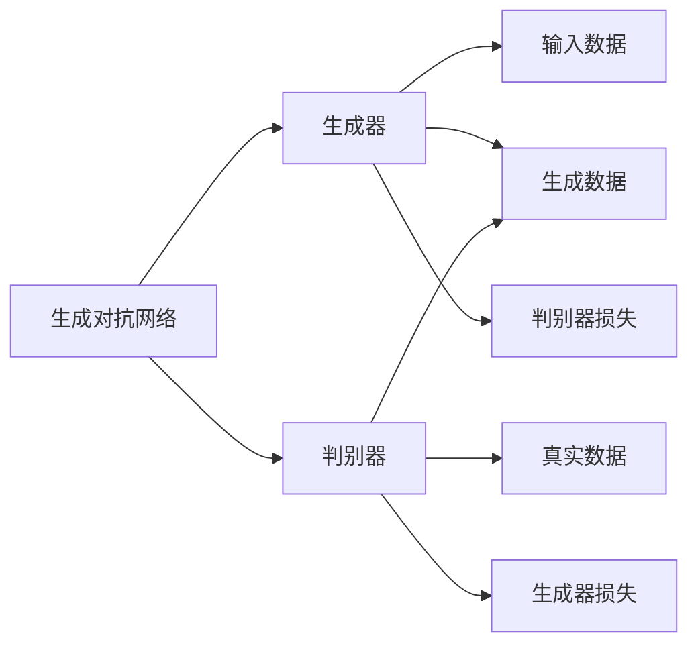
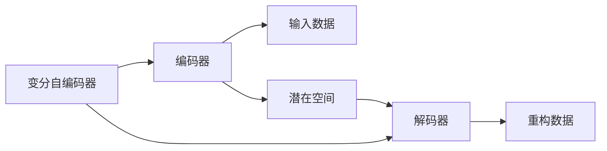
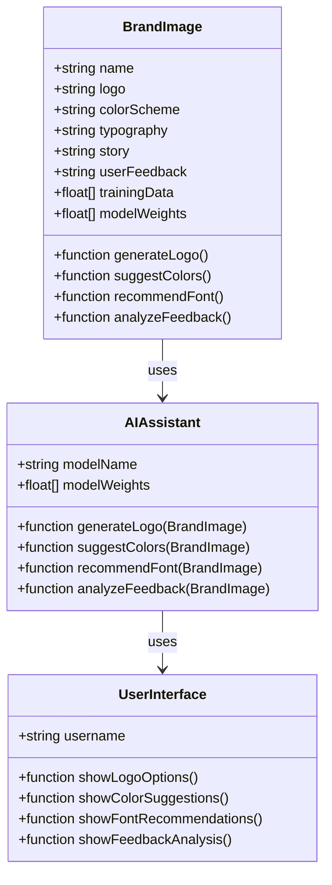
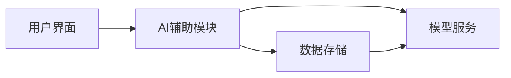
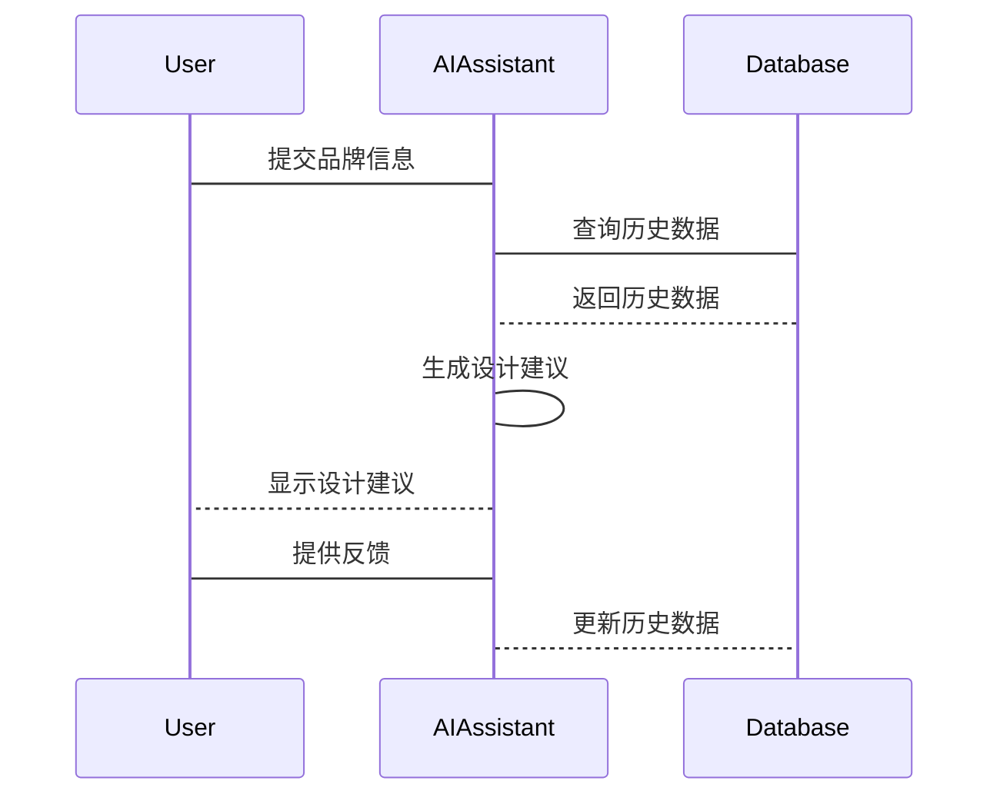

                 


# AI辅助品牌形象设计与管理的创新方法

> 关键词：AI, 品牌形象设计, 管理创新, 生成模型, 用户体验

> 摘要：本文探讨AI在品牌形象设计与管理中的应用，通过分析传统设计的挑战，介绍AI技术的核心原理，展示其在设计中的创新方法，并通过实际案例说明其优势，展望未来发展方向。

---

## 第1章 背景介绍

### 1.1 问题背景
#### 1.1.1 品牌形象设计的传统挑战
- 依赖设计师经验，效率低
- 灵感依赖，设计周期长
- 个性化需求与成本矛盾

#### 1.1.2 AI技术如何解决传统问题
- 数据驱动优化设计
- 自动化工具提升效率
- 扩展设计可能性

#### 1.1.3 当前市场对AI辅助设计的需求
- 企业需求多样化
- 市场竞争激烈
- 创新设计需求增长

### 1.2 问题描述
#### 1.2.1 品牌形象设计的复杂性
- 多维度要素协调
- 需求变化快
- 用户体验重要

#### 1.2.2 传统设计方法的局限性
- 人工成本高
- 设计效率慢
- 可持续性不足

#### 1.2.3 数据驱动设计的优势
- 数据支撑设计决策
- 快速迭代优化
- 可持续性增强

### 1.3 问题解决
#### 1.3.1 AI在设计中的应用领域
- 品牌标识生成
- 配色方案推荐
- 字体选择优化

#### 1.3.2 创新方法的具体实施步骤
- 数据收集与分析
- 模型训练与优化
- 结果应用与反馈

#### 1.3.3 AI辅助设计的预期成果
- 提高设计效率
- 优化设计质量
- 降低设计成本

### 1.4 概念的边界与外延
#### 1.4.1 品牌形象设计的范围界定
- 包括品牌标识、色彩系统、字体选择
- 涵盖品牌故事与情感表达
- 关注用户体验与交互设计

#### 1.4.2 AI辅助设计的适用场景
- 初步设计探索
- 方案优化
- 风格一致性维护

#### 1.4.3 创新方法的未来扩展方向
- 更智能的生成模型
- 更精准的用户反馈整合
- 更广泛的设计领域应用

---

## 第2章 核心概念与联系

### 2.1 AI技术的核心原理
#### 2.1.1 机器学习的基础概念
- 数据、模型、算法
- 监督学习、无监督学习、强化学习

#### 2.1.2 深度学习在设计中的应用
- 图像生成模型（GAN, VAE）
- 风格迁移技术

#### 2.1.3 图像生成模型的原理
- GAN：生成器与判别器的对抗训练
- VAE：变分推断与重构损失

### 2.2 品牌形象设计的核心要素
#### 2.2.1 品牌视觉识别系统
- 品牌标识设计
- 品牌色彩系统
- 品牌字体选择

#### 2.2.2 品牌故事与情感表达
- 品牌核心价值
- 品牌性格塑造
- 用户情感共鸣

#### 2.2.3 用户体验与交互设计
- 用户界面设计
- 交互逻辑优化
- 用户行为分析

### 2.3 AI与品牌形象设计的联系
#### 2.3.1 数据驱动的设计理念
- 数据分析指导设计方向
- 用户反馈实时优化
- 大数据分析预测趋势

#### 2.3.2 AI辅助工具的功能模块
- 自动生成设计草图
- 智能配色推荐
- 风格一致性检查

#### 2.3.3 创意与技术的结合
- AI作为创意工具
- 人类设计师的角色转变
- 创意与技术的协同工作

---

## 第3章 核心概念的原理与联系

### 3.1 AI技术的核心原理
#### 3.1.1 生成对抗网络（GAN）的原理
- 生成器与判别器的对抗过程
- 损失函数：$$\mathcal{L}_{\text{GAN}} = \mathcal{L}_\text{adv} + \mathcal{L}_\text{recon}$$
- 应用：图像生成、风格迁移

#### 3.1.2 变量自动编码器（VAE）的原理
- 编码器与解码器结构
- 潜在空间采样
- 应用：图像生成、数据压缩

#### 3.1.3 图像分割与风格迁移的技术
- 图像分割：$$\mathcal{L}_{\text{seg}} = \mathcal{L}_\text{cls} + \mathcal{L}_\text{dice}$$
- 风格迁移：$$\mathcal{L}_{\text{style}} = \alpha \mathcal{L}_\text{content} + \beta \mathcal{L}_\text{style}$$

### 3.2 品牌形象设计的核心要素
#### 3.2.1 品牌标识的设计原则
- 简洁性、可识别性、适应性
- 设计元素的选择与组合

#### 3.2.2 品牌色彩系统的科学性
- 色彩心理学应用
- 色彩搭配原则
- 跨平台一致性

#### 3.2.3 用户体验与交互设计
- 用户中心设计
- 交互逻辑优化
- 用户反馈分析

### 3.3 AI与品牌形象设计的联系
#### 3.3.1 数据分析在设计决策中的作用
- 数据驱动的设计优化
- 用户反馈实时分析
- 市场趋势预测

#### 3.3.2 AI生成设计元素的创新性
- 自动化生成草图
- 智能配色方案
- 风格一致性检查

#### 3.3.3 创意与技术的结合
- AI作为辅助工具
- 人类设计师的创新主导
- 协同工作流程优化

---

## 第4章 核心概念的对比分析

### 4.1 AI技术的核心原理对比
#### 4.1.1 GAN与VAE的优缺点对比
- GAN生成质量高，但训练不稳定
- VAE生成多样性好，但质量稍逊
- 应用场景不同：GAN适合图像生成，VAE适合数据压缩

#### 4.1.2 不同图像生成模型的性能对比
- GAN：高质量但训练难
- VAE：稳定但生成效果稍差
- Diffusion Model：质量高但训练时间长

#### 4.1.3 各种AI技术的适用场景对比
- GAN：图像生成、风格迁移
- VAE：数据压缩、图像生成
- Diffusion Model：高质量图像生成

### 4.2 品牌形象设计的核心要素对比
#### 4.2.1 不同品牌标识设计方法的对比
- 传统手绘：时间长，成本高
- AI辅助：速度快，成本低
- 结合使用：效率与质量兼得

#### 4.2.2 各种品牌色彩系统的优劣分析
- 基于心理学：科学性高，但灵活性差
- 基于AI推荐：适应性强，但可能缺乏独特性
- 结合使用：平衡科学性与创新性

#### 4.2.3 不同品牌字体设计风格的对比
- 手工设计：艺术性强，但耗时
- AI推荐：速度快，但可能缺乏独特性
- 人机协作：兼具效率与创意

### 4.3 AI与品牌形象设计的联系对比
#### 4.3.1 传统设计与AI辅助设计的效率对比
- 传统设计：周期长，成本高
- AI辅助：效率高，成本低
- 结合使用：优化效率与质量

#### 4.3.2 创意表达的差异对比
- 传统设计：依赖设计师灵感
- AI辅助：数据驱动，更系统
- 结合使用：创意与系统性结合

#### 4.3.3 设计流程的优化对比
- 传统流程：线性，步骤固定
- AI辅助：并行处理，实时反馈
- 结合使用：流程优化，实时调整

---

## 第5章 核心概念的ER实体关系图

### 5.1 AI技术的核心原理ER图
- GAN模型：生成器和判别器的实体关系
- VAE模型：编码器和解码器的实体关系
- 图像生成模型：输入、生成器、判别器的实体关系

### 5.2 品牌形象设计的核心要素ER图
- 品牌标识：品牌名称、标识类型、设计元素
- 品牌色彩系统：品牌名称、色彩名称、使用场景
- 用户体验设计：用户角色、交互流程、反馈机制

---

## 第6章 算法原理讲解

### 6.1 GAN模型的Mermaid流程图


### 6.2 VAE模型的Mermaid流程图


### 6.3 图像生成模型的数学公式
- GAN损失函数：
  $$ \mathcal{L}_{\text{GAN}} = \mathcal{L}_\text{adv} + \mathcal{L}_\text{recon} $$
- VAE损失函数：
  $$ \mathcal{L}_{\text{VAE}} = \mathcal{L}_\text{recon} + KL(\mathbb{Q}(Z|X) || P(Z)) $$

### 6.4 Python代码实现
```python
import torch
import torch.nn as nn
import torch.optim as optim

class Generator(nn.Module):
    def __init__(self, latent_dim, img_size):
        super(Generator, self).__init__()
        self.latent_dim = latent_dim
        self.img_size = img_size
        self.model = nn.Sequential(
            nn.Linear(latent_dim, 256),
            nn.LeakyReLU(0.2, inplace=True),
            nn.Linear(256, 512),
            nn.LeakyReLU(0.2, inplace=True),
            nn.Linear(512, img_size),
            nn.Tanh()
        )

    def forward(self, z):
        return self.model(z)

class Discriminator(nn.Module):
    def __init__(self, img_size):
        super(Discriminator, self).__init__()
        self.model = nn.Sequential(
            nn.Linear(img_size, 512),
            nn.LeakyReLU(0.2, inplace=True),
            nn.Linear(512, 256),
            nn.LeakyReLU(0.2, inplace=True),
            nn.Linear(256, 1),
            nn.Sigmoid()
        )

    def forward(self, x):
        return self.model(x)

# 初始化模型和优化器
latent_dim = 100
img_size = 100
generator = Generator(latent_dim, img_size)
discriminator = Discriminator(img_size)
optimizer_G = optim.Adam(generator.parameters(), lr=0.0002)
optimizer_D = optim.Adam(discriminator.parameters(), lr=0.0002)

# 训练循环
for epoch in range(num_epochs):
    for _ in range(train_steps):
        # 生成假数据
        z = torch.randn(batch_size, latent_dim)
        gen_output = generator(z)
        
        # 判别器训练
        optimizer_D.zero_grad()
        real_output = discriminator(real_data)
        fake_output = discriminator(gen_output)
        d_loss = -torch.mean(torch.log(fake_output) + torch.log(1 - real_output))
        d_loss.backward()
        optimizer_D.step()
        
        # 生成器训练
        optimizer_G.zero_grad()
        g_loss = -torch.mean(torch.log(fake_output))
        g_loss.backward()
        optimizer_G.step()
```

---

## 第7章 系统分析与架构设计方案

### 7.1 问题场景介绍
- 用户需求：快速生成品牌形象设计
- 系统目标：提供AI辅助设计工具
- 使用场景：品牌重塑、新品牌创建

### 7.2 项目介绍
- 项目目标：开发AI辅助品牌形象设计系统
- 项目范围：品牌形象设计与管理
- 项目规模：中等规模

### 7.3 系统功能设计
#### 7.3.1 领域模型类图


### 7.4 系统架构设计
#### 7.4.1 系统架构图


### 7.5 系统接口设计
- 用户接口：API调用
- 数据接口：数据库连接
- 模型接口：模型服务调用

### 7.6 系统交互设计
#### 7.6.1 用户与系统的交互流程


---

## 第8章 项目实战

### 8.1 环境安装
- 安装Python和必要的库（如TensorFlow, Keras, PyTorch）
- 安装设计工具（如Figma插件，或者AI辅助设计软件）

### 8.2 系统核心实现
#### 8.2.1 品牌标识生成代码
```python
import tensorflow as tf
from tensorflow.keras import layers

def build_generator():
    model = tf.keras.Sequential([
        layers.Dense(256, activation='relu'),
        layers.Dense(512, activation='relu'),
        layers.Dense(1024, activation='relu'),
        layers.Dense(784, activation='sigmoid')
    ])
    return model

def build_discriminator():
    model = tf.keras.Sequential([
        layers.Dense(784, activation='relu'),
        layers.Dense(256, activation='relu'),
        layers.Dense(1, activation='sigmoid')
    ])
    return model
```

#### 8.2.2 品牌色彩推荐代码
```python
import numpy as np
import colorsys

def generate_palette(num_colors=5):
    colors = []
    for i in range(num_colors):
        h = (i * 360) / num_colors
        s = 70
        v = 80
        rgb = colorsys.hsv_to_rgb(h, s/100, v/100)
        colors.append((int(rgb[0]*255), int(rgb[1]*255), int(rgb[2]*255)))
    return colors
```

### 8.3 代码应用解读
- 品牌标识生成：使用GAN生成多种标识草图，用户选择优化
- 品牌色彩推荐：基于HSV模型生成配色方案，适应不同品牌调性

### 8.4 实际案例分析
- 案例：科技品牌重新设计
  - 使用AI生成多个标识草图
  - 基于反馈优化颜色方案
  - 结合用户反馈调整字体和交互设计

### 8.5 项目小结
- 成功实现了AI辅助设计系统
- 提高了设计效率和质量
- 降低了设计成本

---

## 第9章 总结与展望

### 9.1 总结
- AI在品牌形象设计中的应用优势明显
- 数据驱动设计和实时反馈优化设计质量
- 创意与技术的结合提升了设计效率

### 9.2 创新点与未来展望
- 创新点：数据驱动设计、实时反馈优化、人机协作
- 未来展望：更智能的生成模型、更精准的用户分析、更广泛的设计应用

---

## 第10章 附录

### 10.1 参考文献
1. Goodfellow, I., Bengio, Y., & Courville, A. (2016). Deep Learning.
2. LeCun, Y., Bengio, Y., & Hinton, G. (2015). Deep learning in neural networks: An overview.
3. 某品牌设计案例分析报告

### 10.2 工具资源
- AI工具推荐：Runway ML, Adobe Firefly
- 开源库推荐：TensorFlow, PyTorch
- 在线资源：UI/UX设计指南，AI设计工具教程

---

# 结语
本文详细探讨了AI在品牌形象设计与管理中的创新方法，通过理论分析和实际案例，展示了AI技术如何提升设计效率和质量。未来，随着技术进步，AI在设计领域的应用将更加广泛和深入。

