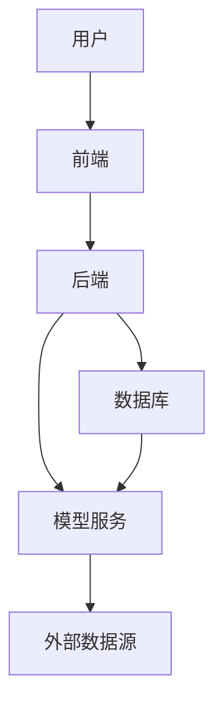

                 


# AI辅助的ESG投资筛选工具

> 关键词：AI, ESG投资, 金融技术, 机器学习, 自然语言处理, 可持续投资

> 摘要：本文将探讨AI在ESG投资筛选中的应用，从ESG投资的基本概念到AI辅助工具的实现原理，再到系统架构设计和项目实战，全面解析如何利用AI技术提升ESG投资的效率和准确性。通过本文，读者将了解如何利用机器学习、自然语言处理等技术，构建一个智能化的ESG投资筛选工具，为投资者提供科学、高效的投资决策支持。

---

# 第一部分: ESG投资的背景与概念

## 第1章: ESG投资的背景与意义

### 1.1 ESG投资的定义与核心要素

ESG投资是指在投资决策过程中，除了考虑传统的财务指标外，还综合评估企业在环境、社会和公司治理方面的表现。其核心要素包括：

- **环境（Environmental）**：企业对环境保护的贡献，包括减少碳排放、资源节约、污染防治等。
- **社会（Social）**：企业在社会责任、员工权益、社区参与等方面的表现。
- **治理（Governance）**：企业的管理结构、董事会构成、高管薪酬、股东权利等治理相关因素。

ESG投资的目的是通过综合评估这些因素，筛选出具有可持续发展能力和社会责任感的企业，从而实现长期投资回报和价值创造。

### 1.2 ESG投资的全球发展趋势

随着全球对可持续发展和气候变化的关注度不断提高，ESG投资正成为全球金融市场的主流趋势。以下是ESG投资的几个发展趋势：

1. **监管政策的推动**：各国政府和监管机构纷纷出台相关政策，要求金融机构在投资决策中考虑ESG因素。
2. **投资者需求的变化**：越来越多的投资者开始关注企业的社会责任和可持续发展能力，尤其是机构投资者和高净值客户。
3. **技术驱动的创新**：AI和大数据技术的应用，使得ESG投资的评估和筛选更加高效和精准。

### 1.3 AI辅助的ESG投资筛选工具的定义与目标

AI辅助的ESG投资筛选工具是一种基于人工智能技术的金融工具，旨在通过自动化的方式，从海量的企业数据中筛选出符合ESG标准的企业。其目标包括：

- **自动化数据处理**：利用AI技术快速处理和分析企业公开数据，提取ESG相关特征。
- **智能化评估**：基于机器学习模型，对企业的ESG表现进行量化评估。
- **高效决策支持**：为投资者提供实时、精准的ESG投资建议，降低投资风险。

---

# 第二部分: AI辅助的ESG投资筛选工具的原理

## 第2章: 基于机器学习的ESG评分模型

### 2.1 ESG评分模型的构建与优化

#### 2.1.1 数据预处理与特征工程

在构建ESG评分模型之前，需要对数据进行预处理，包括：

1. **数据清洗**：去除无效数据、填充缺失值、处理异常值。
2. **特征提取**：从企业财务报表、新闻报道、社会责任报告等多源数据中提取ESG相关特征。
3. **特征选择**：通过相关性分析、主成分分析等方法，筛选出对ESG评分影响较大的特征。

#### 2.1.2 机器学习算法的选择与实现

常用的机器学习算法包括：

- **线性回归**：适用于简单的线性关系建模。
- **支持向量机（SVM）**：适用于高维数据的分类与回归。
- **随机森林**：适用于特征重要性分析和非线性关系建模。
- **神经网络**：适用于复杂非线性关系的建模。

#### 2.1.3 模型评估与优化

通过交叉验证、ROC曲线等方法，对模型的性能进行评估，并通过超参数调优、集成学习等方法优化模型。

---

## 第3章: 自然语言处理在ESG文本分析中的应用

### 3.1 基于NLP的企业社会责任报告分析

#### 3.1.1 文本数据的清洗与分词

对企业的社会责任报告进行分词、去除停用词等预处理，提取关键词和主题。

#### 3.1.2 情感分析与主题提取

利用自然语言处理技术，对企业社会责任报告中的情感倾向进行分析，并提取关键词和主题。

#### 3.1.3 文本相似度计算与聚类分析

通过余弦相似度、BM25等方法，计算文本之间的相似度，并进行聚类分析，识别相似的主题。

### 3.2 基于BERT的ESG文本分析模型

#### 3.2.1 BERT模型的结构与特点

BERT（Bidirectional Encoder Representations from Transformers）是一种基于Transformer的预训练语言模型，具有以下特点：

- **双向编码**：能够捕捉文本的上下文信息。
- **大规模预训练**：在海量数据上进行预训练，具有强大的语言理解能力。
- **可迁移性**：可以在不同的任务上进行微调，适用于多种自然语言处理任务。

#### 3.2.2 ESG文本分类任务的实现

通过微调BERT模型，实现对企业社会责任报告的分类任务，如判断报告的合规性、披露程度等。

---

# 第三部分: 系统架构与设计

## 第4章: 系统功能设计与实现

### 4.1 系统功能模块设计

#### 4.1.1 数据采集模块

负责从企业公开数据、新闻媒体、社会责任报告等多源数据中采集ESG相关数据。

#### 4.1.2 数据处理模块

对采集到的数据进行清洗、特征提取和特征选择。

#### 4.1.3 模型训练模块

基于机器学习算法，构建ESG评分模型，并进行模型优化。

#### 4.1.4 用户交互模块

为用户提供友好的界面，展示ESG评分结果、企业分析报告等信息。

### 4.2 系统架构设计

#### 4.2.1 系统架构图



#### 4.2.2 系统接口设计

系统主要接口包括：

- **数据接口**：与企业数据库、新闻爬虫等外部数据源对接。
- **模型接口**：与机器学习模型服务对接，获取ESG评分结果。
- **用户接口**：与前端界面对接，提供用户查询和结果展示功能。

---

## 第5章: 项目实战与代码实现

### 5.1 项目环境配置

#### 5.1.1 Python环境安装

```bash
pip install numpy pandas scikit-learn spacy-transformers
```

#### 5.1.2 数据集准备

准备企业社会责任报告、财务报表等数据。

### 5.2 核心代码实现

#### 5.2.1 数据预处理代码

```python
import pandas as pd
import numpy as np

# 加载数据
data = pd.read_csv('esg_data.csv')

# 数据清洗
data.dropna(inplace=True)
data['text'] = data['text'].str.lower().str.replace(r'[^\w\s]', ' ')

# 分词处理
from spacy.lang.zh import Chinese

nlp = Chinese()
doc = nlp(data['text'][0])
tokens = [token.text for token in doc]
```

#### 5.2.2 基于BERT的文本分类代码

```python
from transformers import BertTokenizer, BertModel
import torch

# 加载BERT模型和分词器
tokenizer = BertTokenizer.from_pretrained('bert-base-chinese')
model = BertModel.from_pretrained('bert-base-chinese')

# 定义输入
inputs = tokenizer("公司治理结构良好", return_tensors="pt", padding=True, truncation=True)

# 获取模型输出
with torch.no_grad():
    outputs = model(**inputs)

# 提取特征向量
features = outputs.last_hidden_state[:, 0, :].numpy()
```

---

## 第6章: 总结与展望

### 6.1 总结

本文详细介绍了AI辅助的ESG投资筛选工具的实现过程，包括ESG投资的背景与概念、AI辅助工具的原理与算法、系统架构与设计，以及项目实战与代码实现。通过本文的讲解，读者可以了解到如何利用AI技术提升ESG投资的效率和准确性。

### 6.2 展望

未来，随着AI技术的不断发展，ESG投资筛选工具将更加智能化和高效化。建议在以下方面进行进一步研究和探索：

- **多模态数据融合**：结合文本、图像等多种数据源，提高ESG评估的准确性。
- **动态评估模型**：建立动态评估模型，实时跟踪企业的ESG表现。
- **个性化投资建议**：根据投资者的风险偏好和投资目标，提供个性化的ESG投资建议。

---

通过本文的讲解，希望读者能够对AI辅助的ESG投资筛选工具有一个全面的了解，并能够在实际应用中发挥出其潜力，为可持续投资和社会价值的创造做出贡献。

