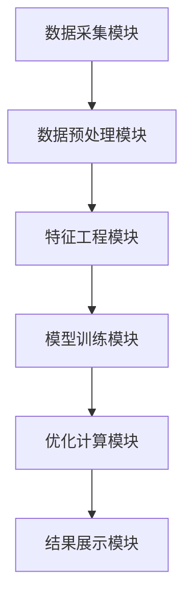
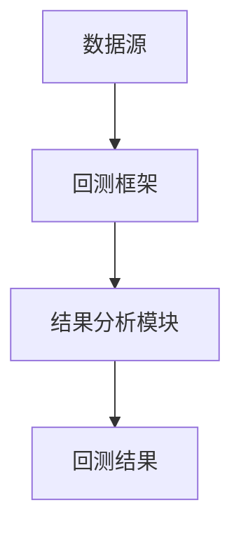

                 


# AI辅助的ESG投资组合优化与回测

---

## 关键词：
- ESG投资
- AI辅助
- 投资组合优化
- 回测系统
- 机器学习

---

## 摘要：
本文详细探讨了人工智能在ESG（环境、社会、治理）投资组合优化中的应用。通过数学建模、算法设计和系统实现，结合实际案例分析，展示如何利用AI技术优化ESG投资组合，并通过回测系统验证其有效性。文章从理论到实践，系统性地介绍了ESG投资的背景、AI辅助优化的方法，以及投资组合回测的实现过程。

---

# 第一部分: AI辅助的ESG投资组合优化与回测基础

## 第1章: ESG投资与AI辅助优化概述

### 1.1 ESG投资的背景与概念
ESG投资是指在投资决策中考虑环境、社会和公司治理因素的投资方式。随着全球对可持续发展的关注增加，ESG投资越来越受到重视。

#### 1.1.1 什么是ESG投资
ESG投资不仅关注企业的财务表现，还关注其在环境、社会和公司治理方面的表现。ESG评分是对企业在这些方面表现的量化评估。

#### 1.1.2 ESG评分的定义与计算方法
ESG评分通常基于企业的公开信息，通过标准化的评分模型计算得出。例如，环境因素包括碳排放、资源利用效率；社会因素包括员工权益、社会责任；治理因素包括董事会结构、高管薪酬。

#### 1.1.3 ESG评分的核心要素对比表
| 因素   | 环境（E）       | 社会（S）       | 治理（G）       |
|--------|----------------|----------------|----------------|
| 定义   | 环境影响         | 社会责任         | 公司治理结构     |
| 示例   | 碳排放、资源利用 | 员工权益、社会责任 | 董事会结构、高管薪酬 |

#### 1.1.4 ESG投资与传统投资的对比
- 传统投资：主要关注财务表现，如收益、风险。
- ESG投资：在财务表现的基础上，加入环境、社会和治理因素。

### 1.2 AI在金融投资中的应用
人工智能技术在金融领域的应用越来越广泛，特别是在投资组合优化方面。

#### 1.2.1 AI在金融领域的应用现状
- 量化交易：利用算法进行高频交易。
- 风险管理：通过机器学习模型预测市场风险。
- 股票推荐：基于历史数据和市场信息推荐股票。

#### 1.2.2 AI在投资组合优化中的优势
- 数据处理能力强：可以处理大量非结构化数据。
- 模型优化速度快：能够快速找到最优解。
- 自适应能力强：可以根据市场变化动态调整投资组合。

#### 1.2.3 AI辅助ESG投资的潜力与挑战
- 潜力：通过AI技术优化ESG评分，提高投资组合的可持续性。
- 挑战：数据质量、模型解释性、计算复杂度。

### 1.3 投资组合优化的基本原理
投资组合优化是通过调整资产配置，使投资组合在风险和收益之间达到最佳平衡。

#### 1.3.1 投资组合优化的数学模型
投资组合优化的目标是最大化收益，同时最小化风险。数学表达式如下：

$$ \text{目标函数：} \quad \max \sum_{i=1}^{n} w_i r_i - \lambda \sum_{i=1}^{n} w_i^2 \sigma_i^2 $$

其中，\( w_i \) 是资产 \( i \) 的权重，\( r_i \) 是资产 \( i \) 的预期收益，\( \sigma_i^2 \) 是资产 \( i \) 的风险，\( \lambda \) 是风险惩罚因子。

#### 1.3.2 现代投资组合理论（MPT）概述
MPT是由Harry Markowitz提出的，旨在通过分散投资降低风险。核心思想是投资组合的风险不仅取决于单个资产的风险，还取决于资产之间的相关性。

#### 1.3.3 ESG约束下的投资组合优化
在传统投资组合优化的基础上，加入ESG评分约束，优化目标函数变为：

$$ \text{目标函数：} \quad \max \sum_{i=1}^{n} w_i r_i - \lambda \sum_{i=1}^{n} w_i^2 \sigma_i^2 $$

约束条件：
$$ \sum_{i=1}^{n} w_i = 1 $$
$$ \sum_{i=1}^{n} w_i \cdot \text{ESG评分}_i \geq \text{目标ESG评分} $$

### 1.4 本章小结
- ESG投资的核心是关注环境、社会和治理因素。
- AI在投资组合优化中的优势在于数据处理能力和模型优化速度。
- ESG约束下的投资组合优化需要在收益和风险之间找到平衡。

---

## 第2章: ESG评分与投资目标的数学建模

### 2.1 ESG评分的量化方法
将ESG评分量化是投资组合优化的第一步。

#### 2.1.1 ESG评分的标准化处理
- 数据标准化：将ESG评分转换为统一的尺度，例如使用Z-score标准化。

#### 2.1.2 多目标优化问题的数学表达
多目标优化问题可以表示为：

$$ \text{目标函数：} \quad \max \sum_{i=1}^{n} w_i r_i - \lambda \sum_{i=1}^{n} w_i^2 \sigma_i^2 $$
$$ \text{约束条件：} \quad \sum_{i=1}^{n} w_i \cdot \text{ESG评分}_i \geq \text{目标ESG评分} $$

#### 2.1.3 ESG评分与投资收益的关系
通过回归分析可以发现，ESG评分与投资收益之间存在一定的相关性。例如，高ESG评分的企业可能具有更高的长期收益。

### 2.2 投资组合优化的数学模型
优化模型是投资组合优化的核心。

#### 2.2.1 线性规划与非线性规划模型
- 线性规划模型：目标函数和约束条件都是线性的。
- 非线性规划模型：目标函数或约束条件是非线性的。

#### 2.2.2 基于ESG约束的优化目标
在传统投资组合优化模型的基础上，加入ESG评分的约束条件。

#### 2.2.3 算法选择与实现路径
选择适合的优化算法，例如遗传算法、模拟退火等。

### 2.3 基于AI的优化算法
AI算法在投资组合优化中具有重要作用。

#### 2.3.1 机器学习在投资组合优化中的应用
- 特征工程：提取影响投资收益的关键特征。
- 模型选择：选择适合的机器学习模型进行优化。

#### 2.3.2 深度学习模型的构建与优化
- 神经网络结构设计：例如LSTM用于时间序列数据。
- 模型训练：通过反向传播算法优化模型参数。

#### 2.3.3 群智能算法（如遗传算法）的应用
- 遗传算法流程：
  1. 初始化种群。
  2. 计算适应度值。
  3. 选择适应度高的个体。
  4. 进行交叉和变异操作。
  5. 重复迭代，直到满足终止条件。

### 2.4 本章小结
- ESG评分的量化处理是投资组合优化的基础。
- 多目标优化模型需要考虑收益和风险的平衡。
- AI算法在优化过程中具有重要作用。

---

## 第3章: 数据准备与特征工程

### 3.1 数据收集与预处理
数据是投资组合优化的基础。

#### 3.1.1 数据来源与获取方法
- 数据来源：股票价格、财务报表、ESG评分报告。
- 数据获取：通过API接口获取实时数据，或通过爬虫抓取历史数据。

#### 3.1.2 数据清洗与标准化
- 数据清洗：处理缺失值、异常值。
- 数据标准化：将不同量纲的变量进行标准化处理。

#### 3.1.3 时间序列数据的处理
- 时间序列数据的特征：趋势、周期性、随机性。
- 数据分割：训练集、验证集、测试集。

### 3.2 ESG特征的提取与选择
特征工程是投资组合优化的关键步骤。

#### 3.2.1 ESG评分的特征分解
- 将ESG评分分解为环境、社会、治理三个维度的特征。
- 例如，环境特征包括碳排放、资源利用效率。

#### 3.2.2 传统金融指标的整合
- 整合传统金融指标，例如市盈率、市净率。
- 通过主成分分析（PCA）提取关键特征。

#### 3.2.3 特征重要性分析
- 使用特征重要性分析方法（如随机森林、Lasso回归）确定关键特征。

### 3.3 数据集的划分与验证
合理的数据划分有助于模型的验证和优化。

#### 3.3.1 训练集、验证集与测试集的划分
- 训练集：用于模型训练。
- 验证集：用于超参数调优。
- 测试集：用于模型验证。

#### 3.3.2 K折交叉验证的应用
- K折交叉验证：将数据集分成K个子集，轮流使用其中一个子集作为验证集，其余子集作为训练集。

#### 3.3.3 数据集的平衡与增强
- 数据平衡：处理类别不平衡问题。
- 数据增强：通过数据生成技术增加数据多样性。

### 3.4 本章小结
- 数据准备是投资组合优化的前提条件。
- 特征工程是优化过程中的关键步骤。
- 合理的数据划分有助于模型的验证和优化。

---

## 第4章: 系统架构设计

### 4.1 系统功能模块划分
系统架构设计是投资组合优化的重要组成部分。

#### 4.1.1 数据采集模块
- 功能：从数据源获取ESG评分和股票价格数据。
- 实现：通过API接口获取实时数据，或通过爬虫抓取历史数据。

#### 4.1.2 模型训练模块
- 功能：训练机器学习模型，用于投资组合优化。
- 实现：使用Python的scikit-learn库进行模型训练。

#### 4.1.3 优化计算模块
- 功能：根据模型预测结果优化投资组合。
- 实现：使用遗传算法或其他优化算法进行优化。

#### 4.1.4 结果展示模块
- 功能：展示优化结果和回测结果。
- 实现：通过可视化工具（如Matplotlib、Seaborn）展示结果。

### 4.2 系统架构的流程图
系统架构设计可以通过mermaid图展示。



### 4.3 本章小结
- 系统架构设计是投资组合优化的基础。
- 合理的功能模块划分有助于系统的开发和维护。
- 系统架构设计需要考虑数据流和模块交互。

---

# 第二部分: AI辅助的ESG投资组合优化实现

## 第5章: 投资组合优化的数学模型与算法

### 5.1 线性规划与非线性规划模型
- 线性规划模型：目标函数和约束条件都是线性的。
- 非线性规划模型：目标函数或约束条件是非线性的。

### 5.2 基于AI的优化算法
- 机器学习算法：随机森林、支持向量机。
- 深度学习算法：神经网络、LSTM。
- 群智能算法：遗传算法、粒子群优化。

### 5.3 优化算法的实现步骤
1. 数据预处理：清洗和标准化数据。
2. 特征工程：提取关键特征。
3. 算法选择：选择适合的优化算法。
4. 模型训练：训练机器学习模型。
5. 优化计算：根据模型预测结果优化投资组合。

### 5.4 本章小结
- 优化模型是投资组合优化的核心。
- AI算法在优化过程中具有重要作用。
- 优化算法的选择需要根据具体问题进行调整。

---

## 第6章: AI辅助的ESG投资组合优化实现

### 6.1 数据加载与特征提取
使用Python代码加载数据并提取特征。

```python
import pandas as pd
import numpy as np

# 加载数据
data = pd.read_csv('esg_data.csv')

# 提取特征
features = data[['收益', '波动率', 'ESG评分']]
```

### 6.2 模型训练与优化计算
使用机器学习模型进行训练和优化。

```python
from sklearn.ensemble import RandomForestRegressor
from sklearn.model_selection import train_test_split

# 划分数据集
X_train, X_test, y_train, y_test = train_test_split(features, data['目标'], test_size=0.2)

# 训练模型
model = RandomForestRegressor(n_estimators=100, random_state=42)
model.fit(X_train, y_train)

# 预测结果
y_pred = model.predict(X_test)
```

### 6.3 优化结果分析
分析优化结果，评估模型的性能。

```python
from sklearn.metrics import mean_squared_error

# 计算均方误差
mse = mean_squared_error(y_test, y_pred)
print(f'均方误差：{mse}')
```

### 6.4 本章小结
- 数据加载和特征提取是投资组合优化的基础。
- 模型训练和优化计算是优化过程中的关键步骤。
- 结果分析是优化过程中的重要环节。

---

# 第三部分: 投资组合回测系统设计与实现

## 第7章: 回测系统的设计

### 7.1 回测系统总体架构
- 回测系统包括数据源、回测框架、结果分析模块。

### 7.2 回测框架的设计
- 数据源：股票价格、ESG评分。
- 回测策略：基于优化模型的投资策略。
- 结果分析：计算回测结果的收益和风险。

### 7.3 系统交互流程
通过mermaid图展示系统交互流程。



### 7.4 本章小结
- 回测系统是投资组合优化的重要组成部分。
- 系统交互流程需要合理设计，确保数据流的顺畅。

---

## 第8章: 回测系统的实现与结果分析

### 8.1 回测系统实现
使用Python代码实现回测系统。

```python
import backtrader as bt

# 定义策略
class ESGStrategy(bt.Strategy):
    def __init__(self):
        self.data = self.datas[0]
        self ES

    def next(self):
        # 根据优化结果调整权重
        pass

# 初始化 cerebro
cerebro = bt.Cerebro()

# 添加数据
data = bt.feeds.PandasData(dataname=data)

cerebro.addstrategy(ESGStrategy)
cerebro.adddata(data)
cerebro.run()
```

### 8.2 回测结果分析
分析回测结果，评估投资组合的性能。

```python
# 计算回测结果的收益和风险
returns = strategy.returns
volatility = strategy.volatility

print(f'平均收益：{returns.mean()}')
print(f'波动率：{volatility}')
```

### 8.3 本章小结
- 回测系统的实现是投资组合优化的重要步骤。
- 回测结果分析是优化过程中的关键环节。

---

## 总结

本文系统地介绍了AI辅助的ESG投资组合优化与回测的实现过程。从理论到实践，详细讲解了ESG投资的背景、AI辅助优化的方法，以及投资组合回测的实现过程。通过数学建模、算法设计和系统实现，结合实际案例分析，展示了如何利用AI技术优化ESG投资组合，并通过回测系统验证其有效性。希望本文能够为读者提供有价值的参考，帮助他们更好地理解AI在ESG投资中的应用。

---

# 附录: 参考文献与工具

- 参考文献：
  1. Markowitz, H. (1952). Portfolio Selection. Journal of Finance.
  2. 其他相关文献...

- 工具：
  1. Python编程语言
  2. Pandas、NumPy数据处理库
  3. Scikit-learn机器学习库
  4. Backtrader回测框架

--- 

**注意**：以上内容为示例，实际写作中需根据具体数据和需求进行调整和补充。

