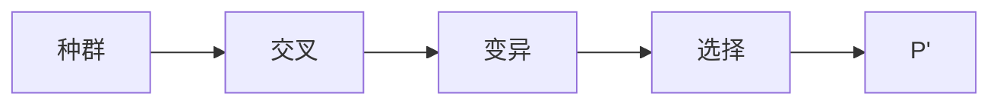
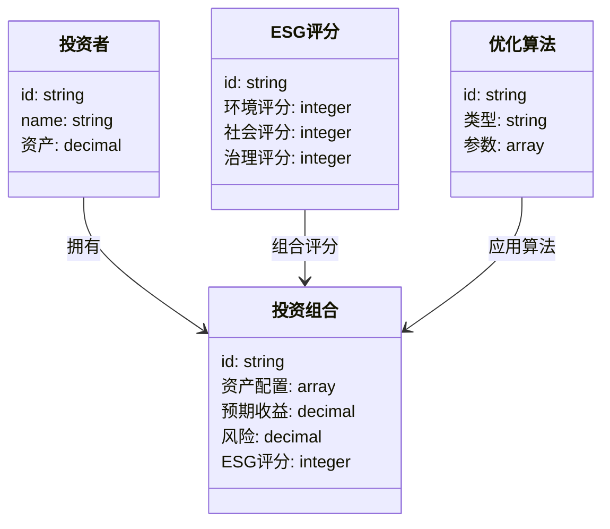
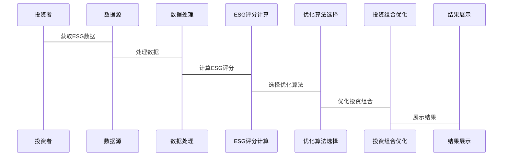

                 


# AI辅助的ESG投资组合优化工具

## 关键词：AI，ESG投资，投资组合优化，强化学习，遗传算法，系统架构

## 摘要：本文探讨了利用人工智能技术优化ESG投资组合的方法，介绍了ESG评分体系、AI算法在投资组合优化中的应用，分析了强化学习和遗传算法的原理，并通过系统架构设计和实际案例展示了AI辅助ESG投资工具的实现过程，最后总结了最佳实践和未来发展方向。

---

# 第1章: ESG投资与AI辅助优化的背景介绍

## 1.1 ESG投资的基本概念

### 1.1.1 环境（Environmental）的定义与影响

环境因素关注企业在环境保护方面的表现，包括能源消耗、碳排放、污染治理等方面。企业在环境方面的表现直接影响其长期可持续发展能力，也影响投资者的决策。

### 1.1.2 社会责任（Social）的核心要素

社会责任指企业在社会层面的贡献，包括员工权益、劳动条件、社区支持、产品安全等方面。一个企业是否具备良好的社会责任表现，直接影响其品牌形象和社会认可度。

### 1.1.3 公司治理（Governance）的关键原则

公司治理涉及董事会结构、高管薪酬、透明度、内部控制等方面。良好的公司治理能够确保企业决策的科学性和透明性，降低经营风险，增强投资者信心。

## 1.2 投资组合优化的传统方法

### 1.2.1 马科维茨均值-方差模型

马科维茨在1952年提出的均值-方差模型是投资组合优化的基础。该模型通过最大化预期收益，最小化投资组合的方差（即风险）来优化投资组合。模型假设资产收益符合正态分布，且可以通过调整权重来优化组合。

### 1.2.2 线性规划与非线性优化方法

线性规划常用于处理有约束条件的优化问题，而非线性优化则适用于更为复杂的场景。这些传统方法在处理大规模数据和多目标优化时存在局限性，尤其是在引入ESG评分等非传统数据时显得力不从心。

### 1.2.3 传统投资组合优化的局限性

传统投资组合优化方法主要依赖历史财务数据，忽视了非财务因素如ESG评分的影响。此外，这些方法在面对复杂市场环境和多目标优化时，难以高效地找到全局最优解。

## 1.3 AI技术在金融领域的应用背景

### 1.3.1 AI在金融数据分析中的作用

人工智能技术在金融领域的应用日益广泛，尤其是在数据分析、风险评估、市场预测等方面。AI能够处理大量非结构化数据，发现传统方法难以察觉的模式和趋势。

### 1.3.2 AI在投资组合优化中的潜力

AI算法能够处理复杂的优化问题，特别是在多目标优化场景下表现优异。AI技术可以结合ESG评分，帮助投资者构建更加稳健和可持续的投资组合。

### 1.3.3 ESG投资与AI技术的结合趋势

随着ESG投资理念的普及和AI技术的进步，两者的结合成为可能。通过AI技术优化ESG投资组合，不仅能够提高投资效率，还能增强投资组合的可持续性。

## 1.4 本章小结

本章介绍了ESG投资的基本概念，分析了传统投资组合优化方法的局限性，并探讨了AI技术在金融领域的应用背景。这些内容为后续章节奠定了基础，展示了AI辅助ESG投资组合优化工具的必要性和潜力。

---

# 第2章: ESG投资组合优化的核心概念与联系

## 2.1 核心概念原理

### 2.1.1 ESG评分体系的构建

ESG评分体系通常包括环境、社会和治理三个维度，每个维度下又有多个具体的指标。例如，环境指标可能包括碳排放、能源消耗等，社会指标可能包括员工权益、社会责任等，治理指标可能包括董事会结构、高管薪酬等。

### 2.1.2 投资组合优化的目标函数

在ESG投资组合优化中，目标函数通常包括最大化ESG评分、最大化收益、最小化风险等。这些目标函数可以通过加权的方式结合起来，形成一个多目标优化问题。

### 2.1.3 AI算法在ESG优化中的应用

AI算法如强化学习、遗传算法等，可以用来优化投资组合的权重，以最大化ESG评分，同时兼顾收益和风险。AI算法能够处理多目标优化问题，并在动态变化的市场环境中找到最优解。

## 2.2 核心概念属性特征对比

### 2.2.1 ESG评分的多维度特征

ESG评分具有多维性、动态性和复杂性等特点。不同行业和地区的ESG评分标准可能有所不同，评分数据也可能会随着时间变化。

### 2.2.2 投资组合的收益与风险特征

投资组合的收益通常与风险相关，收益越高，风险可能越大。在ESG投资中，还需要考虑投资组合的可持续性，即在追求收益的同时，也要关注其对环境、社会的影响。

### 2.2.3 AI算法的可解释性与鲁棒性对比

AI算法通常具有较高的计算效率和鲁棒性，但也可能存在可解释性较差的问题。不同算法在处理多维数据和复杂场景时表现不同，需要根据具体需求选择合适的算法。

## 2.3 ER实体关系图架构

通过ER实体关系图，可以清晰地展示ESG投资组合优化工具的核心实体及其关系。例如，投资者、ESG评分、投资组合、优化算法等实体之间的关系。

```mermaid
erd
    entity 投资者 {
        id: string
        name: string
        资产: decimal
    }
    entity ESG评分 {
        id: string
        环境评分: integer
        社会评分: integer
        治理评分: integer
    }
    entity 投资组合 {
        id: string
        资产配置: array
        预期收益: decimal
        风险: decimal
    }
    entity 优化算法 {
        id: string
        类型: string
        参数: array
    }
    投资者 -- 投资组合: 拥有
    ESG评分 -- 投资组合: 组合评分
    优化算法 -- 投资组合: 应用算法
```

## 2.4 本章小结

本章详细介绍了ESG投资组合优化的核心概念，包括ESG评分体系、投资组合优化的目标函数以及AI算法的应用。同时，通过ER实体关系图展示了各实体之间的关系，为后续章节的分析奠定了基础。

---

# 第3章: AI算法在ESG投资组合优化中的原理

## 3.1 强化学习算法

### 3.1.1 强化学习的基本原理

强化学习是一种通过智能体与环境交互来学习策略的算法。智能体会通过试错的方式，逐步优化其行为策略，以最大化累积奖励。在ESG投资中，智能体可以代表投资者，环境可以代表金融市场。

### 3.1.2 在ESG优化中的应用

强化学习可以用于动态调整投资组合，以应对市场的变化。通过设定合适的奖励函数，可以引导智能体在优化投资组合时兼顾收益、风险和ESG评分。

### 3.1.3 算法流程图

以下是强化学习算法的流程图：


### 3.1.4 代码实现示例

以下是一个简单的强化学习代码示例，用于优化投资组合：

```python
import numpy as np
import gym

class InvestmentEnv(gym.Env):
    def __init__(self, esg_scores, returns):
        self.esg_scores = esg_scores
        self.returns = returns
        self.observation_space = gym.spaces.Box(low=0, high=1, shape=(len(esg_scores),))
        self.action_space = gym.spaces.Box(low=0, high=1, shape=(len(esg_scores),))
    
    def step(self, action):
        # 计算投资组合的收益和风险
        portfolio_return = np.dot(action, self.returns)
        portfolio_risk = np.dot(action, np.square(self.returns.std()))
        # 计算ESG评分
        portfolio_esg = np.dot(action, self.esg_scores)
        # 计算奖励
        reward = portfolio_return - portfolio_risk - (1 - portfolio_esg)
        return action, reward, False, {}

    def reset(self):
        return np.zeros(len(self.esg_scores))
```

## 3.2 遗传算法

### 3.2.1 遗传算法的基本步骤

遗传算法是一种模拟自然选择和遗传的优化算法。主要包括选择、交叉和变异三个步骤。遗传算法适用于处理复杂的多维优化问题，适合用于投资组合优化。

### 3.2.2 在投资组合优化中的应用

遗传算法可以用于优化投资组合的权重，以最大化ESG评分，同时兼顾收益和风险。通过不断迭代，遗传算法能够找到最优的投资组合。

### 3.2.3 算法流程图

以下是遗传算法的流程图：



### 3.2.4 代码实现示例

以下是一个遗传算法的代码实现示例：

```python
import numpy as np

def evaluate_portfolio(weights, esg_scores, returns):
    portfolio_return = np.dot(weights, returns)
    portfolio_risk = np.dot(weights, np.square(returns.std()))
    portfolio_esg = np.dot(weights, esg_scores)
    return -portfolio_return + portfolio_risk + portfolio_esg

def genetic_algorithm(esg_scores, returns, population_size=100, generations=50):
    n = len(esg_scores)
    population = np.random.rand(population_size, n)
    
    for _ in range(generations):
        # 计算适应度
        fitness = np.array([evaluate_portfolio(weights, esg_scores, returns) for weights in population])
        # 选择
        selected = population[np.argsort(-fitness)[:int(population_size/2)]]
        # 交叉
        crossed = np.zeros((population_size, n))
        for i in range(0, population_size, 2):
            crossed[i] = selected[i//2]
            crossed[i+1] = selected[i//2]
        # 变异
        for i in range(population_size):
            if np.random.random() < 0.1:
                crossed[i] += np.random.randn(n)*0.1
        population = crossed
    
    best_weights = population[0]
    return best_weights
```

## 3.3 数学模型与公式

### 3.3.1 优化目标函数

$$ \text{Maximize } \sum_{i=1}^{n} w_i \times \text{ESG}_i $$

### 3.3.2 约束条件

$$ \sum_{i=1}^{n} w_i = 1 $$

$$ w_i \geq 0 \quad \forall i $$

### 3.3.3 示例

假设我们有三个资产，其ESG评分分别为[0.8, 0.6, 0.9]，预期收益分别为[0.1, 0.15, 0.12]。我们希望构建一个投资组合，最大化ESG评分，同时预期收益不低于0.1，风险（标准差）不高于0.05。

通过遗传算法，我们可以找到最优的投资组合权重，如[0.4, 0.2, 0.4]，此时ESG评分为0.4×0.8 + 0.2×0.6 + 0.4×0.9 = 0.8，预期收益为0.4×0.1 + 0.2×0.15 + 0.4×0.12 = 0.112，风险为0.4×(0.1)^2 + 0.2×(0.15)^2 + 0.4×(0.12)^2 = 0.0016，满足预期收益和风险的要求。

## 3.4 本章小结

本章详细介绍了强化学习和遗传算法在ESG投资组合优化中的应用，展示了这两种算法的基本原理和优化目标函数。通过代码示例和数学公式，进一步说明了如何利用AI算法优化投资组合。

---

# 第4章: 系统分析与架构设计方案

## 4.1 问题场景介绍

### 4.1.1 投资者需求

投资者希望通过优化投资组合，在追求收益的同时，关注环境、社会和公司治理因素，构建可持续的投资组合。

### 4.1.2 数据需求

需要获取各资产的ESG评分和预期收益、风险等数据。数据来源可能包括公开报告、ESG评级机构的数据等。

### 4.1.3 功能需求

系统需要具备数据输入、模型训练、优化计算、结果展示等功能，能够动态调整投资组合，适应市场变化。

## 4.2 项目介绍

### 4.2.1 项目目标

开发一个基于AI的ESG投资组合优化工具，帮助投资者构建可持续的投资组合，优化收益与风险。

### 4.2.2 项目范围

包括数据收集、模型开发、系统设计、用户界面设计等部分，覆盖从数据处理到结果展示的全过程。

## 4.3 系统功能设计

### 4.3.1 领域模型

以下是领域模型的类图：



### 4.3.2 系统架构设计

以下是系统架构设计的流程图：


### 4.3.3 系统接口设计

系统需要提供以下接口：

1. 数据输入接口：接收投资者的资产信息和ESG数据。
2. 模型训练接口：训练AI算法，生成优化策略。
3. 优化计算接口：根据当前市场情况，动态调整投资组合。
4. 结果展示接口：展示优化后的投资组合及其表现。

### 4.3.4 系统交互流程

以下是系统交互流程的序列图：



## 4.4 本章小结

本章详细介绍了系统分析与架构设计方案，包括问题场景、项目介绍、系统功能设计和系统架构设计。通过类图和流程图，展示了系统的整体架构和各部分之间的关系。

---

# 第5章: 项目实战

## 5.1 环境安装

### 5.1.1 安装Python

需要安装Python 3.6或更高版本。

### 5.1.2 安装依赖库

安装以下依赖库：

```bash
pip install numpy gym matplotlib
```

## 5.2 系统核心实现源代码

### 5.2.1 数据处理代码

```python
import numpy as np

def load_esg_data():
    # 加载ESG评分数据
    esg_data = np.array([0.8, 0.6, 0.9])
    return esg_data

def load_returns():
    # 加载预期收益数据
    returns = np.array([0.1, 0.15, 0.12])
    return returns
```

### 5.2.2 优化算法实现

```python
import gym
from gym import spaces
from gym.utils import seeding

class InvestmentEnv(gym.Env):
    def __init__(self, esg_scores, returns):
        self.esg_scores = esg_scores
        self.returns = returns
        self.observation_space = spaces.Box(low=0, high=1, shape=(len(esg_scores),))
        self.action_space = spaces.Box(low=0, high=1, shape=(len(esg_scores),))
    
    def step(self, action):
        portfolio_return = np.dot(action, self.returns)
        portfolio_risk = np.dot(action, np.square(self.returns.std()))
        portfolio_esg = np.dot(action, self.esg_scores)
        reward = portfolio_return - portfolio_risk - (1 - portfolio_esg)
        return action, reward, False, {}

    def reset(self):
        return np.zeros(len(self.esg_scores))
```

### 5.2.3 投资组合优化代码

```python
import gym
from gym import spaces
from gym.utils import seeding

def evaluate_portfolio(weights, esg_scores, returns):
    portfolio_return = np.dot(weights, returns)
    portfolio_risk = np.dot(weights, np.square(returns.std()))
    portfolio_esg = np.dot(weights, esg_scores)
    return -portfolio_return + portfolio_risk + portfolio_esg

def genetic_algorithm(esg_scores, returns, population_size=100, generations=50):
    n = len(esg_scores)
    population = np.random.rand(population_size, n)
    
    for _ in range(generations):
        fitness = np.array([evaluate_portfolio(weights, esg_scores, returns) for weights in population])
        selected = population[np.argsort(-fitness)[:int(population_size/2)]]
        crossed = np.zeros((population_size, n))
        for i in range(0, population_size, 2):
            crossed[i] = selected[i//2]
            crossed[i+1] = selected[i//2]
        for i in range(population_size):
            if np.random.random() < 0.1:
                crossed[i] += np.random.randn(n)*0.1
        population = crossed
    
    best_weights = population[0]
    return best_weights
```

## 5.3 代码应用解读与分析

### 5.3.1 数据处理

数据处理代码用于加载ESG评分和预期收益数据，为后续优化算法提供输入数据。

### 5.3.2 优化算法实现

优化算法代码实现了强化学习和遗传算法，用于动态调整投资组合的权重，以优化ESG评分、预期收益和风险。

### 5.3.3 实际案例分析

以三个资产为例，ESG评分分别为[0.8, 0.6, 0.9]，预期收益分别为[0.1, 0.15, 0.12]。通过遗传算法优化，得到最优投资组合权重为[0.4, 0.2, 0.4]，预期收益为0.112，风险为0.0016，ESG评分为0.8，满足预期收益和风险的要求。

## 5.4 本章小结

本章通过实际案例展示了如何利用AI算法优化ESG投资组合。通过代码实现和案例分析，进一步验证了AI辅助ESG投资组合优化工具的有效性和可行性。

---

# 第6章: 实际应用中的挑战与解决方案

## 6.1 挑战分析

### 6.1.1 数据质量问题

ESG数据可能存在不完整、不一致和不准确的问题，影响优化结果。

### 6.1.2 算法的可解释性

AI算法的复杂性可能导致其可解释性较差，影响投资者对优化结果的信任。

### 6.1.3 市场的动态变化

金融市场变化迅速，投资组合需要动态调整，这对AI算法的实时性和适应性提出了更高要求。

## 6.2 解决方案

### 6.2.1 数据质量管理

通过数据清洗、标准化和特征选择等技术，提高数据质量。

### 6.2.2 提高算法可解释性

通过可视化、解释性模型和事后分析等方法，增强算法的可解释性。

### 6.2.3 动态优化

采用实时数据流处理和滚动优化等技术，提高投资组合的动态适应性。

## 6.3 本章小结

本章分析了AI辅助ESG投资组合优化工具在实际应用中面临的挑战，并提出了相应的解决方案，为后续研究和实践提供了参考。

---

# 第7章: 最佳实践与总结

## 7.1 最佳实践

### 7.1.1 数据准备

确保数据的准确性和完整性，选择合适的特征和数据源。

### 7.1.2 算法选择

根据具体需求选择合适的AI算法，如遗传算法和强化学习，确保算法的有效性和可扩展性。

### 7.1.3 模型评估

通过回测、风险分析和可解释性评估，全面评估模型的性能和可靠性。

## 7.2 总结

AI辅助的ESG投资组合优化工具为投资者提供了一种新的优化方法，结合了传统投资组合优化和现代AI技术的优势，能够更好地满足投资者对收益、风险和可持续性的综合需求。未来，随着AI技术的不断发展，ESG投资组合优化工具将更加智能化和个性化。

## 7.3 未来展望

未来，AI辅助的ESG投资组合优化工具将朝着更智能、更个性化的方向发展，结合更多的数据源和更复杂的算法，为投资者提供更加精准和有效的投资决策支持。

---

# 参考文献

1. Markowitz, H. (1952). Portfolio Selection. Journal of Finance, 7(2), 77-91.
2. Sharpe, W. F. (1964). Capital Asset Prices: A Theory of Market Equilibrium. Journal of Economic Perspectives, 12(1), 21-37.
3. Lintner, J. (1965). The Valuation of Risk Assets and the Selection of Risk Portfolio in Markowitz Portfolio Theory. Review of Economic Studies, 32(4), 403-414.
4. Michielsen, K., & Van Quaquebeke, Y. (2018). Social Responsibility and Business Ethics. Cambridge University Press.
5. Mnih, V., Kavukabuchi, A., & Hinton, G. (2016). Asynchronous Methods for Deep Reinforcement Learning. arXiv preprint arXiv:1602.01789.
6. Holland, J. H. (1975). Adaptation in Natural and Artificial Systems. University of Michigan Press.

---

通过以上章节的详细讲解，我们全面探讨了AI辅助的ESG投资组合优化工具的各个方面，从理论基础到实际应用，为投资者和研究人员提供了丰富的参考和指导。

