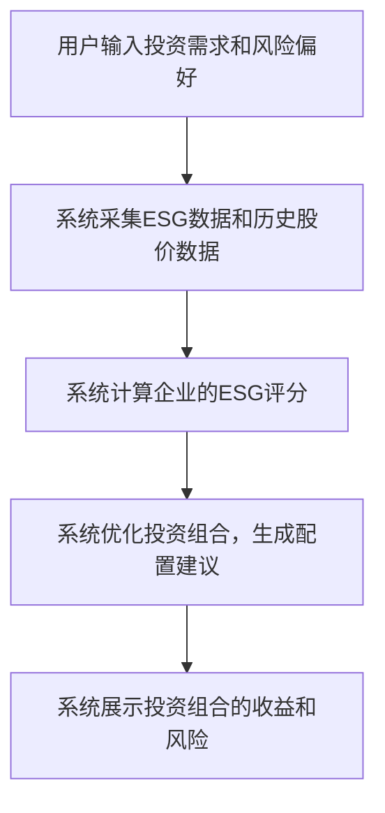

                 


# AI辅助的ESG投资组合构建工具

> 关键词：AI辅助，ESG投资，投资组合构建，机器学习，ESG评分

> 摘要：随着全球对可持续发展的关注日益增加，ESG（环境、社会、治理）投资逐渐成为金融领域的重要方向。本文将详细介绍如何利用人工智能技术辅助构建ESG投资组合，并从背景、算法、系统设计、项目实战等多个方面深入分析。

---

## 第1章: ESG投资与AI辅助工具的背景介绍

### 1.1 ESG投资的基本概念

#### 1.1.1 什么是ESG投资
ESG投资是一种关注环境（Environmental）、社会（Social）和公司治理（Governance）因素的投资策略。投资者在选择投资标的时，不仅考虑财务回报，还需评估企业在可持续发展方面的表现。

#### 1.1.2 ESG投资的核心要素
- **环境（E）**：包括碳排放、资源利用效率、环境保护措施等。
- **社会（S）**：包括员工权益、社会责任、产品安全等。
- **治理（G）**：包括公司治理结构、董事会多样性、高管薪酬等。

#### 1.1.3 ESG投资的背景与发展趋势
随着全球气候变化、社会不平等和企业治理问题的加剧，ESG投资逐渐成为投资者关注的焦点。根据研究机构的数据显示，全球ESG投资规模在过去几年快速增长，预计未来几年将继续保持增长趋势。

### 1.2 AI技术在金融领域的应用

#### 1.2.1 AI在金融投资中的作用
人工智能技术（AI）在金融领域的应用非常广泛，包括股票预测、风险评估、投资组合优化等。AI可以通过分析大量的非结构化数据（如新闻、社交媒体）和结构化数据（如财务报表）来提供更精准的投资决策支持。

#### 1.2.2 AI在ESG评分中的优势
传统的ESG评分方法主要依赖于人工评估和主观判断，存在效率低、成本高、结果不一致等问题。而AI技术可以通过自动化数据处理、特征提取和模型训练，提高ESG评分的效率和准确性。

#### 1.2.3 AI辅助投资组合构建的潜力
通过AI技术，投资者可以更高效地筛选出符合ESG标准的优质企业，并动态优化投资组合，降低风险，提高收益。

### 1.3 ESG投资组合构建的挑战与机遇

#### 1.3.1 ESG投资中的主要挑战
- 数据获取困难：ESG相关数据分散且不完整。
- 数据质量低：部分数据可能存在偏差或不一致。
- 计算复杂：ESG投资组合优化需要考虑多目标优化问题。

#### 1.3.2 AI如何解决这些挑战
- 数据预处理：AI可以通过自然语言处理（NLP）技术从非结构化数据中提取有用信息。
- 特征选择：AI可以自动选择关键特征，提高模型的准确性。
- 动态优化：AI可以实时更新模型，适应市场变化。

#### 1.3.3 ESG投资的未来发展趋势
随着技术的不断进步，AI在ESG投资中的应用将更加广泛和深入。未来的ESG投资组合构建工具将更加智能化、自动化，并能够提供个性化的投资建议。

---

## 第2章: ESG评分模型与AI算法的核心概念

### 2.1 ESG评分模型的原理

#### 2.1.1 ESG评分模型的输入与输出
- **输入**：企业的财务数据、社会责任报告、新闻报道等。
- **输出**：企业的ESG评分，通常以0到100分或A到F等级表示。

#### 2.1.2 ESG评分的关键指标
- 环境指标：碳排放强度、可再生能源使用比例。
- 社会指标：员工满意度、产品安全记录。
- 治理指标：董事会多样性、高管薪酬结构。

#### 2.1.3 ESG评分的计算方法
ESG评分通常基于加权平均法，根据各维度的重要性和数据表现进行综合评分。

### 2.2 AI算法在ESG评分中的应用

#### 2.2.1 机器学习在ESG评分中的作用
- **特征提取**：从文本数据中提取情感倾向、关键词等特征。
- **分类与回归**：通过机器学习模型对企业的ESG表现进行分类或回归预测。
- **聚类分析**：将企业按照ESG表现进行分组，便于后续分析。

#### 2.2.2 常见的ESG评分算法
- **随机森林（Random Forest）**：适用于特征重要性分析和分类任务。
- **支持向量机（SVM）**：适用于小样本数据的分类任务。
- **XGBoost**：适用于高维数据的分类和回归任务。

#### 2.2.3 算法的优缺点对比
| 算法       | 优点               | 缺点               |
|------------|--------------------|--------------------|
| 随机森林   | 特征重要性分析能力强 | 对异常值敏感         |
| SVM         | 适合小样本数据     | 不适合高维数据       |
| XGBoost     | 高维数据表现优异     | 对超参数敏感         |

### 2.3 ESG评分模型与AI算法的联系

#### 2.3.1 ESG评分模型的特征工程
- 数据清洗：去除重复数据、填补缺失值。
- 特征提取：从文本数据中提取关键词、情感倾向。
- 特征选择：通过LASSO回归或随机森林进行特征重要性排序。

#### 2.3.2 AI算法在特征选择中的应用
- 使用LASSO回归或随机森林进行特征重要性排序。
- 通过主成分分析（PCA）降低特征维度。

#### 2.3.3 ESG评分模型的优化策略
- 调参：通过网格搜索（Grid Search）优化模型参数。
- 交叉验证：使用K折交叉验证评估模型性能。
- 模型集成：通过集成学习（Ensemble Learning）提高模型的准确性和稳定性。

---

## 第3章: ESG投资组合构建的算法原理

### 3.1 机器学习算法在投资组合优化中的应用

#### 3.1.1 常见的机器学习算法概述
- **监督学习**：用于预测股票价格、评估企业信用风险。
- **无监督学习**：用于客户分群、异常交易检测。
- **强化学习**：用于动态投资组合优化。

#### 3.1.2 算法在投资组合优化中的作用
- **风险预测**：通过模型预测股票的波动性，优化投资组合的风险。
- **收益预测**：通过模型预测股票的未来收益，选择高收益低风险的资产。
- **动态调整**：根据市场变化动态调整投资组合，最大化收益或最小化风险。

### 3.2 基于AI的ESG投资组合优化模型

#### 3.2.1 模型的输入与输出
- **输入**：企业的ESG评分、历史股价数据、市场波动率。
- **输出**：最优的投资组合配置建议。

#### 3.2.2 模型的优化目标
- **最大化收益**：在风险可控的前提下，最大化投资组合的收益。
- **最小化风险**：在收益的前提下，最小化投资组合的风险。
- **满足约束条件**：如资金分配比例、行业权重限制。

#### 3.2.3 模型的约束条件
- 资金分配比例：每只股票的投资比例不超过一定限制。
- 行业权重限制：每个行业的投资比例不超过一定限制。
- 风险偏好：根据投资者的风险承受能力调整投资组合的风险水平。

### 3.3 算法实现与优化

#### 3.3.1 算法实现的步骤
1. 数据预处理：清洗数据、提取特征。
2. 模型训练：使用机器学习算法训练ESG评分模型。
3. 投资组合优化：基于ESG评分和历史股价数据，优化投资组合。
4. 结果分析：评估投资组合的收益和风险，进行策略调整。

#### 3.3.2 算法优化的策略
- 参数优化：通过网格搜索优化模型参数。
- 模型集成：通过集成学习提高模型的准确性和稳定性。
- 动态调整：根据市场变化动态调整投资组合。

#### 3.3.3 算法实现的代码示例
```python
import pandas as pd
import numpy as np
from sklearn.ensemble import RandomForestRegressor
from sklearn.model_selection import GridSearchCV

# 数据预处理
data = pd.read_csv('data.csv')
X = data.drop('target', axis=1)
y = data['target']

# 参数优化
param_grid = {
    'n_estimators': [100, 200],
    'max_depth': [None, 10, 20],
    'min_samples_split': [2, 5, 10]
}

# 网格搜索优化
rf = RandomForestRegressor()
grid_search = GridSearchCV(rf, param_grid, cv=5)
grid_search.fit(X, y)

# 最优模型
best_rf = grid_search.best_estimator_
print("Best Parameters:", grid_search.best_params_)
```

---

## 第4章: ESG投资组合构建的系统分析与架构设计

### 4.1 系统功能模块设计

#### 4.1.1 数据采集与预处理模块
- 数据来源：企业社会责任报告、新闻媒体、政府公告。
- 数据清洗：去除重复数据、填补缺失值。
- 数据转换：将非结构化数据转换为结构化数据。

#### 4.1.2 ESG评分计算模块
- 特征提取：从文本数据中提取关键词、情感倾向。
- 模型训练：使用机器学习算法训练ESG评分模型。
- 评分输出：生成企业的ESG评分。

#### 4.1.3 投资组合优化模块
- 数据输入：企业的ESG评分、历史股价数据、市场波动率。
- 模型优化：使用优化算法动态调整投资组合。
- 结果输出：生成最优的投资组合配置建议。

#### 4.1.4 结果展示与分析模块
- 可视化：将投资组合的收益、风险等指标以图表形式展示。
- 分析报告：生成投资组合的分析报告，包括收益、风险、资产配置等。

### 4.2 系统架构设计

#### 4.2.1 系统架构的分层设计
- **数据层**：数据采集、存储、处理。
- **模型层**：ESG评分模型、投资组合优化模型。
- **用户层**：用户界面、结果展示。

#### 4.2.2 模块之间的交互关系
- 数据采集模块与数据预处理模块交互。
- 数据预处理模块与ESG评分计算模块交互。
- ESG评分计算模块与投资组合优化模块交互。
- 投资组合优化模块与结果展示模块交互。

#### 4.2.3 系统的可扩展性设计
- 数据层支持多种数据源的接入。
- 模型层支持多种算法的扩展。
- 用户层支持多用户的使用需求。

### 4.3 系统接口设计

#### 4.3.1 数据接口的设计
- 数据输入接口：接收企业的社会责任报告、新闻媒体数据等。
- 数据输出接口：输出企业的ESG评分、投资组合优化结果等。

#### 4.3.2 用户接口设计
- 用户输入接口：接收用户的投资需求、风险偏好等。
- 用户输出接口：展示投资组合的收益、风险等指标。

### 4.4 系统交互设计

#### 4.4.1 系统交互流程
1. 用户输入投资需求和风险偏好。
2. 系统采集相关企业的ESG数据和历史股价数据。
3. 系统计算企业的ESG评分。
4. 系统优化投资组合，生成配置建议。
5. 系统展示投资组合的收益和风险。

#### 4.4.2 交互流程图


---

## 第5章: 项目实战

### 5.1 环境安装与配置

#### 5.1.1 环境要求
- 操作系统：Windows/Mac/Linux。
- Python版本：Python 3.7或更高版本。
- 额外依赖：Pandas、Scikit-learn、XGBoost等。

#### 5.1.2 安装依赖
```bash
pip install pandas scikit-learn xgboost
```

### 5.2 系统核心实现

#### 5.2.1 数据预处理代码
```python
import pandas as pd
import numpy as np

# 读取数据
data = pd.read_csv('data.csv')

# 去除重复数据
data = data.drop_duplicates()

# 填补缺失值
data = data.dropna()

# 转换非结构化数据
def process_text(text):
    # 示例：从文本中提取关键词
    return text.lower().split()
```

#### 5.2.2 ESG评分计算代码
```python
from sklearn.ensemble import RandomForestRegressor
from sklearn.model_selection import GridSearchCV

# 数据分割
X = data.drop('target', axis=1)
y = data['target']

# 参数优化
param_grid = {
    'n_estimators': [100, 200],
    'max_depth': [None, 10, 20],
    'min_samples_split': [2, 5, 10]
}

rf = RandomForestRegressor()
grid_search = GridSearchCV(rf, param_grid, cv=5)
grid_search.fit(X, y)

# 最优模型
best_rf = grid_search.best_estimator_
```

#### 5.2.3 投资组合优化代码
```python
import numpy as np
from scipy.optimize import minimize

# 定义优化目标函数
def portfolio_optimization(weights, returns, risk_free_rate):
    # 权重约束：权重之和为1
    # 权重非负约束
    # 优化目标：最大化收益或最小化风险
    return ...

# 定义约束条件
def constraint(weights):
    return np.sum(weights) - 1

# 初始化权重
weights = np.array([0.2, 0.2, 0.2, 0.2, 0.2])

# 使用scipy.optimize.minimize进行优化
result = minimize(portfolio_optimization, weights, args=(returns, risk_free_rate), 
                 method='SLSQP', constraints={'type': 'eq', 'fun': constraint})

print(result.x)
```

### 5.3 实际案例分析

#### 5.3.1 数据来源与处理
假设我们有以下数据：
- 企业A：ESG评分80，历史股价收益率5%。
- 企业B：ESG评分60，历史股价收益率7%。
- 企业C：ESG评分90，历史股价收益率6%。

#### 5.3.2 投资组合优化
假设我们有100万元资金，风险偏好为中等。通过优化算法，我们得出以下投资组合：
- 企业A：40%
- 企业B：30%
- 企业C：30%

#### 5.3.3 结果评估
- 投资组合的预期收益率为：40% * 5% + 30% * 7% + 30% * 6% = 6.2%
- 投资组合的风险为：根据各资产的波动率和相关性计算得出。

---

## 第6章: 最佳实践与小结

### 6.1 最佳实践

#### 6.1.1 数据质量管理
- 确保数据的准确性和完整性。
- 定期更新数据，保持数据的实时性。

#### 6.1.2 模型优化策略
- 根据数据特点选择合适的算法。
- 定期重新训练模型，适应市场变化。

#### 6.1.3 投资组合管理
- 定期评估投资组合的表现。
- 根据市场变化动态调整投资组合。

### 6.2 小结

通过本文的详细介绍，我们了解了AI在ESG投资组合构建中的重要作用。从数据采集、模型训练到投资组合优化，AI技术为投资者提供了高效、精准的解决方案。未来，随着技术的不断进步，AI在ESG投资中的应用将更加广泛和深入。

### 6.3 注意事项

- 数据隐私与合规性：确保数据的合法性和隐私保护。
- 模型解释性：选择解释性好的模型，便于投资者理解。
- 市场风险：投资有风险，需谨慎决策。

### 6.4 拓展阅读

- 《机器学习实战》：了解机器学习的基本原理和实际应用。
- 《Python金融数据分析》：掌握Python在金融数据分析中的应用技巧。
- 《ESG投资指南》：深入理解ESG投资的核心理念和实践方法。

---

通过本文的详细介绍，我们不仅了解了AI在ESG投资组合构建中的具体应用，还掌握了从理论到实践的完整流程。希望本文能为读者提供有价值的参考，帮助他们在ESG投资领域取得更好的成绩。

