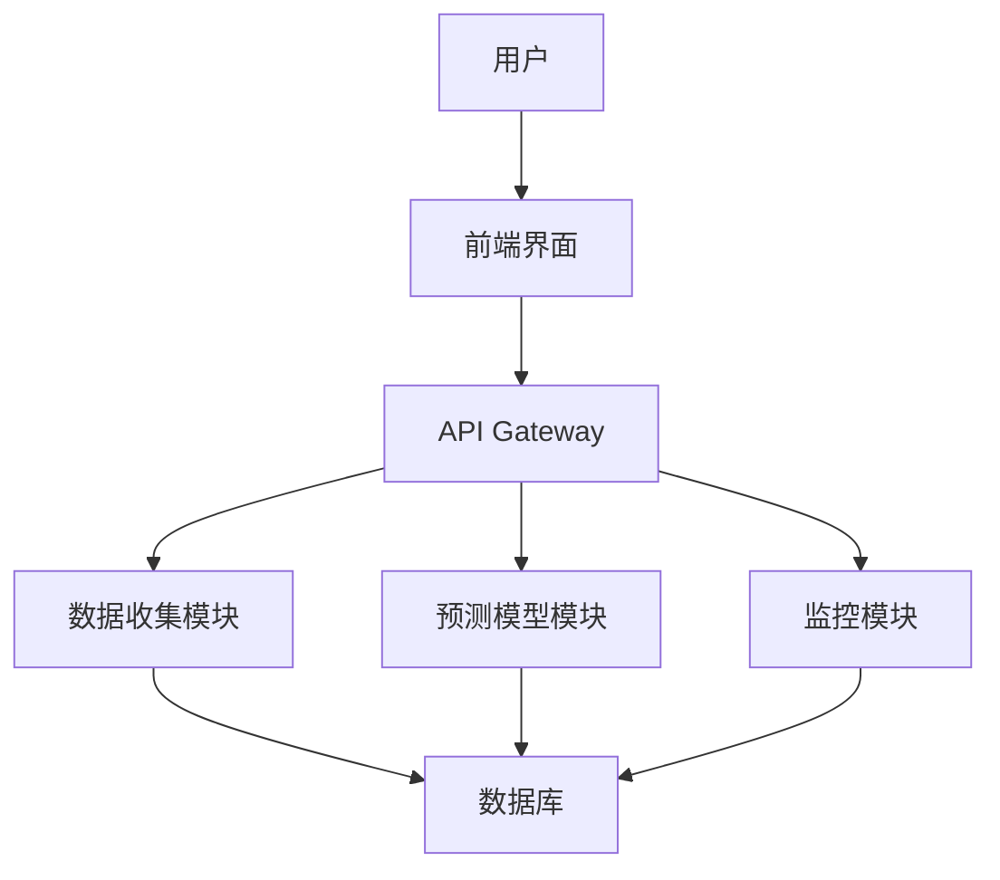
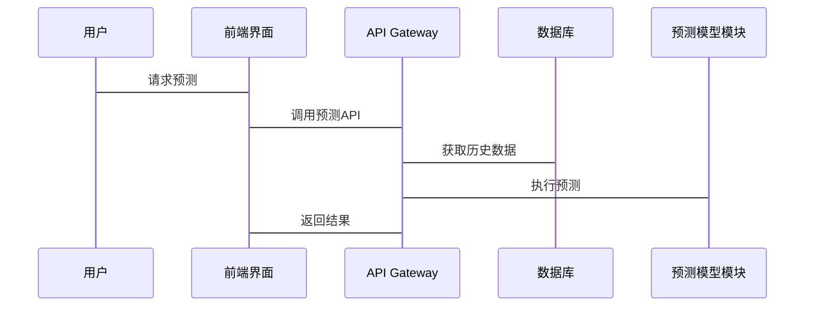

                 


# AI辅助的企业Working Capital优化

## 关键词：
- AI
- 企业
- Working Capital
- 优化
- 机器学习
- 财务管理
- 数据驱动

## 摘要：
本文探讨了人工智能在优化企业Working Capital中的应用。通过分析Working Capital的定义、优化的重要性及AI在财务管理中的潜力，结合机器学习算法、系统架构设计和实际案例，展示了如何利用AI技术提升企业的财务健康和流动性管理。文章详细讲解了线性回归算法的应用，系统设计了微服务架构，并通过实战项目展示了如何将理论应用于实践。

---

# 目录大纲

## 第一部分：背景与概念

### 第1章：企业Working Capital优化概述

#### 1.1 什么是Working Capital
- **1.1.1 流动资产与流动负债的定义**
  - 流动资产：现金及现金等价物、应收账款、存货等。
  - 流动负债：短期借款、应付账款、应计费用等。
- **1.1.2 Working Capital的计算公式：$$\text{Working Capital} = \text{流动资产} - \text{流动负债}$$**
- **1.1.3 优化Working Capital的重要性**
  - 提高流动性，确保日常运营。
  - 支持业务扩展和应对突发情况。
  - 优化资金使用效率，降低成本。

#### 1.2 企业Working Capital管理的挑战
- **1.2.1 流动资金不足的风险**
  - 应收账款回收慢，存货积压。
- **1.2.2 市场波动对企业现金流的影响**
  - 销售额下降，导致现金流减少。
- **1.2.3 传统管理方法的局限性**
  - 主观判断多，缺乏数据支持。
  - 预测准确性低，难以实时调整。

#### 1.3 AI在企业财务管理中的应用前景
- **1.3.1 数据驱动决策的优势**
  - 利用历史数据进行预测，提高决策的准确性。
- **1.3.2 AI如何提升财务预测的准确性**
  - 通过机器学习模型分析市场趋势和企业内部数据。
- **1.3.3 企业对智能财务工具的需求**
  - 自动化处理和实时监控的需求日益增长。

### 第2章：AI辅助优化的核心概念

#### 2.1 核心概念与联系
- **2.1.1 AI优化Working Capital的核心原理**
  - 数据分析与预测模型构建。
  - 机器学习算法的应用，如线性回归、随机森林等。
- **2.1.2 关键概念对比表格**
  | 概念      | 描述                               |
  |-----------|------------------------------------|
  | 数据驱动  | 依赖大量数据进行预测和优化         |
  | 传统方法  | 主要依赖人工经验和规则             |
  | 精确性     | 数据驱动方法通常更精准             |
  | 可扩展性   | 数据驱动方法更易扩展               |
- **2.1.3 实体关系ER图（Mermaid）**
  ```mermaid
  erDiagram
    customer[客户] {
      id : integer
      name : string
      contact : string
    }
    transaction[交易] {
      id : integer
      amount : float
      date : date
    }
    inventory[库存] {
      id : integer
      product : string
      quantity : integer
    }
    financial_data[财务数据] {
      id : integer
      date : date
      amount : float
    }
    customer --> transaction : 进行
    inventory --> financial_data : 影响
    ```

---

## 第二部分：算法原理

### 第3章：基于机器学习的优化算法

#### 3.1 线性回归算法原理
- **3.1.1 线性回归模型的数学公式：$$y = \beta_0 + \beta_1x + \epsilon$$**
  - $$y$$：目标变量（如现金流预测）。
  - $$\beta_0$$：截距。
  - $$\beta_1$$：斜率。
  - $$x$$：自变量（如销售数据）。
  - $$\epsilon$$：误差项。
- **3.1.2 算法步骤（Mermaid流程图）**
  ```mermaid
  graph TD
    A[开始] --> B[数据预处理]
    B --> C[选择模型]
    C --> D[训练模型]
    D --> E[评估模型]
    E --> F[部署模型]
  ```
- **3.1.3 Python代码实现**
  ```python
  import numpy as np
  import pandas as pd
  from sklearn.linear_model import LinearRegression
  from sklearn.metrics import mean_squared_error

  # 数据加载
  data = pd.read_csv('financial_data.csv')
  X = data[['sales']]
  y = data['cash_flow']

  # 模型训练
  model = LinearRegression()
  model.fit(X, y)

  # 预测与评估
  predictions = model.predict(X)
  mse = mean_squared_error(y, predictions)
  print(f"均方误差：{mse}")
  ```

#### 3.2 算法实现与优化
- **3.2.1 数据预处理**
  - 处理缺失值、归一化、特征选择。
- **3.2.2 模型评估**
  - �均方误差（MSE）、R平方值等指标。
- **3.2.3 模型优化**
  - 调整参数、交叉验证、特征工程。

---

## 第三部分：系统分析与架构设计

### 第4章：系统架构设计

#### 4.1 问题场景介绍
- 企业需要实时监控和预测现金流，优化库存和应收账款。

#### 4.2 系统功能设计
- 数据收集模块：从ERP系统获取财务数据。
- 预测模型模块：使用机器学习模型进行现金流预测。
- 监控与报警模块：实时监控现金流，触发报警机制。

#### 4.3 系统架构设计（Mermaid架构图）


#### 4.4 系统接口设计
- 数据接口：与ERP系统的数据对接。
- API接口：提供预测结果和监控报警。

#### 4.5 系统交互设计（Mermaid序列图）


---

## 第四部分：项目实战

### 第5章：AI优化的项目实战

#### 5.1 环境安装
- 安装Python、Pandas、Scikit-learn、TensorFlow等工具。

#### 5.2 系统核心实现
- 数据预处理：清洗、归一化。
- 模型训练：使用线性回归或随机森林。
- 结果分析：可视化预测结果，评估模型性能。

#### 5.3 实际案例分析
- 某制造企业的现金流预测项目。
- 数据来源：销售数据、应收账款、库存数据。
- 模型部署：集成到企业财务系统中，实时提供预测和建议。

#### 5.4 项目小结
- 成功实现了现金流的准确预测。
- 提高了企业的资金使用效率。

---

## 第五部分：总结与展望

### 第6章：总结与展望

#### 6.1 最佳实践
- 数据质量至关重要，需确保数据的完整性和准确性。
- 模型选择需根据实际问题，可能需要尝试多种算法。
- 结合业务知识，优化特征选择和模型调参。

#### 6.2 小结
- AI技术为优化企业Working Capital提供了强大工具。
- 通过数据驱动的方法，显著提高了预测准确性和决策效率。

#### 6.3 注意事项
- 数据隐私和安全需严格保护。
- 模型的可解释性影响实际应用。
- 需定期更新模型，适应业务变化。

#### 6.4 拓展阅读
- 推荐阅读《机器学习实战》和《企业财务管理》相关书籍。

---

## 结语
AI正在改变企业财务管理的方式，优化Working Capital是其中一个关键应用。通过本文的系统讲解和实战案例，读者可以掌握如何利用AI技术提升企业的财务健康和运营效率。未来，随着技术的进步，AI在企业财务管理中的应用将更加广泛和深入。

