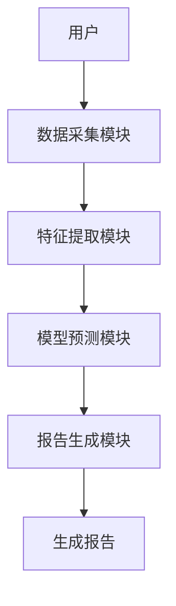
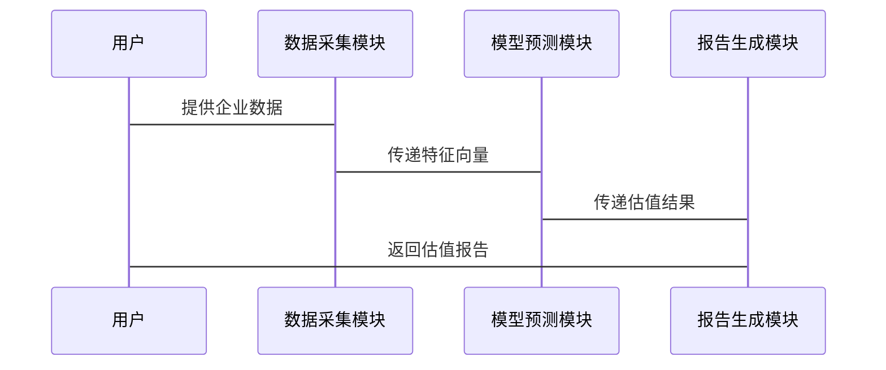

                 


# AI辅助的企业估值报告自动生成

> **关键词**：企业估值、AI辅助、自然语言处理、生成模型、深度学习、企业报告自动生成  
> **摘要**：随着人工智能技术的快速发展，企业估值报告的生成逐渐从人工化向自动化转变。本文详细探讨了如何利用AI技术辅助企业估值报告的自动生成，包括生成模型的核心算法、系统架构设计、项目实战案例以及最佳实践。通过结合自然语言处理和生成模型，我们能够高效、准确地生成高质量的企业估值报告，为企业提供决策支持。

---

## 第一部分：企业估值与AI辅助的背景

### 第1章：企业估值的重要性与AI的应用前景

#### 1.1 企业估值的基本概念

企业估值是指对企业资产、负债、收入、利润等财务数据以及市场环境、行业竞争等非财务因素进行综合评估，确定企业的价值或潜在投资价值的过程。传统的估值方法包括DCF模型（Discounted Cash Flow）、相对估值法（如PE、PB等指标）以及行业对标法等，但这些方法往往依赖于大量人工分析和经验判断，存在效率低下、主观性强等问题。

#### 1.2 AI辅助企业估值的背景与趋势

近年来，人工智能技术的快速发展为企业的自动化估值提供了新的可能性。AI技术可以通过对海量数据的分析和建模，快速生成初步估值结果，并提供数据支持和决策建议。这种自动化的方式不仅提高了估值效率，还能够减少人为误差，提升估值的客观性和准确性。随着企业数据的日益复杂化和多样化，AI辅助企业估值的应用前景广阔。

---

## 第二部分：AI模型的核心概念与原理

### 第2章：AI模型在企业估值中的核心作用

#### 2.1 AI模型的基本原理

AI模型在企业估值中的应用主要依赖于以下几个关键步骤：

1. **数据预处理与特征提取**：对企业的财务数据、市场数据、行业数据等进行清洗、归一化和特征提取，构建适合模型输入的特征向量。
2. **模型训练与优化**：通过深度学习模型（如LSTM、BERT）对特征向量进行训练，学习数据中的潜在规律和模式。
3. **结果生成与解释**：根据训练好的模型生成企业估值结果，并对结果进行解释和验证。

#### 2.2 常见AI模型在企业估值中的应用

- **基于NLP的文本分析模型**：通过自然语言处理技术分析企业财报、行业报告等文本数据，提取关键信息用于估值。
- **基于深度学习的预测模型**：利用LSTM等模型预测企业的未来现金流，辅助DCF模型的计算。
- **混合模型**：结合NLP和预测模型的优势，构建混合模型以提高估值的准确性和全面性。

---

## 第三部分：生成模型的算法原理

### 第3章：生成模型的数学基础

#### 3.1 概率论基础

生成模型的核心在于概率分布的建模。以下是一些关键的概率理论：

- **条件概率与贝叶斯定理**：条件概率公式为：
  $$P(A|B) = \frac{P(B|A)P(A)}{P(B)}$$
  贝叶斯定理用于根据先验概率和条件概率计算后验概率。

- **马尔可夫链与隐马尔可夫模型**：马尔可夫链假设当前状态只依赖于前一状态，适用于时间序列数据的建模。

- **生成模型的概率分布**：生成模型的目标是学习数据的联合概率分布，常用的方法包括最大似然估计和变分下界。

#### 3.2 深度学习模型的结构

- **神经网络的基本结构**：包括输入层、隐藏层和输出层，通过非线性激活函数（如ReLU）进行特征提取。
- **生成对抗网络（GAN）**：由生成器和判别器组成，生成器尝试生成与真实数据相似的样本，判别器则区分真实数据和生成数据。
- **变量自编码器（VAE）**：通过编码器将数据映射到潜在空间，解码器将潜在向量还原为数据。

#### 3.3 模型训练的数学公式

- **最大似然估计与交叉熵损失**：
  最大似然估计的目标是最大化数据的概率：
  $$\theta = \arg\max_{\theta} \prod_{i=1}^{n} P(x_i|\theta)$$
  在分类任务中，交叉熵损失函数为：
  $$L = -\frac{1}{n}\sum_{i=1}^{n} y_i \log p(y_i|x_i) + (1-y_i)\log(1-p(y_i|x_i))$$

- **生成对抗网络的损失函数**：
  GAN的损失函数包括生成器和判别器的损失：
  $$\mathcal{L}_\text{GAN}^G = \mathbb{E}_{z}[D(G(z))]$$
  $$\mathcal{L}_\text{GAN}^D = \mathbb{E}_{x}[D(x)] + \mathbb{E}_{z}[1-D(G(z))]$$

---

## 第四部分：系统分析与架构设计方案

### 第4章：系统架构与功能设计

#### 4.1 问题场景介绍

企业估值报告自动生成系统的目标是通过AI技术，快速生成包含企业财务数据、市场分析、估值模型和结论的企业估值报告。系统需要处理多种数据源，包括财务报表、行业数据、市场新闻等，并结合自然语言处理技术生成报告文本。

#### 4.2 系统功能设计

- **数据采集模块**：从企业数据库、公开财报等数据源获取数据。
- **特征提取模块**：对数据进行清洗、归一化和特征提取。
- **模型预测模块**：基于深度学习模型生成估值结果。
- **报告生成模块**：结合生成模型生成自然语言报告。

#### 4.3 系统架构设计

以下是系统架构的Mermaid图：



#### 4.4 系统接口设计

- **输入接口**：接收企业的财务数据和市场数据。
- **输出接口**：生成企业估值报告并输出。

#### 4.5 系统交互设计

以下是系统交互的Mermaid图：



---

## 第五部分：项目实战

### 第5章：项目实现与案例分析

#### 5.1 环境安装

项目需要以下环境：

- Python 3.8+
- PyTorch 1.9+
- Transformers库
- Mermaid图生成工具

#### 5.2 核心代码实现

以下是生成模型的代码示例：

```python
import torch
import torch.nn as nn
import torch.optim as optim

class GANGenerator(nn.Module):
    def __init__(self, input_size, hidden_size, output_size):
        super(GANGenerator, self).__init__()
        self.fc1 = nn.Linear(input_size, hidden_size)
        self.fc2 = nn.Linear(hidden_size, output_size)
    
    def forward(self, x):
        x = torch.relu(self.fc1(x))
        x = torch.sigmoid(self.fc2(x))
        return x

class GANDiscriminator(nn.Module):
    def __init__(self, input_size, hidden_size, output_size):
        super(GANDiscriminator, self).__init__()
        self.fc1 = nn.Linear(input_size, hidden_size)
        self.fc2 = nn.Linear(hidden_size, output_size)
    
    def forward(self, x):
        x = torch.relu(self.fc1(x))
        x = torch.sigmoid(self.fc2(x))
        return x

# 初始化模型和优化器
generator = GANGenerator(10, 20, 1)
discriminator = GANDiscriminator(1, 20, 1)
optimizer_G = optim.Adam(generator.parameters(), lr=0.001)
optimizer_D = optim.Adam(discriminator.parameters(), lr=0.001)

# 训练循环
for epoch in range(100):
    for _ in range(100):
        # 生成假数据
        noise = torch.randn(100, 10)
        fake = generator(noise)
        # 判别器训练
        d_output_real = discriminator(real_data)
        d_output_fake = discriminator(fake.detach())
        loss_D = -torch.mean(torch.log(d_output_real) + torch.log(1 - d_output_fake))
        optimizer_D.zero_grad()
        loss_D.backward()
        optimizer_D.step()
    # 生成器训练
    noise = torch.randn(100, 10)
    fake = generator(noise)
    d_output_fake = discriminator(fake)
    loss_G = -torch.mean(torch.log(d_output_fake))
    optimizer_G.zero_grad()
    loss_G.backward()
    optimizer_G.step()
```

#### 5.3 案例分析与结果解读

通过上述代码，我们可以训练一个简单的GAN模型，生成企业估值报告的初步结果。生成的报告可以通过进一步的自然语言处理技术进行优化，以提高报告的可读性和准确性。

---

## 第六部分：最佳实践与总结

### 第6章：总结与展望

#### 6.1 最佳实践

- **数据质量**：确保输入数据的准确性和完整性。
- **模型调优**：通过超参数调节和模型优化提高生成结果的准确性。
- **结果验证**：结合人工审核和反馈机制，确保生成报告的可靠性。

#### 6.2 未来展望

随着AI技术的不断进步，企业估值报告的自动生成将更加智能化和高效化。未来的研究方向包括更复杂的生成模型、多模态数据的融合以及实时数据的处理。

---

## 结语

通过本文的详细讲解，我们了解了如何利用AI技术辅助企业估值报告的自动生成。从背景介绍到算法原理，再到系统设计和项目实战，我们全面探讨了这一领域的关键技术。希望本文能够为读者提供有价值的参考和启发。

--- 

**关键词**：企业估值、AI辅助、自然语言处理、生成模型、深度学习、企业报告自动生成  
**摘要**：本文详细探讨了如何利用AI技术辅助企业估值报告的自动生成，包括生成模型的核心算法、系统架构设计、项目实战案例以及最佳实践。通过结合自然语言处理和生成模型，我们能够高效、准确地生成高质量的企业估值报告，为企业提供决策支持。

