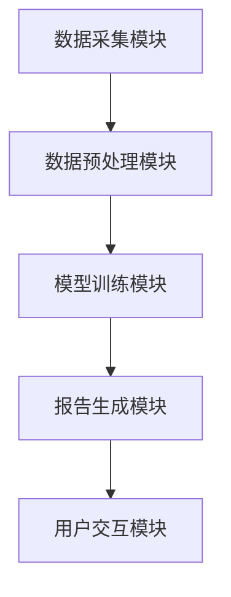

                 


# AI辅助的企业估值报告自动生成系统

## 关键词：AI、企业估值、报告生成、机器学习、自动化系统、数据处理

## 摘要：  
本文详细介绍了AI辅助的企业估值报告自动生成系统的构建与实现。通过结合企业财务数据、市场信息和管理策略，利用机器学习和自然语言处理技术，系统能够自动生成精准的企业估值报告。文章从背景、原理到系统架构、项目实战，全面解析了该系统的设计与实现过程，为企业和投资者提供了高效、可靠的估值工具。

---

# 第一部分: 企业估值与AI辅助的背景介绍

## 第1章: 企业估值的基本概念与AI辅助的意义

### 1.1 企业估值的定义与重要性  
企业估值是指对企业整体价值的评估，通常用于投资决策、并购交易、融资等活动。准确的估值能够帮助企业做出合理的财务决策，优化资源配置。然而，传统估值方法依赖人工分析，耗时且容易出错。  

**AI辅助的意义**：  
AI技术能够通过大数据分析和机器学习算法，快速处理海量信息，生成精准的估值结果，显著提高估值效率和准确性。

### 1.2 传统企业估值方法的局限性  
传统估值方法主要包括DCF模型、市盈率法、市净率法等，但存在以下问题：  
- 数据采集耗时，依赖人工经验；  
- 跨界企业的数据难以标准化；  
- 市场波动对企业估值的影响难以预测。  

### 1.3 AI技术在企业估值中的潜力  
AI技术可以通过以下方式提升企业估值：  
- **自动化数据采集**：从多种数据源获取企业财务数据、市场信息等；  
- **深度学习模型**：通过训练大量企业数据，预测企业价值；  
- **自然语言处理**：分析企业新闻、公告等非结构化数据，辅助估值。  

---

## 第2章: AI辅助企业估值的背景与现状  

### 2.1 AI技术的发展与应用趋势  
近年来，AI技术在金融领域的应用迅速崛起，特别是在股票定价、风险评估等方面表现出色。企业估值作为金融领域的重要组成部分，同样受益于AI技术的进步。  

### 2.2 企业估值领域的数字化转型需求  
随着企业规模的不断扩大和市场环境的复杂化，传统估值方法已无法满足需求。企业需要更高效、更精准的估值工具来应对复杂挑战。  

### 2.3 当前市场中AI辅助估值系统的应用现状  
目前，部分企业已经开始尝试引入AI辅助估值系统，但仍存在以下问题：  
- 数据质量参差不齐；  
- 系统的泛化能力不足；  
- 高昂的开发成本。  

---

## 第3章: 本书的目标与价值  

### 3.1 系统设计目标  
本系统的目标是通过AI技术，自动生成精准的企业估值报告，帮助用户快速完成估值过程。  

### 3.2 系统的实际应用场景  
- 投资者进行股票投资决策；  
- 企业进行并购交易；  
- 风险投资机构评估创业公司价值。  

### 3.3 对企业与投资者的价值  
- 提高估值效率，节省时间成本；  
- 增强估值结果的准确性；  
- 提供数据可视化支持，便于决策者理解。  

---

# 第二部分: AI辅助企业估值的核心概念与原理  

## 第4章: 企业估值的关键要素与AI结合的逻辑  

### 4.1 企业估值的核心要素  
企业估值的核心要素包括：  
1. **财务指标**：如EBITDA、净利润、资产负债率等；  
2. **市场分析**：如行业趋势、竞争环境、市场增长率；  
3. **管理团队**：如管理能力、战略规划等。  

### 4.2 AI在企业估值中的应用逻辑  
AI通过以下方式将企业估值的关键要素结合起来：  
1. **数据采集**：从多种数据源获取企业数据；  
2. **特征提取**：对数据进行预处理，提取有用特征；  
3. **模型训练**：基于机器学习算法，训练估值模型；  
4. **报告生成**：根据模型输出结果，生成估值报告。  

---

## 第5章: 企业估值模型的数学表达与AI结合的流程  

### 5.1 企业估值模型的数学表达  
传统的DCF模型可以表示为：  
$$ V = \sum_{t=1}^{n} \frac{CF_t}{(1+r)^t} $$  
其中，\( V \)为企业的估值，\( CF_t \)为第\( t \)年的现金流，\( r \)为折现率。  

### 5.2 AI结合企业估值的流程  
1. **数据采集**：获取企业财务数据、市场数据等；  
2. **数据预处理**：清洗数据，提取特征；  
3. **模型训练**：训练机器学习模型，如随机森林、神经网络；  
4. **模型评估**：验证模型的准确性和稳定性；  
5. **报告生成**：根据模型输出结果，生成估值报告。  

---

# 第三部分: 系统架构与算法原理  

## 第6章: 系统架构设计  

### 6.1 系统功能模块划分  
系统主要功能模块包括：  
1. **数据采集模块**：从数据库、API等数据源获取数据；  
2. **模型训练模块**：训练机器学习模型；  
3. **报告生成模块**：生成估值报告；  
4. **用户交互模块**：提供用户界面，供用户输入和查看报告。  

### 6.2 系统架构设计图  


### 6.3 系统架构的实现细节  
- 数据采集模块通过API获取企业数据；  
- 数据预处理模块使用Python的Pandas库进行数据清洗；  
- 模型训练模块采用深度学习框架TensorFlow进行训练；  
- 报告生成模块通过模板生成报告文档。  

---

## 第7章: 算法原理与实现  

### 7.1 算法原理  
系统采用基于深度学习的模型，具体流程如下：  
1. **数据预处理**：对原始数据进行标准化和归一化处理；  
2. **模型训练**：使用神经网络模型进行训练；  
3. **模型预测**：根据输入数据，输出企业估值结果。  

### 7.2 算法实现代码  
```python
import tensorflow as tf
from tensorflow.keras import layers

# 数据预处理
def preprocess(data):
    # 标准化处理
    data_mean = data.mean()
    data_std = data.std()
    processed_data = (data - data_mean) / data_std
    return processed_data

# 模型训练
def train_model(train_data, train_labels):
    model = tf.keras.Sequential([
        layers.Dense(64, activation='relu'),
        layers.Dense(1, activation='linear')
    ])
    model.compile(optimizer='adam', loss='mse')
    history = model.fit(train_data, train_labels, epochs=100, batch_size=32)
    return model, history

# 模型预测
def predict(model, test_data):
    predictions = model.predict(test_data)
    return predictions
```

### 7.3 算法优化与调优  
- 使用交叉验证优化模型参数；  
- 调整神经网络的层数和节点数，提高模型性能；  
- 使用早停法防止过拟合。  

---

# 第四部分: 项目实战与优化  

## 第8章: 项目实战  

### 8.1 环境安装与配置  
- 安装Python、TensorFlow、Pandas等依赖库；  
- 配置开发环境，如Jupyter Notebook或IDE。  

### 8.2 系统核心功能实现  
```python
import pandas as pd
import tensorflow as tf

# 数据加载
data = pd.read_csv('enterprise_data.csv')

# 数据预处理
processed_data = preprocess(data)

# 模型训练
model, history = train_model(processed_data, labels)

# 模型评估
loss = model.evaluate(test_data, test_labels)
print(f"模型在测试集上的损失为：{loss}")
```

### 8.3 实际案例分析  
以某科技公司为例，通过系统生成估值报告，分析其市场地位、财务状况和管理能力，最终得出估值结果。  

---

## 第9章: 系统优化与部署  

### 9.1 模型优化  
- 使用超参数优化技术，如随机搜索；  
- 增加数据增强，提高模型泛化能力。  

### 9.2 系统部署方案  
- 使用Docker容器化部署；  
- 部署到云服务器，提供API接口。  

### 9.3 系统安全与性能优化  
- 数据加密，防止数据泄露；  
- 使用缓存技术，提高系统响应速度。  

---

## 第10章: 总结与展望  

### 10.1 系统总结  
通过本系统的实现，展示了AI技术在企业估值领域的巨大潜力。系统能够高效、精准地生成估值报告，为企业和投资者提供有力支持。  

### 10.2 未来展望  
未来，随着AI技术的不断发展，企业估值系统将更加智能化和自动化。可以通过引入更多的数据源和更复杂的模型，进一步提高估值的准确性。  

---

## 第11章: 注意事项与拓展阅读  

### 11.1 注意事项  
- 数据来源必须可靠；  
- 模型需要定期更新，以适应市场变化；  
- 系统上线前需进行充分的测试。  

### 11.2 拓展阅读  
推荐阅读以下书籍和文章：  
1. 《机器学习实战》；  
2. 《深度学习入门：基于Python和TensorFlow》；  
3. 《企业估值与投资分析》。  

---

通过以上内容，我们详细介绍了AI辅助的企业估值报告自动生成系统的构建与实现。从背景介绍到系统设计，从算法实现到项目实战，本文为读者提供了全面的技术指导和实践参考。

