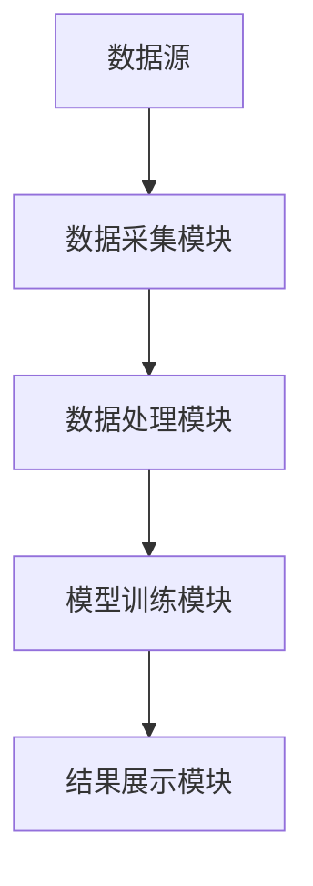
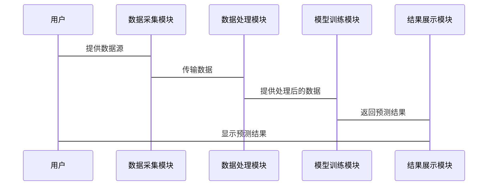

                 


# AI辅助的企业信用周期预测

> 关键词：AI, 信用周期预测, 机器学习, 系统架构, 项目实战

> 摘要：本文将详细探讨如何利用人工智能技术辅助企业信用周期预测。通过分析企业信用周期的核心概念、AI技术的应用原理、常见算法的实现方式、系统架构设计以及实际项目案例，本文旨在为企业信用周期预测提供一种高效、准确的解决方案。

---

## 第一部分: 背景与概念

### 第1章: 企业信用周期预测的背景与意义

#### 1.1 企业信用周期的概念与重要性
- 信用周期的定义：企业信用周期是指企业在经营过程中，由于外部经济环境和内部经营状况的变化，导致信用风险波动的周期性变化。
- 信用周期对企业经营的影响：企业信用周期的预测对企业融资、投资决策和风险管理具有重要意义。
- 信用周期预测的必要性：通过预测信用周期，企业可以更好地规划财务策略，降低信用风险，提高经营效率。

#### 1.2 AI技术在信用周期预测中的应用背景
- AI技术的发展与进步：近年来，人工智能技术在金融领域的应用越来越广泛，尤其是在信用评估和预测方面。
- 传统信用周期预测的局限性：传统方法依赖于经验判断和简单的统计模型，存在预测精度低、效率低的问题。
- AI技术在信用周期预测中的优势：AI技术可以通过大数据分析和复杂算法，提高预测的准确性和效率。

### 第2章: AI辅助信用周期预测的核心概念

#### 2.1 信用周期预测的关键要素
- 企业财务数据：包括资产负债表、利润表、现金流量表等。
- 市场环境因素：如宏观经济指标、行业发展趋势等。
- 企业经营状况：如销售收入、利润率、管理水平等。

#### 2.2 AI技术在信用周期预测中的核心原理
- 数据特征提取：通过AI技术对大量数据进行特征提取和筛选，找出影响信用周期的关键因素。
- 模型训练与优化：利用机器学习算法对数据进行建模和优化，提高预测的准确性。
- 结果预测与评估：通过模型预测信用周期，并对预测结果进行评估和优化。

---

## 第二部分: 算法原理与实现

### 第3章: 信用周期预测的算法原理

#### 3.1 常见信用周期预测算法
- 线性回归模型：通过线性关系拟合数据，预测信用周期。
- 支持向量机：通过构建支持向量进行分类和回归，适用于非线性数据。
- 随机森林：通过集成学习提高模型的准确性和鲁棒性。
- 神经网络：通过深度学习模型捕捉复杂的数据特征，提高预测精度。

#### 3.2 算法原理与流程
- 数据预处理：对数据进行清洗、归一化和特征工程。
- 特征选择：通过特征重要性分析选择关键特征。
- 模型训练：利用训练数据训练模型，并进行超参数优化。
- 模型评估：通过测试数据评估模型的准确性和稳定性。

### 第4章: 算法实现与代码示例

#### 4.1 线性回归模型实现
```python
import numpy as np
from sklearn.linear_model import LinearRegression

# 示例数据
X = np.array([[1], [2], [3], [4], [5]])
y = np.array([2, 4, 5, 4, 5])

# 训练模型
model = LinearRegression()
model.fit(X, y)

# 预测结果
print(model.predict([[6]]))
```

#### 4.2 支持向量机实现
```python
from sklearn.svm import SVR

# 示例数据
X = np.array([[1], [2], [3], [4], [5]])
y = np.array([2, 4, 5, 4, 5])

# 训练模型
model = SVR(kernel='rbf', C=1e3, gamma=0.1)
model.fit(X, y)

# 预测结果
print(model.predict([[6]]))
```

#### 4.3 随机森林实现
```python
from sklearn.ensemble import RandomForestRegressor

# 示例数据
X = np.array([[1], [2], [3], [4], [5]])
y = np.array([2, 4, 5, 4, 5])

# 训练模型
model = RandomForestRegressor(n_estimators=100, max_depth=2, random_state=42)
model.fit(X, y)

# 预测结果
print(model.predict([[6]]))
```

---

## 第三部分: 系统架构与设计

### 第5章: 系统功能模块划分

#### 5.1 数据采集模块
- 数据来源：企业财务数据、市场环境数据、行业数据等。
- 数据格式：结构化数据，如CSV、Excel等。
- 数据存储：数据库存储，方便后续处理和分析。

#### 5.2 数据处理模块
- 数据清洗：处理缺失值、异常值等。
- 数据转换：数据归一化、特征提取等。
- 数据分块：将数据分为训练集、测试集等。

### 第6章: 系统架构设计

#### 6.1 系统架构图


#### 6.2 系统交互流程


---

## 第四部分: 项目实战与分析

### 第7章: 项目实战

#### 7.1 环境安装与配置
- 安装Python和相关库：如NumPy、Scikit-learn、TensorFlow等。
- 配置开发环境：如Jupyter Notebook、PyCharm等。

#### 7.2 核心代码实现
```python
import pandas as pd
from sklearn.model_selection import train_test_split
from sklearn.metrics import mean_squared_error

# 示例数据
data = pd.DataFrame({
    'feature1': [1, 2, 3, 4, 5],
    'feature2': [2, 4, 5, 4, 5],
    'label': [3, 5, 6, 7, 8]
})

# 数据分割
X_train, X_test, y_train, y_test = train_test_split(data[['feature1', 'feature2']], data['label'], test_size=0.2, random_state=42)

# 模型训练
model = RandomForestRegressor(n_estimators=100, max_depth=2, random_state=42)
model.fit(X_train, y_train)

# 模型预测
y_pred = model.predict(X_test)

# 模型评估
print(mean_squared_error(y_test, y_pred))
```

#### 7.3 项目总结与优化
- 项目总结：通过AI技术实现了企业信用周期预测，提高了预测的准确性和效率。
- 模型优化：通过调整超参数和优化算法，进一步提高预测精度。
- 实际应用：将模型应用于实际企业信用周期预测中，验证其有效性和实用性。

---

## 第五部分: 总结与展望

### 第8章: 总结与注意事项

#### 8.1 总结
- 通过本文的介绍，我们了解了AI技术在企业信用周期预测中的应用。
- 熟悉了常见的信用周期预测算法及其实现方式。
- 掌握了系统架构设计和项目实战的基本方法。

#### 8.2 注意事项
- 数据质量：确保数据的准确性和完整性。
- 模型选择：根据实际情况选择合适的算法。
- 模型评估：通过多种指标和方法评估模型的性能。

### 第9章: 未来展望与拓展阅读

#### 9.1 未来展望
- 深度学习的应用：随着深度学习技术的发展，未来可以在信用周期预测中应用更复杂的模型。
- 多模态数据：结合文本、图像等多种数据源，提高预测的准确性和全面性。
- 实时预测：通过流数据处理技术，实现信用周期的实时预测。

#### 9.2 拓展阅读
- 《机器学习实战》：深入学习机器学习算法的实现和应用。
- 《深度学习》：了解深度学习的基本原理和应用。
- 《金融风险管理》：掌握信用风险的基本理论和方法。

---

通过以上内容，我们可以看到，AI技术在企业信用周期预测中具有重要的应用价值。未来，随着技术的不断发展，AI将为企业信用周期预测提供更加高效、准确的解决方案。

