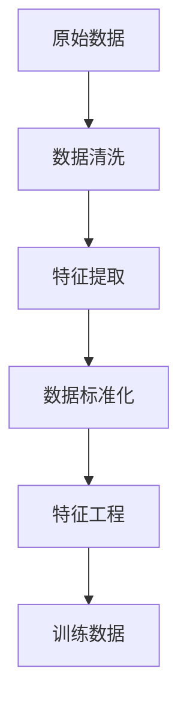

                 


# AI辅助的企业信用周期预测与风险管理

## 关键词：人工智能，信用周期，风险管理，机器学习，深度学习，企业信用评分

## 摘要：本文将探讨如何利用人工智能技术，特别是机器学习和深度学习，来辅助企业信用周期的预测与风险管理。通过分析信用周期的核心要素、风险管理的重要性，以及AI技术的优势，我们将逐步构建一个基于AI的信用周期预测模型，并结合实际案例展示其应用。文章还将涵盖系统的架构设计、项目实战与案例分析，最终总结AI在信用周期预测中的应用成果及未来发展方向。

---

# 第一部分: 企业信用周期预测与风险管理的背景介绍

## 第1章: 企业信用周期预测与风险管理概述

### 1.1 企业信用周期的基本概念
- **信用周期的定义**：信用周期是指企业因赊销或信用交易而形成的资金流动周期。它包括信用申请、信用授予、信用使用、信用收回等阶段。
- **信用周期的核心要素**：
  - 企业信用状况
  - 市场经济环境
  - 企业经营状况
- **信用周期的形成机制**：
  - 企业内部管理
  - 市场供需关系
  - 经济波动影响

### 1.2 风险管理的重要性
- **风险管理的基本概念**：风险管理是指识别、评估和应对潜在风险的过程，以降低风险对企业的影响。
- **企业信用风险管理的目标**：
  - 防范信用风险
  - 优化信用决策
  - 提高企业抗风险能力
- **风险管理的常见方法**：
  - 风险评估
  - 风险分散
  - 风险转移

### 1.3 AI辅助信用周期预测与风险管理的必要性
- **传统信用周期预测的局限性**：
  - 数据量有限
  - 模型简单，预测精度低
  - 无法实时更新
- **AI技术在信用周期预测中的优势**：
  - 高效的数据处理能力
  - 复杂模式识别
  - 实时更新能力
- **企业信用风险管理的未来趋势**：
  - 数据驱动决策
  - 智能化风险管理
  - 全球化风险管理

---

# 第二部分: AI技术在信用周期预测中的应用

## 第2章: 机器学习与深度学习在信用周期预测中的应用

### 2.1 机器学习的基本原理
- **机器学习的定义与分类**：
  - 监督学习
  - 非监督学习
  - 强化学习
- **常见机器学习算法及其特点**：
  - 线性回归
  - 支持向量机
  - 随机森林
- **机器学习在信用评分中的应用案例**：
  - 使用逻辑回归进行信用评分
  - 使用随机森林分析信用风险

### 2.2 深度学习在信用周期预测中的应用
- **深度学习的基本原理**：
  - 神经网络
  - 卷积神经网络
  - 循环神经网络
- **常见深度学习模型及其特点**：
  - LSTM（长短期记忆网络）
  - Transformer模型
- **深度学习在信用评分中的应用案例**：
  - 使用LSTM预测企业信用风险
  - 使用Transformer进行信用评分

### 2.3 机器学习与深度学习的对比分析
- **机器学习与深度学习的优缺点对比**：
  | 特性       | 机器学习       | 深度学习       |
  |------------|----------------|----------------|
  | 数据需求   | 数据量较小     | 数据量较大     |
  | 模型复杂度 | 模型简单       | 模型复杂       |
  | 计算资源   | 计算资源需求低 | 计算资源需求高 |
- **机器学习与深度学习的适用场景**：
  - 机器学习适合中小规模数据
  - 深度学习适合大数据场景

### 2.4 本章小结
- 总结机器学习和深度学习在信用周期预测中的应用及其优缺点。

---

# 第三部分: 基于AI的信用周期预测模型构建

## 第3章: 数据预处理与特征工程

### 3.1 数据预处理的基本概念
- **数据清洗**：
  - 删除重复数据
  - 处理缺失值
  - 去除异常值
- **数据标准化与归一化**：
  - 标准化：$X_{std} = \frac{X - \mu}{\sigma}$
  - 归一化：$X_{norm} = \frac{X - \min}{\max - \min}$
- **数据缺失值的处理方法**：
  - 删除法
  - 均值/中位数填充
  - 线性插值

### 3.2 特征工程的核心步骤
- **特征选择**：
  - 相关性分析
  - 逐步回归法
- **特征提取**：
  - 主成分分析（PCA）
  - 线性判别分析（LDA）
- **特征构造**：
  - 组合特征
  - 分箱特征

### 3.3 数据流图（使用 Mermaid）：


### 3.4 本章小结
- 详细讲解数据预处理和特征工程的核心步骤及其重要性。

---

## 第4章: 基于机器学习的信用周期预测模型

### 4.1 模型训练与评估
- **模型训练**：
  - 使用训练数据拟合模型
  - 调参优化
- **模型评估**：
  - 准确率
  - 召回率
  - F1分数

### 4.2 模型实现代码
```python
from sklearn.model_selection import train_test_split
from sklearn.linear_model import LogisticRegression
from sklearn.metrics import accuracy_score

# 数据准备
X_train, X_test, y_train, y_test = train_test_split(X, y, test_size=0.2)

# 模型训练
model = LogisticRegression()
model.fit(X_train, y_train)

# 模型预测
y_pred = model.predict(X_test)

# 模型评估
print("准确率:", accuracy_score(y_test, y_pred))
```

### 4.3 模型优化与调参
- **网格搜索**：
  ```python
  from sklearn.model_selection import GridSearchCV

  param_grid = {'C': [0.1, 1, 10], 'penalty': ['l1', 'l2']}
  grid_search = GridSearchCV(LogisticRegression(), param_grid, cv=5)
  grid_search.fit(X_train, y_train)
  print("最佳参数:", grid_search.best_params_)
  ```

### 4.4 本章小结
- 详细讲解基于机器学习的信用周期预测模型的构建过程及其优化方法。

---

## 第5章: 基于深度学习的信用周期预测模型

### 5.1 深度学习模型的设计
- **LSTM网络结构**：
  ```mermaid
  graph TD
  Input --> LSTM_layer
  LSTM_layer --> Dense_layer
  Dense_layer --> Output
  ```

### 5.2 模型实现代码
```python
import tensorflow as tf
from tensorflow.keras import layers

# 模型定义
model = tf.keras.Sequential([
    layers.LSTM(64, input_shape=(timesteps, features)),
    layers.Dense(1, activation='sigmoid')
])

# 模型编译
model.compile(loss='binary_crossentropy', optimizer='adam', metrics=['accuracy'])
```

### 5.3 模型训练与评估
```python
# 训练数据
model.fit(X_train, y_train, epochs=10, batch_size=32, validation_data=(X_test, y_test))

# 模型评估
print("验证准确率:", model.evaluate(X_test, y_test)[1])
```

### 5.4 本章小结
- 详细讲解基于深度学习的信用周期预测模型的设计与实现。

---

# 第四部分: 风险管理与控制策略

## 第6章: 风险管理与控制策略

### 6.1 风险定价
- **信用风险定价模型**：
  - 基于信用评分的风险定价
  - 基于VaR（在险价值）的风险定价

### 6.2 风险监控
- **实时风险监控**：
  - 实时数据采集
  - 实时风险评估
  - 实时风险预警

### 6.3 风险控制策略
- **动态调整信用额度**：
  - 根据企业信用评分动态调整信用额度
  - 根据市场变化调整信用策略

### 6.4 本章小结
- 总结风险管理与控制策略的核心内容。

---

# 第五部分: 系统架构与实现方案

## 第7章: 系统架构与实现方案

### 7.1 系统架构设计
- **系统架构图**：
  ```mermaid
  graph TD
  A[数据采集模块] --> B[数据预处理模块]
  B --> C[模型训练模块]
  C --> D[风险评估模块]
  D --> E[风险监控模块]
  ```

### 7.2 系统功能设计
- **功能模块**：
  - 数据采集模块
  - 数据预处理模块
  - 模型训练模块
  - 风险评估模块
  - 风险监控模块

### 7.3 系统接口设计
- **API接口**：
  - 数据接口：用于数据采集和预处理
  - 模型接口：用于模型训练和预测
  - 监控接口：用于实时风险监控

### 7.4 系统交互设计
- **交互流程**：
  ```mermaid
  graph TD
  User --> API接口
  API接口 --> 数据采集模块
  数据采集模块 --> 数据预处理模块
  数据预处理模块 --> 模型训练模块
  模型训练模块 --> 风险评估模块
  风险评估模块 --> 风险监控模块
  ```

### 7.5 本章小结
- 详细讲解系统的架构设计与实现方案。

---

# 第六部分: 项目实战与案例分析

## 第8章: 项目实战与案例分析

### 8.1 项目背景介绍
- **项目目标**：构建一个基于AI的企业信用周期预测与风险管理系统。
- **项目数据来源**：企业财务数据、市场数据、行业数据。

### 8.2 系统核心实现源代码
```python
# 数据准备
import pandas as pd
data = pd.read_csv('企业信用数据.csv')

# 数据预处理
from sklearn.impute import SimpleImputer
imputer = SimpleImputer(strategy='mean')
data_processed = imputer.fit_transform(data)

# 模型训练
from sklearn.ensemble import RandomForestClassifier
model = RandomForestClassifier(n_estimators=100, max_depth=10, random_state=42)
model.fit(data_processed[:-100], target_data[:-100])

# 模型预测与评估
from sklearn.metrics import classification_report
y_pred = model.predict(data_processed[-100:])
print(classification_report(target_data[-100:], y_pred))
```

### 8.3 项目小结
- 总结项目实战的核心步骤与成果。

---

# 第七部分: 总结与展望

## 第9章: 总结与展望

### 9.1 总结
- **总结内容**：
  - AI技术在企业信用周期预测中的应用成果
  - 基于AI的信用周期预测模型的优势
  - 系统架构与实现方案的核心要点

### 9.2 展望
- **未来发展方向**：
  - 更先进的AI算法
  - 多模态数据的应用
  - 全球化风险管理

### 9.3 最佳实践 Tips
- **数据质量的重要性**：确保数据的准确性和完整性。
- **模型优化的关键点**：合理选择算法，优化模型参数。
- **系统安全的注意事项**：保护数据隐私，确保系统安全性。

### 9.4 本章小结
- 总结全文内容，展望未来发展方向。

---

# 附录

## 附录A: 术语表

## 附录B: 参考文献

## 附录C: 算法与代码汇总

---

**注**：以上目录大纲和内容设计为简化版，实际书籍需要更详细的内容展开，包括更多的算法实现、案例分析和系统设计细节。

