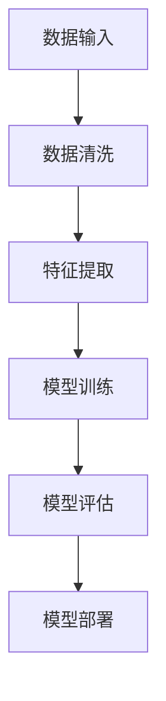
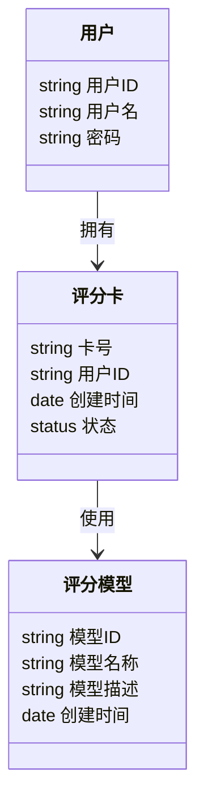
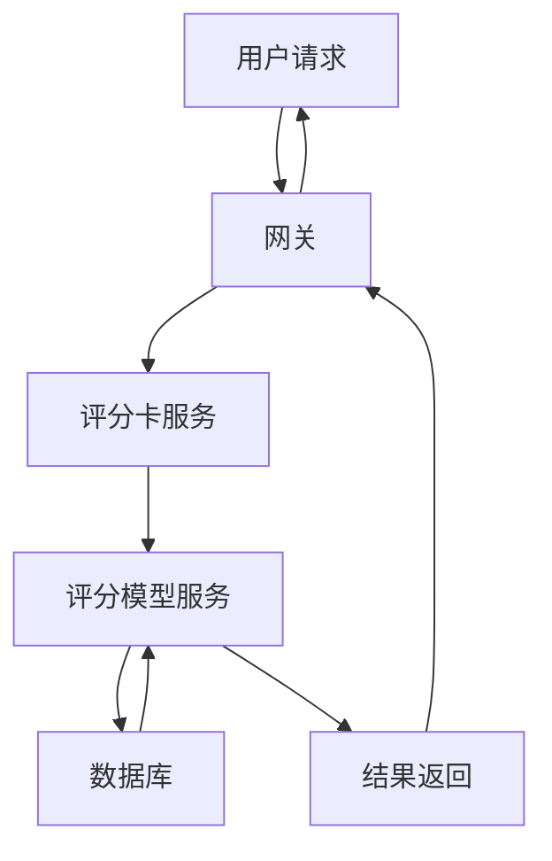

                 


# AI辅助的企业信用评分卡开发平台

> 关键词：企业信用评分卡，AI辅助开发，机器学习，信用评分模型，系统架构设计

> 摘要：本文详细介绍了AI辅助的企业信用评分卡开发平台的背景、核心概念、算法原理、系统架构设计、项目实战及最佳实践。通过分析企业信用评分卡的传统开发方式的局限性，探讨了AI技术在信用评分卡开发中的应用潜力，结合实际案例，展示了如何利用机器学习算法构建高效的信用评分模型，并通过系统架构设计确保平台的可扩展性和稳定性。

---

## 第一部分: 企业信用评分卡开发平台的背景与核心概念

### 第1章: 企业信用评分卡的背景与问题背景

#### 1.1 企业信用评分卡的背景

企业信用评分卡是一种用于评估企业信用状况的重要工具，它通过对企业财务数据、经营状况、市场表现等多维度信息的综合分析，生成一个量化评分，帮助企业做出信贷决策、风险控制等关键业务决策。

**1.1.1 企业信用评分卡的定义与作用**  
企业信用评分卡是基于企业多维度数据（如财务数据、市场数据、信用历史等）构建的评分模型，其作用在于量化企业的信用风险，帮助金融机构、供应链合作伙伴等做出信贷审批、供应商筛选等决策。

**1.1.2 传统信用评分卡的局限性**  
传统信用评分卡的开发通常依赖人工经验，存在以下问题：  
- 数据处理复杂：需要手动清洗和特征提取，耗时且容易出错。  
- 模型性能受限：传统评分卡依赖简单的统计模型，难以捕捉复杂的信用风险特征。  
- 开发周期长：从数据准备到模型上线，通常需要数周甚至数月时间。  

**1.1.3 AI技术在信用评分卡中的应用潜力**  
AI技术（特别是机器学习和深度学习）能够显著提升信用评分卡的开发效率和模型性能，主要体现在：  
- 自动化数据处理：AI能够自动完成数据清洗、特征提取和特征工程。  
- 模型优化：AI能够训练更复杂的模型，捕捉更多的信用风险特征。  
- 实时更新：AI模型能够动态更新，适应市场变化和企业信用状况的变化。  

#### 1.2 问题背景与问题描述

**1.2.1 信用评分卡开发的核心问题**  
- 数据清洗与特征工程复杂，需要人工干预。  
- 传统评分模型难以捕捉复杂的信用风险特征。  
- 模型开发周期长，难以满足业务需求的实时性。  

**1.2.2 传统开发中的痛点与挑战**  
- 数据孤岛：企业数据分散在不同的系统中，难以整合。  
- 数据隐私与安全：信用评分涉及企业的敏感数据，数据泄露风险高。  
- 模型解释性差：复杂的AI模型难以解释评分结果，影响业务决策的透明性。  

**1.2.3 AI辅助开发的必要性与目标**  
AI辅助开发的目标是通过自动化工具和算法，提升信用评分卡的开发效率和模型性能，同时降低开发成本和风险。主要体现在：  
- 提供自动化数据处理工具，简化特征工程。  
- 提供多种机器学习模型，支持模型选择与优化。  
- 提供实时更新机制，确保评分模型的动态适应性。  

#### 1.3 问题解决与边界

**1.3.1 AI辅助开发的核心解决思路**  
AI辅助开发的核心思路是通过机器学习算法构建信用评分模型，并结合自动化工具实现数据处理、模型训练和部署的全流程自动化。

**1.3.2 信用评分卡开发的边界与外延**  
- 数据范围：包括企业财务数据、市场数据、信用历史等。  
- 模型范围：包括传统评分模型（如逻辑回归）和机器学习模型（如随机森林、XGBoost）。  
- 应用范围：主要用于企业信贷审批、供应链管理、风险控制等领域。  

**1.3.3 核心要素与组成结构**  
企业信用评分卡的核心要素包括：  
1. 数据采集与处理：包括数据清洗、特征提取和特征工程。  
2. 模型训练：基于机器学习算法训练信用评分模型。  
3. 模型部署：将模型部署到生产环境，实现评分结果的实时输出。  
4. 模型监控与优化：对模型性能进行监控，并根据数据变化进行模型优化。  

---

## 第二部分: AI辅助的企业信用评分卡核心概念与联系

### 第2章: 核心概念与原理

#### 2.1 AI在信用评分卡中的核心原理

**2.1.1 机器学习在信用评分中的应用**  
机器学习算法（如逻辑回归、随机森林、XGBoost）能够从企业多维度数据中提取特征，并构建高精度的信用评分模型。

**2.1.2 自然语言处理在信用数据中的应用**  
自然语言处理（NLP）技术可以用于分析企业的文本数据（如财务报告、合同文本），提取有用的信息用于信用评分。

**2.1.3 深度学习模型的信用评分预测**  
深度学习模型（如LSTM、BERT）能够捕捉企业数据中的复杂模式，提升信用评分的准确性。

#### 2.2 核心概念对比与ER实体关系图

**2.2.1 核心概念属性特征对比表**  
| 特征对比 | 传统评分卡 | AI辅助评分卡 |  
|----------|-------------|----------------|  
| 数据来源 | 单一数据源 | 多数据源（包括文本、结构化数据） |  
| 模型复杂度 | 简单模型 | 复杂模型 |  
| 开发时间 | 长周期 | 短周期 |  
| 模型性能 | 低精度 | 高精度 |  

**2.2.2 信用评分卡开发的ER实体关系图**  
```mermaid
erDiagram
    actor 用户角色 {
        string 用户ID
        string 用户名
        string 密码
    }
    entity 信用评分卡 {
        string 卡号
        string 用户ID
        date 开卡时间
        status 状态
    }
    entity 评分模型 {
        string 模型ID
        string 模型名称
        string 模型描述
        date 创建时间
    }
    entity 评分数据 {
        string 数据ID
        string 模型ID
        float 评分结果
        date 评分时间
    }
    用户角色 --> 信用评分卡 : 拥有
    用户角色 --> 评分模型 : 使用
    信用评分卡 --> 评分数据 : 生成
```

---

## 第三部分: 算法原理与系统架构设计

### 第3章: 算法原理

#### 3.1 算法原理

**3.1.1 机器学习算法的核心原理**  
以逻辑回归为例，其核心公式为：  
$$ P(y=1) = \frac{1}{1 + e^{-\beta x}} $$  
其中，\( x \) 是输入特征，\( \beta \) 是模型参数。

**3.1.2 机器学习算法的选择与对比**  
常用算法包括：  
- 逻辑回归（Logistic Regression）：适合二分类问题。  
- 随机森林（Random Forest）：适合高维数据和非线性关系。  
- XGBoost：适合高精度要求的场景。  

**3.1.3 算法流程图**  


#### 3.2 算法实现

**3.2.1 Python代码实现**  
以下是一个基于逻辑回归的信用评分模型实现示例：

```python
import pandas as pd
from sklearn.linear_model import LogisticRegression
from sklearn.metrics import accuracy_score

# 数据加载与预处理
df = pd.read_csv('credit_data.csv')
X = df.drop('label', axis=1)
y = df['label']

# 模型训练
model = LogisticRegression()
model.fit(X, y)

# 模型评估
y_pred = model.predict(X)
print(f'模型准确率: {accuracy_score(y, y_pred)}')
```

---

## 第四部分: 系统架构与项目实战

### 第4章: 系统架构设计

#### 4.1 系统功能设计

**4.1.1 领域模型类图**  


#### 4.2 系统架构设计

**4.2.1 系统架构图**  


---

## 第五部分: 项目实战与最佳实践

### 第5章: 项目实战

#### 5.1 项目背景与目标

**5.1.1 项目背景**  
本项目旨在开发一个基于AI的信用评分卡平台，实现企业信用评分的自动化开发与部署。

#### 5.2 环境安装

**5.2.1 环境要求**  
- Python 3.8+  
- Scikit-learn、XGBoost等机器学习库  
- Mermaid、PlantUML等工具（用于图表绘制）  

#### 5.3 核心代码实现

**5.3.1 数据处理代码**  
```python
import pandas as pd
from sklearn.preprocessing import StandardScaler

# 数据加载
df = pd.read_csv('credit_data.csv')

# 数据清洗
df.dropna(inplace=True)

# 特征工程
scaler = StandardScaler()
X_scaled = scaler.fit_transform(df.drop('label', axis=1))
y = df['label']
```

---

## 第六部分: 最佳实践与总结

### 第6章: 最佳实践

#### 6.1 开发中的经验与教训

**6.1.1 数据处理中的注意事项**  
- 数据清洗时要注意处理异常值和缺失值。  
- 特征工程要结合业务知识，选择合适的特征。  

**6.1.2 模型优化中的注意事项**  
- 选择合适的模型评估指标（如准确率、召回率、F1分数）。  
- 使用交叉验证评估模型性能。  

#### 6.2 小结与展望

**6.2.1 小结**  
通过本文的介绍，读者可以了解AI辅助的企业信用评分卡开发平台的核心概念、算法原理和系统架构设计。通过实际案例的分析，读者可以掌握如何利用机器学习算法构建高效的信用评分模型。

**6.2.2 展望**  
未来，随着AI技术的不断发展，企业信用评分卡开发平台将更加智能化和自动化，模型性能也将不断提升，为企业信用评估提供更精准的支持。

---

## 参考文献

- Scikit-learn官方文档  
- XGBoost官方文档  
- Mermaid图表工具官方文档  

---

通过以上思考过程，我们可以逐步构建一个完整的AI辅助的企业信用评分卡开发平台，从理论到实践，帮助读者深入了解其核心技术和实际应用。

