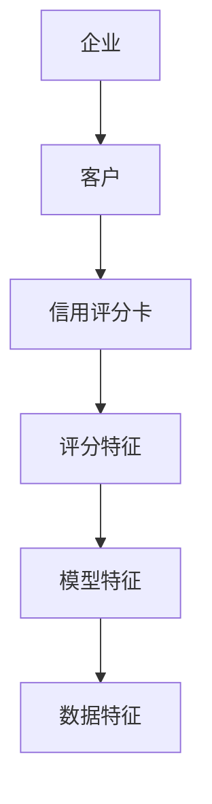
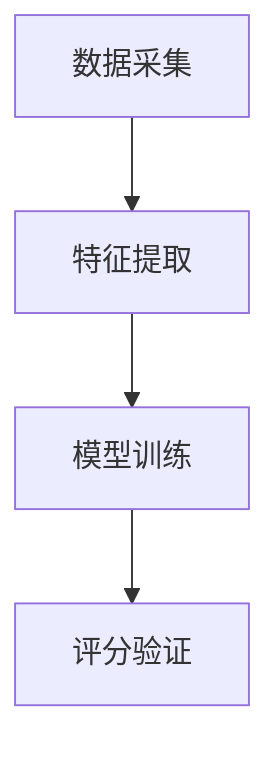
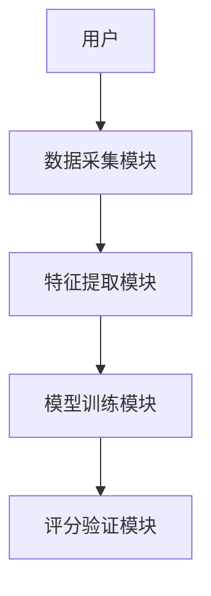

                 


# AI辅助的企业信用评分卡验证

> 关键词：AI技术，信用评分卡，企业信用评估，机器学习，算法模型

> 摘要：本文详细探讨了AI技术在企业信用评分卡验证中的应用，从核心概念到算法原理，再到系统架构设计和项目实战，全面分析了AI如何提升信用评分卡的验证效率和准确性。通过具体的案例分析和代码实现，展示了如何利用AI技术优化企业信用评估流程，为企业风险管理提供更可靠的决策支持。

---

## 第一部分: AI辅助的企业信用评分卡验证基础

### 第1章: 企业信用评分卡验证的背景与概念

#### 1.1 企业信用评分卡的基本概念
企业信用评分卡是一种用于评估企业信用状况的工具，它通过收集和分析企业的财务数据、市场表现、经营状况等信息，生成一个量化评分，帮助企业信用机构评估企业的信用风险。传统的信用评分卡通常基于简单的统计模型，难以应对复杂多变的市场环境。

#### 1.2 AI在信用评分卡验证中的作用
AI技术的引入，使得信用评分卡的验证过程更加智能化和高效。通过机器学习算法，AI能够从海量数据中提取关键特征，并自动优化模型参数，从而提高评分的准确性和预测能力。

#### 1.3 信用评分卡验证的流程与挑战
传统的信用评分卡验证流程通常包括数据采集、特征提取、模型训练和结果验证等步骤。然而，这一过程往往耗时长、效率低，且容易受到人为因素的影响。AI技术的应用，可以显著减少验证时间，降低人为错误，并提高模型的泛化能力。

---

### 第2章: AI辅助信用评分卡验证的核心概念与联系

#### 2.1 核心概念原理
AI辅助信用评分卡验证的核心在于通过机器学习算法，从企业的多维度数据中提取有用的特征，并构建高精度的预测模型。这一过程包括数据特征提取、模型特征工程和评分特征分析。

#### 2.2 核心概念属性特征对比表
以下是传统方法与AI方法在信用评分卡验证中的属性特征对比：

| 特征类型 | 传统方法 | AI方法 |
|----------|----------|--------|
| 数据特征 | 单一维度 | 多维度 |
| 模型特征 | 线性关系 | 非线性 |
| 评分特征 | 简单评分 | 综合评分 |

#### 2.3 实体关系图（ER图）架构
以下是信用评分卡验证系统的实体关系图：



---

### 第3章: AI辅助信用评分卡验证的算法原理

#### 3.1 传统算法与AI算法对比
以下是传统算法与AI算法在信用评分卡验证中的对比：

- **逻辑回归（传统算法）**：基于线性模型，适合处理二分类问题，但对非线性关系的处理能力有限。
- **XGBoost（基于树的算法）**：通过构建决策树进行特征提取，具有较强的非线性拟合能力。
- **神经网络模型（AI算法）**：通过多层神经网络，能够捕捉复杂的特征关系，适用于高维数据。

#### 3.2 神经网络模型的数学原理
神经网络模型的核心在于其数学公式。以下是一个简单的神经网络模型的数学表达：

$$ y = \sigma(w x + b) $$

其中，$x$ 是输入特征，$w$ 是权重，$b$ 是偏置，$\sigma$ 是激活函数（如sigmoid函数）。

---

## 第二部分: 系统分析与架构设计

### 第4章: 系统分析与架构设计

#### 4.1 问题场景介绍
企业信用评分卡验证系统需要处理海量的企业数据，并利用AI算法快速生成信用评分。系统需要具备高效的数据处理能力、强大的模型训练能力和灵活的接口调用能力。

#### 4.2 系统功能设计
以下是系统的主要功能模块：

- **数据采集模块**：负责采集企业数据，包括财务数据、市场数据等。
- **特征提取模块**：通过机器学习算法提取关键特征。
- **模型训练模块**：利用AI算法训练预测模型。
- **评分验证模块**：根据模型生成信用评分，并进行验证。

#### 4.3 系统架构设计
以下是系统架构的Mermaid图：



#### 4.4 系统接口设计
系统接口设计需要考虑数据输入、模型调用和结果输出三个环节。

#### 4.5 系统交互设计
以下是系统交互的Mermaid图：



---

## 第三部分: 项目实战

### 第5章: 项目实战

#### 5.1 项目介绍
本项目旨在设计一个基于AI的企业信用评分卡验证系统，通过Python和机器学习算法实现模型训练和评分验证。

#### 5.2 核心实现
以下是系统的Python代码实现：

```python
import numpy as np
from sklearn.model_selection import train_test_split
from sklearn.linear_model import LogisticRegression
from sklearn.metrics import accuracy_score

# 数据准备
X = np.array([[...], [...]])  # 特征数据
y = np.array([...])  # 标签数据

# 数据分割
X_train, X_test, y_train, y_test = train_test_split(X, y, test_size=0.2)

# 模型训练
model = LogisticRegression()
model.fit(X_train, y_train)

# 模型预测
y_pred = model.predict(X_test)

# 模型评估
print(accuracy_score(y_test, y_pred))
```

---

## 第四部分: 最佳实践与总结

### 第6章: 最佳实践与总结

#### 6.1 最佳实践
在实际应用中，建议企业结合自身业务特点，选择合适的AI算法，并注重数据质量和模型解释性。

#### 6.2 小结
本文详细探讨了AI技术在企业信用评分卡验证中的应用，通过理论分析和实践案例，展示了AI如何提升信用评分卡的验证效率和准确性。

#### 6.3 注意事项
在实际应用中，需要注意数据隐私保护和模型的可解释性问题。

#### 6.4 拓展阅读
推荐读者进一步阅读《机器学习实战》和《深度学习》等书籍，深入了解AI技术的更多应用场景。

---

通过以上分析和实践，我们可以看到，AI技术在企业信用评分卡验证中的应用前景广阔，能够显著提升企业的风险管理能力。未来，随着AI技术的不断发展，信用评分卡的验证将更加智能化和精准化。

