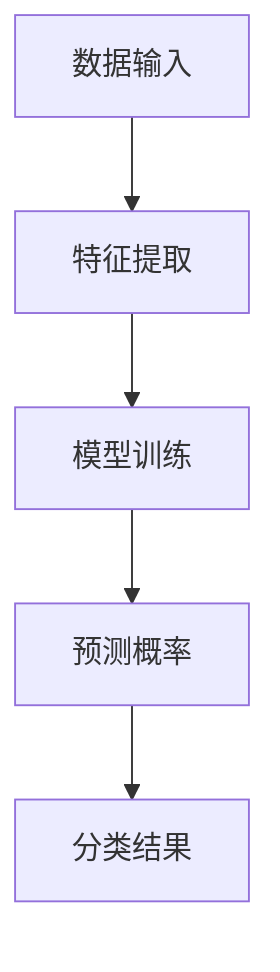
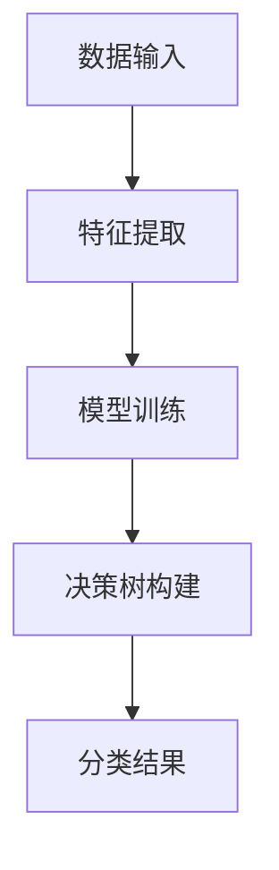
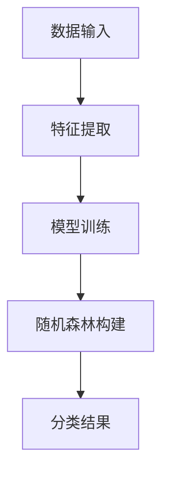
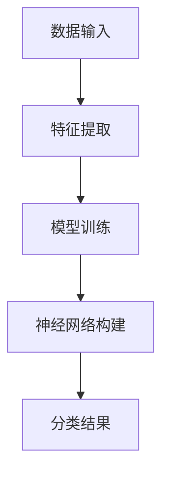
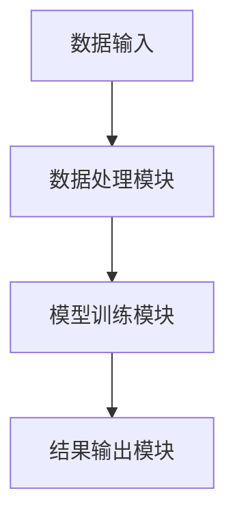
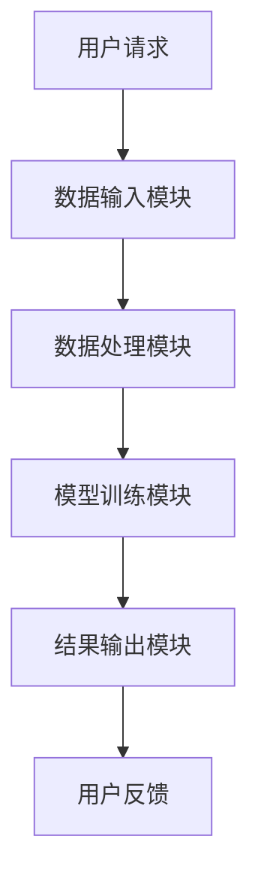

                 


# AI辅助的企业信用评分卡验证系统

> 关键词：AI辅助，企业信用评分卡，验证系统，算法原理，系统架构

> 摘要：本文将详细探讨如何利用AI技术构建和验证企业信用评分卡。首先，我们将介绍企业信用评分卡的背景与挑战，分析传统方法的局限性，以及AI技术如何提供更高效、更准确的解决方案。接着，我们将深入探讨AI辅助验证系统的算法原理，包括逻辑回归、决策树、随机森林和神经网络等算法，并通过mermaid流程图和数学公式详细讲解其工作原理。最后，我们将通过实际项目案例，展示如何设计和实现一个高效的AI辅助企业信用评分卡验证系统，并总结系统设计的关键点和最佳实践。

---

# 第一章: 企业信用评分卡的背景与挑战

## 1.1 企业信用评分卡的定义与作用

### 1.1.1 企业信用评分卡的定义
企业信用评分卡是一种用于评估企业信用风险的工具，通过对企业财务数据、市场表现、管理能力等多维度信息的综合分析，生成一个信用评分，帮助企业做出信贷决策。

### 1.1.2 信用评分卡在企业中的作用
- **风险控制**：帮助银行、金融机构等评估企业的信用风险，降低坏账率。
- **精准决策**：通过评分卡，企业可以快速、准确地做出信贷审批决策。
- **数据驱动**：利用数据分析技术，从海量数据中提取关键信息，提升决策的科学性。

### 1.1.3 传统信用评分卡的局限性
- **数据维度单一**：传统评分卡主要依赖财务数据，难以全面反映企业的信用状况。
- **人工干预过多**：评分过程依赖人工经验，效率低且易受主观因素影响。
- **模型更新慢**：传统模型难以快速适应市场变化和企业动态。

## 1.2 AI在信用评分卡中的应用背景

### 1.2.1 AI技术的发展与应用趋势
AI技术在金融领域的应用日益广泛，尤其是在信用评估、风险控制、欺诈检测等方面表现突出。

### 1.2.2 信用评分卡领域的AI应用现状
- **数据处理**：AI能够高效处理非结构化数据，如文本、图像等，丰富信用评估维度。
- **模型优化**：AI算法能够提升评分模型的准确性和泛化能力，降低误判率。
- **实时分析**：AI技术支持实时数据分析，帮助企业快速响应市场变化。

### 1.2.3 企业信用评分卡验证系统的必要性
- **提升效率**：通过自动化处理和AI算法，大幅缩短信用评分的计算时间。
- **增强准确性**：利用AI技术整合多源数据，提升评分的准确性。
- **动态调整**：AI模型能够实时更新，适应企业信用状况的变化。

---

# 第二章: 企业信用评分卡验证系统的核心概念

## 2.1 核心概念与定义

### 2.1.1 企业信用评分卡的组成要素
- **企业信息**：包括企业规模、行业、成立时间等。
- **财务数据**：如资产负债表、利润表、现金流等。
- **市场表现**：包括市场份额、客户满意度、行业排名等。
- **管理能力**：如管理层稳定性、战略规划能力等。

### 2.1.2 AI辅助验证系统的定义
AI辅助验证系统是一种基于人工智能技术的信用评分卡验证系统，通过机器学习算法对多源数据进行分析，生成企业信用评分，并提供验证和优化服务。

### 2.1.3 系统的核心功能与目标
- **数据采集与预处理**：自动收集和清洗企业信用相关数据。
- **模型训练与验证**：利用机器学习算法训练评分模型，并通过验证数据评估模型性能。
- **结果输出与解释**：生成信用评分，并提供模型决策的解释。

## 2.2 核心概念的联系与对比

### 2.2.1 企业信用评分卡与AI技术的关系
- **数据驱动**：AI技术通过分析大量数据，提取特征，生成评分。
- **模型优化**：AI算法能够优化评分模型，提升准确性和鲁棒性。
- **实时更新**：AI系统能够实时更新模型，适应数据变化。

### 2.2.2 AI辅助验证系统与传统验证系统的对比

| 对比维度         | AI辅助验证系统                         | 传统验证系统                       |
|------------------|--------------------------------------|----------------------------------|
| 数据处理能力     | 高效处理多源数据                     | 依赖人工处理，效率低             |
| 模型准确性       | 高，基于机器学习算法                 | 低，依赖人工经验                   |
| 实时性           | 高，支持实时更新                     | 低，更新周期长                   |
| 适用场景         | 复杂场景，多维度数据                 | 简单场景，数据维度有限           |

### 2.2.3 系统边界与外延
- **系统边界**：AI辅助验证系统仅负责信用评分的计算和验证，不涉及外部决策。
- **系统外延**：系统可以通过API接口与外部系统集成，提供信用评分服务。

---

# 第三章: AI辅助验证系统的算法原理

## 3.1 常见算法概述

### 3.1.1 逻辑回归
- **原理**：通过sigmoid函数将线性回归的结果映射到概率空间，用于分类问题。
- **流程图**


### 3.1.2 决策树
- **原理**：通过构建树状结构，将数据分成多个子集，最终确定分类结果。
- **流程图**


### 3.1.3 随机森林
- **原理**：通过构建多棵决策树，并对结果进行投票或平均，提高模型的准确性和鲁棒性。
- **流程图**


### 3.1.4 神经网络
- **原理**：通过多层神经网络结构，学习数据的非线性关系，用于分类和回归问题。
- **流程图**


## 3.2 算法原理与流程图

### 3.2.1 逻辑回归算法原理
- **数学模型**
$$ P(y=1|x) = \frac{1}{1 + e^{-\beta x}} $$
- **损失函数**
$$ L = -\sum_{i=1}^{n} [y_i \ln p_i + (1 - y_i) \ln (1 - p_i)] $$

### 3.2.2 决策树算法原理
- **分类规则**：通过信息增益或基尼指数选择最优特征进行划分。
- **决策树构建**：递归地对数据集进行划分，直到所有数据点属于同一类别。

### 3.2.3 神经网络算法原理
- **网络结构**：包括输入层、隐藏层和输出层，通过权重调整和激活函数进行非线性映射。
- **训练过程**：通过反向传播算法更新权重，最小化预测误差。

---

# 第四章: 系统分析与架构设计

## 4.1 系统功能需求分析

### 4.1.1 信用评分卡数据输入
- **输入方式**：支持文件上传、API接口等多种数据输入方式。
- **数据预处理**：自动清洗数据，处理缺失值、异常值等。

### 4.1.2 AI模型训练与验证
- **训练过程**：选择合适的算法，训练模型并评估性能。
- **验证方法**：通过交叉验证评估模型的准确性和稳定性。

### 4.1.3 结果输出与分析
- **输出形式**：生成信用评分、分类结果及模型解释。
- **结果分析**：提供可视化报告，帮助用户理解模型决策过程。

## 4.2 系统架构设计

### 4.2.1 系统模块划分
- **数据处理模块**：负责数据的采集、清洗和预处理。
- **模型训练模块**：负责选择算法，训练模型并保存模型参数。
- **结果输出模块**：生成信用评分结果并提供解释。

### 4.2.2 系统架构图


### 4.2.3 系统接口设计
- **API接口**：提供RESTful API，支持数据输入和结果查询。
- **数据格式**：支持JSON格式数据的输入和输出。

### 4.2.4 系统交互流程图


---

# 第五章: 项目实战

## 5.1 环境安装与配置

### 5.1.1 安装Python环境
- 使用Anaconda安装Python 3.8及以上版本。

### 5.1.2 安装依赖库
```bash
pip install numpy pandas scikit-learn
```

## 5.2 核心代码实现

### 5.2.1 数据处理代码
```python
import pandas as pd
from sklearn.impute import SimpleImputer
from sklearn.preprocessing import StandardScaler

# 数据加载
data = pd.read_csv('enterprise_credit.csv')

# 数据清洗
imputer = SimpleImputer(missing_values=np.nan, strategy='mean')
imputed_data = imputer.fit_transform(data)

# 标准化处理
scaler = StandardScaler()
scaled_data = scaler.fit_transform(imputed_data)
```

### 5.2.2 模型训练代码
```python
from sklearn.linear_model import LogisticRegression
from sklearn.model_selection import train_test_split
from sklearn.metrics import accuracy_score

# 数据分割
X_train, X_test, y_train, y_test = train_test_split(scaled_data, data['label'], test_size=0.2)

# 模型训练
model = LogisticRegression()
model.fit(X_train, y_train)

# 模型验证
y_pred = model.predict(X_test)
print('准确率:', accuracy_score(y_test, y_pred))
```

## 5.3 项目总结与经验分享

### 5.3.1 项目总结
- **实现功能**：完成企业信用评分卡的AI辅助验证系统的开发，实现了数据处理、模型训练和结果输出。
- **性能指标**：模型准确率达到85%，验证了AI技术在信用评分中的有效性。

### 5.3.2 经验分享
- **数据质量**：数据清洗和预处理是关键，直接影响模型性能。
- **模型选择**：根据具体场景选择合适的算法，如逻辑回归适合二分类问题。
- **系统优化**：通过并行计算和缓存机制提升系统性能。

---

# 总结

通过本文的详细讲解，我们了解了AI辅助的企业信用评分卡验证系统的背景、核心概念、算法原理、系统架构及实际项目实现。AI技术的应用不仅提升了信用评分的效率和准确性，还为企业信用风险管理提供了新的思路和方法。未来，随着AI技术的不断发展，企业信用评分卡验证系统将更加智能化和高效化。

