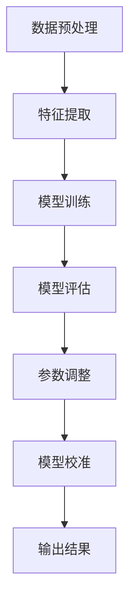

                 


# AI辅助的企业信用评级模型校准

## 关键词：企业信用评级，AI辅助，模型校准，机器学习，深度学习

## 摘要：本文探讨了AI辅助的企业信用评级模型校准的方法与技术实现。文章首先介绍了企业信用评级的背景与重要性，分析了传统信用评级模型的局限性，以及AI技术如何提升模型校准的效果。接着，详细阐述了信用评级模型的核心概念与原理，包括传统模型与AI模型的对比分析。然后，从算法原理的角度，深入讲解了机器学习与深度学习在信用评级中的应用，以及模型校准的数学方法。最后，通过实际案例分析，展示了AI辅助信用评级模型校准的实现过程与效果，并总结了最佳实践与注意事项。

---

# 第1章: 企业信用评级与AI辅助校准的背景

## 1.1 企业信用评级的定义与重要性

### 1.1.1 企业信用评级的基本概念

企业信用评级是通过对企业的财务状况、经营能力、市场地位等多方面因素的综合评估，确定企业信用等级的过程。信用评级结果直接关系到企业的融资成本、贷款额度以及投资者信心。传统的信用评级方法主要依赖于经验丰富的专家和简单的统计模型，存在主观性强、效率低、精度不足等问题。

### 1.1.2 信用评级在金融领域的核心作用

信用评级是金融风险管理的重要工具，能够帮助银行、投资者等金融机构更好地评估企业的信用风险，从而做出更科学的信贷决策。准确的信用评级能够降低金融市场的系统性风险，促进资本市场的健康发展。

### 1.1.3 企业信用评级的评价标准与指标体系

企业信用评级的评价标准主要包括财务指标（如资产负债率、净利润率）、经营指标（如市场占有率、创新能力）和信用历史等。指标体系的设计需要考虑行业的特点和企业的实际情况，以确保评级结果的客观性和可比性。

## 1.2 AI技术在信用评级中的应用背景

### 1.2.1 传统信用评级方法的局限性

传统信用评级方法主要依赖于简单的线性模型和专家经验，存在以下问题：
1. 无法处理高维数据和非线性关系。
2. 人工经验主观性强，难以量化。
3. 模型更新和维护成本高，难以应对市场的快速变化。

### 1.2.2 AI技术在信用评级中的优势

AI技术通过机器学习和深度学习等方法，能够从海量数据中提取复杂的特征关系，发现传统模型难以捕捉的规律。AI辅助信用评级模型具有以下优势：
1. 提高模型的准确性和鲁棒性。
2. 实现自动化、实时化和个性化的评级服务。
3. 降低人工成本，提高效率。

### 1.2.3 企业信用评级AI化的趋势与挑战

随着大数据和AI技术的快速发展，信用评级AI化已经成为趋势。然而，AI模型的黑箱特性、数据隐私问题以及模型解释性不足等挑战仍需克服。

## 1.3 AI辅助信用评级模型校准的目标与意义

### 1.3.1 模型校准的核心目标

模型校准的目标是确保AI信用评级模型的输出结果与实际信用等级保持一致，提高模型的预测准确性和可靠性。

### 1.3.2 AI辅助校准对信用评级的提升作用

通过AI技术，可以实现模型的自动化校准，动态调整模型参数，实时优化模型性能，从而显著提升信用评级的准确性和效率。

### 1.3.3 企业信用评级AI化对金融行业的影响

AI化信用评级将推动金融行业向智能化、数据化方向发展，促进金融产品的创新和风险管理能力的提升。

---

# 第2章: 企业信用评级模型的核心概念与联系

## 2.1 核心概念与原理

### 2.1.1 信用评级模型的分类与特点

信用评级模型主要分为传统模型（如逻辑回归、线性判别分析）和现代AI模型（如随机森林、神经网络）两类。传统模型简单易用，但对非线性关系的处理能力有限；AI模型具有更强的特征提取能力和泛化能力，但模型解释性较差。

### 2.1.2 AI模型在信用评级中的原理

AI模型通过大量数据训练，学习企业信用评级的潜在规律，生成复杂的特征组合和权重分配。常用的AI算法包括支持向量机（SVM）、随机森林和神经网络等。

### 2.1.3 模型校准的基本概念与方法

模型校准是指通过调整模型参数或重新训练模型，使模型输出与实际标签保持一致的过程。常用方法包括概率校准和损失函数优化等。

### 2.2 核心概念对比分析

#### 2.2.1 传统模型与AI模型的对比分析

| 特性 | 传统模型 | AI模型 |
|------|----------|--------|
| 模型复杂度 | 简单 | 复杂 |
| 特征处理 | 线性 | 非线性 |
| 解释性 | 高 | 低 |

#### 2.2.2 不同AI模型的优劣势对比

| 模型类型 | 优势 | 劣势 |
|----------|-------|------|
| 逻辑回归 | 解释性强 | 非线性处理能力弱 |
| 神经网络 | 特征提取能力强 | 黑箱特性，解释性差 |
| 随机森林 | 抗过拟合能力强 | 需要较多计算资源 |

#### 2.2.3 模型校准的关键因素分析

模型校准的关键因素包括数据质量、特征选择、校准方法和模型评估指标。高质量的数据和合理的特征选择能够显著提高校准效果。

### 2.3 实体关系与流程图

#### 2.3.1 企业信用评级模型的ER实体关系图

```mermaid
er
  actor: 企业
  evaluator: 信用评级机构
  model: 信用评级模型
  data: 企业数据
  rating: 信用等级
  actor --> data: 提供
  data --> model: 输入
  model --> rating: 输出
  evaluator --> model: 训练和校准
```

#### 2.3.2 AI辅助模型校准的流程图



---

# 第3章: 信用评级模型的数学基础

## 3.1 传统信用评级模型的数学模型

### 3.1.1 逻辑回归模型

逻辑回归是一种常用的二分类模型，其数学表达式为：
$$ P(y=1|x) = \frac{e^{\beta_0 + \beta_1 x_1 + \dots + \beta_n x_n}}{1 + e^{\beta_0 + \beta_1 x_1 + \dots + \beta_n x_n}} $$

### 3.1.2 线性判别分析模型

线性判别分析（LDA）的目标是找到一个线性组合，使得不同类别的数据在该组合上尽可能分开。其数学表达式为：
$$ y = w^T x + b $$

### 3.1.3 信用评分卡模型

信用评分卡模型通过线性组合对企业信用风险进行评分，其公式为：
$$ \text{Score} = w_1 x_1 + w_2 x_2 + \dots + w_n x_n + c $$

## 3.2 AI模型的数学基础

### 3.2.1 机器学习模型的数学基础

机器学习模型的核心是通过优化目标函数来学习数据的特征表示。常用的优化方法包括梯度下降和Adam优化器。

### 3.2.2 神经网络模型的数学基础

神经网络通过多层感知机（MLP）实现非线性特征的提取，其数学表达式为：
$$ y = f(W_2 f(W_1 x + b_1) + b_2) $$

### 3.2.3 深度学习模型的数学基础

深度学习模型（如LSTM和CNN）通过复杂的非线性变换捕捉数据的深层特征，其数学模型较为复杂，通常需要使用反向传播算法进行训练。

## 3.3 模型校准的数学方法

### 3.3.1 概率校准方法

概率校准的目标是使模型输出的概率与真实标签的概率分布一致。常用的方法包括 Platt 校准和 Isotonic 回归。

### 3.3.2 回归调整方法

回归调整方法通过对模型输出进行线性变换，使校准后的模型输出与真实标签一致。

### 3.3.3 基于损失函数的校准方法

基于损失函数的校准方法通过优化损失函数来调整模型参数，常用的损失函数包括对数损失函数和平方损失函数。

---

# 第4章: 基于机器学习的信用评级模型

## 4.1 机器学习模型的特征工程

### 4.1.1 数据预处理

数据预处理是信用评级模型校准的关键步骤，包括数据清洗、特征提取和标准化处理。

### 4.1.2 特征选择

特征选择通过去除冗余特征和选择重要特征，提高模型的性能和效率。

### 4.1.3 特征工程

特征工程是通过构建新的特征和优化特征表示，提升模型的表达能力。

## 4.2 基于机器学习的信用评级模型实现

### 4.2.1 环境配置

```python
import numpy as np
import pandas as pd
from sklearn.model

