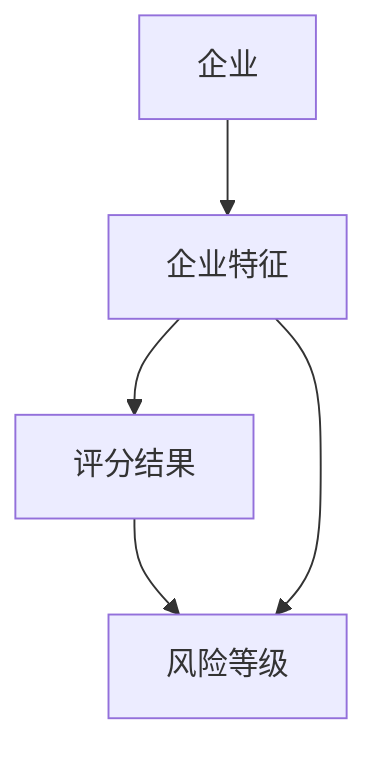

                 

# AI辅助的企业信用评级模型解释性研究

## 关键词：
- AI辅助
- 企业信用评级
- 解释性模型
- 数据特征
- 评分机制

## 摘要：
本文探讨了如何利用人工智能技术构建和解释企业信用评级模型。通过分析传统信用评级的局限性，提出了基于AI的解决方案，并详细阐述了模型的核心概念、算法原理、系统架构以及实际应用。本文旨在为企业信用评级提供一种高效、透明的AI辅助方法，同时确保模型的可解释性。

---

# 第一章: AI辅助的企业信用评级模型背景介绍

## 1.1 问题背景

### 1.1.1 传统企业信用评级的局限性
传统企业信用评级主要依赖于人工经验判断和简单的统计模型，存在以下问题：
- 数据维度单一，难以捕捉企业的多维特征。
- 模型泛化能力不足，难以应对复杂的市场变化。
- 评分结果缺乏透明性，难以解释具体原因。

### 1.1.2 AI技术在信用评级中的应用潜力
AI技术（如机器学习、深度学习）在处理海量数据和复杂模式方面具有显著优势，可以提升信用评级的准确性和效率。

### 1.1.3 当前信用评级模型的痛点与挑战
- 数据量大、维度高，传统模型难以处理。
- 模型黑箱化，缺乏可解释性。
- 风险评估需要实时更新，传统方法难以应对。

## 1.2 问题描述

### 1.2.1 企业信用评级的核心目标
对企业进行信用评分，预测其违约风险，帮助金融机构做出信贷决策。

### 1.2.2 数据特征与模型构建的关键问题
- 数据清洗与特征提取。
- 模型选择与优化。
- 结果的可解释性。

### 1.2.3 解释性需求的重要性
- 满足监管要求。
- 增强用户信任。
- 便于调整和优化模型。

## 1.3 问题解决

### 1.3.1 AI技术如何辅助信用评级
- 利用机器学习算法自动提取特征。
- 通过深度学习模型捕捉复杂关系。
- 结合自然语言处理分析非结构化数据。

### 1.3.2 解释性模型的设计思路
- 使用可解释性算法（如线性模型、树模型）。
- 提供特征重要性分析。
- 解释模型的决策过程。

### 1.3.3 从数据到评分的完整流程
- 数据收集与预处理。
- 特征提取与选择。
- 模型训练与优化。
- 生成评分并解释结果。

## 1.4 边界与外延

### 1.4.1 模型的适用范围
- 中小企业信用评级。
- 行业通用性与特定行业适用性。

### 1.4.2 与传统信用评级的区别
- 数据来源更广泛。
- 模型复杂度更高。
- 结果更精准。

### 1.4.3 解释性模型的边界条件
- 解释性要求与模型复杂性的平衡。
- 数据质量和完整性的影响。

## 1.5 核心概念与核心要素

### 1.5.1 核心概念的定义
- 数据特征：企业的财务数据、市场表现、管理团队等。
- 模型结构：线性回归、随机森林、神经网络等。
- 评分机制：基于模型输出的分值或概率。

### 1.5.2 核心要素的组成
- 数据特征：文本、数值、时间序列等。
- 模型算法：分类、回归、聚类等。
- 评分结果：风险等级、违约概率等。

### 1.5.3 概念结构与关系
企业信用评级模型通过数据特征输入，经过模型处理，输出评分结果。模型的可解释性依赖于特征重要性和算法透明度。

---

# 第二章: 核心概念与联系

## 2.1 核心概念原理

### 2.1.1 数据特征提取
- 文本特征：关键词提取、情感分析。
- 数值特征：财务指标、市场表现。
- 时间序列特征：趋势分析、周期性识别。

### 2.1.2 模型结构设计
- 线性模型：简单透明，适合线性关系。
- 树模型：适合复杂关系，可解释性较好。
- 深度学习模型：非线性能力强，但解释性差。

### 2.1.3 评分机制
- 分值评分：0-10分，直观易懂。
- 概率评分：0-1概率，反映违约可能性。
- 风险等级：A、B、C等级别，便于分类。

## 2.2 核心概念属性对比表

| 概念 | 属性 | 描述 |
|------|------|------|
| 数据特征 | 类型 | 文本、数值、时间序列 |
| 模型结构 | 类型 | 线性模型、树模型、深度学习模型 |
| 评分机制 | 类型 | 分值、概率、风险等级 |

## 2.3 ER实体关系图

---

接下来的章节将详细讲解算法原理、数学公式、系统架构和项目实战等内容，确保逻辑清晰、内容详实。

