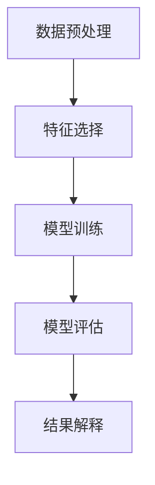

                 


# AI辅助的企业信用评级模型解释性研究

> 关键词：AI，企业信用评级，机器学习，可解释性，模型解释

> 摘要：随着人工智能技术的快速发展，企业信用评级模型的构建和解释性研究成为金融领域的热点问题。本文系统地探讨了AI辅助企业信用评级模型的构建过程，分析了模型的解释性问题，并通过实际案例展示了如何利用AI技术提升信用评级的准确性和透明性。文章从背景介绍、核心概念、算法原理、系统设计到项目实战，全面阐述了AI在企业信用评级中的应用，为金融机构提供了理论支持和实践指导。

---

# 第一部分：企业信用评级模型概述

## 第1章：企业信用评级的定义与作用

### 1.1 企业信用评级的基本概念
企业信用评级是对企业在特定时间段内的信用状况进行评估，主要包括企业的财务状况、经营能力、市场环境等多方面的综合评价。信用评级的结果通常以等级形式呈现，如AAA、AA、A、BBB、BB、B、CCC、CC、C、D等，D通常表示企业已破产。

### 1.2 信用评级在企业融资中的重要性
企业信用评级是金融机构评估企业信用风险的重要依据，直接影响企业融资成本和融资能力。良好的信用评级可以帮助企业获得更低的贷款利率和更长的贷款期限，而较低的评级则可能导致融资困难或高昂的融资成本。

### 1.3 传统信用评级方法的局限性
传统的信用评级方法主要依赖于经验丰富的信贷分析师对企业的财务报表和市场环境进行主观判断。这种方法存在以下问题：
- **主观性强**：不同分析师可能对同一企业的评级结果不同。
- **效率低下**：手工分析耗时长，难以应对大量企业的评级需求。
- **缺乏透明性**：评级结果的解释性差，难以向企业说明评级的具体原因。

---

## 第2章：AI辅助信用评级的背景与意义

### 2.1 AI技术在金融领域的应用现状
近年来，人工智能技术在金融领域的应用日益广泛，尤其是在信用评估、风险控制、欺诈检测等方面。AI技术的应用可以帮助金融机构提高效率、降低成本，并通过大数据分析发现潜在的风险因素。

### 2.2 AI辅助信用评级的优势
- **高效性**：AI可以快速处理海量数据，显著提高评级效率。
- **准确性**：通过机器学习算法，AI可以发现传统方法难以察觉的复杂模式。
- **可扩展性**：AI模型可以轻松扩展，适用于大量企业的评级需求。

### 2.3 企业信用评级模型的解释性需求
尽管AI模型在信用评级中表现出色，但其黑箱特性使得解释评级结果的原因变得困难。金融机构需要解释性模型来满足监管要求，同时增强客户对评级结果的信任。

---

# 第二部分：AI辅助企业信用评级模型的核心概念与联系

## 第3章：企业信用评级模型的核心要素

### 3.1 企业信用评级的核心维度
企业信用评级的核心维度包括：
- **财务指标**：如资产负债率、流动比率、净利润率等。
- **经营能力**：如市场占有率、品牌价值、管理团队稳定性等。
- **信用历史**：包括过去的还款记录、违约历史等。

### 3.2 AI模型在信用评级中的应用
- **机器学习算法**：如逻辑回归、随机森林、梯度提升树（XGBoost）等。
- **深度学习模型**：如神经网络、长短期记忆网络（LSTM）等。

### 3.3 核心概念的ER实体关系图
```mermaid
er
actor: 企业, 金融机构
entity: 信用评级, 企业特征, 评级结果
```

---

# 第三部分：AI辅助企业信用评级模型的算法原理

## 第4章：常见信用评级算法原理

### 4.1 线性回归模型
线性回归是一种简单但强大的统计学习方法，适用于线性关系的建模。

#### 线性回归的基本原理
线性回归假设目标变量与特征变量之间存在线性关系，其数学表达式为：
$$y = \beta_0 + \beta_1x_1 + \beta_2x_2 + \ldots + \beta_nx_n$$
其中，$\beta_0$ 是截距项，$\beta_1, \beta_2, \ldots, \beta_n$ 是特征变量的系数。

#### 线性回归的实现流程


### 4.2 支持向量机（SVM）
支持向量机是一种监督学习算法，适用于分类和回归问题。

#### SVM的基本原理
SVM通过找到一个超平面，使得数据点被正确分类到两个类别中。对于非线性可分的数据，SVM可以通过核函数将数据映射到高维空间。

#### 核函数的作用
核函数将低维数据映射到高维空间，使得数据在高维空间中线性可分。常用的核函数包括：
- 线性核
- 多项式核
- 高斯核

---

# 第四部分：系统分析与架构设计

## 第5章：系统分析与架构设计

### 5.1 系统功能设计
企业信用评级系统的主要功能模块包括：
- **数据采集模块**：从企业财务报表、征信报告等数据源获取数据。
- **特征工程模块**：对数据进行清洗、特征选择和特征工程。
- **模型训练模块**：基于机器学习算法训练信用评级模型。
- **结果解释模块**：对模型输出的评级结果进行解释。

### 5.2 系统架构设计


---

# 第五部分：项目实战

## 第6章：项目实战

### 6.1 环境安装与配置
- **Python环境**：安装Python 3.8及以上版本。
- **依赖库安装**：使用pip安装numpy、pandas、scikit-learn等库。

### 6.2 核心代码实现
以下是基于线性回归的信用评级模型的实现代码：
```python
import pandas as pd
import numpy as np
from sklearn.linear_model import LinearRegression
from sklearn.metrics import mean_squared_error

# 数据加载
data = pd.read_csv('企业信用数据.csv')

# 特征选择
X = data[['资产负债率', '流动比率', '净利润率']]
y = data['信用评级']

# 模型训练
model = LinearRegression()
model.fit(X, y)

# 模型预测
y_pred = model.predict(X)

# 模型评估
mse = mean_squared_error(y, y_pred)
print(f"均方误差：{mse}")
```

### 6.3 实际案例分析
通过实际案例分析，展示模型的预测结果及其解释。例如，对于某企业，模型预测其信用评级为AA级，主要原因是其良好的财务状况和稳定的经营能力。

---

# 第六部分：总结与展望

## 第7章：总结与展望

### 7.1 研究总结
本文系统地探讨了AI辅助企业信用评级模型的构建与解释性问题，分析了传统方法的局限性，并通过实际案例展示了AI技术在信用评级中的应用。

### 7.2 研究展望
未来的研究可以进一步优化模型的解释性，探索更高效的算法，同时加强模型的鲁棒性，以应对复杂的金融环境。

---

通过本文的研究，读者可以深入了解AI辅助企业信用评级模型的构建过程，并掌握如何利用AI技术提升信用评级的准确性和透明性。希望本文能为金融机构在信用评级领域的实践提供有价值的参考。

