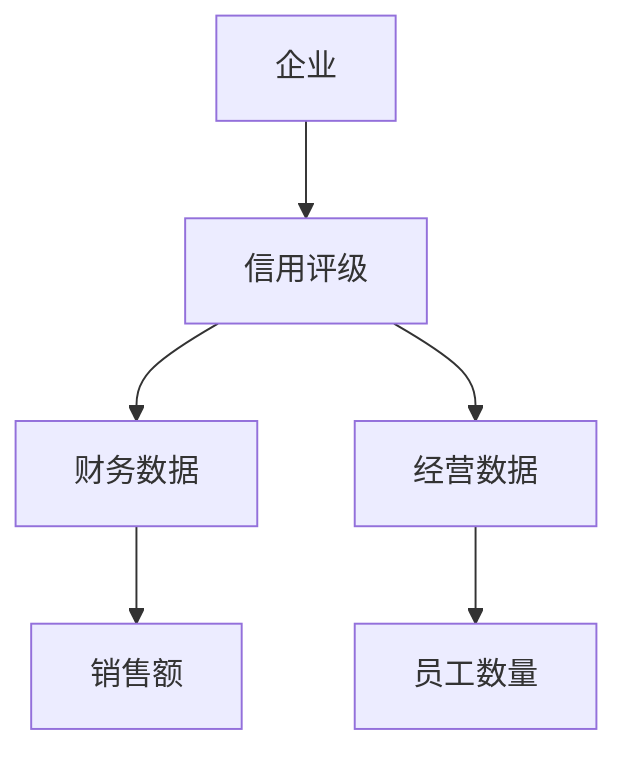
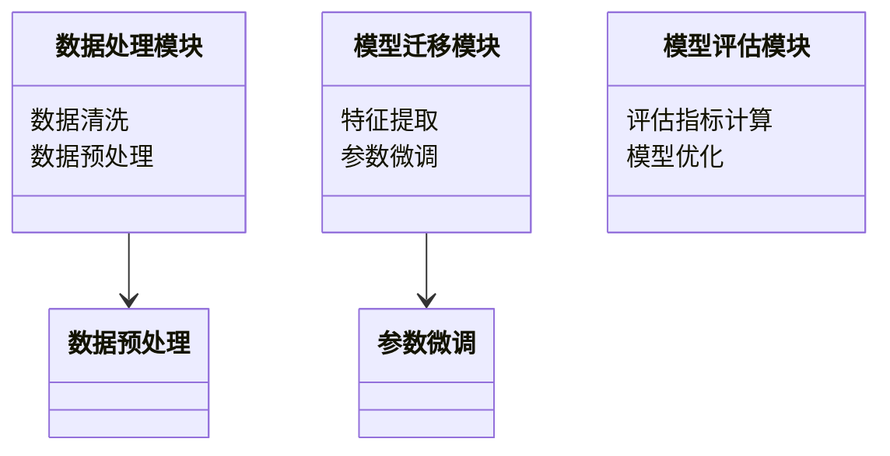
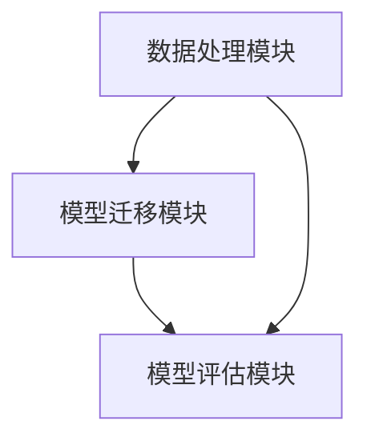

                 


# AI辅助的企业信用评级模型迁移

## 关键词：
- AI辅助
- 企业信用评级
- 模型迁移
- 机器学习
- 迁移学习

## 摘要：
本文探讨了AI辅助下的企业信用评级模型迁移问题。通过分析传统评级方法的局限性，提出利用迁移学习技术优化模型的可行性。文章从核心概念、算法原理、系统架构到项目实战，详细阐述了模型迁移的实现路径，并结合实际案例进行分析，最后总结了最佳实践和注意事项。

---

## 第一部分: 企业信用评级模型迁移概述

### 第1章: 问题背景与核心概念

#### 1.1 问题背景
##### 1.1.1 企业信用评级的重要性
企业信用评级是评估企业信用风险的重要手段，直接影响企业的融资能力、银行贷款决策和市场信任度。传统的评级方法依赖于财务指标和历史数据，但存在主观性强、样本不足和数据稀疏等问题。

##### 1.1.2 传统信用评级的局限性
- 数据样本不足：许多中小企业缺乏足够的历史数据。
- 特征维度不足：传统方法依赖财务数据，忽视非结构化数据。
- 模型泛化能力差：传统模型难以应对跨行业或跨地区的数据。

##### 1.1.3 AI辅助评级的潜力与优势
- 数据处理能力：AI能够处理大量非结构化数据。
- 模型泛化能力：迁移学习能够提升模型在不同场景下的适用性。
- 高效性：AI辅助评级可以快速生成结果，提高效率。

#### 1.2 核心概念与问题描述
##### 1.2.1 信用评级模型的基本原理
信用评级模型通过对企业财务、经营和市场数据进行分析，预测企业的信用风险等级。常用模型包括Logistic回归、决策树和随机森林等。

##### 1.2.2 模型迁移的定义与目标
模型迁移是指将一个领域中的模型迁移到另一个领域，同时保持或提升模型性能。在信用评级中，目标是利用已有的模型在新领域（如新行业或地区）中进行评级。

##### 1.2.3 企业信用评级中的迁移场景
- 行业间迁移：将某一行业的模型迁移到另一行业。
- 地区间迁移：将某一地区的模型迁移到另一地区。
- 数据稀疏场景：在数据不足的情况下，利用迁移学习弥补数据缺失。

#### 1.3 问题解决与边界条件
##### 1.3.1 模型迁移的核心问题
- 如何保持模型在目标领域的准确性。
- 如何处理源领域和目标领域的特征差异。
- 如何避免过拟合源领域数据。

##### 1.3.2 边界与外延分析
- 模型迁移的边界：仅限于企业信用评级领域。
- 外延：可以扩展到其他信用评估场景，如个人信用评估。

##### 1.3.3 核心要素与组成结构
- 数据：源领域和目标领域的数据。
- 模型：可迁移的信用评级模型。
- 算法：迁移学习算法。

---

## 第二部分: 核心概念与联系

### 第2章: 核心概念与联系

#### 2.1 模型迁移的基本原理
##### 2.1.1 迁移学习的定义与特点
迁移学习是一种机器学习技术，通过将知识从一个任务迁移到另一个任务，减少对新任务数据的依赖。其特点包括：可扩展性、鲁棒性和高效性。

##### 2.1.2 企业信用评级中的迁移策略
- 特征对齐：对源领域和目标领域的特征进行对齐。
- 域适应：通过对抗训练或其他方法，减少域的差异。

##### 2.1.3 模型迁移的关键因素
- 特征提取能力：模型能否有效提取关键特征。
- 过渡函数：如何将源领域特征映射到目标领域。
- 模型调整：如何在目标领域微调模型参数。

#### 2.2 核心概念的属性特征对比
##### 2.2.1 模型迁移的特征对比表

| 特征 | 源领域 | 目标领域 |
|------|--------|----------|
| 数据量 | 大      | 小        |
| 数据分布 | 高维   | 低维      |
| 标签可用性 | 完全   | 部分       |

##### 2.2.2 不同迁移策略的优劣势分析
- 特征提取：优势是适用于小样本数据，劣势是可能丢失部分信息。
- 参数微调：优势是保持模型性能，劣势是需要大量计算资源。

##### 2.2.3 核心概念的ER实体关系图


---

## 第三部分: 算法原理与实现

### 第3章: 算法原理与实现

#### 3.1 迁移学习算法的原理
##### 3.1.1 特征提取与参数微调
- 特征提取：使用预训练模型提取特征。
- 参数微调：在目标领域上微调模型参数。

##### 3.1.2 域适应与对抗训练
- 域适应：通过对抗训练，让模型适应目标领域。

##### 3.1.3 小样本数据的处理方法
- 数据增强：通过生成数据扩展样本量。
- 迁移学习：利用外部数据增强模型。

#### 3.2 算法实现的步骤
##### 3.2.1 数据预处理流程
1. 数据清洗：去除缺失值和异常值。
2. 数据标注：对数据进行标签标注。
3. 数据分割：将数据分为源领域和目标领域。

##### 3.2.2 模型迁移的实现步骤
1. 加载预训练模型。
2. 提取特征或微调参数。
3. 在目标领域上进行训练。
4. 评估模型性能。

##### 3.2.3 模型评估与优化方法
- 准确率、召回率和F1分数：评估模型性能。
- 调参：通过网格搜索优化模型参数。

---

## 第四部分: 数学模型与公式

### 第4章: 数学模型与公式

#### 4.1 基本公式推导
##### 4.1.1 模型迁移的数学基础
- 源领域和目标领域的联合分布：\( P_{\text{source}}(x,y) \) 和 \( P_{\text{target}}(x,y) \)。
- 迁移学习的目标：最小化目标领域的误差。

##### 4.1.2 迁移学习的核心公式
$$ L_{\text{transfer}} = \lambda L_{\text{source}} + (1-\lambda) L_{\text{target}} $$
其中，\( \lambda \) 是权衡系数。

##### 4.1.3 优化目标的数学表达
$$ \min_{\theta} \sum_{i=1}^{n} \mathbb{I}(y_i \neq f_\theta(x_i)) $$

#### 4.2 示例分析与公式应用
##### 4.2.1 公式在实际案例中的应用
假设目标领域有少量数据，利用源领域的数据进行迁移学习，公式中的 \( \lambda \) 可以调整源领域和目标领域的权重。

##### 4.2.2 迁移学习效果的数学评估
通过对比源领域和目标领域的准确率，评估迁移学习的效果。

##### 4.2.3 模型参数的调整与优化
使用网格搜索优化 \( \lambda \) 和学习率。

---

## 第五部分: 系统分析与架构设计

### 第5章: 系统分析与架构设计

#### 5.1 系统功能设计
##### 5.1.1 问题场景介绍
系统需要处理企业信用评级数据，实现模型迁移。

##### 5.1.2 系统功能模块划分
- 数据处理模块：负责数据清洗和预处理。
- 模型迁移模块：负责特征提取和参数微调。
- 模型评估模块：负责评估模型性能。

##### 5.1.3 领域模型的Mermaid类图


#### 5.2 系统架构设计
##### 5.2.1 系统架构的Mermaid架构图


##### 5.2.2 关键模块的交互设计
- 数据处理模块向模型迁移模块提供预处理后的数据。
- 模型迁移模块向模型评估模块提供训练后的模型。

##### 5.2.3 系统接口的设计
- 数据接口：提供数据输入和输出接口。
- 模型接口：提供模型加载和训练接口。

---

## 第六部分: 项目实战与案例分析

### 第6章: 项目实战与案例分析

#### 6.1 环境安装与配置
##### 6.1.1 开发环境的选择
推荐使用Python和深度学习框架（如TensorFlow或Keras）。

##### 6.1.2 依赖库的安装与配置
安装必要的库：`pip install tensorflow pandas scikit-learn`。

##### 6.1.3 数据集的获取与预处理
使用公开数据集或企业内部数据，进行数据清洗和标注。

#### 6.2 核心代码实现
##### 6.2.1 模型迁移的Python代码
```python
import tensorflow as tf
from tensorflow.keras import layers

# 加载预训练模型
base_model = tf.keras.applications.VGG16(weights='imagenet', include_top=False)

# 微调模型
model = tf.keras.Sequential([
    base_model,
    layers.Flatten(),
    layers.Dense(256, activation='relu'),
    layers.Dense(num_classes, activation='sigmoid')
])

# 编译模型
model.compile(optimizer='adam', loss='binary_crossentropy', metrics=['accuracy'])
```

##### 6.2.2 数据处理与特征提取
```python
# 数据预处理
def preprocess_data(data):
    data = data.dropna()
    data = pd.get_dummies(data)
    return data

processed_data = preprocess_data(raw_data)
```

##### 6.2.3 模型评估与优化
```python
# 评估指标计算
from sklearn.metrics import accuracy_score, recall_score, f1_score

y_pred = model.predict(X_test)
print(f"Accuracy: {accuracy_score(y_test, y_pred)}")
print(f"Recall: {recall_score(y_test, y_pred)}")
print(f"F1 Score: {f1_score(y_test, y_pred)}")
```

#### 6.3 项目小结
通过实战可以发现，迁移学习能够有效提升模型在小样本场景下的性能。但在实际应用中，需要根据具体场景调整参数和模型结构。

---

## 第七部分: 最佳实践与总结

### 第7章: 最佳实践与总结

#### 7.1 最佳实践 tips
- 数据预处理是关键，确保数据质量。
- 选择合适的迁移学习策略，如特征提取或参数微调。
- 通过网格搜索优化模型参数。

#### 7.2 小结
本文详细探讨了AI辅助的企业信用评级模型迁移问题，从理论到实践，给出了完整的解决方案。

#### 7.3 注意事项
- 模型迁移需要考虑数据分布差异。
- 避免过拟合源领域数据。
- 确保数据隐私和合规性。

#### 7.4 拓展阅读
- 迁移学习的经典论文：《A Survey on Transfer Learning》。
- 深度学习框架的最新进展：《Deep Learning》。

---

通过以上章节的详细分析，可以系统地理解和实现AI辅助的企业信用评级模型迁移。

