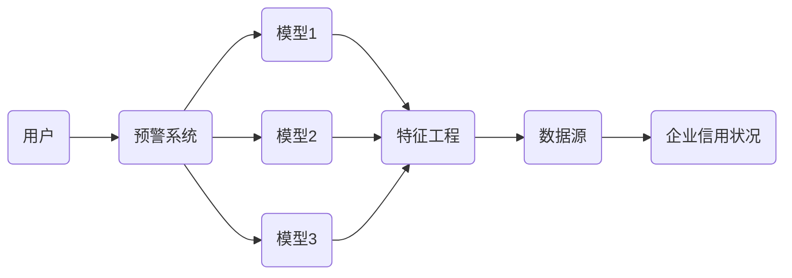

                 


# AI辅助的企业信用评级预警

> 关键词：企业信用评级、AI技术、信用预警、机器学习、风险管理

> 摘要：随着企业信用风险的日益复杂化，传统的信用评级方法逐渐显现出局限性。本文深入探讨了人工智能技术在企业信用评级预警中的应用，结合逻辑回归、随机森林、神经网络等算法，详细分析了AI辅助信用评级的核心原理、系统架构和实际应用场景。通过对算法原理的深入剖析和系统设计的优化，提出了基于AI的企业信用评级预警解决方案，并通过实际案例验证了该方案的有效性。本文旨在为企业风险管理提供新的思路，助力企业更好地应对信用风险。

---

# 第一部分: AI辅助的企业信用评级预警背景与基础

## 第1章: 企业信用评级预警概述

### 1.1 企业信用评级的定义与意义

#### 1.1.1 企业信用评级的基本概念
企业信用评级是指根据企业的财务状况、经营能力、偿债能力等多维度指标，对其信用状况进行综合评估的过程。信用评级的结果通常以等级形式呈现，例如AAA、AA、A、BBB、BB、B、CCC、CC、C、D等，其中AAA代表最高信用等级，D代表最低信用等级或破产。

信用评级的核心目的是帮助债权人评估债务人（企业）的信用风险，从而决定是否放贷、放贷额度以及利率水平。信用评级的结果直接影响企业的融资成本和市场信任度。

#### 1.1.2 信用评级在企业经营中的作用
- **融资决策支持**：信用评级结果是企业获取贷款、发行债券等融资活动的重要参考依据。
- **风险管理工具**：帮助企业识别和管理自身及合作伙伴的信用风险。
- **市场信任度提升**：较高的信用评级能够增强企业在市场中的信誉和竞争力。

#### 1.1.3 信用评级对金融市场的价值
- **优化资源配置**：通过信用评级，金融市场可以更有效地分配资金资源，降低系统性风险。
- **降低信息不对称**：信用评级帮助投资者快速了解企业的信用状况，减少信息不对称。
- **促进金融创新**：信用评级为衍生品定价、信用违约互换（CDO）等金融工具的开发提供了基础。

### 1.2 信用评级预警的必要性

#### 1.2.1 企业信用风险的来源
- **财务风险**：企业财务状况恶化，如盈利能力下降、资产负债率过高、现金流断裂等。
- **经营风险**：市场需求变化、供应链中断、管理不善等因素可能导致企业信用能力下降。
- **行业风险**：行业整体景气度下降或政策变化对企业信用状况的影响。
- **外部风险**：宏观经济波动、政策调整、自然灾害等不可抗力因素。

#### 1.2.2 传统信用评级的局限性
- **信息更新滞后**：传统信用评级通常每年更新一次，难以及时反映企业的最新状况。
- **主观性较强**：评级结果在很大程度上依赖于评级机构的主观判断，可能存在人为误差。
- **覆盖范围有限**：传统评级方法主要基于财务数据，难以全面捕捉企业的非财务风险因素。

#### 1.2.3 信用预警对企业风险管理的重要性
- **及时发现风险**：通过实时监控企业经营数据和外部环境变化，及时发现潜在的信用风险。
- **精准制定策略**：基于预警结果，企业可以提前制定应对措施，降低风险损失。
- **提升决策效率**：通过AI技术快速处理大量数据，提高信用评级的效率和准确性。

### 1.3 AI技术在信用评级中的应用前景

#### 1.3.1 AI技术的基本概念
人工智能（AI）是指计算机系统通过模拟人类智能完成特定任务的技术，包括机器学习、自然语言处理、计算机视觉等领域。

#### 1.3.2 AI在信用评级中的优势
- **数据处理能力**：AI能够快速处理海量数据，提取关键特征，发现传统方法难以察觉的规律。
- **模型复杂度**：AI算法（如深度学习）能够处理非线性关系，捕捉复杂的信用风险因素。
- **实时性**：AI技术可以实现信用评级的实时更新，满足企业对风险预警的实时需求。

#### 1.3.3 信用评级预警的未来发展趋势
- **智能化**：基于AI的信用评级将更加智能化，能够实时更新和调整评级结果。
- **个性化**：AI技术可以根据企业的个性化特征，定制专属的信用评级模型。
- **多维度分析**：AI能够整合财务数据、市场数据、社交数据等多种信息源，提供更全面的信用评估。

---

## 第2章: 企业信用评级预警的核心概念与联系

### 2.1 核心概念原理

#### 2.1.1 信用评级的基本原理
信用评级的核心在于对企业的偿债能力和意愿进行评估。传统的信用评级方法主要依赖财务指标（如流动比率、速动比率、资产负债率、净利润率等）和非财务指标（如行业地位、管理团队稳定性等）。

#### 2.1.2 AI辅助评级的核心机制
AI辅助信用评级通过机器学习算法，从海量数据中提取特征，构建预测模型，实现对企业的信用评分和风险预警。AI技术能够处理结构化和非结构化数据，例如财务报表、新闻媒体信息、社交网络数据等。

#### 2.1.3 数据驱动的信用评估模型
基于数据驱动的信用评估模型，AI系统能够实时更新企业的信用评分，及时反映企业的信用状况变化。

### 2.2 核心概念属性特征对比

| **特征维度**   | **传统信用评级**           | **AI辅助信用评级**           |
|----------------|----------------------------|-----------------------------|
| 数据来源       | 主要依赖财务报表数据       | 结合财务数据、文本数据、网络数据等多源数据 |
| 模型复杂度     | 线性模型为主               | 支持非线性模型，如随机森林、神经网络等 |
| 更新频率       | 定期更新（如按年）         | 实时或准实时更新             |
| 预测精度       | 受主观因素影响较大         | 精度更高，支持复杂特征的挖掘   |
| 处理能力       | 数据量有限，处理速度较慢   | 支持海量数据，处理速度快     |

### 2.3 ER实体关系图架构


---

# 第二部分: AI辅助信用评级预警的算法原理

## 第3章: 常用算法原理与实现

### 3.1 逻辑回归算法

#### 3.1.1 算法原理

逻辑回归是一种常用的分类算法，适用于二分类问题。在信用评级中，可以将信用等级分为“违约”和“非违约”两类。

**数学模型**：
$$ P(y=1) = \frac{1}{1 + e^{-(\beta_0 + \beta_1x_1 + \beta_2x_2 + \dots + \beta_nx_n)}} $$

其中：
- $y$ 是目标变量（违约标记，1表示违约，0表示非违约）。
- $\beta_0$ 是截距项。
- $\beta_1, \beta_2, \dots, \beta_n$ 是特征变量的系数。
- $x_1, x_2, \dots, x_n$ 是特征变量。

**损失函数**：
$$ \text{损失函数} = -\sum_{i=1}^{m} [y_i \ln(p_i) + (1 - y_i)\ln(1 - p_i)] $$

其中：
- $p_i$ 是第i个样本的预测概率。
- $y_i$ 是第i个样本的真实标签。

#### 3.1.2 算法实现

```python
import numpy as np
from sklearn.linear_model import LogisticRegression

# 示例数据：企业特征和违约标记
X = np.array([[1, 2], [3, 4], [5, 6], [7, 8]])
y = np.array([0, 0, 1, 1])

# 训练逻辑回归模型
model = LogisticRegression()
model.fit(X, y)

# 预测概率
print(model.predict_proba(X))
```

### 3.2 随机森林算法

#### 3.2.1 算法原理

随机森林是一种基于决策树的集成学习算法，通过构建多个决策树并进行投票或平均，提高模型的准确性和稳定性。

**决策树分类流程**：
1. 根据特征重要性选择分割特征。
2. 根据分割特征和阈值划分数据集。
3. 递归分割，直到叶子节点。
4. 预测时，每个决策树进行投票。

#### 3.2.2 算法实现

```python
from sklearn.ensemble import RandomForestClassifier

# 示例数据：企业特征和违约标记
X = np.array([[1, 2], [3, 4], [5, 6], [7, 8]])
y = np.array([0, 0, 1, 1])

# 训练随机森林模型
model = RandomForestClassifier(n_estimators=10, max_depth=2, random_state=42)
model.fit(X, y)

# 预测结果
print(model.predict(X))
```

### 3.3 神经网络算法

#### 3.3.1 算法原理

神经网络是一种受生物神经元启发的计算模型，通过多层感知机（MLP）实现非线性分类。

**神经网络结构**：
- 输入层：接收企业特征数据。
- 隐藏层：通过非线性激活函数（如ReLU、sigmoid）进行特征变换。
- 输出层：输出信用评分。

**损失函数**：
$$ \text{损失函数} = \frac{1}{m} \sum_{i=1}^{m} (y_i - \hat{y}_i)^2 $$

其中：
- $y_i$ 是真实标签。
- $\hat{y}_i$ 是预测概率。

#### 3.3.2 算法实现

```python
import tensorflow as tf

# 示例数据：企业特征和违约标记
X = tf.constant([[1, 2], [3, 4], [5, 6], [7, 8]])
y = tf.constant([0, 0, 1, 1])

# 定义神经网络模型
model = tf.keras.Sequential([
    tf.keras.layers.Dense(4, activation='relu', input_shape=(2,)),
    tf.keras.layers.Dense(1, activation='sigmoid')
])

# 编译模型
model.compile(optimizer='adam', loss='binary_crossentropy', metrics=['accuracy'])

# 训练模型
model.fit(X, y, epochs=10, batch_size=4)
```

---

## 第4章: 算法对比与优化

### 4.1 算法对比分析

| **算法名称**   | **优势**                           | **劣势**                           |
|----------------|------------------------------------|------------------------------------|
| 逻辑回归       | 实现简单，解释性强               | 非线性关系处理能力有限             |
| 随机森林       | 抗过拟合能力强，特征重要性分析好   | 对特征工程依赖较高                 |
| 神经网络       | 非线性处理能力强，模型复杂度高     | 实现复杂，解释性较差               |

### 4.2 算法优化策略

#### 4.2.1 特征选择
- **特征筛选**：使用相关性分析或Lasso回归去除冗余特征。
- **特征组合**：通过主成分分析（PCA）或因子分析（FA）生成新的特征。

#### 4.2.2 超参数优化
- **网格搜索**：通过网格搜索（Grid Search）或随机搜索（Random Search）优化模型参数。
- **自动调优**：使用自动化工具（如Optuna、Hyperopt）进行超参数调优。

#### 4.2.3 模型融合
- **投票融合**：将多个模型的预测结果进行投票，提高整体准确率。
- **加权融合**：根据各个模型的性能，赋予不同权重后进行预测结果的加权。

---

## 第5章: 系统分析与架构设计方案

### 5.1 问题场景介绍

企业信用评级预警系统需要实时监控企业的信用状况，及时发现潜在风险。系统需要处理以下问题：
- **数据来源多样化**：包括财务数据、行业数据、新闻数据等。
- **数据实时性要求高**：需要实时更新企业信用评分。
- **模型可解释性要求高**：需要对模型的预测结果进行解释和分析。

### 5.2 系统功能设计

#### 5.2.1 领域模型设计


#### 5.2.2 系统架构设计



---

## 第6章: 项目实战

### 6.1 环境安装与配置

```bash
pip install numpy pandas scikit-learn tensorflow
```

### 6.2 核心实现代码

```python
import numpy as np
from sklearn.ensemble import RandomForestClassifier
from sklearn.metrics import accuracy_score

# 示例数据：企业特征和违约标记
X = np.array([[1, 2], [3, 4], [5, 6], [7, 8]])
y = np.array([0, 0, 1, 1])

# 训练随机森林模型
model = RandomForestClassifier(n_estimators=10, max_depth=2, random_state=42)
model.fit(X, y)

# 预测结果
y_pred = model.predict(X)

# 计算准确率
print("Accuracy:", accuracy_score(y, y_pred))
```

---

## 第7章: 总结与展望

### 7.1 总结

通过本文的深入分析，我们可以看到AI技术在企业信用评级预警中的巨大潜力。基于机器学习的信用评级方法不仅能够提高评估的准确性和实时性，还能够通过数据挖掘发现传统方法难以捕捉的潜在风险因素。

### 7.2 未来展望

随着AI技术的不断发展，企业信用评级预警系统将更加智能化和个性化。未来的研究方向可能包括：
- **强化学习**：通过强化学习优化信用评级策略。
- **多模态数据融合**：结合文本、图像等多种数据源进行信用评估。
- **动态模型**：开发能够实时更新的动态模型，适应市场环境的变化。

---

通过本文的分析和实践，我们相信AI技术将在企业信用评级预警领域发挥越来越重要的作用，为企业风险管理提供更强大的工具和方法。

