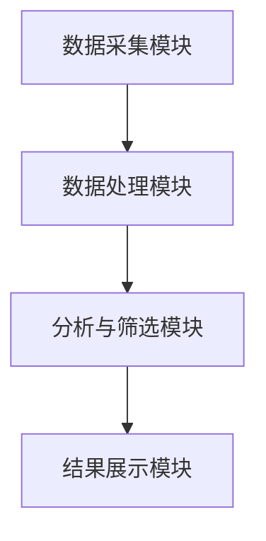

                 

# AI辅助的企业并购target筛选

## 关键词：
企业并购、人工智能、目标筛选、数据挖掘、机器学习

## 摘要：
企业并购是商业领域的重要战略决策，传统的目标筛选过程复杂且耗时。本文通过介绍AI技术，如机器学习和NLP，展示了如何高效筛选并购目标。从数据收集到算法模型，再到系统设计，详细讲解了AI在并购中的应用，最后通过项目实战展示了实际应用，帮助读者掌握AI辅助并购的全过程。

---

# 第一部分：企业并购与AI辅助筛选概述

## 第1章：企业并购的基本概念

### 1.1 企业并购的定义与类型
#### 1.1.1 企业并购的定义
企业并购（Mergers and Acquisitions, M&A）指两家或多家企业合并或收购，以实现战略目标。并购可以是横向、纵向或混合型的。

#### 1.1.2 并购的类型
- **横向并购**：同行业竞争企业合并，扩大市场份额。
- **纵向并购**：上下游企业合并，整合产业链。
- **混合并购**：无直接关联的企业合并，寻求多元化发展。

#### 1.1.3 并购的目标选择与战略意义
目标选择直接影响并购效果，通常考虑财务表现、市场地位、技术优势等因素。AI通过分析大量数据，帮助筛选优质目标，提升决策效率。

### 1.2 AI辅助并购的必要性
AI技术能够处理海量数据，发现潜在模式，解决信息不对称和传统方法的局限性，提高筛选准确性和效率。

---

## 第2章：AI技术在企业并购中的应用背景

### 2.1 AI技术的基本概念
#### 2.1.1 机器学习简介
机器学习是AI的核心，通过训练模型从数据中学习，用于预测和分类。

#### 2.1.2 自然语言处理（NLP）
NLP帮助分析非结构化文本，如公司报告和新闻，提取有用信息。

#### 2.1.3 数据挖掘与分析
数据挖掘技术从大数据中提取模式和洞见，支持决策。

### 2.2 AI在企业并购中的应用场景
#### 2.2.1 数据收集与处理
AI从公开市场、内部和第三方数据源收集数据，清洗和整合，确保数据质量。

#### 2.2.2 财务数据分析
AI分析财务指标，如收入、利润和债务，评估公司财务健康。

#### 2.2.3 市场风险评估
AI评估目标公司所处行业的风险，预测潜在问题。

---

# 第三部分：AI辅助企业并购的技术实现

## 第3章：数据收集与预处理

### 3.1 数据来源
#### 3.1.1 公开市场数据
包括股票价格、财务报表等，通过API或爬虫获取。

#### 3.1.2 内部数据
企业内部数据，如销售数据和客户信息，需脱敏处理。

#### 3.1.3 第三方数据源
如行业报告和新闻，需清洗和整合。

### 3.2 数据清洗与整合
#### 3.2.1 数据清洗方法
删除重复数据，处理缺失值，标准化格式。

#### 3.2.2 数据格式统一
将不同来源的数据统一格式，便于分析。

#### 3.2.3 数据去重与补全
去除重复数据，填充缺失值，确保数据完整性。

---

## 第4章：目标筛选的算法模型

### 4.1 聚类分析
#### 4.1.1 K-means算法
将公司分为几类，分析潜在并购目标。

#### 4.1.2 层次聚类
逐步合并相似公司，形成并购目标梯队。

#### 4.1.3 算法实现与案例分析
使用Python代码实现K-means，分析示例数据。

### 4.2 分类模型
#### 4.2.1 支持向量机（SVM）
用于分类目标公司，判断是否符合并购标准。

#### 4.2.2 随机森林
通过特征重要性识别关键指标，评估公司质量。

#### 4.2.3 模型训练与评估
使用训练数据训练模型，测试数据验证准确率。

---

## 第5章：系统架构设计

### 5.1 系统功能模块
#### 5.1.1 数据采集模块
负责收集和清洗数据。

#### 5.1.2 数据处理模块
处理数据，提取特征。

#### 5.1.3 分析与筛选模块
应用算法筛选目标。

### 5.2 系统架构图
使用Mermaid绘制系统架构图，展示各模块交互。

---

## 第6章：项目实战

### 6.1 环境配置与安装
#### 6.1.1 安装Python与相关库
如Pandas、Scikit-learn、NLTK。

#### 6.1.2 数据库配置
选择合适的数据库存储和处理数据。

### 6.2 核心代码实现
#### 6.2.1 数据预处理代码
读取数据，清洗和整合。

#### 6.2.2 模型训练代码
训练聚类和分类模型。

#### 6.2.3 结果可视化代码
展示聚类结果和分类准确率。

---

## 第7章：系统优化与扩展

### 7.1 模型优化
#### 7.1.1 调参技巧
使用网格搜索优化模型参数。

#### 7.1.2 模型评估指标
准确率、召回率、F1分数等。

### 7.2 系统扩展
#### 7.2.1 处理更大规模数据
优化数据处理流程，提升系统性能。

---

## 第8章：最佳实践与小结

### 8.1 最佳实践
- 数据清洗和特征工程是关键。
- 结合业务背景解释模型结果。
- 持续优化模型和系统。

### 8.2 小结
AI辅助企业并购目标筛选显著提升了效率和准确性，未来将结合更多技术，如深度学习，进一步优化。

---

### 数学公式示例

#### 聚类分析的距离计算
$$
距离 = \sqrt{(x_2 - x_1)^2 + (y_2 - y_1)^2}
$$

#### 支持向量机的目标函数
$$
\text{minimize} \quad \frac{1}{2}||\mathbf{w}||^2 + C \sum_{i=1}^{n} \xi_i
$$

---

### 系统架构图

---

### 结语

通过系统化的分析和实际案例，本文展示了AI如何辅助企业并购目标筛选。从数据处理到算法模型，再到系统架构，AI技术为这一过程提供了强大的支持，帮助企业做出更明智的决策。

