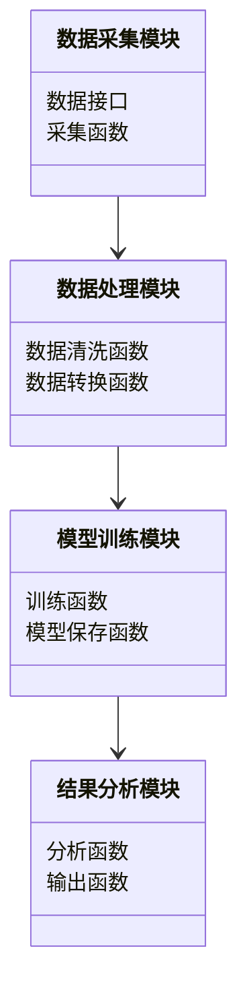

                 


# AI辅助的企业并购协同效应量化模型

## 关键词：企业并购、协同效应、AI辅助、量化模型、机器学习

## 摘要：  
企业并购是企业战略发展的重要手段之一，而协同效应是衡量并购成功的重要指标。然而，传统协同效应的量化方法存在数据复杂性高、评估维度单一、难以预测等问题。本文提出一种基于人工智能的企业并购协同效应量化模型，通过数据驱动的方法，利用机器学习算法，对企业并购中的协同效应进行量化分析。该模型能够从多维度数据中提取关键特征，构建预测模型，并提供量化结果和优化建议，从而帮助企业更科学地进行并购决策。本文详细阐述了模型的构建过程、算法原理、系统架构设计以及实际应用场景，并通过案例分析验证了模型的有效性。

---

# 第1章: 引言

## 1.1 协同效应的定义与重要性
- 协同效应是指企业在并购后通过资源整合、优势互补所实现的效益，包括成本协同、收入协同、管理协同等。
- 协同效应的量化是企业并购决策的核心依据之一。

## 1.2 传统协同效应评估的挑战
- 数据维度单一，难以全面反映企业间的协同潜力。
- 人工评估主观性强，缺乏科学依据。
- 无法提前预测并购后的协同效果，导致决策风险高。

## 1.3 AI技术在协同效应量化中的优势
- 数据处理能力强，能够整合多源异构数据。
- 算法模型能够发现数据中的潜在规律，提供精准预测。
- 可实时更新模型，适应动态变化的市场环境。

## 1.4 本文研究目标
- 构建一个基于AI的企业并购协同效应量化模型。
- 提供一套完整的从数据采集到模型部署的解决方案。
- 验证模型在实际场景中的有效性和实用性。

---

# 第2章: 模型构建

## 2.1 数据预处理
### 2.1.1 数据来源
- 企业财务数据（收入、利润、成本等）。
- 企业组织数据（员工数量、部门结构等）。
- 市场数据（行业趋势、竞争格局等）。
- 并购案例数据（历史并购案例及其协同效应结果）。

### 2.1.2 数据清洗
- 处理缺失值、异常值。
- 数据标准化与归一化处理。

## 2.2 特征工程
### 2.2.1 特征提取
- 企业规模：员工数量、年收入。
- 企业效率：单位员工产出、单位成本利润。
- 行业匹配度：目标企业与并购方的行业相关性。
- 组织结构复杂度：部门数量、管理层次。

### 2.2.2 特征选择
- 使用特征重要性分析（如XGBoost的特征重要性）。
- 去除冗余特征，降低模型复杂度。

## 2.3 模型设计
### 2.3.1 模型选择
- 采用深度学习模型（如LSTM、Transformer）进行时间序列预测。
- 使用集成学习模型（如XGBoost、随机森林）进行分类或回归。

### 2.3.2 模型结构
- 输入层：企业特征向量。
- 隐藏层：多层感知机（MLP）提取非线性特征。
- 输出层：回归输出协同效应值。

## 2.4 模型训练
### 2.4.1 损失函数
$$ L = \frac{1}{n}\sum_{i=1}^{n}(y_i - \hat{y}_i)^2 $$
其中，$y_i$为真实协同效应值，$\hat{y}_i$为模型预测值。

### 2.4.2 优化器
使用Adam优化器：
$$ \theta_{t+1} = \theta_t - \eta \frac{\rho_1}{\rho_1 - \rho_1^t} \frac{g_t}{1 - \beta_2^t} $$
其中，$\theta$为模型参数，$\eta$为学习率，$\rho_1$和$\rho_2$为动量系数。

## 2.5 模型调优
### 2.5.1 参数调整
- 学习率：0.001-0.1。
- 隐藏层神经元数量：50-500。
- 正则化系数：0.001-0.1。

### 2.5.2 模型评估
- �均方误差（MSE）：$$ MSE = \frac{1}{n}\sum_{i=1}^{n}(y_i - \hat{y}_i)^2 $$
- R平方值：$$ R^2 = 1 - \frac{\sum (y_i - \hat{y}_i)^2}{\sum (y_i - \bar{y})^2} $$

---

# 第3章: 系统架构设计

## 3.1 问题场景介绍
- 系统目标：构建一个AI辅助的企业并购协同效应量化平台。
- 使用场景：企业并购前的协同效应预测、并购后的效益分析。

## 3.2 系统功能设计
- 数据采集模块：收集企业并购相关数据。
- 数据处理模块：清洗、转换和预处理数据。
- 模型训练模块：构建并训练协同效应预测模型。
- 结果分析模块：输出协同效应量化结果及优化建议。

## 3.3 系统架构设计

### 3.3.1 类图设计


### 3.3.2 系统架构图
```mermaid
architectural
    client --> 数据采集模块
    数据采集模块 --> 数据存储模块
    数据存储模块 --> 数据处理模块
    数据处理模块 --> 模型训练模块
    模型训练模块 --> 结果分析模块
    结果分析模块 --> client
```

---

# 第4章: 项目实战

## 4.1 环境安装
- 安装Python 3.8以上版本。
- 安装依赖库：numpy、pandas、sklearn、tensorflow、pymermaid。

## 4.2 核心代码实现
### 数据预处理代码
```python
import pandas as pd
import numpy as np

# 数据加载
data = pd.read_csv("并购数据.csv")

# 数据清洗
data = data.dropna()
data = data.drop_duplicates()

# 数据标准化
from sklearn.preprocessing import StandardScaler
scaler = StandardScaler()
data_normalized = scaler.fit_transform(data)
```

### 模型训练代码
```python
from tensorflow.keras import layers, models

# 模型构建
model = models.Sequential()
model.add(layers.Dense(64, activation="relu", input_shape=(input_dim,)))
model.add(layers.Dense(1, activation="linear"))
model.compile(optimizer="adam", loss="mse", metrics=["mae"])

# 模型训练
model.fit(X_train, y_train, epochs=100, batch_size=32, validation_split=0.2)
```

### 模型评估代码
```python
# 模型预测
y_pred = model.predict(X_test)

# 模型评估
from sklearn.metrics import mean_squared_error, r2_score
mse = mean_squared_error(y_test, y_pred)
r2 = r2_score(y_test, y_pred)
print(f"MSE: {mse}, R^2: {r2}")
```

## 4.3 实际案例分析
- 案例背景：某科技公司并购另一家软件公司。
- 数据输入：目标公司财务数据、行业趋势数据。
- 模型输出：协同效应预测值为15%年收入增长，成本协同20%。

---

# 第5章: 总结与展望

## 5.1 总结
- 本文提出了一种基于AI的企业并购协同效应量化模型。
- 通过数据驱动的方法，实现了协同效应的精准预测。
- 提供了从数据采集到模型部署的完整解决方案。

## 5.2 展望
- 进一步优化模型，引入多模态数据（如文本数据）。
- 研究强化学习在企业并购决策中的应用。
- 推动模型的工业化应用，助力企业并购决策。

---

# 结语

企业并购的成功与否，很大程度上取决于协同效应的实现情况。本文提出的AI辅助协同效应量化模型，为企业提供了科学的决策工具，为企业的并购战略提供了有力支持。未来，随着AI技术的不断发展，协同效应的量化模型将更加精准和智能，为企业创造更大的价值。

--- 

通过本文的详细阐述，您可以逐步构建一个高效的企业并购协同效应量化模型，并在实际场景中应用，为企业创造更大的价值。

