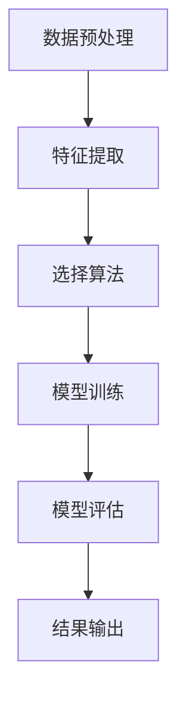

                 


# AI辅助的企业并购整合效果评估与优化

## 关键词：AI，企业并购，整合效果评估，机器学习，企业整合优化，并购整合，AI辅助整合

## 摘要：  
随着企业并购活动的日益频繁，如何利用人工智能技术优化并购整合效果成为企业界和学术界关注的焦点。本文从企业并购整合的背景与挑战出发，详细探讨了AI在企业并购整合中的核心应用领域，包括数据分析、风险评估和整合优化等。通过机器学习算法的原理和实现，结合实际案例分析，本文为读者提供了从理论到实践的系统化指导，帮助企业更好地利用AI技术提升并购整合的效果和效率。

---

## 第一部分: 企业并购整合的背景与挑战

### 第1章: 企业并购整合概述

#### 1.1 企业并购的定义与特点
- **1.1.1 企业并购的基本概念**
  - 企业并购（Mergers and Acquisitions, M&A）是指两个或多个企业之间的合并或收购行为。
  - 并购可以分为横向并购、纵向并购和混合并购，每种类型有不同的特点和目标。
- **1.1.2 并购的类型与特点**
  - 横向并购：同一行业内的企业合并，旨在扩大市场份额。
  - 纵向并购：产业链上下游企业的合并，以优化生产流程。
  - 混合并购：跨行业或跨领域的并购，寻求多元化发展。
- **1.1.3 并购整合的核心目标**
  - 提高效率：通过整合资源降低成本。
  - 拓展市场：通过并购扩大市场份额。
  - 实现协同效应：通过业务协同提升整体竞争力。

#### 1.2 企业并购整合的背景与趋势
- **1.2.1 全球化背景下的企业并购**
  - 全球化促进了跨国并购，企业通过并购快速进入新市场。
  - 数字化转型使得企业并购更加注重技术创新和数据驱动。
- **1.2.2 数字化转型对企业并购的影响**
  - 数据成为企业核心资产，数字化能力是并购的重要考量因素。
  - AI技术的应用使得并购后的整合更加精准和高效。
- **1.2.3 AI技术在企业并购中的应用前景**
  - AI可以帮助企业快速分析并购目标的价值和风险。
  - AI可以优化并购后的整合流程，提高协同效应。

#### 1.3 企业并购整合的挑战
- **1.3.1 文化冲突与组织整合的难点**
  - 不同企业有不同的文化背景和管理风格，整合过程中容易出现冲突。
  - 组织结构的调整需要时间和资源，可能导致效率下降。
- **1.3.2 业务协同与资源优化的复杂性**
  - 并购后业务协同需要跨部门协作，涉及复杂的流程和资源分配。
  - 资源优化需要精确的数据分析和决策支持。
- **1.3.3 并购后的绩效评估与优化**
  - 并购绩效的评估需要多维度的指标体系，包括财务、市场和运营等方面。
  - 绩效优化需要持续的监控和调整，确保并购目标的实现。

---

### 第2章: AI辅助企业并购整合的核心概念

#### 2.1 AI在企业并购中的应用领域
- **2.1.1 数据分析与预测**
  - 利用AI技术分析并购目标的历史数据，预测其未来表现。
  - 通过自然语言处理技术分析并购相关的文本数据，如财务报告和新闻。
- **2.1.2 风险评估与预警**
  - 识别并购中的潜在风险，如市场风险和财务风险。
  - 通过机器学习模型预测并购后的风险概率。
- **2.1.3 效益预测与优化**
  - 预测并购后的协同效应和财务表现。
  - 优化整合方案，提高并购的整体效益。

#### 2.2 AI辅助整合的关键技术
- **2.2.1 机器学习在并购整合中的应用**
  - 监督学习：用于分类和回归任务，如并购成功的概率预测。
  - 非监督学习：用于聚类分析，发现潜在的市场机会或风险。
  - 深度学习：用于复杂模式识别，如图像识别和自然语言处理。
- **2.2.2 自然语言处理在并购文档分析中的应用**
  - 文本挖掘：从并购相关的文档中提取关键信息。
  - 情感分析：分析并购相关文本的情感倾向，辅助决策。
- **2.2.3 数据挖掘在并购数据中的应用**
  - 数据清洗：处理并购数据中的噪声，确保数据质量。
  - 数据建模：构建预测模型，评估并购的潜在价值。

#### 2.3 AI辅助整合的流程与阶段
- **2.3.1 并购前的评估与筛选**
  - 数据收集：收集并购目标的相关数据，如财务数据和市场数据。
  - 数据分析：利用AI技术评估并购目标的价值和风险。
  - 筛选目标：根据分析结果筛选出合适的并购目标。
- **2.3.2 并购中的尽职调查与风险分析**
  - 尽职调查：利用AI技术辅助进行财务和法律尽职调查。
  - 风险分析：识别并购中的潜在风险，并制定应对策略。
- **2.3.3 并购后的整合与优化**
  - 整合计划：制定并购后的整合方案，优化组织结构和业务流程。
  - 协同效应评估：利用AI技术评估协同效应的实现情况。
  - 持续优化：根据评估结果持续优化整合方案。

---

## 第二部分: 算法原理

### 第3章: 企业并购整合的数学模型与算法原理

#### 3.1 并购整合的数学模型
- **3.1.1 并购价值评估模型**
  - 股权价值评估：通过DCF模型评估目标企业的股权价值。
  - 企业价值评估：通过EV/EBITDA倍数评估企业的整体价值。
- **3.1.2 并购协同效应模型**
  - 协同效应的度量：通过成本节约和收入增长预测协同效应。
  - 协同效应的实现路径：通过整合计划和协同效应评估模型确定协同效应的实现路径。
- **3.1.3 并购风险评估模型**
  - 风险识别：识别并购中的潜在风险，如市场风险和财务风险。
  - 风险量化：通过概率-影响矩阵量化风险的影响和概率。

#### 3.2 机器学习算法在并购整合中的应用
- **3.2.1 监督学习算法（如决策树、随机森林）**
  - 决策树：用于分类任务，如预测并购成功的概率。
  - 随机森林：用于回归任务，如预测并购后的财务表现。
- **3.2.2 非监督学习算法（如聚类分析）**
  - 聚类分析：用于发现潜在的市场机会或风险。
- **3.2.3 深度学习算法（如神经网络）**
  - 神经网络：用于复杂模式识别，如图像识别和自然语言处理。

#### 3.3 算法流程图


#### 3.4 算法实现代码示例
```python
# 示例代码：决策树算法实现
from sklearn.tree import DecisionTreeClassifi
from sklearn.metrics import accuracy_score

# 数据预处理
X_train, y_train = prepare_data()
X_test, y_test = prepare_data()

# 模型训练
model = DecisionTreeClassifi().fit(X_train, y_train)

# 模型预测
y_pred = model.predict(X_test)

# 模型评估
print("Accuracy:", accuracy_score(y_test, y_pred))
```

#### 3.5 算法的数学模型和公式
- **决策树算法**
  - 决策树是一种基于树状结构的分类方法。
  - 决策树的分裂标准：信息增益、信息增益率、基尼指数。
  - 信息增益公式：
    $$ \text{信息增益}(A) = H(D) - H(D|A) $$
    其中，$H(D)$是数据集$D$的熵，$H(D|A)$是在已知特征$A$的条件下数据集$D$的熵。
- **随机森林算法**
  - 随机森林是一种基于决策树的集成学习算法。
  - 随机森林的构建过程包括随机选择特征和样本。
  - 集成学习公式：
    $$ y = \sum_{i=1}^{n} \text{树}_i(x) $$

---

## 第三部分: 系统分析与架构设计

### 第4章: 系统分析与架构设计

#### 4.1 系统功能设计
- **领域模型设计**
  - 实体：企业、并购目标、整合方案、风险评估。
  - 关系：企业-并购目标：并购关系；并购目标-整合方案：整合策略；整合方案-风险评估：风险分析。
```mermaid
classDiagram
    class 企业 {
        +名称：字符串
        +行业：字符串
        +财务数据：数据结构
    }
    class 并购目标 {
        +名称：字符串
        +行业：字符串
        +财务数据：数据结构
    }
    class 整合方案 {
        +目标：企业
        +策略：字符串
    }
    class 风险评估 {
        +风险：字符串
        +概率：数值
    }
    企业 --> 并购目标：并购
    整合方案 --> 并购目标：优化
    风险评估 --> 整合方案：评估
```

#### 4.2 系统架构设计
- **系统架构图**


#### 4.3 系统接口设计
- **接口描述**
  - 数据接口：用于数据采集和处理。
  - 模型接口：用于模型训练和预测。
  - 输出接口：用于结果展示和报告生成。

#### 4.4 系统交互流程
```mermaid
sequenceDiagram
    participant 用户
    participant 数据采集模块
    participant 数据处理模块
    participant 模型训练模块
    participant 结果输出模块
    用户 -> 数据采集模块：请求数据采集
    数据采集模块 -> 数据处理模块：传输数据
    数据处理模块 -> 模型训练模块：训练模型
    模型训练模块 -> 结果输出模块：输出结果
    结果输出模块 -> 用户：展示结果
```

---

## 第四部分: 项目实战

### 第5章: 项目实战

#### 5.1 环境安装
- **安装Python和必要的库**
  - Python 3.8+
  - NumPy、Pandas、Scikit-learn、TensorFlow、Mermaid等。

#### 5.2 核心实现代码
```python
# 示例代码：并购目标筛选
import pandas as pd
from sklearn.ensemble import RandomForestClassifier

# 数据加载
data = pd.read_csv('并购数据.csv')

# 数据预处理
data = data.dropna()
X = data.drop('并购成功', axis=1)
y = data['并购成功']

# 模型训练
model = RandomForestClassifier().fit(X, y)

# 模型预测
预测结果 = model.predict(X)
print(预测结果)
```

#### 5.3 代码应用解读与分析
- **代码功能**
  - 数据加载：从CSV文件中读取并购数据。
  - 数据预处理：删除缺失值，确保数据完整性。
  - 特征选择：选择目标变量和其他特征。
  - 模型训练：使用随机森林算法训练模型。
  - 模型预测：预测并购成功的概率。

#### 5.4 实际案例分析
- **案例背景**
  - 某企业计划并购一家同行业公司，希望通过AI技术优化整合方案。
- **案例分析**
  - 数据采集：收集目标企业的财务数据和市场数据。
  - 数据分析：利用随机森林算法预测并购成功的概率。
  - 整合优化：根据预测结果制定整合方案，优化组织结构和业务流程。
- **案例总结**
  - AI技术在并购整合中的应用显著提高了整合效率和效果。
  - 通过数据分析和预测，企业能够更好地识别风险和机会，制定最优的整合策略。

#### 5.5 项目小结
- **项目成果**
  - 成功实现AI辅助企业并购整合的效果评估与优化。
  - 提供了一套完整的从数据采集到模型训练的实现方案。
  - 通过实际案例验证了AI技术在并购整合中的应用价值。

---

## 第五部分: 最佳实践与拓展

### 5.1 总结与展望
- **总结**
  - AI技术在企业并购整合中的应用前景广阔，可以帮助企业提高整合效率和效果。
  - 通过数据分析和预测，企业能够更好地识别风险和机会，制定最优的整合策略。
- **展望**
  - 随着AI技术的不断发展，企业并购整合将更加智能化和数据化。
  - 未来的研究方向包括更复杂的模型和算法，以及更广泛的应用场景。

### 5.2 注意事项
- **数据质量**
  - 数据的准确性和完整性是AI技术应用的基础，数据预处理是关键步骤。
- **模型选择**
  - 根据具体场景选择合适的算法，避免盲目使用复杂模型。
- **风险管理**
  - 并购整合过程中可能存在多种风险，需要通过模型和实际操作进行有效管理。

### 5.3 拓展阅读
- **推荐书籍**
  - 《企业并购整合的策略与实践》
  - 《人工智能在金融领域的应用》
- **推荐博客**
  - [AI在企业并购中的应用](https://example.com)
  - [机器学习与企业整合](https://example.com)

---

## 结语
AI技术正在改变企业并购整合的方式，通过数据分析和机器学习算法，企业能够更高效地评估和优化整合效果。本文从理论到实践，详细介绍了AI在企业并购整合中的应用，为读者提供了从背景知识到实际操作的全面指导。希望本文能够为企业的并购整合提供有价值的参考和启示。

