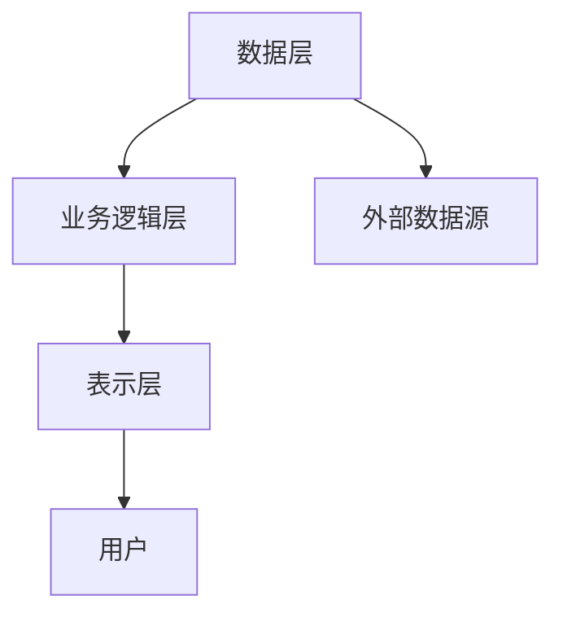

                 


# AI辅助的企业并购整合风险评估

> 关键词：企业并购，整合风险，人工智能，风险评估，系统架构

> 摘要：本文系统地探讨了人工智能在企业并购整合风险评估中的应用。首先介绍了企业并购的基本概念和整合风险的核心问题，详细阐述了AI技术在风险评估中的潜力和优势。接着，分析了并购整合风险的主要类型，并深入讲解了AI辅助风险评估的算法原理和系统架构设计。最后，通过实际案例展示了AI在企业并购整合中的应用场景和最佳实践。

---

# 第1章: 企业并购整合概述

## 1.1 企业并购的基本概念
### 1.1.1 企业并购的定义
企业并购是指一家企业通过购买另一家企业的一部分或全部股权，以实现战略目标的过程。并购可以是横向的、纵向的或混合型的，目的是增强市场地位、获取技术或扩大规模。

### 1.1.2 并购的类型与特点
- **横向并购**：同一行业内的企业合并，旨在扩大市场份额。
- **纵向并购**：上下游企业合并，优化供应链。
- **混合并购**：跨行业并购，寻求多元化发展。

### 1.1.3 企业并购的动机与目标
- **动机**：市场扩张、成本节约、技术获取。
- **目标**：增强竞争力、实现规模效应、优化资产配置。

## 1.2 企业整合的核心问题
### 1.2.1 整合的定义与范围
整合是指在并购后，将两家企业的资源、业务流程和文化等进行整合，以实现协同效应。

### 1.2.2 整合的主要挑战
- 组织文化冲突
- 业务流程不兼容
- 资源分配不均
- 人力资源整合困难

### 1.2.3 整合的关键成功因素
- 高层支持
- 明确的整合计划
- 有效沟通与培训

## 1.3 并购整合风险的内涵
### 1.3.1 风险的定义与分类
- **业务风险**：整合后业务表现不佳。
- **财务风险**：并购后的财务状况恶化。
- **文化风险**：企业文化的冲突导致整合失败。
- **战略风险**：战略目标未能实现。

### 1.3.2 风险评估的重要性
准确评估风险可以帮助企业制定应对策略，降低整合失败的可能性。

### 1.3.3 风险与企业价值的关系
高风险可能导致企业价值下降，而有效的风险管理可以提升企业价值。

## 1.4 AI在企业并购整合中的作用
### 1.4.1 AI技术的基本概念
人工智能通过机器学习、自然语言处理等技术，能够从大量数据中提取有价值的信息。

### 1.4.2 AI在风险评估中的应用潜力
- 数据分析与预测
- 自动化风险识别
- 智能决策支持

### 1.4.3 AI辅助整合的未来趋势
AI将更加广泛地应用于并购前的尽职调查、整合计划制定和风险管理中。

## 1.5 本章小结
本章介绍了企业并购的基本概念和整合的核心问题，强调了AI在风险评估中的重要作用，并展望了未来的发展趋势。

---

# 第2章: AI辅助企业并购整合风险评估的核心概念与原理

## 2.1 风险评估的基本原理
### 2.1.1 风险评估的框架与方法
- **定量分析**：利用财务数据进行评估。
- **定性分析**：分析企业文化和战略匹配度。

### 2.1.2 风险的量化与度量
- 利用统计模型对风险进行量化，如概率加权法。

### 2.1.3 风险评估的模型与工具
- **财务模型**：如净现值法、内部收益率法。
- **战略模型**：如SWOT分析。

## 2.2 并购整合风险的主要类型
### 2.2.1 业务风险
- 整合后业务协同效应不佳。
- 市场竞争加剧。

### 2.2.2 财务风险
- 企业杠杆率过高。
- 资产减值风险。

### 2.2.3 文化风险
- 企业文化冲突导致员工不满。
- 组织结构混乱。

### 2.2.4 战略风险
- 战略目标未实现。
- 资源分配不当。

## 2.3 风险评估的核心要素
### 2.3.1 数据来源与质量
- 数据的完整性和准确性是评估的基础。
- 数据来源包括财务报表、市场报告和内部文档。

### 2.3.2 评估模型的选择
- 监督学习模型（如随机森林）适合分类问题。
- 无监督学习模型（如聚类分析）适合发现潜在风险。

### 2.3.3 结果的解释与应用
- 风险评分的解读。
- 制定应对策略。

## 2.4 AI在风险评估中的核心作用
### 2.4.1 数据处理与分析能力
- 处理大量非结构化数据，如文本数据。
- 使用自然语言处理技术提取关键信息。

### 2.4.2 智能预测与决策支持
- 利用机器学习模型预测整合后的风险。
- 提供实时监控和预警。

### 2.4.3 自适应优化能力
- 根据实时数据调整模型参数。
- 不断优化风险评估结果。

## 2.5 本章小结
本章详细介绍了AI在风险评估中的核心概念与原理，强调了数据处理与分析、智能预测和自适应优化能力的重要性。

---

# 第3章: AI辅助风险评估的算法原理

## 3.1 机器学习在风险评估中的应用
### 3.1.1 监督学习与无监督学习
- **监督学习**：用于分类和回归问题，如预测整合后的财务风险。
- **无监督学习**：用于聚类分析，发现潜在风险因素。

### 3.1.2 算法选择与模型构建
- 根据数据类型和问题类型选择合适的算法。
- 构建模型并进行训练。

### 3.1.3 模型评估与优化
- 使用交叉验证评估模型性能。
- 调参优化提升准确率。

## 3.2 常见的AI算法及其特点
### 3.2.1 线性回归
- 用于预测连续型变量，如股价预测。
- 方程：$$ y = \beta_0 + \beta_1x + \epsilon $$

### 3.2.2 支持向量机
- 适用于分类和回归问题。
- 原理：寻找最优超平面，最大化分类间隔。

### 3.2.3 随机森林
- 基于决策树的集成学习方法。
- 优点：抗噪声能力强，易于处理非线性关系。

### 3.2.4 神经网络
- 用于复杂模式识别，如自然语言处理。
- 结构：输入层、隐藏层、输出层。

## 3.3 基于AI的风险评估流程
### 3.3.1 数据预处理
- 清洗数据，处理缺失值和异常值。
- 标准化和归一化处理。

### 3.3.2 模型训练
- 将数据分为训练集和测试集。
- 使用训练数据训练模型。

### 3.3.3 结果解释
- 解释模型输出，如概率值或分类结果。
- 提供可视化报告。

## 3.4 AI算法的优缺点分析
### 3.4.1 优点
- 高效性：快速处理大量数据。
- 精准性：提高预测准确性。

### 3.4.2 缺点
- 黑箱问题：难以解释模型决策过程。
- 数据依赖：模型性能依赖于数据质量和数量。

### 3.4.3 应用中的注意事项
- 确保数据隐私和合规性。
- 定期更新模型，防止过时。

## 3.5 本章小结
本章深入讲解了机器学习在风险评估中的应用，分析了常见算法的特点及其优缺点。

---

# 第4章: 并购整合风险评估的系统架构设计

## 4.1 系统功能需求分析
### 4.1.1 数据采集模块
- 采集企业财务数据、市场报告和内部文档。
- 使用API接口获取实时数据。

### 4.1.2 风险评估模块
- 输入数据，运行机器学习模型，输出风险评估结果。

### 4.1.3 结果展示模块
- 以图表形式展示风险评分和预测结果。
- 提供可视化报告和建议。

### 4.1.4 用户交互模块
- 提供用户友好的界面，方便输入数据和查看结果。
- 支持多用户权限管理。

## 4.2 系统架构设计
### 4.2.1 分层架构
- **数据层**：存储数据。
- **业务逻辑层**：处理数据和业务逻辑。
- **表示层**：展示结果。

### 4.2.2 微服务架构
- 每个模块独立开发和部署。
- 通过API接口进行通信。

### 4.2.3 数据流设计
- 数据从采集模块进入系统，经过处理模块，最后在展示模块呈现。

## 4.3 系统接口设计
### 4.3.1 数据接口
- 使用RESTful API接口与外部数据源对接。
- 接口文档说明数据格式和请求方式。

### 4.3.2 模型接口
- 提供模型调用接口，方便其他系统集成。

## 4.4 系统交互设计
### 4.4.1 用户登录与权限管理
- 用户登录系统，系统根据权限展示功能模块。

### 4.4.2 数据输入与处理
- 用户输入数据，系统自动进行数据清洗和预处理。

### 4.4.3 结果展示与导出
- 展示风险评估结果，用户可以下载报告。

## 4.5 本章小结
本章详细描述了系统架构设计，包括功能模块、架构选择和接口设计。

---

# 第5章: 项目实战——AI辅助并购整合风险评估系统开发

## 5.1 项目背景与目标
- 开发一个AI辅助的并购整合风险评估系统，帮助企业在并购过程中降低风险。

## 5.2 环境配置与工具安装
- 安装Python、TensorFlow、Scikit-learn等工具。
- 配置数据库和开发环境。

## 5.3 核心代码实现
### 5.3.1 数据预处理
```python
import pandas as pd
import numpy as np

# 读取数据
data = pd.read_csv('并购数据.csv')

# 处理缺失值
data = data.dropna()

# 标准化处理
from sklearn.preprocessing import StandardScaler
scaler = StandardScaler()
data_scaled = scaler.fit_transform(data)
```

### 5.3.2 模型训练
```python
from sklearn.ensemble import RandomForestClassifier
model = RandomForestClassifier(n_estimators=100, random_state=42)
model.fit(data_scaled, target)
```

### 5.3.3 结果展示
```python
import matplotlib.pyplot as plt

# 绘制风险分布图
plt.hist(model.predict_proba(data_scaled)[:, 1], bins=10)
plt.show()
```

## 5.4 案例分析与结果解读
- 以某企业并购案例为例，展示系统如何进行风险评估。
- 解释模型输出结果，提供改进建议。

## 5.5 项目总结与优化
- 总结项目实施过程中的经验教训。
- 提出优化方向，如增加更多数据源、优化模型结构。

## 5.6 本章小结
本章通过实际项目展示了AI辅助并购整合风险评估系统的开发过程，从环境配置到代码实现，再到案例分析，详细讲解了系统的实际应用。

---

# 第6章: 总结与展望

## 6.1 本章总结
- 回顾全文，总结AI在企业并购整合风险评估中的应用价值。
- 强调数据处理、算法选择和系统架构设计的重要性。

## 6.2 未来展望
- AI技术的进一步发展将推动风险评估的智能化。
- 更多行业将应用AI进行并购整合风险评估。
- 数据隐私和模型解释性将是未来研究的重点。

## 6.3 最佳实践 tips
- 选择合适的数据源和算法。
- 定期更新模型，保持其有效性。
- 注重数据隐私和合规性。

## 6.4 本章小结
本章总结了全文的主要内容，并展望了未来的发展方向，同时提供了实际应用中的注意事项。

---

# 附录

## 附录A: 常用机器学习算法对比表
| 算法名称 | 主要特点 | 适用场景 | 优缺点 |
|----------|----------|----------|--------|
| 线性回归 | 简单，易于解释 | 预测连续型变量 | 易受异常值影响 |
| 支持向量机 | 高维空间表现好 | 分类和回归 | 参数敏感 |
| 随机森林 | 抗噪声能力强 | 分类和回归 | 计算资源消耗大 |
| 神经网络 | 适用于复杂模式 | 图像识别、自然语言处理 | 黑箱问题 |

## 附录B: 系统架构图


---

# 参考文献

（此处列出相关书籍、论文和网站资源）

---

# 索引

（此处列出文章中出现的关键术语和名词）

---

以上目录大纲和内容设计详细地涵盖了企业并购整合风险评估的各个方面，结合了理论分析和实际应用，旨在为企业并购整合提供一种基于AI的高效解决方案。

