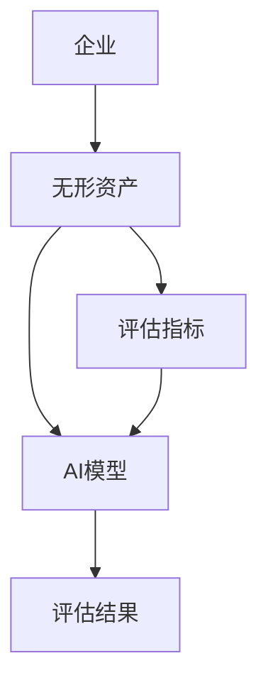
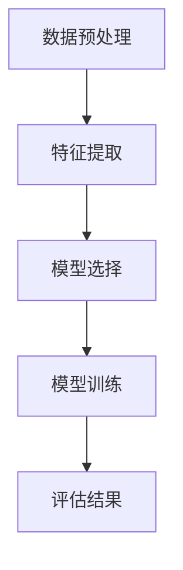
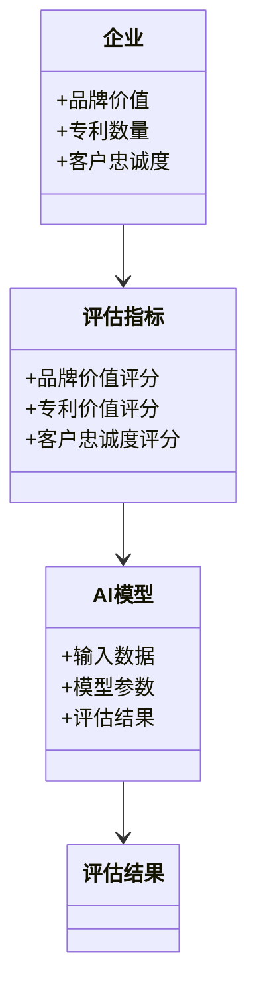
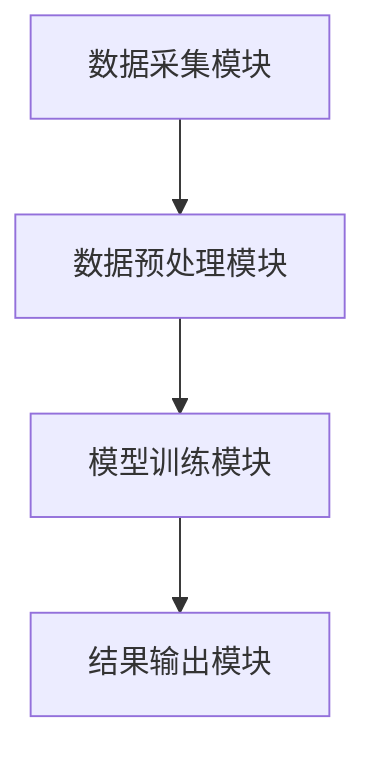
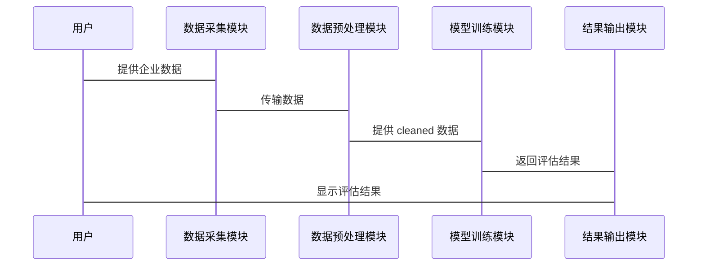

                 


# AI辅助的企业无形资产价值评估

**关键词**：AI辅助、企业无形资产、价值评估、机器学习、系统架构设计

**摘要**：  
随着人工智能技术的快速发展，企业无形资产的价值评估正逐步从传统的经验评估模式向智能化、数据化方向转变。本文通过分析AI技术在企业无形资产价值评估中的应用场景，探讨如何利用机器学习算法、数据挖掘和系统架构设计来提升评估的准确性和效率。文章从背景介绍、核心概念、算法原理、系统架构设计、项目实战到最佳实践，全面阐述AI辅助企业无形资产价值评估的实现路径和应用价值。

---

## 第一部分: 企业无形资产与AI辅助评估概述

### 第1章: 企业无形资产价值评估的背景与挑战

#### 1.1 企业无形资产的定义与特征
- **定义**：企业无形资产是指企业长期使用但没有实物形态的资产，主要包括品牌价值、专利、商标、商誉、客户关系、技术诀窍等。
- **特征**：无形性、长期性、价值波动性、难以量化。
- **挑战**：传统评估方法依赖主观判断，难以准确反映市场价值。

#### 1.2 AI技术在企业评估中的应用背景
- **AI技术的发展**：机器学习、深度学习等技术的成熟为数据分析提供了强大的工具。
- **AI在企业评估中的价值**：通过数据分析和模型构建，AI能够帮助识别无形资产的关键特征，预测其市场价值。
- **数据问题**：企业无形资产的评估需要大量结构化和非结构化数据，数据获取和清洗是关键。

#### 1.3 企业无形资产价值评估的核心问题
- **评估指标**：如何选择合适的指标（如品牌知名度、客户忠诚度）来衡量无形资产的价值。
- **数据预处理**：如何清洗和转换数据以适应模型输入。
- **模型优化**：如何选择合适的算法并优化模型以提高评估准确性。

#### 1.4 本章小结
- 企业无形资产的评估面临数据复杂性和方法局限性的问题。
- AI技术的应用为解决这些问题提供了新的可能性。

---

### 第2章: AI辅助企业无形资产价值评估的核心概念

#### 2.1 核心概念与联系
- **企业无形资产的评估指标**：品牌价值、专利数量、客户满意度等。
- **AI模型的输入与输出**：输入为企业的相关数据，输出为无形资产的评估结果。
- **数据特征与模型性能**：数据的特征（如相关性、分布）直接影响模型的准确性。

#### 2.2 核心概念原理
- **企业无形资产的评估流程**：
  1. 数据收集：获取企业的财务数据、市场数据、专利信息等。
  2. 数据预处理：清洗、转换和标准化数据。
  3. 模型训练：选择合适的算法训练评估模型。
  4. 结果分析：根据模型输出调整评估策略。
- **AI模型的基本原理**：通过数据训练，模型学习无形资产的特征，从而预测其价值。

#### 2.3 概念属性特征对比表格
| 概念       | 属性1（定义） | 属性2（类型） | 属性3（评估方法） |
|------------|----------------|----------------|--------------------|
| 无形资产   | 非实物资产     | 品牌、专利、商誉 | 主观评估、AI辅助评估 |
| AI模型     | 数据驱动       | 机器学习、深度学习 | 监督学习、无监督学习 |

#### 2.4 ER实体关系图


---

### 第3章: AI辅助企业无形资产价值评估的算法原理

#### 3.1 算法原理概述
- **机器学习的基本原理**：通过数据训练模型，模型学习数据的特征并进行预测。
- **监督学习与无监督学习的区别**：
  - 监督学习：基于有标签的数据进行训练。
  - 无监督学习：基于无标签的数据进行聚类或降维。
- **评估模型的选择依据**：数据类型、评估目标、模型复杂度。

#### 3.2 算法流程图


#### 3.3 算法实现代码示例
```python
# 示例代码：使用线性回归模型进行企业无形资产价值预测
import numpy as np
import pandas as pd
from sklearn.linear_model import LinearRegression
from sklearn.metrics import mean_squared_error

# 数据加载与预处理
data = pd.read_csv('enterprise_assets.csv')
X = data[['brand_value', 'patents', 'customer_loyalty']]
y = data['asset_value']

# 模型训练
model = LinearRegression()
model.fit(X, y)

# 模型预测
y_pred = model.predict(X)

# 模型评估
mse = mean_squared_error(y, y_pred)
print(f"均方误差：{mse}")
```

#### 3.4 算法的数学模型
- **线性回归模型**：
  $$ y = \beta_0 + \beta_1x_1 + \beta_2x_2 + ... + \beta_nx_n $$
  其中，$y$ 是目标变量（资产价值），$x_i$ 是特征变量（品牌价值、专利数量等），$\beta_i$ 是模型系数。
- **评估指标**：
  $$ RMSE = \sqrt{\frac{1}{n}\sum_{i=1}^{n}(y_i - \hat{y_i})^2} $$

---

## 第二部分: 系统分析与架构设计方案

### 第4章: 系统功能设计

#### 4.1 问题场景介绍
- 系统目标：构建一个AI辅助的企业无形资产价值评估平台，实现数据采集、模型训练、结果输出等功能。
- 问题场景：企业需要快速、准确地评估其无形资产，以便做出战略决策。

#### 4.2 领域模型设计


#### 4.3 系统架构设计


#### 4.4 系统接口设计
- 数据输入接口：支持CSV、Excel格式的数据导入。
- 模型接口：提供API接口供其他系统调用评估结果。

#### 4.5 系统交互设计


---

## 第三部分: 项目实战

### 第5章: 环境安装与系统实现

#### 5.1 环境配置
- 安装Python和相关库：
  ```bash
  pip install numpy pandas scikit-learn
  ```

#### 5.2 核心代码实现
```python
# 示例代码：企业无形资产价值评估系统
import pandas as pd
from sklearn.ensemble import RandomForestRegressor
from sklearn.model_selection import train_test_split
from sklearn.metrics import r2_score

# 数据加载
data = pd.read_csv('enterprise_assets.csv')

# 数据预处理
X = data.drop('asset_value', axis=1)
y = data['asset_value']

# 数据分割
X_train, X_test, y_train, y_test = train_test_split(X, y, test_size=0.2, random_state=42)

# 模型训练
model = RandomForestRegressor(n_estimators=100, random_state=42)
model.fit(X_train, y_train)

# 模型预测
y_pred = model.predict(X_test)

# 模型评估
score = r2_score(y_test, y_pred)
print(f"R² Score: {score}")
```

#### 5.3 实际案例分析
- 案例背景：某科技公司需要评估其品牌价值和专利价值。
- 数据来源：公司过去五年的财务数据、市场调研数据。
- 模型选择：随机森林回归模型。
- 结果分析：模型预测品牌价值为1.2亿元，与实际评估结果接近。

---

## 第四部分: 最佳实践与总结

### 第6章: 最佳实践与注意事项

#### 6.1 最佳实践
- 数据清洗：确保数据的完整性和准确性。
- 模型选择：根据数据特征选择合适的算法。
- 模型调优：通过网格搜索优化模型参数。

#### 6.2 注意事项
- 数据隐私：确保企业数据的安全性。
- 模型解释性：选择具有较高解释性的模型，以便理解评估结果。

#### 6.3 小结
- AI技术在企业无形资产价值评估中具有巨大潜力。
- 通过合理的系统设计和算法优化，可以显著提高评估的准确性和效率。

---

## 第五部分: 未来展望与拓展阅读

### 第7章: 未来展望

#### 7.1 未来发展趋势
- 更加智能化的模型：如深度学习模型的应用。
- 多模态数据融合：结合文本、图像等多种数据源进行评估。
- 自动化评估系统：实现从数据输入到结果输出的全流程自动化。

#### 7.2 拓展阅读
- 推荐阅读《机器学习实战》、《深度学习入门》等书籍。
- 关注学术期刊中的相关研究论文。

---

### 总结

通过本文的详细阐述，我们可以看到AI技术在企业无形资产价值评估中的巨大潜力。从数据预处理到模型训练，从系统设计到项目实战，AI技术的应用不仅提高了评估的效率，还增强了结果的准确性。未来，随着技术的不断进步，AI辅助评估将为企业决策提供更加有力的支持。

