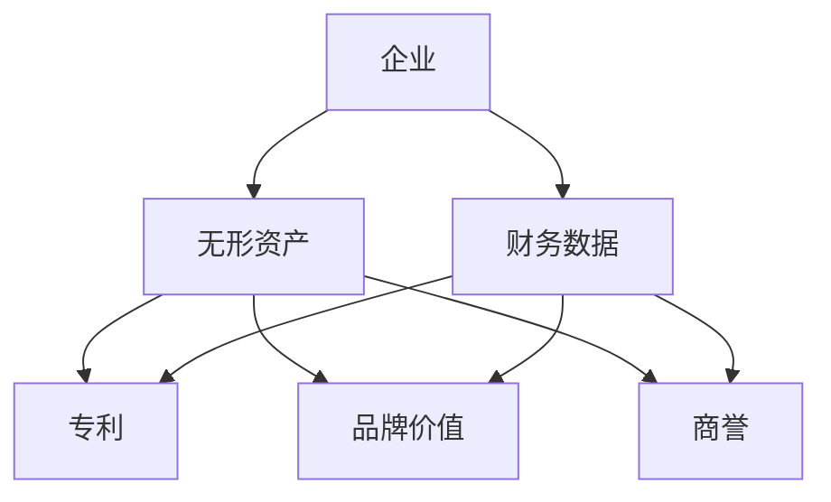
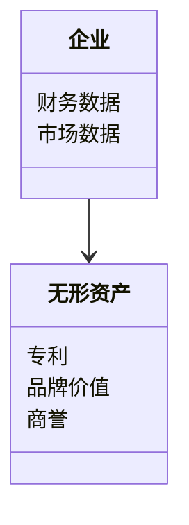
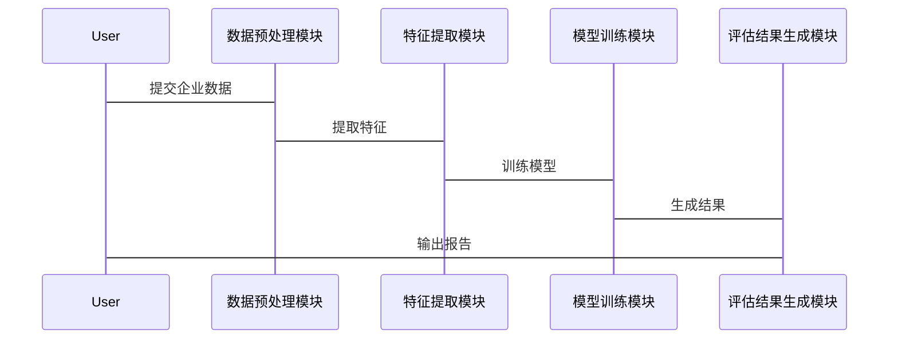

                 


# AI辅助的企业无形资产估值

## 关键词：
AI, 无形资产, 估值模型, 企业评估, 技术分析

## 摘要：
本文探讨了如何利用人工智能技术辅助企业无形资产的估值过程。从背景介绍到算法原理，再到系统架构和项目实战，系统地分析了AI在无形资产评估中的应用。通过详细讲解数学模型、系统设计和实际案例，本文为读者提供了全面的技术视角，展示了AI如何提升无形资产评估的效率和准确性。

---

## 第一部分: AI辅助的企业无形资产估值背景与基础

### 第1章: 企业无形资产与AI估值的背景介绍

#### 1.1 问题背景与描述

无形资产是企业的重要组成部分，包括品牌价值、专利、商誉等。传统的评估方法依赖于财务数据和专家经验，但存在主观性强、数据不足和难以量化的挑战。AI技术的引入，通过大数据分析和机器学习模型，为无形资产评估提供了新的解决方案。

##### 1.1.1 无形资产的定义与分类
无形资产是指企业长期使用但没有实物形态的资产，主要分为两类：可确指的无形资产（如专利、商标）和不可确指的无形资产（如商誉）。

##### 1.1.2 传统无形资产评估的挑战
传统方法依赖于财务数据和主观判断，评估结果可能不够准确，且难以应对复杂和动态的市场环境。

##### 1.1.3 AI技术在无形资产评估中的应用潜力
AI技术可以通过大数据分析和机器学习模型，提取更多维度的信息，提高评估的准确性和效率。

#### 1.2 问题解决与边界

##### 1.2.1 AI在无形资产评估中的核心作用
AI技术可以帮助企业更准确地评估无形资产的价值，提供数据支持和决策依据。

##### 1.2.2 问题解决的边界与外延
AI评估仅提供辅助作用，不能完全替代人类专家的判断。评估范围包括品牌价值、专利价值等，但不涉及企业的有形资产。

##### 1.2.3 核心概念与组成要素
无形资产评估的核心要素包括企业财务数据、市场表现、行业竞争状况和品牌影响力等。

---

### 第2章: 核心概念与联系

#### 2.1 AI与无形资产评估的核心原理

##### 2.1.1 大模型在无形资产评估中的应用流程
AI模型通过数据采集、特征提取、模型训练和结果生成四个步骤完成评估。

##### 2.1.2 多模态数据处理与特征提取
AI模型整合财务数据、市场数据和文本数据，提取关键特征进行评估。

##### 2.1.3 结构化输出与评估结果生成
模型输出结构化评估结果，提供准确的价值估算和分析报告。

#### 2.2 核心概念属性对比

##### 2.2.1 无形资产与有形资产的属性对比
| 特性 | 无形资产 | 有形资产 |
|------|----------|----------|
| 实物形态 | 无       | 有       |
| 评估难度 | 高       | 低       |
| 变现能力 | 低       | 高       |

#### 2.3 ER实体关系图


---

## 第二部分: 算法原理与数学模型

### 第3章: 算法原理与数学模型

#### 3.1 算法原理

##### 3.1.1 基于大模型的特征提取
AI模型通过自然语言处理技术提取文本数据中的关键词和情感倾向，进行特征提取。

##### 3.1.2 多任务学习与联合优化
模型同时优化多个任务，如特征提取、分类和回归，提升整体性能。

##### 3.1.3 结果生成与评分机制
模型生成评估结果后，通过交叉验证和评分机制进行优化。

#### 3.2 数学模型与公式

##### 3.2.1 特征权重计算公式
$$ w_i = \alpha \cdot f(x_i) + \beta \cdot g(x_i) $$

其中，$\alpha$和$\beta$为权重系数，$f(x_i)$和$g(x_i)$为特征函数。

##### 3.2.2 回归模型公式
$$ y = \beta_0 + \beta_1x_1 + \beta_2x_2 + \ldots + \beta_nx_n + \epsilon $$

---

## 第三部分: 系统分析与架构设计

### 第4章: 系统分析与架构设计

#### 4.1 系统分析

##### 4.1.1 问题场景介绍
系统需要处理企业提供的财务数据和市场数据，生成无形资产的评估报告。

##### 4.1.2 系统功能需求
- 数据采集模块：获取企业财务数据和市场数据。
- 特征提取模块：提取关键特征。
- 模型训练模块：训练评估模型。
- 结果生成模块：输出评估报告。

#### 4.2 系统架构设计

##### 4.2.1 领域模型类图


##### 4.2.2 系统架构图


#### 4.3 接口设计与交互流程图

##### 4.3.1 接口设计
- 数据接口：接收企业数据。
- 结果接口：输出评估报告。

##### 4.3.2 交互流程图


---

## 第四部分: 项目实战与应用

### 第5章: 项目实战

#### 5.1 项目实战

##### 5.1.1 环境安装
安装Python、机器学习库（如scikit-learn、TensorFlow）和数据处理工具（如Pandas）。

##### 5.1.2 核心代码实现
```python
import pandas as pd
from sklearn.linear_model import LinearRegression

# 数据加载
data = pd.read_csv('enterprise_data.csv')

# 特征选择
features = ['revenue', 'profit', 'market_share']
target = 'asset_value'

# 模型训练
model = LinearRegression()
model.fit(data[features], data[target])

# 结果预测
predictions = model.predict(data[features])
print('预测值:', predictions)
```

##### 5.1.3 代码解读与分析
代码加载数据，选择特征，训练线性回归模型，并生成预测结果。模型可以进一步优化，如引入深度学习模型提高准确性。

##### 5.1.4 实际案例分析
以某企业为例，分析其品牌价值的评估过程，展示AI模型的优势。

---

### 第6章: 最佳实践与小结

#### 6.1 最佳实践

##### 6.1.1 小结
AI技术显著提升了企业无形资产评估的效率和准确性，但需要结合具体业务场景进行调整。

##### 6.1.2 注意事项
- 数据质量至关重要，需确保数据的完整性和准确性。
- 模型需要定期更新，以适应市场变化。
- 结果需结合专家意见，避免过度依赖AI模型。

#### 6.2 拓展阅读
推荐阅读相关书籍和论文，深入学习AI在金融和资产评估中的应用。

---

## 总结
通过本文的详细讲解，读者可以全面了解AI在企业无形资产评估中的应用。从背景介绍到算法原理，再到系统设计和项目实战，本文为读者提供了从理论到实践的完整指南。希望本文能为企业的无形资产评估提供新的思路和技术支持。

--- 

**End of Document**

