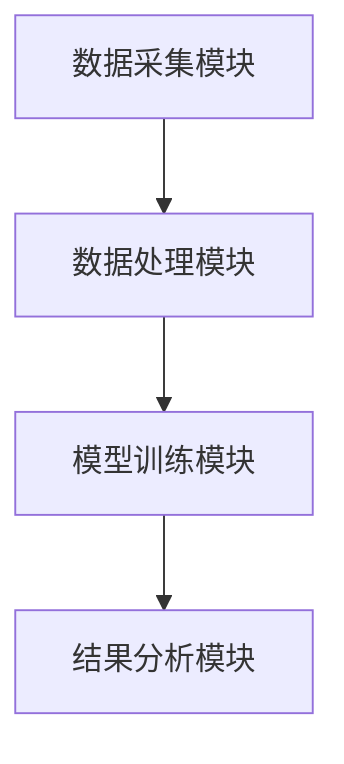
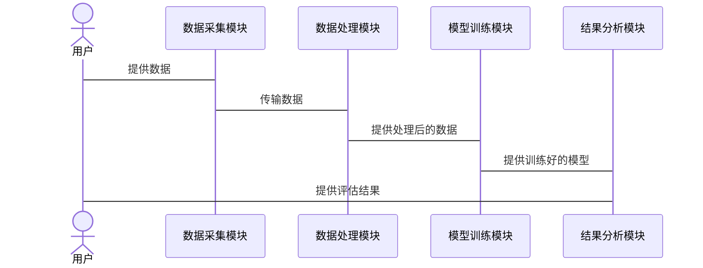

                 


# AI辅助的企业无形资产估值与管理

> 关键词：AI，企业无形资产，估值，管理，机器学习，深度学习

> 摘要：本文探讨了如何利用人工智能技术辅助企业无形资产的估值与管理。通过分析无形资产的定义、分类及其估值的挑战，详细介绍了AI在无形资产评估中的应用，包括机器学习和深度学习算法的原理和实现。同时，结合实际案例，展示了如何构建AI辅助的无形资产管理系统，提供了系统设计、架构实现和项目实战的具体步骤，最后总结了AI在这一领域的未来发展方向。

---

# 第一部分：AI辅助的企业无形资产估值与管理背景介绍

## 第1章：企业无形资产概述

### 1.1 无形资产的基本概念

#### 1.1.1 无形资产的定义与分类
企业无形资产是指企业拥有或控制的，没有实物形态的长期资产。它们通常包括品牌价值、客户关系、专利技术、商誉等。无形资产的价值往往难以直接量化，但它们在企业的经营中起着至关重要的作用。

| 无形资产类别 | 特征 | 示例 |
|----------------|------|------|
| 知识产权       | 法律保护的独有权 | 专利、商标、版权 |
| 品牌价值       | 品牌的市场影响力 | 品牌知名度、品牌忠诚度 |
| 客户关系       | 客户的忠诚度和关系强度 | 客户数据库、客户满意度 |

#### 1.1.2 无形资产在企业中的重要性
无形资产是企业核心竞争力的重要组成部分，直接影响企业的市场价值和长期盈利能力。例如，强大的品牌价值可以为企业带来更高的市场份额和客户忠诚度，而高效的客户关系管理可以降低客户流失率，提高销售额。

#### 1.1.3 无形资产的评估挑战
传统上，无形资产的评估主要依赖于财务数据和主观判断，这种方法存在以下问题：
- 数据的不完整性和不准确性
- 评估过程的主观性
- 难以捕捉动态市场变化
- 忽略非结构化数据（如文本、图像）的价值

### 1.2 AI技术在无形资产估值中的作用

#### 1.2.1 AI技术的基本概念
人工智能（AI）是指计算机系统执行人类智能任务的能力，如视觉识别、语音识别、决策-making等。AI的核心技术包括机器学习、深度学习、自然语言处理（NLP）等。

#### 1.2.2 AI在无形资产估值中的优势
AI技术能够处理大量结构化和非结构化数据，识别复杂模式，并提供数据驱动的决策支持。在无形资产估值中，AI的优势体现在以下几个方面：
- 高效处理大量数据
- 准确识别影响资产价值的关键因素
- 实时更新评估结果，适应市场变化
- 提供客观、可量化的评估依据

#### 1.2.3 AI技术在无形资产管理中的应用前景
随着AI技术的不断发展，其在无形资产管理中的应用前景广阔。未来，AI可以帮助企业更准确地识别、评估和管理无形资产，从而提升企业的整体价值。

---

## 第2章：AI辅助无形资产估值的核心概念

### 2.1 无形资产的分类与特征

#### 2.1.1 知识产权类无形资产
知识产权类无形资产包括专利、商标、版权等。这些资产的价值通常与技术的先进性、市场的独占性以及法律保护的力度相关。

#### 2.1.2 品牌价值类无形资产
品牌价值类无形资产是指品牌在市场中的影响力和认知度。品牌价值的评估需要考虑品牌知名度、品牌忠诚度、品牌联想等多个因素。

#### 2.1.3 客户关系类无形资产
客户关系类无形资产是指企业与客户之间的关系强度。客户关系的好坏直接影响企业的销售额和客户留存率。

### 2.2 AI算法在无形资产估值中的应用

#### 2.2.1 机器学习算法的基本原理
机器学习是一种通过数据训练模型的技术，其核心是通过数据输入和标签输出，训练模型预测新的数据。机器学习算法可以分为监督学习、无监督学习和强化学习。

#### 2.2.2 深度学习算法的基本原理
深度学习是一种基于人工神经网络的机器学习技术，其核心是通过多层非线性变换提取数据特征。深度学习在处理非结构化数据（如文本、图像）方面具有显著优势。

#### 2.2.3 自然语言处理在无形资产估值中的应用
自然语言处理（NLP）是一种用于处理人类语言的技术。在无形资产估值中，NLP可以用于分析客户评论、市场报告等文本数据，提取有用的信息。

### 2.3 无形资产估值的核心要素

#### 2.3.1 数据采集与处理
数据采集是无形资产估值的第一步，需要收集与无形资产相关的各种数据，如市场数据、财务数据、文本数据等。数据处理包括数据清洗、数据转换和数据增强。

#### 2.3.2 模型构建与训练
模型构建是通过选择合适的算法，训练模型以预测无形资产的价值。模型训练需要使用大量的数据，并通过调整模型参数来优化预测结果。

#### 2.3.3 结果分析与优化
模型训练完成后，需要对结果进行分析和优化。分析包括模型的准确率、召回率等指标，优化包括调整模型结构、优化训练参数等。

---

## 第3章：基于机器学习的无形资产估值模型

### 3.1 机器学习算法的基本原理

#### 3.1.1 线性回归模型
线性回归是一种用于预测连续型变量的算法。其基本公式为：
$$ y = \beta_0 + \beta_1x_1 + \beta_2x_2 + ... + \beta_nx_n $$

#### 3.1.2 支持向量机（SVM）模型
支持向量机是一种用于分类和回归的算法。其核心思想是通过找到一个超平面，将数据点分开。

#### 3.1.3 随机森林模型
随机森林是一种基于决策树的集成算法。其基本公式为：
$$ y = \sum_{i=1}^{n} \text{Tree}_i(x) $$

### 3.2 深度学习算法的基本原理

#### 3.2.1 神经网络的基本结构
神经网络是一种模拟人脑结构的算法。其基本结构包括输入层、隐藏层和输出层。

#### 3.2.2 卷积神经网络（CNN）的应用
卷积神经网络是一种用于处理图像数据的算法。其核心是卷积层，用于提取图像特征。

#### 3.2.3 循环神经网络（RNN）的应用
循环神经网络是一种用于处理序列数据的算法。其核心是循环层，用于处理时间序列数据。

### 3.3 无形资产估值的数学模型

#### 3.3.1 线性回归模型的数学公式
线性回归模型的数学公式为：
$$ y = \beta_0 + \beta_1x_1 + \beta_2x_2 + ... + \beta_nx_n $$

#### 3.3.2 随机森林模型的数学公式
随机森林模型的数学公式为：
$$ y = \sum_{i=1}^{n} \text{Tree}_i(x) $$

---

## 第4章：基于深度学习的无形资产估值模型

### 4.1 神经网络的基本结构

#### 4.1.1 输入层
输入层是神经网络的第一层，用于接收输入数据。

#### 4.1.2 隐藏层
隐藏层是神经网络的核心部分，用于提取数据特征。

#### 4.1.3 输出层
输出层是神经网络的最后一层，用于生成预测结果。

### 4.2 卷积神经网络（CNN）的应用

#### 4.2.1 卷积层
卷积层用于提取图像的局部特征。

#### 4.2.2 池化层
池化层用于降低计算复杂度和防止过拟合。

#### 4.2.3 全连接层
全连接层用于将卷积层的特征映射到输出结果。

### 4.3 循环神经网络（RNN）的应用

#### 4.3.1 循环层
循环层用于处理序列数据。

#### 4.3.2 状态层
状态层用于记忆序列信息。

#### 4.3.3 输出层
输出层用于生成序列的下一个元素。

---

## 第5章：自然语言处理（NLP）在无形资产估值中的应用

### 5.1 NLP的基本原理

#### 5.1.1 词袋模型
词袋模型是一种将文本表示为单词的集合的技术。

#### 5.1.2 词嵌入
词嵌入是一种将单词表示为向量的技术，常用的词嵌入模型包括Word2Vec、GloVe等。

#### 5.1.3 循环神经网络（RNN）
循环神经网络可以用于处理文本序列数据。

### 5.2 NLP在品牌价值评估中的应用

#### 5.2.1 品牌知名度评估
品牌知名度可以通过分析社交媒体上的评论来评估。

#### 5.2.2 品牌忠诚度评估
品牌忠诚度可以通过分析客户的购买历史来评估。

#### 5.2.3 品牌联想分析
品牌联想可以通过分析客户对品牌的描述来评估。

### 5.3 NLP在客户关系管理中的应用

#### 5.3.1 客户情感分析
客户情感分析可以通过分析客户评论来评估客户满意度。

#### 5.3.2 客户意图分析
客户意图分析可以通过分析客户的查询来预测客户的购买行为。

#### 5.3.3 客户分群
客户分群可以通过分析客户的特征来将客户分成不同的群体。

---

## 第6章：系统架构设计与实现

### 6.1 系统功能设计

#### 6.1.1 数据采集模块
数据采集模块负责收集与无形资产相关的各种数据。

#### 6.1.2 数据处理模块
数据处理模块负责对采集的数据进行清洗和转换。

#### 6.1.3 模型训练模块
模型训练模块负责训练无形资产估值模型。

#### 6.1.4 结果分析模块
结果分析模块负责对模型的预测结果进行分析和优化。

### 6.2 系统架构设计

#### 6.2.1 系统架构图
以下是系统架构图的mermaid代码：


#### 6.2.2 接口设计
系统接口设计包括数据输入接口、模型训练接口和结果输出接口。

#### 6.2.3 交互流程
以下是交互流程的mermaid代码：


### 6.3 项目实战

#### 6.3.1 环境安装
需要安装Python、机器学习库（如scikit-learn、TensorFlow）、NLP库（如NLTK、spaCy）等。

#### 6.3.2 代码实现

##### 数据采集模块
```python
import requests

def fetch_data(url):
    response = requests.get(url)
    return response.text
```

##### 数据处理模块
```python
import pandas as pd

def preprocess_data(data):
    df = pd.DataFrame(data)
    df.dropna(inplace=True)
    return df
```

##### 模型训练模块
```python
from sklearn.linear_model import LinearRegression

def train_model(X, y):
    model = LinearRegression()
    model.fit(X, y)
    return model
```

##### 结果分析模块
```python
from sklearn.metrics import r2_score

def evaluate_model(model, X_test, y_test):
    y_pred = model.predict(X_test)
    score = r2_score(y_test, y_pred)
    return score
```

#### 6.3.3 案例分析
以某企业品牌价值评估为例，展示如何利用AI技术进行品牌价值评估。

#### 6.3.4 代码解读与分析
详细解读上述代码，解释每一步的作用。

#### 6.3.5 项目小结
总结项目实施过程中的经验和教训，提出改进建议。

---

## 第7章：总结与展望

### 7.1 总结
本文详细介绍了AI在企业无形资产估值与管理中的应用，包括核心概念、算法原理、系统设计和项目实战。通过实际案例分析，展示了AI技术在无形资产管理中的巨大潜力。

### 7.2 展望
未来，随着AI技术的不断发展，其在无形资产管理中的应用将更加广泛和深入。建议企业积极拥抱AI技术，提升无形资产管理的效率和准确性。

### 7.3 最佳实践Tips
- 数据是AI模型的核心，确保数据的准确性和完整性。
- 根据具体业务需求选择合适的AI算法。
- 定期更新模型，以适应市场变化。

---

## 第8章：附录

### 8.1 附录A：数学公式汇总
列出本文中涉及的所有数学公式。

### 8.2 附录B：代码示例汇总
列出本文中涉及的所有代码示例。

### 8.3 附录C：参考文献
列出本文中引用的所有参考文献。

---

# 结束语

感谢您的阅读！希望本文对您理解AI在企业无形资产估值与管理中的应用有所帮助。如需进一步探讨，请随时联系我。

---

通过以上思考，我可以开始撰写完整的文章内容。

