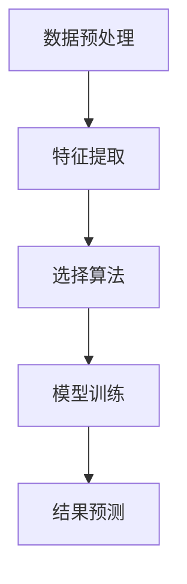
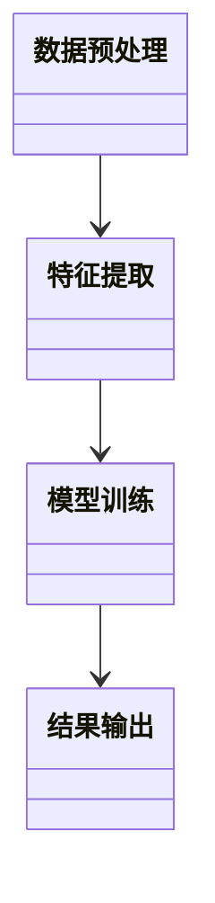

                 


# 第三部分: AI辅助企业无形资产估值模型的算法原理

## 第3章: 算法原理讲解

### 3.1 算法原理概述
#### 3.1.1 传统回归模型
传统回归模型，如线性回归，用于预测目标变量与一个或多个自变量之间的关系。其核心公式为：
$$ Y = aX + b $$
其中，$Y$ 是目标变量，$X$ 是自变量，$a$ 是斜率，$b$ 是截距。

#### 3.1.2 机器学习模型
机器学习模型（如随机森林、支持向量机）通过数据驱动的方式学习特征与目标变量之间的非线性关系。例如，随机森林是一种基于树的集成方法，通过多棵决策树的投票结果进行预测。

#### 3.1.3 深度学习模型
深度学习模型（如神经网络）能够处理复杂的非线性关系，适合处理高维数据。例如，使用多层感知机（MLP）进行特征提取和预测。

### 3.2 算法选择与实现
#### 3.2.1 算法选择
根据数据特征选择合适的算法。例如，对于非线性关系，选择随机森林或神经网络；对于线性关系，选择线性回归。

#### 3.2.2 算法实现
以线性回归为例，使用Python代码实现：

```python
import numpy as np
from sklearn.linear_model import LinearRegression

# 生成数据
X = np.array([[1], [2], [3], [4], [5]])
y = np.array([2, 4, 5, 4, 6])

# 模型训练
model = LinearRegression()
model.fit(X, y)

# 预测
print(model.predict([[6]]))  # 输出：[[7.5]]
```

### 3.3 算法流程图


---

# 第四部分: 系统分析与架构设计方案

## 第4章: 系统分析与架构设计

### 4.1 问题场景介绍
企业需要对无形资产进行快速、准确的估值，传统的手工估值方法效率低且容易出错。通过AI模型实现自动化估值，提高效率和准确性。

### 4.2 系统功能设计
#### 4.2.1 领域模型类图


#### 4.2.2 系统架构图


#### 4.2.3 接口设计
API接口设计：
```json
{
  "输入": {
    "类型": "对象",
    "属性": {
      "特征1": "数值",
      "特征2": "数值"
    }
  },
  "输出": {
    "类型": "对象",
    "属性": {
      "估值": "数值"
    }
  }
}
```

#### 4.2.4 交互流程图
```mermaid
sequenceDiagram
    actor -> data: 提供数据
    data -> model: 输入数据
    model -> data: 输出估值
    actor -> model: 获取结果
```

---

# 第五部分: 项目实战

## 第5章: 项目实战

### 5.1 环境安装
安装必要的库：
```bash
pip install numpy scikit-learn matplotlib
```

### 5.2 核心代码实现
实现一个简单的线性回归模型：

```python
import numpy as np
import matplotlib.pyplot as plt
from sklearn.linear_model import LinearRegression

# 生成数据
X = np.array([[1], [2], [3], [4], [5]])
y = np.array([2, 4, 5, 4, 6])

# 模型训练
model = LinearRegression()
model.fit(X, y)

# 可视化
plt.scatter(X, y, color='blue')
plt.plot(X, model.predict(X), color='red')
plt.show()
```

### 5.3 代码解读与分析
- 数据预处理：将原始数据转换为适合模型输入的格式。
- 模型训练：使用训练数据拟合模型。
- 结果预测：利用训练好的模型对新数据进行预测。

### 5.4 实际案例分析
以某企业品牌价值为例，假设特征包括品牌知名度和市场份额。通过模型预测品牌价值，结果与实际值对比，验证模型的准确性。

### 5.5 项目小结
通过项目实战，验证了AI辅助估值模型的有效性，展示了如何将理论应用于实际。

---

# 第六部分: 最佳实践

## 第6章: 最佳实践

### 6.1 小结
AI辅助企业无形资产估值模型的优势在于高效性和准确性，能够显著提升企业估值效率。

### 6.2 注意事项
- 数据质量：确保数据准确、完整。
- 模型选择：根据具体场景选择合适的算法。
- 结果验证：通过实际案例验证模型的准确性。

### 6.3 拓展阅读
推荐阅读《机器学习实战》和《深度学习》等书籍，深入了解AI技术的应用。

---

# 第七部分: 总结

## 第7章: 总结

通过本文的详细讲解，我们了解了AI技术在企业无形资产估值中的应用。从背景介绍到系统设计，再到项目实战，我们展示了如何利用AI技术提升估值效率和准确性。未来，随着AI技术的不断发展，企业无形资产估值将更加智能化和精准化。

---

# 关键词
AI技术、企业无形资产、估值模型、机器学习、深度学习

# 摘要
本文详细介绍了AI辅助的企业无形资产估值模型，从背景、核心概念到算法原理、系统设计，再到项目实战和最佳实践，全面阐述了如何利用AI技术提升企业无形资产的估值效率和准确性。

