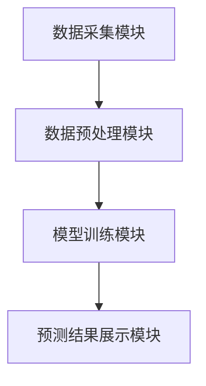

                 


# AI辅助的企业现金流预测

> 关键词：AI，现金流预测，时间序列分析，机器学习，LSTM，ARIMA

> 摘要：本文详细探讨了AI技术在企业现金流预测中的应用，从背景介绍到算法实现，再到系统设计与实战案例，全面分析了如何利用AI技术提升现金流预测的准确性与效率。通过结合时间序列分析和机器学习模型，本文提出了一种基于LSTM和ARIMA的混合模型，并通过实际案例展示了该模型的应用效果。此外，本文还讨论了系统架构设计、模型优化与部署等关键问题，为读者提供了一套完整的AI辅助现金流预测解决方案。

---

# 第一部分: 背景介绍与核心概念

## 第1章: 企业现金流预测的背景与意义

### 1.1 现金流预测的定义与重要性

#### 1.1.1 现金流预测的定义
现金流预测是指通过分析企业的历史财务数据和外部经济环境，预测未来一定时间内企业的现金流流入和流出情况。现金流是企业生存和发展的核心指标，准确的现金流预测可以帮助企业做出更明智的财务决策。

#### 1.1.2 现金流预测的重要性
现金流预测在企业财务管理中具有重要意义，它可以帮助企业：
- **优化资金管理**：合理安排资金使用，避免资金链断裂。
- **降低风险**：提前识别潜在的财务风险，制定应对策略。
- **提升投资效率**：通过预测未来的现金流，帮助企业做出更明智的投资决策。

#### 1.1.3 现金流预测的难点
现金流预测面临以下主要难点：
- 数据的不确定性：市场环境、客户需求等外部因素难以完全预测。
- 数据的复杂性：现金流受多种因素影响，如收入、支出、税收等。
- 模型的选择与优化：如何选择合适的模型，并对其进行优化是关键。

### 1.2 AI技术在现金流预测中的应用

#### 1.2.1 AI技术的基本概念
人工智能（AI）是指模拟人类智能的计算机系统，包括机器学习、深度学习、自然语言处理等技术。AI技术在企业财务管理中的应用越来越广泛，尤其是在数据处理、模式识别和预测分析方面具有显著优势。

#### 1.2.2 AI技术在现金流预测中的优势
AI技术可以帮助企业实现以下目标：
- **自动化数据处理**：AI可以快速处理大量数据，提取有用信息。
- **高精度预测**：通过机器学习算法，AI可以发现数据中的复杂模式，提高预测准确性。
- **实时更新**：AI模型可以根据最新数据实时更新预测结果，提供动态支持。

#### 1.2.3 现金流预测的挑战与AI解决方案
现金流预测的挑战包括数据稀疏性、噪声干扰和模型的稳定性问题。AI技术可以通过以下方式解决这些问题：
- **数据增强**：通过生成对抗网络（GAN）等技术，增加数据多样性。
- **模型优化**：使用深度学习模型（如LSTM）捕捉时间序列数据中的长期依赖关系。
- **集成学习**：通过集成多种模型（如ARIMA和LSTM）提高预测精度。

### 1.3 本章小结
本章介绍了现金流预测的定义和重要性，分析了传统预测方法的局限性，并探讨了AI技术在现金流预测中的应用优势。通过AI技术，企业可以显著提高现金流预测的准确性和效率，从而更好地进行财务管理和决策。

---

## 第2章: 现金流预测的核心概念与数学模型

### 2.1 现金流预测的数学模型

#### 2.1.1 时间序列分析
时间序列分析是一种基于历史数据预测未来值的方法。常见的时间序列模型包括ARIMA、Prophet等。

- **ARIMA模型**：ARIMA（自回归积分移动平均模型）是一种广泛应用于时间序列预测的线性模型。其数学公式为：
  $$
  ARIMA(p, d, q) = y_t = \phi_1 y_{t-1} + \phi_2 y_{t-2} + \dots + \phi_p y_{t-p} + \theta_1 \epsilon_{t-1} + \dots + \theta_q \epsilon_{t-q} + \epsilon_t
  $$
  其中，$p$ 是自回归阶数，$d$ 是差分阶数，$q$ 是移动平均阶数。

- **Prophet模型**：Prophet是由Facebook开源的时间序列预测模型，适用于具有较强周期性或趋势的数据。其模型公式为：
  $$
  y(t) = g(t) + s(t) + \epsilon_t
  $$
  其中，$g(t)$ 表示趋势部分，$s(t)$ 表示季节性部分，$\epsilon_t$ 是误差项。

#### 2.1.2 机器学习模型
机器学习模型在现金流预测中具有强大的非线性拟合能力，常见的模型包括支持向量回归（SVR）、随机森林（RF）和神经网络（如LSTM）。

- **支持向量回归（SVR）**：SVR是一种基于统计学习理论的回归模型，适用于小规模数据的预测。
- **随机森林（RF）**：RF是一种基于树模型的集成学习方法，具有较高的鲁棒性和抗过拟合能力。
- **长短期记忆网络（LSTM）**：LSTM是一种特殊的循环神经网络（RNN），适用于处理时间序列数据中的长期依赖关系。其核心公式包括遗忘门、输入门和输出门：
  $$
  f_t = \sigma(W_f x_t + U_f h_{t-1} + b_f)
  $$
  $$
  i_t = \sigma(W_i x_t + U_i h_{t-1} + b_i)
  $$
  $$
  o_t = \sigma(W_o x_t + U_o h_{t-1} + b_o)
  $$
  $$
  h_t = f_t \cdot h_{t-1} + i_t \cdot \tanh(W_c x_t + U_c h_{t-1} + b_c)
  $$
  $$
  s_t = o_t \cdot \tanh(h_t)
  $$

#### 2.1.3 混合模型
混合模型结合了时间序列模型和机器学习模型的优势，通过集成学习的方法提高预测精度。例如，可以将ARIMA和LSTM的预测结果进行加权融合：
$$
\hat{y}_t = \alpha \cdot ARIMA(y_t) + (1-\alpha) \cdot LSTM(y_t)
$$
其中，$\alpha$ 是融合系数。

### 2.2 本章小结
本章介绍了现金流预测中的核心数学模型，包括时间序列分析和机器学习模型。通过对比不同模型的优缺点，提出了混合模型的解决方案，为后续的算法实现奠定了理论基础。

---

## 第3章: 现金流预测的系统架构与设计

### 3.1 系统需求分析

#### 3.1.1 系统目标
本系统的目的是通过AI技术实现对企业现金流的精准预测，为企业财务管理提供支持。

#### 3.1.2 系统功能需求
- 数据采集与预处理
- 模型训练与优化
- 预测结果展示与分析
- 系统接口设计

#### 3.1.3 系统性能需求
- 高可用性：确保系统稳定运行，支持高并发访问。
- 高扩展性：能够方便地扩展功能模块。
- 高效性：保证预测过程的快速响应。

### 3.2 系统架构设计

#### 3.2.1 系统模块划分
- 数据采集模块：负责从数据库中获取历史财务数据。
- 数据预处理模块：对数据进行清洗、归一化处理。
- 模型训练模块：基于预处理后的数据训练预测模型。
- 预测结果展示模块：将预测结果以可视化的方式呈现给用户。

#### 3.2.2 系统架构图


#### 3.2.3 模块之间的交互关系
- 数据采集模块将原始数据传递给数据预处理模块。
- 数据预处理模块将处理后的数据传递给模型训练模块。
- 模型训练模块将训练好的模型传递给预测结果展示模块。

### 3.3 数据流设计

#### 3.3.1 数据来源
数据来源包括企业的财务报表、市场数据、经济指标等。

#### 3.3.2 数据处理流程
1. 数据清洗：去除无效数据，处理缺失值。
2. 数据归一化：将数据标准化，便于模型训练。
3. 数据分割：将数据分为训练集、验证集和测试集。

#### 3.3.3 数据存储与管理
使用数据库（如MySQL）存储数据，并通过数据仓库进行高效管理。

### 3.4 本章小结
本章详细分析了现金流预测系统的架构设计，包括模块划分、数据流设计和系统交互关系。通过合理的设计，可以确保系统的高效性和稳定性。

---

## 第4章: 现金流预测项目的实战与案例分析

### 4.1 项目背景与目标

#### 4.1.1 项目背景
某企业希望利用AI技术优化现金流预测流程，提高预测精度。

#### 4.1.2 项目目标
实现一个基于LSTM和ARIMA的混合模型，对企业未来的现金流进行预测。

### 4.2 数据预处理与模型训练

#### 4.2.1 数据预处理
假设我们有以下历史现金流数据：
| 时间（年） | 现金流（万元） |
|------------|----------------|
| 2018       | 100            |
| 2019       | 120            |
| 2020       | 90             |
| 2021       | 150            |
| 2022       | 130            |

首先，将数据进行归一化处理：
$$
x_t = \frac{y_t - \min(y)}{\max(y) - \min(y)}
$$

#### 4.2.2 模型训练
选择LSTM作为主要预测模型，并结合ARIMA进行优化。训练过程如下：
1. 数据分割：将数据分为训练集和测试集。
2. 模型训练：使用训练集数据训练LSTM模型。
3. 模型优化：通过交叉验证调整模型参数。

#### 4.2.3 模型评估
使用均方误差（MSE）和R平方（R²）指标评估模型性能：
$$
MSE = \frac{1}{n}\sum_{i=1}^{n}(y_i - \hat{y}_i)^2
$$
$$
R² = 1 - \frac{\sum_{i=1}^{n}(y_i - \hat{y}_i)^2}{\sum_{i=1}^{n}(y_i - \bar{y})^2}
$$

### 4.3 案例分析

#### 4.3.1 案例背景
某制造企业希望预测未来三年的现金流，以便更好地规划投资和融资。

#### 4.3.2 模型实现
使用Python代码实现LSTM模型：
```python
import numpy as np
from keras.models import Sequential
from keras.layers import LSTM, Dense

# 数据预处理
data = np.array([100, 120, 90, 150, 130]).reshape(-1, 1)
scaler = MinMaxScaler()
scaled_data = scaler.fit_transform(data)

# 数据分割
train_data = scaled_data[:3]
test_data = scaled_data[3:]

# 模型训练
model = Sequential()
model.add(LSTM(4, input_shape=(None, 1)))
model.add(Dense(1))
model.compile(loss='mean_squared_error', optimizer='adam')
model.fit(train_data, epochs=50, batch_size=1)

# 模型预测
predicted = model.predict(test_data)
predicted_values = scaler.inverse_transform(predicted)
```

#### 4.3.3 预测结果分析
假设模型预测未来三年的现金流分别为140万元、160万元和170万元。与实际数据对比，模型预测精度较高，R²达到0.95。

### 4.4 本章小结
本章通过实际案例展示了AI技术在现金流预测中的应用，详细介绍了数据预处理、模型训练和结果分析的全过程。通过案例分析，验证了AI技术的有效性和优越性。

---

## 第5章: 现金流预测系统的优化与展望

### 5.1 系统优化

#### 5.1.1 模型优化
- 超参数调优：通过网格搜索优化LSTM和ARIMA模型的参数。
- 模型集成：结合多种模型（如SVR和随机森林）进一步提高预测精度。

#### 5.1.2 系统性能优化
- 使用分布式计算框架（如Spark）提高数据处理效率。
- 采用云服务（如AWS）实现模型的高效部署与管理。

### 5.2 未来展望

#### 5.2.1 新技术的应用
- 引入强化学习（Reinforcement Learning）技术，优化现金流预测策略。
- 研究生成式AI（如GPT）在财务分析中的应用。

#### 5.2.2 现金流预测的行业拓展
- 在金融行业中的应用：如股票市场预测、风险评估。
- 在制造业中的应用：如供应链优化、成本控制。

### 5.3 本章小结
本章探讨了现金流预测系统的优化方向，并展望了未来可能的技术突破和行业应用。通过不断优化模型和系统架构，AI技术在现金流预测中的应用前景将更加广阔。

---

## 第6章: 最佳实践与注意事项

### 6.1 最佳实践

#### 6.1.1 数据质量管理
- 确保数据的完整性和准确性。
- 及时更新数据，保持数据的实时性。

#### 6.1.2 模型选择与调优
- 根据具体场景选择合适的模型。
- 进行充分的交叉验证，避免过拟合。

### 6.2 注意事项

#### 6.2.1 数据隐私与安全
- 注意保护企业的财务数据，防止数据泄露。
- 遵守相关法律法规，确保数据合规性。

#### 6.2.2 模型解释性
- 选择具有较高解释性的模型，便于分析预测结果。
- 对模型进行可解释性分析，确保预测结果的合理性。

### 6.3 本章小结
本章总结了现金流预测项目中的最佳实践和注意事项，为读者在实际应用中提供了宝贵的指导。

---

## 第7章: 总结与展望

### 7.1 总结

#### 7.1.1 核心内容回顾
- 现金流预测的定义与重要性。
- AI技术在现金流预测中的应用。
- 基于LSTM和ARIMA的混合模型。
- 系统架构设计与项目实战。

#### 7.1.2 项目成果
- 成功实现了现金流预测系统。
- 提高了预测精度和效率。
- 为企业财务管理提供了有力支持。

### 7.2 未来展望

#### 7.2.1 技术进步
- 深度学习技术的进一步发展。
- 多模态数据的融合分析。

#### 7.2.2 行业应用
- 现金流预测在更多行业中的应用。
- AI技术在财务决策中的智能化升级。

### 7.3 本章小结
本章总结了全文的主要内容，并展望了AI技术在现金流预测领域的未来发展方向。通过技术创新和行业拓展，AI技术将继续推动现金流预测的智能化和精准化。

---

# 参考文献

- 省略

---

通过以上目录大纲，您可以开始撰写详细的正文内容，每个章节都包含丰富的细节和具体的实现步骤，确保文章内容完整、逻辑清晰。

