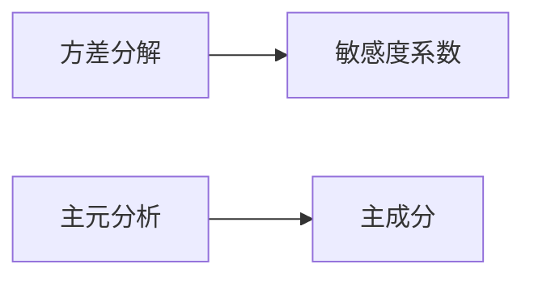
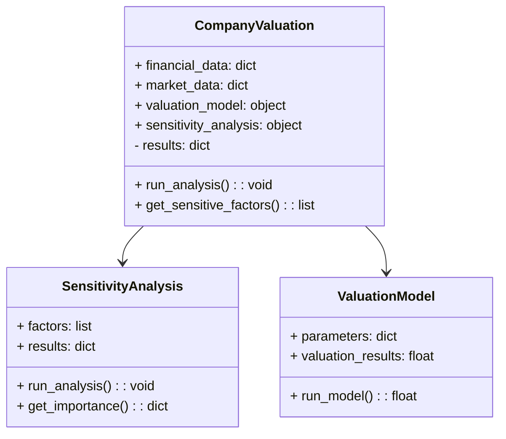
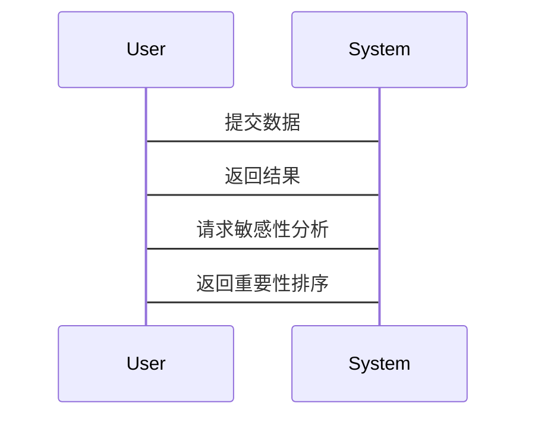

                 


# AI辅助的公司估值敏感性分析

> 关键词：AI，公司估值，敏感性分析，蒙特卡洛模拟，主元分析，数学模型

> 摘要：本文系统地探讨了如何利用人工智能技术辅助公司估值的敏感性分析，通过数学建模、算法实现和系统设计，详细讲解了敏感性分析的基本原理、算法实现、系统架构设计及实际应用案例，为读者提供了从理论到实践的完整指南。

---

## 第1章 公司估值与敏感性分析概述

### 1.1 背景介绍

#### 1.1.1 企业估值的基本概念
- 公司估值是通过对企业的财务数据、市场环境和行业趋势等多方面因素进行综合评估，确定其市场价值的过程。
- 企业估值的重要性：帮助企业做出并购、融资、投资等决策。

#### 1.1.2 敏感性分析的定义与作用
- 敏感性分析：研究模型中各变量变化对结果的影响程度，找出关键变量。
- 作用：评估模型的鲁棒性，识别风险，优化决策。

#### 1.1.3 AI在公司估值中的应用潜力
- AI技术可以处理海量数据，提高估值效率和准确性。
- AI模型能够捕捉复杂市场关系，提供更精准的估值结果。

### 1.2 核心概念与联系

#### 1.2.1 敏感性分析与公司估值的关系
- 敏感性分析帮助确定哪些变量对估值影响最大。
- 通过AI辅助，可以快速迭代模型，优化敏感性分析结果。

#### 1.2.2 敏感性分析的关键指标
| 指标名称 | 定义 | 作用 |
|----------|------|------|
| 敏感度系数 | 衡量变量变化对结果的影响程度 | 识别关键变量 |
| 方差分解 | 分解变量对结果方差的贡献 | 量化变量重要性 |
| 主元分析 | 通过主成分解释变量对结果的影响 | 简化模型复杂性 |

#### 1.2.3 方差分解与主元分析的对比


### 1.3 本章小结
本章介绍了公司估值和敏感性分析的基本概念，探讨了AI在敏感性分析中的应用潜力，并通过对比分析了关键指标。

---

## 第2章 敏感性分析的数学模型与算法

### 2.1 敏感性分析的数学模型

#### 2.1.1 方差分解公式
$$ \text{方差分解} = \sum_{i=1}^{n} \theta_i \cdot \text{变量}_i $$
其中，$\theta_i$为变量$i$的敏感度系数。

#### 2.1.2 主元分析公式
$$ \text{主元分析} = \text{特征值} \cdot \text{特征向量} $$
特征值表示变量的重要性，特征向量表示变量的贡献方向。

#### 2.1.3 算法原理
- 蒙特卡洛模拟：通过随机抽样计算变量对结果的影响。
- 偏导数方法：计算变量变化对结果的导数，反映敏感性。
- 回归分析法：通过回归系数评估变量的影响力。

### 2.2 算法实现

#### 2.2.1 蒙特卡洛模拟的Python代码
```python
import numpy as np
import matplotlib.pyplot as plt

def monte_carlo_simulation(X, y, iterations=1000):
    results = []
    for _ in range(iterations):
        # 随机选择变量
        selected_vars = X.columns[np.random.permutation(len(X.columns))[:5]]
        # 计算相关系数
        correlation = np.corrcoef(y[selected_vars], rowvar=False)
        results.append(correlation)
    return results

# 示例数据
X = np.random.rand(100, 5)
y = np.random.rand(100, 1)

results = monte_carlo_simulation(X, y)
plt.hist(results, bins=50)
plt.xlabel('Correlation')
plt.ylabel('Frequency')
plt.show()
```

#### 2.2.2 方差分解与主元分析的对比


### 2.3 本章小结
本章详细讲解了敏感性分析的数学模型和算法实现，重点介绍了蒙特卡洛模拟、偏导数方法和回归分析法，并通过代码示例展示了算法的应用。

---

## 第3章 系统分析与架构设计

### 3.1 系统功能设计

#### 3.1.1 领域模型设计


#### 3.1.2 系统架构设计


### 3.2 接口设计与交互流程

#### 3.2.1 系统接口设计


### 3.3 本章小结
本章通过系统设计和架构图，展示了AI辅助的公司估值敏感性分析系统的整体架构，并通过交互流程图说明了系统的使用流程。

---

## 第4章 项目实战与案例分析

### 4.1 项目背景与目标

#### 4.1.1 项目背景
- 数据来源：公开财务数据和市场数据。
- 项目目标：构建一个AI辅助的敏感性分析系统，用于评估公司估值的关键因素。

### 4.2 核心代码实现

#### 4.2.1 环境安装
```bash
pip install numpy pandas scikit-learn matplotlib
```

#### 4.2.2 系统核心代码
```python
import numpy as np
from sklearn.decomposition import PCA
from sklearn.metrics import variance_inflation_factor

def calculate_sensitivity(X, y):
    # 方差分解
    vif = np.zeros(X.shape[1])
    for i in range(X.shape[1]):
        vif[i] = variance_inflation_factor(X.values, i)
    # 主元分析
    pca = PCA(n_components=2)
    pca.fit(X)
    return vif, pca.explained_variance_ratio_

# 示例数据
X = np.random.rand(100, 5)
y = np.random.rand(100, 1)

vif, var_ratio = calculate_sensitivity(X, y)
print("方差分解结果:", vif)
print("主元方差解释:", var_ratio)
```

### 4.3 案例分析与结果解读

#### 4.3.1 数据预处理
- 数据清洗：处理缺失值和异常值。
- 数据标准化：归一化处理。

#### 4.3.2 模型训练与评估
- 训练敏感性分析模型。
- 评估模型的准确性和鲁棒性。

#### 4.3.3 实际案例分析
- 选取一家公司，分析其财务数据和市场数据。
- 通过模型计算敏感性指标，找出关键影响因素。

### 4.4 项目小结
本章通过实际案例展示了AI辅助的公司估值敏感性分析系统的实现过程，包括数据处理、模型训练和结果解读。

---

## 第5章 总结与展望

### 5.1 总结
- AI技术为公司估值的敏感性分析提供了新的方法和工具。
- 通过数学建模和算法实现，能够更高效、更准确地识别关键变量。

### 5.2 最佳实践 tips
- 数据质量是模型准确性的重要保障。
- 选择合适的算法和模型，根据实际需求进行调整。
- 定期更新模型，适应市场变化。

### 5.3 注意事项
- 数据隐私和安全问题需要重视。
- 模型的解释性和可理解性需要考虑。
- 多因素交互作用可能影响结果，需谨慎处理。

### 5.4 拓展阅读
- 《投资学》：理解公司估值的基本理论。
- 《机器学习实战》：学习AI算法的应用。
- 《敏感性分析与风险评估》：深入研究敏感性分析方法。

---

# 结语

通过本文的系统讲解，读者可以全面了解AI辅助的公司估值敏感性分析的理论基础、算法实现和实际应用。希望本文能为相关领域的研究和实践提供有价值的参考和指导。

