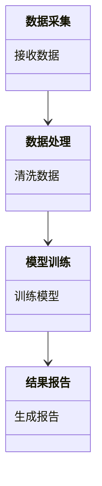
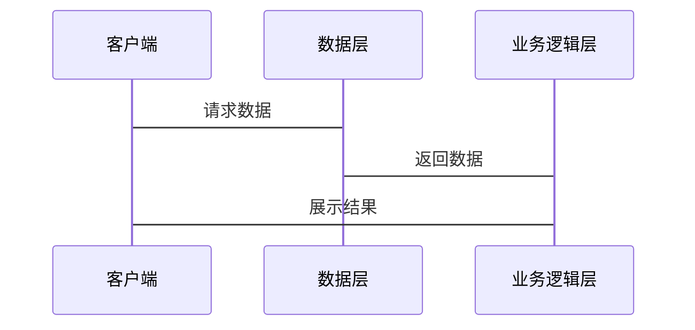

                 


# AI辅助的公司治理缺陷识别

> 关键词：AI技术、公司治理、缺陷识别、机器学习、企业风险管理

> 摘要：随着企业面临的治理挑战日益复杂，传统的公司治理缺陷识别方法逐渐显现出效率低下、准确度不足等问题。本篇文章深入探讨了如何利用人工智能技术来辅助公司治理缺陷识别，通过结合AI算法、数据挖掘和自然语言处理技术，提出了一套完整的解决方案。本文从核心概念、算法原理、系统架构设计到实际项目案例进行了全面分析，为读者提供了理论和实践相结合的深度见解。

---

## 第1章 公司治理缺陷识别的背景与挑战

### 1.1 公司治理的基本概念
#### 1.1.1 公司治理的定义与核心要素
公司治理是通过合理配置权力和责任，确保公司战略目标的实现和利益相关者权益的保护。其核心要素包括：
- **治理结构**：董事会、监事会、管理层的职责划分。
- **治理机制**：决策、执行、监督和激励机制。
- **治理文化**：透明性、道德规范和企业价值观。

#### 1.1.2 公司治理中的主要问题
- **决策失误**：管理层决策缺乏数据支持或战略规划。
- **监管合规**：未能满足法律法规要求，导致法律风险。
- **利益冲突**：股东与管理层的利益冲突。
- **透明度不足**：信息不对称导致治理效率低下。

#### 1.1.3 公司治理缺陷的类型与影响
- **战略缺陷**：战略规划不合理，缺乏市场洞察。
- **管理缺陷**：管理流程低效，缺乏监督。
- **合规缺陷**：未能遵守相关法律法规，导致法律风险。
- **文化缺陷**：缺乏透明和诚信的企业文化，影响员工积极性。

---

### 1.2 传统公司治理缺陷识别的挑战
#### 1.2.1 传统识别方法的局限性
- **人工识别效率低**：依赖经验丰富的专家，耗时且成本高。
- **信息不全面**：难以整合来自不同部门的多源数据。
- **主观性较强**：缺乏客观的数据支持，结果可能受主观因素影响。

#### 1.2.2 人工识别的低效性
- **数据量大**：现代企业数据繁多，人工处理难度大。
- **复杂性高**：治理问题往往涉及多个因素，难以逐一排查。
- **及时性不足**：人工识别难以实现实时监控，可能导致问题扩大化。

#### 1.2.3 数据驱动识别的必要性
- **数据驱动的优势**：通过分析大量数据，发现潜在问题。
- **实时监控的可能性**：利用大数据和AI技术，实现实时监控和预警。
- **精准识别的潜力**：通过机器学习模型，提高缺陷识别的准确率。

---

### 1.3 AI技术在公司治理中的应用前景
#### 1.3.1 AI技术的基本概念
人工智能（AI）是指计算机系统模拟人类智能的能力，包括学习、推理、自我改进等功能。AI技术涵盖机器学习、自然语言处理、计算机视觉等领域。

#### 1.3.2 AI在公司治理中的潜在应用场景
- **风险预警**：通过分析财务数据和市场动态，预测潜在风险。
- **合规监控**：实时监控企业运营，确保符合相关法规。
- **决策支持**：通过数据挖掘和预测分析，辅助管理层决策。
- **内部审计**：利用AI技术自动识别财务报表中的异常情况。

#### 1.3.3 AI辅助缺陷识别的优势与潜力
- **高效性**：AI技术能够快速处理大量数据，提高识别效率。
- **准确性**：通过训练模型，AI能够识别复杂模式，减少人为错误。
- **实时性**：AI系统可以实时监控企业运营，及时发现和解决问题。

---

### 1.4 本章小结
公司治理缺陷识别的核心问题在于如何高效、准确地发现和解决治理中的问题。AI技术通过其强大的数据处理能力和学习能力，为缺陷识别提供了新的解决方案。本书将从理论到实践，系统地探讨AI在公司治理缺陷识别中的应用，为读者提供全面的指导和参考。

---

## 第2章 AI辅助公司治理缺陷识别的核心概念

### 2.1 AI技术与公司治理的结合
#### 2.1.1 AI技术的基本原理
AI通过数据训练模型，模拟人类的学习和推理能力。在公司治理中，AI可以用于数据分析、模式识别和预测。

#### 2.1.2 公司治理中的数据特征
公司治理数据包括财务数据、市场数据、内部政策、法律法规等，具有多样性和复杂性。

#### 2.1.3 AI在公司治理中的应用模式
- **监督学习**：用于分类任务，如识别合规风险。
- **无监督学习**：用于发现隐藏的模式和异常。
- **深度学习**：用于处理非结构化数据，如文本分析。

---

### 2.2 公司治理缺陷识别的关键要素
#### 2.2.1 缺陷识别的标准与指标
- **财务指标**：如ROE、净利率等。
- **运营指标**：如周转率、效率等。
- **合规指标**：如法规遵循情况。

#### 2.2.2 数据来源与处理方法
- **数据来源**：财务报表、内部审计报告、市场数据等。
- **数据清洗**：处理缺失值、异常值。
- **数据特征提取**：提取关键特征用于模型训练。

#### 2.2.3 缺陷分类与优先级评估
- **分类标准**：根据缺陷的严重性和影响范围进行分类。
- **优先级评估**：优先处理高风险、高影响的缺陷。

---

### 2.3 AI算法在缺陷识别中的作用
#### 2.3.1 监督学习与无监督学习的对比
- **监督学习**：需要标签数据，适合分类任务。
- **无监督学习**：无需标签数据，适合发现隐藏模式。

#### 2.3.2 分类算法在缺陷识别中的应用
- **逻辑回归**：用于二分类问题。
- **随机森林**：用于多分类问题，适合处理高维数据。

#### 2.3.3 深度学习模型的优势
- **神经网络**：适合处理非结构化数据，如文本和图像。
- **卷积神经网络（CNN）**：用于图像识别任务。

---

### 2.4 本章小结
AI技术通过其强大的数据处理和模式识别能力，为公司治理缺陷识别提供了新的思路。通过理解AI的核心概念和其在治理中的应用模式，我们可以更好地利用AI技术解决实际问题。

---

## 第3章 AI辅助公司治理缺陷识别的算法原理

### 3.1 算法原理概述
公司治理缺陷识别的核心是通过AI算法从数据中提取有价值的信息。常用的算法包括监督学习、无监督学习和深度学习。

---

### 3.2 监督学习算法
#### 3.2.1 算法流程
1. 数据预处理：清洗和特征提取。
2. 模型训练：使用训练数据训练模型。
3. 模型评估：通过测试数据评估模型性能。
4. 模型部署：将模型应用于实际数据。

#### 3.2.2 具体算法实现
- **逻辑回归**：用于二分类问题。
- **支持向量机（SVM）**：适用于高维数据分类。

---

### 3.3 无监督学习算法
#### 3.3.1 算法流程
1. 数据预处理：清洗和特征提取。
2. 模型训练：无需标签数据，发现数据中的隐藏模式。
3. 模型评估：通过可视化和人工验证发现潜在问题。

#### 3.3.2 具体算法实现
- **K-means**：用于聚类分析，发现数据中的自然分组。
- **DBSCAN**：用于密度聚类，发现异常点。

---

### 3.4 深度学习算法
#### 3.4.1 算法流程
1. 数据预处理：清洗和归一化。
2. 网络构建：设计神经网络结构。
3. 模型训练：使用反向传播算法优化权重。
4. 模型评估：通过测试数据评估模型性能。

#### 3.4.2 具体算法实现
- **神经网络**：用于处理非结构化数据。
- **卷积神经网络（CNN）**：用于图像识别任务。

---

### 3.5 数学公式
#### 3.5.1 逻辑回归
逻辑回归的损失函数为：
$$ L(y, y') = -\frac{1}{m} \sum_{i=1}^{m} [y_i \ln y'_i + (1-y_i)\ln(1-y'_i)] $$
其中，$y$ 是真实标签，$y'$ 是预测概率。

#### 3.5.2 支持向量机
SVM的目标是最优化以下目标函数：
$$ \min_{w, b, \xi} \frac{1}{2}||w||^2 + C \sum_{i=1}^{m}\xi_i $$
其中，$w$ 是权重向量，$b$ 是偏置，$\xi$ 是松弛变量。

---

### 3.6 本章小结
通过理解AI算法的基本原理和具体实现，我们可以更好地应用于公司治理缺陷识别。选择合适的算法，能够显著提高缺陷识别的准确率和效率。

---

## 第4章 AI辅助公司治理缺陷识别的系统架构设计

### 4.1 问题场景介绍
公司治理缺陷识别系统需要处理大量的结构化和非结构化数据，实时监控企业运营，发现潜在问题。

---

### 4.2 系统功能设计
#### 4.2.1 领域模型
领域模型展示了系统的核心功能模块，包括数据采集、数据处理、模型训练和结果报告。



---

### 4.3 系统架构设计
系统架构包括数据层、业务逻辑层和用户界面层。


---

### 4.4 系统接口设计
系统需要与多个数据源进行交互，包括财务系统、市场数据系统等。



---

### 4.5 本章小结
通过系统架构设计，我们可以清晰地看到各模块之间的关系和功能。合理的设计能够提高系统的可扩展性和可维护性。

---

## 第5章 AI辅助公司治理缺陷识别的项目实战

### 5.1 环境安装
需要安装Python、Scikit-learn、TensorFlow等库。

```bash
pip install python scikit-learn tensorflow
```

---

### 5.2 核心代码实现
以下是一个简单的逻辑回归实现代码：

```python
from sklearn.linear_model import LogisticRegression
from sklearn.model_selection import train_test_split
from sklearn.metrics import accuracy_score

# 数据准备
X = ...  # 特征矩阵
y = ...  # 标签

# 数据分割
X_train, X_test, y_train, y_test = train_test_split(X, y, test_size=0.2)

# 模型训练
model = LogisticRegression()
model.fit(X_train, y_train)

# 模型预测
y_pred = model.predict(X_test)

# 模型评估
print("Accuracy:", accuracy_score(y_test, y_pred))
```

---

### 5.3 代码解读与分析
代码实现了一个简单的逻辑回归模型，用于分类任务。通过数据分割、模型训练和评估，我们可以看到模型的准确率。

---

### 5.4 实际案例分析
以某公司为例，分析其财务数据，识别潜在的财务风险。

---

### 5.5 项目小结
通过实际项目，我们可以看到AI技术在公司治理缺陷识别中的实际应用价值。

---

## 第6章 最佳实践与总结

### 6.1 本章小结
总结AI技术在公司治理缺陷识别中的应用，强调其优势和潜力。

---

### 6.2 注意事项
- **数据隐私**：注意保护企业的数据隐私。
- **模型解释性**：确保模型的可解释性，便于发现问题。
- **持续优化**：定期更新模型，适应数据变化。

---

### 6.3 拓展阅读
推荐相关书籍和论文，供读者进一步学习。

---

## 第7章 附录

### 7.1 术语表
解释文中出现的专业术语。

---

### 7.2 参考文献
列出文中引用的文献和资料。

---

## 结语
通过本文的详细讲解，读者可以全面了解AI技术在公司治理缺陷识别中的应用。希望本文能够为读者提供有价值的参考，帮助他们在实际工作中更好地利用AI技术解决复杂问题。

--- 

## 附录
- **附录A**：数学公式详细推导
- **附录B**：系统架构详细设计
- **附录C**：项目代码完整实现

