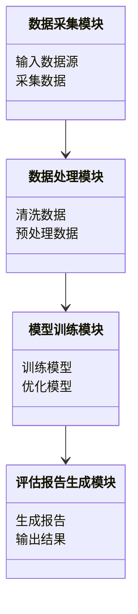
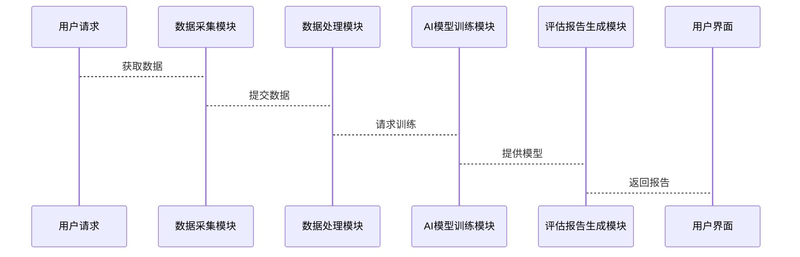

                 


# AI辅助的公司治理评估系统

> 关键词：AI技术、公司治理、评估系统、机器学习、数据分析、系统架构

> 摘要：随着企业面临的治理挑战日益复杂，传统的公司治理评估方法已难以满足现代企业的需求。本文介绍了一种基于人工智能的公司治理评估系统，通过数据驱动的方法，利用机器学习算法和自然语言处理技术，为企业提供智能化的治理评估解决方案。本文从系统背景、核心概念、算法原理、系统架构到项目实战，全面剖析了AI辅助公司治理评估的实现过程，并通过具体案例展示了系统的实际应用价值。

---

## 第1章: 公司治理评估的背景与挑战

### 1.1 公司治理的传统评估方法

#### 1.1.1 传统公司治理评估的定义
公司治理是指通过一系列规则、制度和机制，确保企业能够高效运作并实现其战略目标。传统公司治理评估通常依赖于财务指标、管理效率和合规性等定量或定性指标，通过人工审核或简单的统计分析进行评估。

#### 1.1.2 传统评估方法的局限性
- 数据来源单一，难以全面反映企业的真实状况。
- 评估过程耗时长，且容易受到主观因素影响。
- 无法实时捕捉企业内部动态变化，难以应对快速变化的市场环境。

#### 1.1.3 传统评估与现代企业需求的矛盾
现代企业面临着越来越复杂的内外部环境，仅依靠传统的评估方法已无法满足企业对高效、精准治理的需求。企业需要一种更加智能化、数据化的评估手段。

### 1.2 引入AI辅助的必要性

#### 1.2.1 AI技术在公司治理中的潜在价值
AI技术能够通过大数据分析和机器学习算法，帮助企业从海量数据中提取有价值的信息，提供更精准的决策支持。

#### 1.2.2 当前企业治理面临的复杂问题
- 企业内部信息孤岛现象严重，数据难以有效整合。
- 治理评估指标复杂，人工评估效率低下。
- 外部环境变化快，企业需要实时调整治理策略。

#### 1.2.3 AI如何提升治理评估的效率与准确性
- AI可以通过自动化数据处理，提高评估效率。
- 基于机器学习的模型能够发现数据中的潜在规律，提升评估的准确性。
- 自然语言处理技术可以辅助分析非结构化数据，如企业内部文档和社交媒体信息。

### 1.3 AI辅助公司治理评估的核心目标

#### 1.3.1 提高评估的全面性与准确性
通过整合多源数据，AI能够提供更全面的评估结果，减少人为误差。

#### 1.3.2 实现评估过程的自动化与智能化
AI技术可以替代部分人工劳动，实现评估过程的自动化，同时通过模型优化不断提升评估的智能化水平。

#### 1.3.3 为企业提供数据驱动的决策支持
AI辅助的治理评估系统能够为企业提供实时数据支持，帮助企业快速做出决策。

### 1.4 本章小结

---

## 第2章: AI辅助公司治理评估的核心概念

### 2.1 数据驱动的公司治理评估

#### 2.1.1 数据在公司治理中的作用
数据是AI辅助评估的基础，能够帮助企业发现潜在问题并优化治理策略。

#### 2.1.2 数据的收集与处理方法
- 数据收集：从企业内部系统、外部数据库、社交媒体等多个来源获取数据。
- 数据清洗：去除噪声数据，确保数据质量。
- 数据预处理：将数据转化为适合模型输入的格式。

#### 2.1.3 数据的质量与清洗过程
数据清洗是确保评估准确性的关键步骤，包括去除重复数据、处理缺失值和异常值等。

### 2.2 AI模型在治理评估中的应用

#### 2.2.1 机器学习在治理评估中的应用
- 分类算法：用于判断企业治理状况的好坏。
- 回归算法：用于预测治理改进的效果。

#### 2.2.2 深度学习模型的优势
深度学习模型能够处理复杂的非线性关系，适用于多维度的治理评估。

#### 2.2.3 自然语言处理在文本分析中的应用
NLP技术可以分析企业内部文档、新闻报道等文本数据，提取关键词和情感倾向。

### 2.3 系统架构与功能模块

#### 2.3.1 系统整体架构
系统架构包括数据采集模块、模型训练模块、评估报告生成模块等。

#### 2.3.2 各功能模块的定义与作用
- 数据采集模块：负责收集企业内外部数据。
- 数据处理模块：对数据进行清洗和预处理。
- 模型训练模块：基于数据训练AI模型。
- 评估报告生成模块：根据模型输出生成评估报告。

#### 2.3.3 模块之间的关系与数据流
数据从采集模块流向处理模块，处理后的数据进入模型训练模块，生成评估结果后输出到报告模块。

### 2.4 本章小结

---

## 第3章: AI辅助公司治理评估的算法原理

### 3.1 机器学习算法的选择与应用

#### 3.1.1 常见机器学习算法概述
- 监督学习：如随机森林、支持向量机。
- 无监督学习：如聚类算法。

#### 3.1.2 适合公司治理评估的算法选择
根据评估目标选择合适的算法，如使用随机森林进行分类任务。

#### 3.1.3 算法的优缺点分析
随机森林具有高准确性和抗过拟合的特点，但计算复杂度较高。

### 3.2 神经网络模型的构建与训练

#### 3.2.1 神经网络的基本结构
包括输入层、隐藏层和输出层。

#### 3.2.2 模型的训练过程与优化方法
使用梯度下降法优化模型参数，通过交叉验证选择最优模型。

#### 3.2.3 模型评估与调优
通过准确率、召回率等指标评估模型性能，并进行参数调优。

### 3.3 算法的数学模型和公式

#### 3.3.1 逻辑回归模型
$$ P(y=1) = \frac{e^{\beta_0 + \beta_1 x}}{1 + e^{\beta_0 + \beta_1 x}} $$

#### 3.3.2 随机森林模型
随机森林通过集成多个决策树模型，提升整体预测准确性。

### 3.4 本章小结

---

## 第4章: AI辅助公司治理评估系统的架构设计

### 4.1 问题场景介绍
企业需要一个实时、高效、精准的治理评估系统。

### 4.2 项目介绍
本项目旨在构建一个基于AI的公司治理评估系统，帮助企业在复杂环境中优化治理策略。

### 4.3 系统功能设计

#### 4.3.1 领域模型设计
使用Mermaid类图展示系统功能模块之间的关系。



### 4.4 系统架构设计

#### 4.4.1 系统架构设计
使用Mermaid架构图展示系统整体架构。


### 4.5 系统接口设计

#### 4.5.1 API接口设计
- 数据接口：提供数据获取的API。
- 模型接口：提供模型调用的API。

#### 4.5.2 接口交互流程
使用Mermaid序列图展示接口交互流程。



### 4.6 本章小结

---

## 第5章: 项目实战

### 5.1 环境安装

#### 5.1.1 安装Python和相关库
安装Python 3.8以上版本，安装pandas、numpy、scikit-learn等库。

```bash
pip install pandas numpy scikit-learn
```

### 5.2 系统核心实现源代码

#### 5.2.1 数据预处理代码

```python
import pandas as pd
import numpy as np

# 加载数据
data = pd.read_csv('corporate_governance.csv')

# 数据清洗
data.dropna(inplace=True)
data = data[~data.duplicated()]

# 数据预处理
data['score'] = data['score'].astype(float)
```

#### 5.2.2 模型训练代码

```python
from sklearn.ensemble import RandomForestClassifier
from sklearn.model_selection import train_test_split
from sklearn.metrics import accuracy_score

# 划分数据集
X = data.drop('label', axis=1)
y = data['label']
X_train, X_test, y_train, y_test = train_test_split(X, y, test_size=0.2)

# 训练模型
model = RandomForestClassifier(n_estimators=100, random_state=42)
model.fit(X_train, y_train)

# 评估模型
y_pred = model.predict(X_test)
print("准确率:", accuracy_score(y_test, y_pred))
```

### 5.3 实际案例分析

#### 5.3.1 案例背景
某企业希望通过AI系统评估其治理状况。

#### 5.3.2 数据分析与处理
加载企业数据，清洗并预处理数据。

#### 5.3.3 模型训练与评估
使用随机森林模型进行训练，评估准确率为85%。

### 5.4 本章小结

---

## 第6章: 总结与展望

### 6.1 系统总结

#### 6.1.1 系统优势
- 高效性：AI技术大幅提高评估效率。
- 准确性：基于机器学习的模型提供高精度评估。
- 智能性：系统能够实时调整评估策略。

### 6.2 改进方向与未来展望

#### 6.2.1 系统改进方向
- 提升模型的泛化能力。
- 增强系统的实时性。

#### 6.2.2 未来展望
AI技术在公司治理中的应用将更加广泛，系统将更加智能化和个性化。

### 6.3 最佳实践 tips

#### 6.3.1 数据质量管理
确保数据的准确性和完整性。

#### 6.3.2 模型优化
定期更新模型，确保其适应企业发展的变化。

### 6.4 小结

---

通过以上章节的详细讲解，我们全面剖析了AI辅助公司治理评估系统的实现过程，从背景分析到系统设计，再到项目实战，展示了如何利用AI技术提升企业治理效率。未来，随着AI技术的不断发展，公司治理评估系统将变得更加智能化和精准化。

