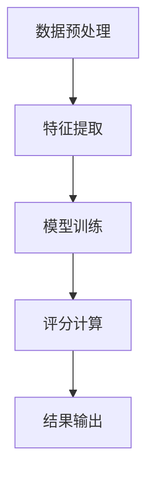
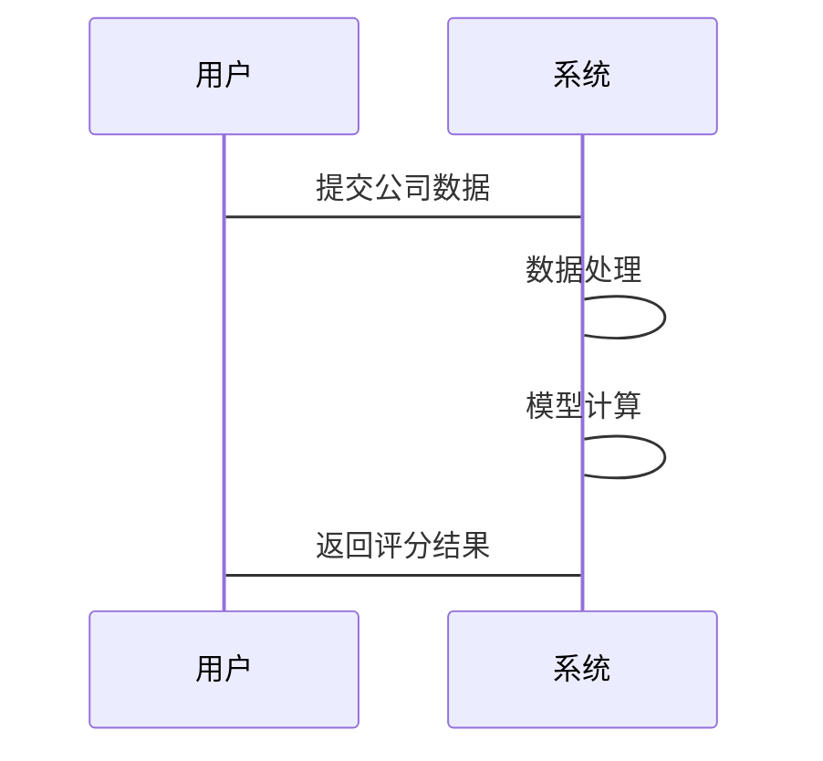

                 


```markdown
# AI辅助的公司治理评分系统

> 关键词：公司治理，人工智能，评分系统，算法原理，系统架构，项目实战

> 摘要：本文介绍了一种基于人工智能的公司治理评分系统，探讨了其核心概念、算法原理、系统架构，并通过实际案例展示了系统的实现过程和应用效果。

---

## 第一部分: 公司治理评分系统概述

### 第1章: 公司治理的基本概念

#### 1.1 公司治理的定义
- 公司治理的定义与核心要素
- 公司治理的主体与客体关系
- 公司治理的目标与功能

#### 1.2 AI技术在公司治理中的应用
- AI技术的发展与现状
- AI在企业决策中的作用
- 公司治理与AI技术的结合趋势

### 第2章: 公司治理评分系统的核心概念

#### 2.1 评分系统的定义与特点
- 评分系统的定义
- 评分系统的特征
- 评分系统的边界与外延

#### 2.2 核心概念与联系
- 公司治理评分系统的实体关系图
- 评分模型的属性特征对比

## 第二部分: AI辅助的公司治理评分系统算法原理

### 第3章: 评分模型的算法流程

#### 3.1 算法流程图


#### 3.2 算法实现
```python
def governance_score(data):
    # 数据预处理
    preprocessed_data = data清洗处理
    
    # 特征提取
    features = 提取特征函数(preprocessed_data)
    
    # 模型训练
    model = 训练模型(features)
    
    # 评分计算
    score = 计算评分(model, features)
    
    return score
```

### 第4章: 算法原理的数学模型

#### 4.1 线性回归模型
$$ y = \beta_0 + \beta_1x + \epsilon $$

#### 4.2 逻辑回归模型
$$ P(Y=1|X) = \frac{1}{1 + e^{-\beta X}} $$

## 第三部分: 系统架构与设计

### 第5章: 系统架构设计

#### 5.1 系统功能模块
- 数据采集模块
- 数据处理模块
- 模型训练模块
- 评分计算模块

#### 5.2 系统架构图


### 第6章: 系统接口设计

#### 6.1 数据接口
- 输入接口：公司治理数据
- 输出接口：治理评分结果

#### 6.2 交互流程


## 第四部分: 项目实战与案例分析

### 第7章: 项目实战

#### 7.1 环境安装
- 安装Python
- 安装相关库（如numpy, pandas, scikit-learn）

#### 7.2 核心功能实现
```python
import numpy as np
from sklearn.linear_model import LinearRegression

def calculate_governance_score(data):
    # 数据预处理
    features = data[['特征1', '特征2', ...]]
    target = data['目标变量']
    
    # 模型训练
    model = LinearRegression()
    model.fit(features, target)
    
    # 评分计算
    predictions = model.predict(features)
    
    return predictions
```

### 第8章: 案例分析

#### 8.1 实际案例
- 案例背景
- 数据收集与处理
- 模型训练与评分
- 结果分析

## 第五部分: 最佳实践与总结

### 第9章: 最佳实践

#### 9.1 小结
- 项目总结
- 经验教训

#### 9.2 注意事项
- 数据质量的重要性
- 模型选择的注意事项
- 系统维护与更新

#### 9.3 拓展阅读
- 推荐书籍与文章
- 进一步学习的方向

---

# 结语

通过本文的介绍，读者可以全面了解AI辅助的公司治理评分系统的构建过程，从理论到实践，掌握其核心算法和系统架构设计。希望本文能为相关领域的研究和应用提供有价值的参考。
```

