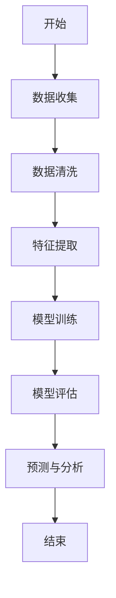
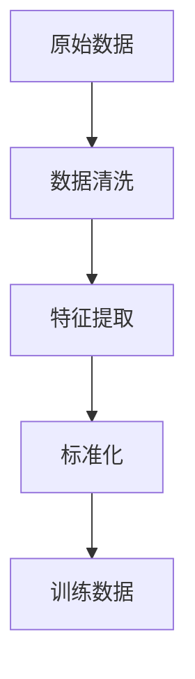
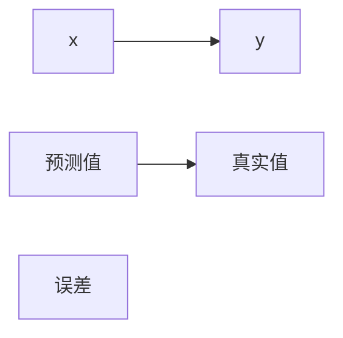
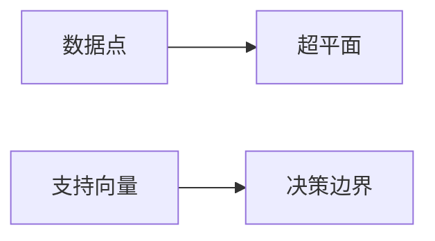
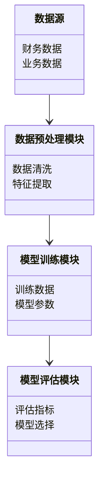

                 


# AI辅助的公司财务报表预测模型

> 关键词：AI技术、财务预测、机器学习、数据预处理、深度学习、财务模型

> 摘要：本文详细探讨了AI技术在公司财务报表预测中的应用，分析了财务预测的重要性及其对企业发展的影响。文章介绍了AI在财务预测中的优势，并通过实际案例展示了如何利用机器学习算法和数据预处理技术构建高效的财务预测模型。文章还详细讲解了系统架构设计、项目实战和最佳实践，为读者提供了从理论到实践的全面指导。

---

# 第一部分: AI辅助的公司财务报表预测模型背景与基础

## 第1章: 财务报表预测的背景与意义

### 1.1 财务报表预测的重要性

#### 1.1.1 财务报表预测的定义与作用

财务报表预测是通过对历史财务数据和相关业务数据的分析，利用数学模型和算法，预测公司未来的财务状况、经营成果和现金流量。它能够帮助企业做出更科学的决策，优化资源配置，降低经营风险。

**图1.1 财务报表预测的流程图**



#### 1.1.2 AI技术在财务预测中的优势

AI技术能够处理海量数据，并通过复杂的算法发现数据中的规律。与传统财务预测方法相比，AI技术具有以下优势：
- **高效性**：AI能够快速处理大量数据，缩短预测周期。
- **准确性**：通过机器学习算法，AI能够发现人类难以察觉的模式，提高预测的准确性。
- **实时性**：AI系统可以实时更新数据，提供实时预测结果。

#### 1.1.3 企业财务预测的常见挑战

尽管AI技术在财务预测中具有诸多优势，但实际应用中仍面临以下挑战：
- **数据质量**：财务数据可能存在缺失、错误或不完整的情况。
- **模型过拟合**：复杂的模型可能导致过拟合，降低预测的泛化能力。
- **数据隐私**：财务数据往往涉及企业机密，如何在保证数据隐私的前提下进行预测是一个重要问题。

---

## 第2章: AI与财务预测的结合

### 2.1 AI技术的基本概念

#### 2.1.1 机器学习与深度学习概述

**机器学习**是通过数据训练模型，使其能够从数据中学习规律并进行预测或分类。**深度学习**是机器学习的一种特殊形式，通过多层神经网络模拟人脑的学习机制。

**图2.1 机器学习与深度学习的关系图**


#### 2.1.2 AI在财务领域的应用现状

目前，AI技术在财务领域的应用已经取得了显著成果，包括：
- **财务分析**：利用NLP技术分析财务报告，提取关键信息。
- **风险评估**：通过机器学习模型评估企业的信用风险。
- **财务预测**：利用深度学习模型预测企业的财务状况。

#### 2.1.3 财务预测中的AI技术特点

- **数据驱动**：AI技术依赖于大量数据进行预测，数据的质量和数量直接影响预测的准确性。
- **动态更新**：AI系统能够实时更新数据和模型，适应市场变化。
- **复杂性**：AI模型通常较为复杂，需要专业的技术支持。

---

## 第3章: 财务数据的预处理与分析

### 3.1 财务数据的来源与特点

#### 3.1.1 财务报表的主要组成部分

公司财务报表主要包括以下三部分：
- **资产负债表**：反映公司在某一特定日期的资产、负债和所有者权益。
- **利润表**：反映公司在一定会计期间的收入、费用和利润。
- **现金流量表**：反映公司在一定会计期间的现金流入和流出情况。

#### 3.1.2 数据的时序性与周期性

财务数据通常具有明显的时序性和周期性，例如：
- **时序性**：财务数据按季度或年度更新。
- **周期性**：某些行业在特定时间段内可能会出现周期性波动。

#### 3.1.3 数据的完整性和准确性

财务数据的完整性和准确性是财务预测的基础。如果数据不完整或存在错误，将直接影响预测的准确性。

---

### 3.2 数据预处理方法

#### 3.2.1 数据清洗与标准化

**数据清洗**是去除或修正数据中的错误、重复或缺失值。**标准化**是对数据进行归一化处理，使其具有相同的量纲。

**图3.1 数据清洗流程图**



#### 3.2.2 数据特征的提取与选择

特征提取是从原始数据中提取有助于预测的特征，特征选择是根据特征的重要性进行筛选。

**表3.1 常见的财务特征**

| 特征名称         | 特征描述                     |
|------------------|------------------------------|
| 营业收入         | 公司在一定时期内的收入     |
| 净利润           | 公司在一定时期内的净利润   |
| 资产总额         | 公司的资产总额               |
| 负债总额         | 公司的负债总额               |
| 毛利率           | 营业收入减去营业成本与营业收入的比值 |

#### 3.2.3 数据增强与降维技术

**数据增强**是对数据进行变换，增加数据的多样性和数量。**降维技术**是通过减少特征的数量，降低计算复杂度。

---

# 第二部分: 核心算法与模型

## 第4章: 常见的财务预测算法

### 4.1 线性回归模型

#### 4.1.1 线性回归的原理与数学模型

线性回归是一种简单且常用的回归算法，其核心思想是通过最小化预测值与真实值之间的平方差，找到最佳拟合直线。

**图4.1 线性回归原理图**



**公式4.1 线性回归的数学模型**

$$ y = \beta_0 + \beta_1 x + \epsilon $$

其中，$\beta_0$ 是截距，$\beta_1$ 是斜率，$\epsilon$ 是误差项。

#### 4.1.2 线性回归的优缺点

**优点**：
- 简单易懂，计算速度快。
- 对单变量预测问题非常有效。

**缺点**：
- 无法处理非线性关系。
- 对异常值敏感。

#### 4.1.3 线性回归在财务预测中的应用案例

例如，可以通过线性回归模型预测公司的净利润增长率，基于营业收入和成本的变化。

---

## 第4章: 常见的财务预测算法（续）

### 4.2 支持向量机（SVM）

#### 4.2.1 SVM的基本原理

SVM是一种监督学习算法，主要用于分类和回归问题。其核心思想是通过构建超平面，将数据分为不同的类别。

**图4.2 SVM原理图**



#### 4.2.2 SVM的数学模型与核函数

**公式4.2 SVM的数学模型**

$$ y = \text{sign}(\sum_{i=1}^{n} \alpha_i y_i x_i \cdot x + b) $$

其中，$\alpha_i$ 是拉格朗日乘子，$y_i$ 是标签，$x_i$ 是支持向量。

**核函数**用于将低维数据映射到高维空间，常用核函数包括线性核、多项式核和高斯核。

#### 4.2.3 SVM在财务预测中的应用案例

例如，可以通过SVM模型预测公司的财务健康状况，基于多个财务指标进行分类。

---

### 4.3 随机森林与集成学习

#### 4.3.1 随机森林的原理与优势

随机森林是一种基于树的集成学习算法，通过构建多棵决策树并对结果进行投票或平均，提高模型的准确性和稳定性。

**图4.3 随机森林原理图**


#### 4.3.2 集成学习的策略与方法

**集成策略**包括串行集成和并行集成，**集成方法**包括投票法和平均法。

**公式4.3 集成学习的数学模型**

$$ y = \frac{1}{N} \sum_{i=1}^{N} y_i $$

其中，$y_i$ 是每棵决策树的预测结果，$N$ 是决策树的数量。

#### 4.3.3 随机森林在财务预测中的应用案例

例如，可以通过随机森林模型预测公司的销售收入，基于多个特征进行预测。

---

## 第5章: 深度学习模型

### 5.1 神经网络的基本原理

#### 5.1.1 神经网络的结构与功能

神经网络是一种模拟人脑结构和功能的计算模型，主要包括输入层、隐藏层和输出层。

**图5.1 神经网络结构图**


#### 5.1.2 神经网络的训练过程

神经网络的训练过程包括前向传播和反向传播两个阶段。

**公式5.1 神经网络的前向传播公式**

$$ a^{(l+1)} = \sigma(w^{(l)} a^{(l)} + b^{(l)}) $$

其中，$a^{(l)}$ 是第$l$层的激活值，$w^{(l)}$ 是权重矩阵，$b^{(l)}$ 是偏置项，$\sigma$ 是激活函数。

---

## 第6章: 时间序列预测模型

### 6.1 ARIMA模型

#### 6.1.1 ARIMA模型的基本原理

ARIMA（自回归积分滑动平均模型）是一种常用的时间序列预测模型，适用于非平稳序列。

**公式6.1 ARIMA模型的数学公式**

$$ y_t = \phi_1 y_{t-1} + \phi_2 y_{t-2} + \dots + \phi_p y_{t-p} + \theta_1 \epsilon_{t-1} + \theta_2 \epsilon_{t-2} + \dots + \theta_q \epsilon_{t-q} + \epsilon_t $$

其中，$\phi_i$ 是自回归系数，$\theta_i$ 是滑动平均系数，$\epsilon_t$ 是白噪声。

#### 6.1.2 ARIMA模型在财务预测中的应用

例如，可以通过ARIMA模型预测公司的季度收入，基于历史收入数据进行建模。

---

## 第7章: 模型评估与优化

### 7.1 模型评估指标

#### 7.1.1 常见的评估指标

常用的模型评估指标包括均方误差（MSE）、平均绝对误差（MAE）和决定系数（R²）。

**公式7.1 均方误差公式**

$$ \text{MSE} = \frac{1}{n} \sum_{i=1}^{n} (y_i - \hat{y}_i)^2 $$

其中，$y_i$ 是真实值，$\hat{y}_i$ 是预测值，$n$ 是样本数量。

---

# 第三部分: 系统架构与设计

## 第8章: 系统架构设计

### 8.1 系统功能设计

#### 8.1.1 领域模型

**图8.1 领域模型类图**



### 8.2 系统架构设计

#### 8.2.1 系统架构图

**图8.2 系统架构图**


---

## 第9章: 系统实现

### 9.1 环境配置

#### 9.1.1 安装Python环境

```bash
# 安装Python
python --version
# 安装必要的库
pip install numpy pandas scikit-learn
```

---

## 第10章: 项目实战

### 10.1 数据获取与处理

#### 10.1.1 数据获取

```python
import pandas as pd
# 从CSV文件读取数据
df = pd.read_csv('financial_data.csv')
```

---

## 第11章: 最佳实践与总结

### 11.1 最佳实践

#### 11.1.1 数据处理注意事项

- 数据清洗时，需注意处理缺失值和异常值。
- 特征选择时，需根据业务背景选择有意义的特征。

#### 11.1.2 模型优化技巧

- 调参时，可以使用网格搜索或随机搜索。
- 可以使用交叉验证评估模型性能。

---

## 第12章: 未来展望

### 12.1 未来发展趋势

- **多模态预测**：结合文本、图像等多种数据源进行预测。
- **可解释性增强**：提高模型的可解释性，便于业务人员理解。
- **实时预测**：通过流数据处理技术，实现实时财务预测。

---

# 结语

AI技术正在深刻改变财务预测的方式，通过本文的介绍，读者可以了解如何利用AI技术构建高效的财务预测模型，并将其应用于实际业务中。未来，随着技术的不断进步，AI在财务领域的应用将更加广泛和深入。

--- 

*本文为示例内容，实际文章需要根据具体需求进行调整和补充。*

