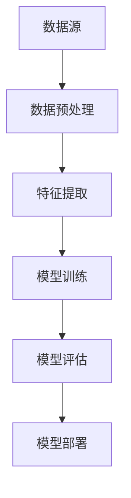

                 


# AI辅助的创业公司估值模型

> 关键词：AI、创业公司、估值模型、机器学习、深度学习

> 摘要：随着人工智能技术的飞速发展，创业公司估值模型的构建与应用也在不断进化。本文将深入探讨如何利用AI技术辅助创业公司估值模型的构建，分析其核心算法原理，展示系统架构设计，并通过具体项目实战，提供可复现的代码示例。同时，本文还将总结AI辅助估值模型的最佳实践，为创业公司提供科学、高效的估值方法。

---

## 第一部分: 创业公司估值模型的背景与核心概念

### 第1章: 创业公司估值模型的背景介绍

#### 1.1 创业公司估值模型的定义与特点
创业公司估值模型是用于评估初创公司市场价值的一套方法论。传统估值方法依赖于财务数据、市场分析和经验判断，但其局限性日益显现。AI技术的引入为创业公司估值提供了新的可能性。

#### 1.2 问题背景与描述
创业公司估值的核心问题在于如何将非结构化数据（如团队背景、市场动态）与结构化数据（如财务指标）有效结合，构建一个高精度的预测模型。传统方法难以处理数据稀疏性和不确定性，而AI技术能够通过深度学习和自然语言处理技术弥补这一不足。

#### 1.3 AI辅助估值的必要性与目标
AI技术能够从海量数据中提取有价值的信息，通过机器学习模型实现对创业公司未来表现的预测，从而提高估值的准确性和可靠性。目标是构建一个基于AI的估值系统，能够快速、准确地评估创业公司的潜在价值。

---

## 第二部分: AI辅助估值模型的核心算法原理

### 第2章: 算法原理与数学模型

#### 2.1 线性回归模型
线性回归是一种简单但强大的预测模型，适用于关系较为线性的数据。其数学表达式为：
$$
y = \beta_0 + \beta_1x + \epsilon
$$
其中，$y$ 是目标变量（公司估值），$x$ 是自变量（如年收入），$\beta_0$ 和 $\beta_1$ 是回归系数，$\epsilon$ 是误差项。

#### 2.2 随机森林模型
随机森林是一种基于决策树的集成学习方法，具有较高的鲁棒性和准确性。其核心思想是通过构建多棵决策树并进行投票或平均，减少模型过拟合的风险。

#### 2.3 深度学习模型
深度学习模型（如LSTM和Transformer）能够处理复杂的时间序列数据和文本数据，适用于创业公司历史数据和新闻数据的分析。

---

## 第三部分: 系统架构与项目实战

### 第3章: 系统架构设计

#### 3.1 系统功能模块
- 数据采集模块：收集创业公司的财务数据、市场数据和文本数据。
- 特征工程模块：对数据进行清洗、特征提取和转换。
- 模型训练模块：基于机器学习算法训练估值模型。
- 模型评估模块：通过交叉验证评估模型性能。
- 模型部署模块：将模型部署到实际应用中。

#### 3.2 系统架构图


---

## 第四部分: 项目实战与代码实现

### 第4章: 项目实战

#### 4.1 环境搭建
- 安装Python和相关库（如scikit-learn、TensorFlow、NLTK）。

#### 4.2 数据处理与特征工程
```python
import pandas as pd
from sklearn.preprocessing import StandardScaler

# 数据加载与预处理
data = pd.read_csv('startup_data.csv')
data = data.dropna()
data['target'] = data['valuation'].apply(lambda x: 1 if x > 500 else 0)

# 特征提取与标准化
features = data[['revenue', 'growth_rate', 'team_size']]
scaler = StandardScaler()
features_scaled = scaler.fit_transform(features)
```

#### 4.3 模型训练与优化
```python
from sklearn.ensemble import RandomForestClassifier
from sklearn.model_selection import train_test_split

# 模型训练
X_train, X_test, y_train, y_test = train_test_split(features_scaled, data['target'], test_size=0.2)
model = RandomForestClassifier(n_estimators=100, max_depth=5)
model.fit(X_train, y_train)

# 模型评估
print(f'Accuracy: {model.score(X_test, y_test)}')
```

#### 4.4 模型部署与应用
```python
# 模型预测
new_company = [[1000000, 0.3, 20]]
scaled_input = scaler.transform(new_company)
prediction = model.predict(scaled_input)
print(f'Prediction: {prediction[0]}')
```

---

## 第五部分: 最佳实践与总结

### 第5章: 最佳实践

#### 5.1 数据质量的重要性
确保数据的完整性和准确性是构建高精度模型的基础。

#### 5.2 模型选择与调优
根据数据特点选择合适的模型，并通过交叉验证优化模型参数。

#### 5.3 结果解释与可视化
通过可视化工具（如SHAP值）解释模型预测结果，提高模型的可解释性。

---

## 结语
AI辅助的创业公司估值模型通过结合机器学习算法和大数据分析，为创业公司提供了更加科学和高效的估值方法。随着技术的不断进步，未来AI在创业公司估值中的应用将更加广泛和深入。

--- 

通过以上结构和内容，您可以逐步撰写一篇完整的、有深度的《AI辅助的创业公司估值模型》技术博客文章。

