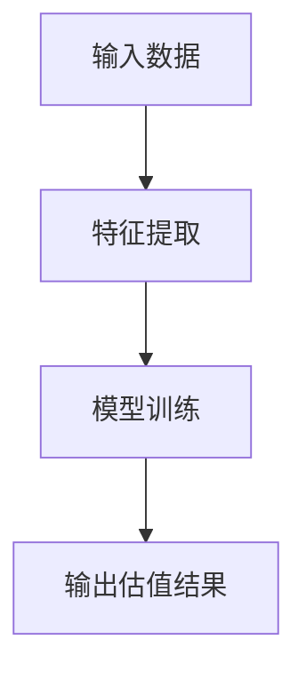
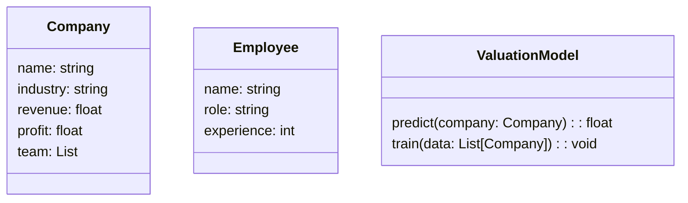
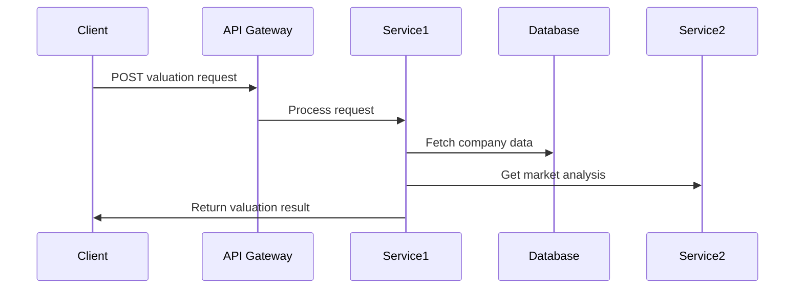

                 


# AI辅助的创业公司估值模型校准

> 关键词：创业公司估值，AI辅助，机器学习，深度学习，数据驱动

> 摘要：本文探讨了利用人工智能技术校准创业公司估值模型的方法与实践，分析了传统估值模型的局限性，并结合机器学习与深度学习算法，提出了基于数据驱动的估值模型校准策略，最终通过实际案例展示了该模型的应用效果。

---

# 第一部分: 创业公司估值模型的背景与挑战

# 第1章: 创业公司估值模型概述

## 1.1 创业公司估值的基本概念
### 1.1.1 估值的基本定义与作用
创业公司估值是企业在种子轮、天使轮、A轮等早期融资阶段的核心决策依据。传统估值方法通常采用DCF模型（现金流折现法）或“可比交易法”，但这些方法在面对创业公司数据 scarce、市场波动大、未来不确定性高等特点时显得力不从心。

### 1.1.2 创业公司的特殊性与估值挑战
创业公司的特点是：
1. 数据稀缺性：早期公司财务数据有限，市场数据不足。
2. 高不确定性：未来收入和增长难以预测。
3. 标准化困难：不同行业、不同商业模式的公司差异大。

### 1.1.3 传统估值方法的局限性
传统估值方法的不足包括：
1. 数据依赖性强，难以处理小样本问题。
2. 人工干预多，主观性较强。
3. 无法快速迭代更新，难以应对市场变化。

## 1.2 AI在创业公司估值中的应用前景
### 1.2.1 AI技术在金融领域的应用现状
AI技术已在金融领域广泛应用，包括股票预测、风险评估、信用评分等。但在创业公司估值领域，AI技术的应用仍处于探索阶段。

### 1.2.2 创业公司估值的独特需求
创业公司估值的独特需求包括：
1. 快速迭代：需要根据市场变化快速调整模型。
2. 多维数据：需要整合文本、社交网络等非结构化数据。
3. 可解释性：需要模型结果可解释，便于决策者理解。

### 1.2.3 AI辅助估值的优势与潜力
AI辅助估值的优势：
1. 数据处理能力强，可整合多维度数据。
2. 自动化程度高，可快速生成估值结果。
3. 可解释性逐渐提升，满足实际需求。

---

# 第2章: 创业公司估值模型的核心要素

## 2.1 估值模型的构建要素
### 2.1.1 财务指标的选择与权重分配
关键财务指标包括：
1. 收入增长率
2. 净利润
3. 现金流
4. 资产负债情况

权重分配需要根据行业特点和公司具体情况调整。

### 2.1.2 市场分析与行业基准
市场分析包括：
1. 行业发展趋势
2. 可比公司分析
3. 市场波动情况

### 2.1.3 创业团队与企业战略
创业团队的能力和企业战略对估值有重要影响，包括：
1. 团队背景
2. 产品竞争力
3. 市场拓展能力

## 2.2 AI辅助估值的核心原理
### 2.2.1 数据驱动的特征提取
通过NLP技术提取文本数据中的特征，如公司新闻、行业报告中的关键词。

### 2.2.2 机器学习模型的训练与优化
使用监督学习算法（如随机森林、支持向量机）进行模型训练，并通过交叉验证优化模型参数。

### 2.2.3 结果的解释与校准
通过可解释性机器学习模型（如SHAP值）分析模型输出，对估值结果进行校准。

---

# 第3章: AI辅助估值模型的算法原理

## 3.1 机器学习在估值中的应用
### 3.1.1 监督学习与无监督学习的对比
监督学习适用于有标签数据，无监督学习适用于无标签数据。

### 3.1.2 神经网络在特征提取中的作用
使用卷积神经网络（CNN）提取文本数据特征。

### 3.1.3 回归模型的估值应用
使用线性回归模型预测公司估值。

## 3.2 基于深度学习的估值模型
### 3.2.1 Transformer模型的引入
使用Transformer模型处理序列数据，如时间序列分析。

### 3.2.2 多任务学习在估值中的应用
同时预测公司估值和市场风险。

### 3.2.3 模型的可解释性问题
通过可视化技术（如注意力机制）分析模型输出。

## 3.3 算法原理图


## 3.4 代码实现示例
```python
import numpy as np
from sklearn.linear_model import LinearRegression

# 示例数据
X = np.array([[1], [2], [3], [4], [5]])
y = np.array([2, 4, 5, 4, 6])

# 模型训练
model = LinearRegression()
model.fit(X, y)

# 预测结果
print(model.predict([[6]]))
```

## 3.5 数学模型与公式
### 3.5.1 线性回归模型
$$ y = \beta_0 + \beta_1 x + \epsilon $$

---

# 第4章: 系统分析与架构设计

## 4.1 项目背景
介绍项目目标和应用场景。

## 4.2 系统功能设计
### 4.2.1 领域模型类图


### 4.2.2 系统架构图
```mermaid
graph LR
    Client --> API Gateway
    API Gateway --> Service1
    Service1 --> Database
    Service1 --> Service2
    Service2 --> Database
```

### 4.2.3 接口设计
定义API接口，如`POST /api/valuation`。

### 4.2.4 交互序列图


---

# 第5章: 项目实战

## 5.1 环境安装
安装必要的Python库，如scikit-learn、TensorFlow等。

## 5.2 核心代码实现
实现AI辅助估值模型的代码，包括数据预处理、模型训练和预测。

## 5.3 案例分析
通过实际案例展示模型的应用效果。

## 5.4 项目小结
总结项目的实施过程和成果。

---

# 第6章: 最佳实践

## 6.1 小结
总结AI辅助创业公司估值模型的核心要点。

## 6.2 注意事项
提醒读者注意数据质量和模型解释性问题。

## 6.3 拓展阅读
推荐相关书籍和论文，供读者深入学习。

---

# 参考文献
（此处列出相关文献和资料）

---

# 结语
本文详细探讨了AI辅助创业公司估值模型的构建与应用，通过理论分析和实践案例展示了该模型的优势与潜力。未来，随着AI技术的不断发展，创业公司估值模型将更加精准和高效。

