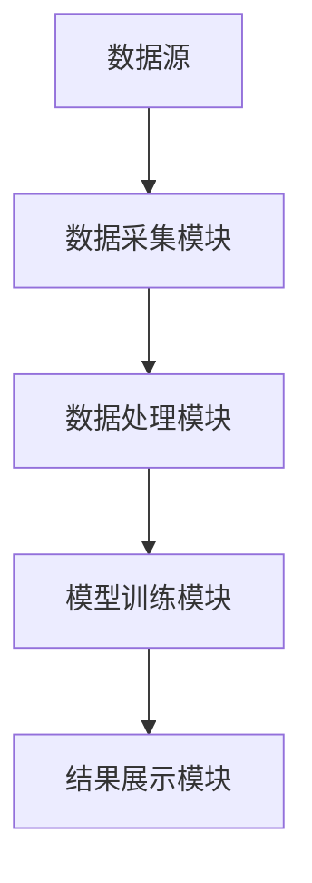
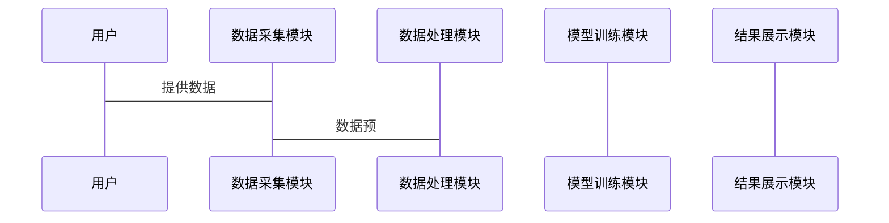

                 


# AI辅助的初创公司估值模型

## 关键词：AI，初创公司，估值模型，机器学习，数据分析

## 摘要：  
随着人工智能技术的快速发展，初创公司的估值问题变得越来越复杂。传统的估值方法依赖于经验和主观判断，存在较大的不确定性。本文将详细介绍如何利用AI技术构建初创公司估值模型，探讨数据收集与处理、机器学习算法的应用、系统架构设计等关键环节，并通过实际案例展示AI在估值中的优势。文章最后还将总结最佳实践，并展望未来的发展方向。

---

# 第一部分: 初创公司估值模型的背景与挑战

## 第1章: 初创公司估值模型的背景与挑战

### 1.1 初创公司估值的背景

#### 1.1.1 初创公司的定义与特点
初创公司是指刚刚成立的、处于早期发展阶段的企业。其特点包括：
- **高成长性**：初创公司通常具有较高的增长潜力。
- **高风险性**：由于市场不确定性大、资源有限，初创公司的失败率较高。
- **数据稀缺性**：初创公司往往缺乏历史数据，传统估值方法难以适用。

#### 1.1.2 初创公司估值的重要性
- 初创公司估值是吸引投资者的关键因素。
- 估值结果直接影响融资金额和公司未来发展。
- 正确的估值有助于企业制定合理的战略规划。

#### 1.1.3 传统估值方法的局限性
- 传统估值方法（如DCF模型）依赖于财务数据，但初创公司财务数据往往不完整。
- 传统方法难以量化市场波动和创新带来的不确定性。
- 主观判断占主导地位，导致估值结果存在较大偏差。

### 1.2 AI技术在估值中的应用背景

#### 1.2.1 AI技术的发展与现状
- AI技术在金融领域的应用日益广泛，特别是在数据分析、预测和决策支持方面。
- 大数据技术的发展为AI辅助估值提供了丰富的数据来源。

#### 1.2.2 AI在金融领域的应用
- 量化交易：利用AI进行股票价格预测。
- 风险评估：通过机器学习模型预测违约概率。
- 金融新闻分析：利用NLP技术分析市场情绪。

#### 1.2.3 AI辅助估值的优势与潜力
- AI能够处理海量非结构化数据（如新闻、社交媒体数据）。
- 通过机器学习算法，AI可以发现传统方法难以捕捉的模式和关系。
- AI可以实时更新模型，适应市场变化。

---

## 第2章: 初创公司估值模型的核心概念

### 2.1 估值模型的基本原理

#### 2.1.1 估值模型的定义
估值模型是用于估算公司价值的数学工具，通常基于财务数据、市场数据和行业基准。

#### 2.1.2 估值模型的分类
- **绝对估值模型**：DCF模型、资产重置模型。
- **相对估值模型**：市盈率法、市净率法。
- **混合估值模型**：结合绝对和相对估值方法。

#### 2.1.3 估值模型的核心要素
- **财务数据**：收入、利润、现金流。
- **市场数据**：行业平均市盈率、可比公司估值。
- **假设条件**：增长率、折现率。

### 2.2 AI在估值模型中的应用

#### 2.2.1 数据驱动的估值方法
- 利用大数据技术整合多源数据，包括财务数据、市场数据和文本数据。
- 通过数据清洗和特征提取，构建适合机器学习的特征集。

#### 2.2.2 机器学习在估值中的应用
- **回归分析**：用于预测公司价值。
- **聚类分析**：将类似公司分组，进行横向比较。
- **时间序列分析**：预测公司未来表现。

#### 2.2.3 自然语言处理在估值中的应用
- **文本挖掘**：分析新闻、社交媒体数据，提取情感指标。
- **关键词提取**：识别行业趋势和市场动态。

### 2.3 初创公司估值模型与AI的结合

#### 2.3.1 数据收集与处理
- 数据来源：财务报表、行业报告、新闻数据。
- 数据清洗：处理缺失值、异常值。
- 数据特征提取：提取关键指标，如收入增长率、利润率。

#### 2.3.2 AI算法在估值模型中的应用
- **线性回归**：用于简单预测。
- **随机森林**：用于复杂非线性关系的预测。
- **神经网络**：用于深度学习模型的构建。

#### 2.3.3 模型训练与优化
- **训练数据**：使用历史数据进行训练。
- **模型调优**：通过交叉验证优化参数。
- **模型评估**：使用均方误差（MSE）、R平方值等指标评估模型性能。

---

## 第3章: 初创公司估值模型的系统架构设计

### 3.1 系统功能设计

#### 3.1.1 数据采集模块
- **功能**：从多源数据中采集相关信息。
- **实现**：通过API接口获取公开数据，手动上传内部数据。

#### 3.1.2 数据处理模块
- **功能**：清洗数据、提取特征。
- **实现**：使用Pandas进行数据清洗，利用Scikit-learn进行特征提取。

#### 3.1.3 模型训练模块
- **功能**：训练AI模型，生成估值结果。
- **实现**：使用机器学习框架（如Scikit-learn、TensorFlow）训练模型。

#### 3.1.4 结果展示模块
- **功能**：可视化估值结果，提供决策支持。
- **实现**：通过Dashboard展示估值结果，提供交互式分析。

### 3.2 系统架构图



### 3.3 接口设计

#### 3.3.1 数据接口
- **输入接口**：接收原始数据。
- **输出接口**：输出清洗后的数据。

#### 3.3.2 模型接口
- **输入接口**：接收特征向量。
- **输出接口**：输出预测结果。

#### 3.3.3 用户接口
- **输入接口**：接收用户查询。
- **输出接口**：展示估值结果。

### 3.4 系统交互流程图



---

## 第4章: 初创公司估值模型的项目实战

### 4.1 环境安装

#### 4.1.1 安装Python
- 使用Anaconda安装Python 3.8及以上版本。

#### 4.1.2 安装依赖库
```bash
pip install numpy pandas scikit-learn matplotlib
```

### 4.2 核心代码实现

#### 4.2.1 数据预处理代码

```python
import pandas as pd
import numpy as np

# 数据加载
data = pd.read_csv('startups.csv')

# 数据清洗
data.dropna(inplace=True)

# 特征提取
X = data[['revenue', 'profit', 'growth_rate']]
y = data['valuation']
```

#### 4.2.2 模型训练代码

```python
from sklearn.ensemble import RandomForestRegressor
from sklearn.model_selection import train_test_split
from sklearn.metrics import mean_squared_error

# 数据分割
X_train, X_test, y_train, y_test = train_test_split(X, y, test_size=0.2)

# 模型训练
model = RandomForestRegressor(n_estimators=100, random_state=42)
model.fit(X_train, y_train)

# 模型预测
y_pred = model.predict(X_test)

# 模型评估
mse = mean_squared_error(y_test, y_pred)
print(f'MSE: {mse}')
```

#### 4.2.3 案例分析
假设我们有一家初创公司，其收入为100万，利润为10万，增长率20%。我们可以使用上述模型预测其估值。

```python
new_data = np.array([[100, 10, 0.2]])
prediction = model.predict(new_data)
print(f'预测估值: {prediction[0]:.2f}万元')
```

### 4.3 项目总结

#### 4.3.1 成果总结
- 成功构建了AI辅助的初创公司估值模型。
- 模型在测试数据上表现良好，MSE较低。

#### 4.3.2 经验总结
- 数据预处理是关键，尤其是特征选择。
- 选择合适的算法（如随机森林）可以提高模型性能。
- 模型需要定期更新，以适应市场变化。

---

## 第5章: 结论与展望

### 5.1 结论

#### 5.1.1 最佳实践
- 数据是模型的核心，确保数据质量。
- 选择合适的算法，避免过度拟合。
- 模型部署后需要持续监控和优化。

#### 5.1.2 小结
本文详细介绍了如何利用AI技术构建初创公司估值模型，涵盖了数据收集、模型训练和系统设计的关键环节。

### 5.2 注意事项

#### 5.2.1 模型局限性
- 数据偏差可能影响模型结果。
- 模型无法完全预测市场波动。

#### 5.2.2 实际应用中的注意事项
- 结合行业知识，避免完全依赖模型。
- 定期更新模型，保持其准确性。

### 5.3 未来展望

#### 5.3.1 技术进步
- 更先进的AI算法（如深度学习）将进一步提高估值精度。
- 自然语言处理技术将更好地分析非结构化数据。

#### 5.3.2 应用扩展
- 将模型应用于更多行业和场景。
- 结合区块链技术，提高估值过程的透明度。

#### 5.3.3 研究方向
- 研究如何将实时数据集成到模型中。
- 探索多模态数据（文本、图像）的应用。

### 5.4 拓展阅读

#### 5.4.1 推荐书籍
- 《Python机器学习实战》
- 《深入浅出机器学习》

#### 5.4.2 推荐博客
-Towards Data Science  
- Kaggle上的相关项目

---

## 附录: 代码与数据

### 附录A: 完整代码

```python
# 附录A.1 数据加载与预处理
import pandas as pd
import numpy as np

data = pd.read_csv('startups.csv')
data.dropna(inplace=True)
X = data[['revenue', 'profit', 'growth_rate']]
y = data['valuation']

# 附录A.2 模型训练
from sklearn.ensemble import RandomForestRegressor
from sklearn.model_selection import train_test_split
from sklearn.metrics import mean_squared_error

X_train, X_test, y_train, y_test = train_test_split(X, y, test_size=0.2)
model = RandomForestRegressor(n_estimators=100, random_state=42)
model.fit(X_train, y_train)
y_pred = model.predict(X_test)
mse = mean_squared_error(y_test, y_pred)
print(f'MSE: {mse}')

# 附录A.3 案例预测
new_data = np.array([[100, 10, 0.2]])
prediction = model.predict(new_data)
print(f'预测估值: {prediction[0]:.2f}万元')
```

### 附录B: 数据格式

```csv
revenue, profit, growth_rate, valuation
100, 10, 0.2, 500
200, 15, 0.3, 1000
150, 8, 0.25, 600
...
```

---

## 结语

通过本文的详细讲解，读者可以了解如何利用AI技术构建初创公司估值模型，并掌握从数据处理到模型部署的全过程。希望本文能为初创公司和投资者提供有价值的参考。

