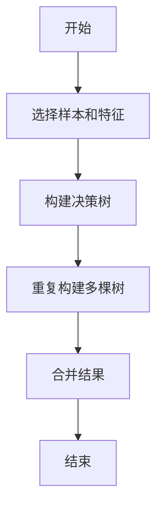
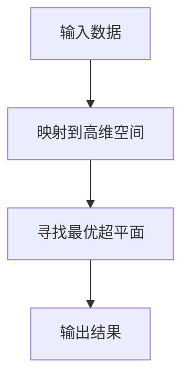
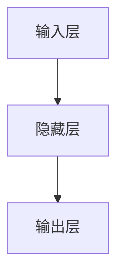
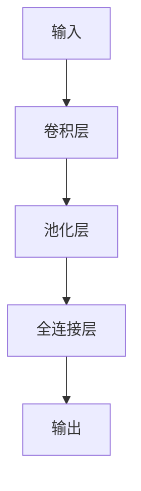
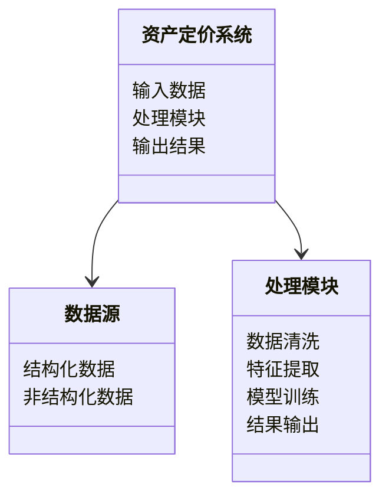
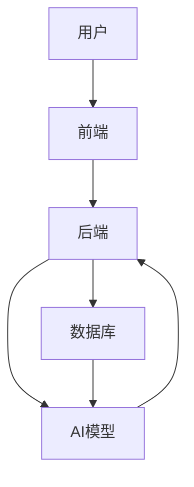

                 


# AI辅助的多资产类别定价模型

> 关键词：AI定价模型，多资产类别，机器学习，深度学习，金融定价，系统架构

> 摘要：本文深入探讨了AI技术在多资产类别定价中的应用，分析了定价模型的核心概念、算法原理、系统架构，并通过实际案例展示了如何构建高效的AI辅助定价系统。文章结合理论与实践，为读者提供了从理解到实现的完整指南。

---

## 第一部分: AI辅助的多资产类别定价模型背景介绍

## 第1章: 多资产类别定价模型概述

### 1.1 问题背景与定义

#### 1.1.1 多资产类别定价的背景

在金融领域，定价是一项复杂而关键的任务。资产类别多样，包括股票、债券、基金、房地产等，每类资产的定价受到市场波动、经济指标、公司基本面等多种因素的影响。传统的定价模型常常难以捕捉这些复杂因素，尤其是在数据量大、维度高的情况下，传统方法往往力不从心。

近年来，随着人工智能技术的飞速发展，AI在金融领域的应用日益广泛。AI技术能够处理大量非结构化数据，发现隐藏的模式，提供实时定价支持，因此在多资产类别定价中展现出巨大潜力。

#### 1.1.2 多资产类别定价的定义与特点

多资产类别定价是指对多种不同类型的资产进行价格评估的过程。与单一资产定价不同，多资产定价需要同时考虑多种资产的特性和市场环境，具有以下特点：

1. **复杂性**：涉及多种资产类别，每类资产的定价逻辑不同。
2. **动态性**：市场价格波动频繁，需要实时调整定价策略。
3. **数据多样性**：需要处理结构化数据（如财务指标）和非结构化数据（如新闻、社交媒体信息）。
4. **风险控制**：多资产定价需考虑组合风险，避免单一资产的波动影响整体定价。

#### 1.1.3 AI辅助定价的核心问题

AI辅助定价的核心问题在于如何有效地利用机器学习模型来捕捉资产价格的驱动因素，并实时更新定价策略。这涉及以下关键问题：

1. **数据处理**：如何高效地收集、清洗和整合多源数据。
2. **模型选择**：选择适合的机器学习算法，确保模型的准确性和稳定性。
3. **实时性**：如何在动态市场环境中实现快速定价更新。
4. **风险管理**：如何在多资产定价中有效控制风险。

---

### 1.2 多资产类别定价的挑战

#### 1.2.1 不同资产类别的定价难点

不同资产类别的定价具有显著差异：

- **股票**：受公司基本面、市场情绪、行业趋势等因素影响。
- **债券**：受利率变化、信用评级、宏观经济政策影响。
- **基金**：受投资策略、市场波动、管理团队影响。
- **房地产**：受经济周期、政策调控、地理位置影响。

每类资产的定价模型和影响因素不同，构建统一的多资产定价模型面临挑战。

#### 1.2.2 市场波动性与数据复杂性

金融市场波动剧烈，数据复杂多样。例如，新闻事件可能在短时间内影响资产价格，而社交媒体上的 sentiment（情绪）分析也需要纳入定价模型。如何处理这些动态数据并实时更新定价是一个难题。

#### 1.2.3 AI在定价中的作用

AI技术能够处理大量非结构化数据，通过自然语言处理（NLP）分析新闻和社交媒体，利用机器学习预测价格走势，为多资产定价提供支持。然而，AI模型的解释性较差，且容易受数据偏差影响，需要结合专家知识进行调整。

---

### 1.3 AI辅助定价的边界与外延

#### 1.3.1 定价模型的适用范围

AI辅助定价模型适用于以下场景：

- **实时定价**：需要快速响应市场变化，如高频交易。
- **组合定价**：对多资产组合进行整体定价，优化投资组合。
- **风险管理**：通过模型预测潜在风险，制定对冲策略。

#### 1.3.2 AI辅助定价的边界条件

AI定价模型并非万能的，存在一定的边界：

- **数据质量**：模型依赖高质量数据，数据缺失或偏差会影响结果。
- **模型解释性**：复杂的模型难以解释定价逻辑，可能影响决策的透明性。
- **市场环境**：模型假设可能与实际市场环境不符，导致定价误差。

#### 1.3.3 多资产定价的外延领域

多资产定价的外延包括：

- **资产配置**：根据定价结果调整资产配置比例。
- **投资策略**：制定基于定价模型的投资策略。
- **风险对冲**：利用定价模型进行风险对冲操作。

---

### 1.4 本章小结

本章介绍了多资产类别定价模型的背景、定义、特点及挑战。AI技术在多资产定价中具有重要作用，但也面临数据复杂性和模型解释性等挑战。下一章将深入探讨定价模型与AI技术的核心概念及其联系。

---

## 第二部分: 核心概念与联系

## 第2章: 定价模型与AI技术的核心概念

### 2.1 定价模型的核心要素

#### 2.1.1 资产特性与定价模型

不同资产具有不同的特性，定价模型需要针对这些特性进行调整。例如，股票定价可能需要考虑市盈率、市净率等指标，而债券定价则需要考虑信用评级和利率。

#### 2.1.2 数据特征与模型选择

数据特征直接影响模型选择。结构化数据适合传统统计模型，而非结构化数据则需要NLP技术处理。以下是不同数据类型的适用模型：

| 数据类型       | 适用模型                     |
|----------------|------------------------------|
| 结构化数据       | 线性回归、随机森林           |
| 文本数据         | NLP模型（如BERT、TF-IDF）     |
| 图像数据         | CNN、GAN                   |

#### 2.1.3 模型的输入与输出

定价模型的输入通常是各种特征变量，输出是资产的价格或价格预测值。例如，股票定价模型的输入可能是公司财务指标、市场情绪指数，输出是股票的目标价格。

---

### 2.2 AI技术在定价中的应用

#### 2.2.1 机器学习算法在定价中的作用

机器学习算法能够从大量数据中学习定价规律，例如：

- **回归算法**：用于预测资产价格。
- **分类算法**：用于判断资产是否被高估或低估。
- **聚类算法**：用于将相似资产分组，进行比较定价。

#### 2.2.2 深度学习模型的优势

深度学习模型（如神经网络、LSTM）在处理复杂数据和捕捉时间序列特征方面具有优势，特别适合高频交易和实时定价。

#### 2.2.3 自然语言处理在文本数据中的应用

NLP技术可以分析新闻、社交媒体等文本数据，提取市场情绪，辅助定价决策。例如，可以通过分析社交媒体上的 sentiment 指数调整股票定价。

---

### 2.3 定价模型

#### 2.3.1 定价模型的核心属性

定价模型具有以下核心属性：

- **准确性**：模型预测价格与实际价格的接近程度。
- **实时性**：模型能否快速响应市场变化。
- **稳定性**：模型在不同市场环境下的表现是否稳定。
- **解释性**：模型结果是否易于解释。

#### 2.3.2 定价模型的类型

定价模型可以分为以下几类：

- **单变量模型**：仅考虑单一因素，如市盈率。
- **多变量模型**：考虑多个因素，如多元回归模型。
- **时间序列模型**：基于历史数据预测未来价格，如ARIMA、LSTM。

---

### 2.4 定价模型与AI技术的关系

#### 2.4.1 定价模型与AI技术的实体关系

以下是定价模型与AI技术的实体关系图：

```mermaid
erDiagram
    class 定价模型 {
        id
        输入特征
        输出价格
    }
    class AI技术 {
        算法类型
        模型参数
    }
    定价模型 --> AI技术 : 使用
```

定价模型依赖AI技术来实现高效定价，而AI技术通过模型参数和算法类型影响定价模型的输出。

---

## 第3章: 算法原理与数学模型

### 3.1 机器学习算法原理

#### 3.1.1 随机森林算法

随机森林是一种基于决策树的集成算法，具有较高的准确性和鲁棒性。以下是随机森林的流程图：



#### 3.1.2 支持向量机

支持向量机（SVM）适用于分类和回归问题。以下是SVM的工作流程：



#### 3.1.3 神经网络

神经网络通过多层结构逼近非线性函数。以下是神经网络的结构图：



---

### 3.2 深度学习模型

#### 3.2.1 LSTM网络

LSTM适用于时间序列数据，能够捕捉长期依赖关系。以下是LSTM的结构图：

```mermaid
graph TD
    A[输入] --> B[遗忘门]
    A --> C[输入门]
    A --> D[输出门]
    B, C, D --> E[细胞状态]
    E --> F[输出]
```

#### 3.2.2 CNN网络

CNN适用于图像数据，通过卷积核提取特征。以下是CNN的结构图：



---

### 3.3 数学模型与公式

#### 3.3.1 回归模型

线性回归模型的数学公式为：

$$ y = \beta_0 + \beta_1 x_1 + \beta_2 x_2 + \dots + \beta_n x_n + \epsilon $$

其中，$y$ 是目标变量，$\beta_i$ 是回归系数，$x_i$ 是自变量，$\epsilon$ 是误差项。

#### 3.3.2 时间序列模型

ARIMA模型的数学公式为：

$$ y_t = \phi_1 y_{t-1} + \phi_2 y_{t-2} + \dots + \phi_p y_{t-p} + \theta_1 \epsilon_{t-1} + \theta_2 \epsilon_{t-2} + \dots + \theta_q \epsilon_{t-q} + \epsilon_t $$

其中，$\phi_i$ 是自回归系数，$\theta_j$ 是移动平均系数，$\epsilon_t$ 是白噪声。

---

## 第4章: 系统分析与架构设计方案

### 4.1 系统功能设计

#### 4.1.1 领域模型设计

以下是领域模型类图：



---

### 4.2 系统架构设计

以下是系统架构图：



---

## 第5章: 项目实战

### 5.1 环境安装

安装Python和相关库：

```bash
pip install numpy pandas scikit-learn tensorflow keras
```

---

### 5.2 核心代码实现

以下是股票定价的随机森林实现代码：

```python
from sklearn.ensemble import RandomForestRegressor
import pandas as pd

# 加载数据
data = pd.read_csv('stock_data.csv')

# 特征工程
features = data[['市盈率', '市净率', '营收增长率']]
target = data['股价']

# 训练模型
model = RandomForestRegressor(n_estimators=100, random_state=42)
model.fit(features, target)

# 预测价格
new_features = [[20, 30, 15]]
predicted_price = model.predict(new_features)
print(predicted_price)
```

---

### 5.3 项目总结

通过本项目，我们展示了如何利用随机森林算法进行股票定价。实际应用中，需要结合更多数据和模型调优以提高准确性。

---

## 第6章: 最佳实践与小结

### 6.1 最佳实践

- **数据质量**：确保数据清洗和特征工程的准确性。
- **模型选择**：根据数据类型选择合适的算法。
- **实时性**：优化模型以提高计算效率。
- **风险管理**：定期监控模型表现并调整策略。

### 6.2 本章小结

本文详细介绍了AI辅助的多资产类别定价模型，从背景到实现，为读者提供了全面的指导。通过实际案例，展示了如何利用AI技术提升定价效率和准确性。

---

## 第7章: 扩展阅读与参考文献

- 建议阅读《机器学习实战》、《深度学习》等书籍，深入理解算法原理。
- 关注学术期刊和行业报告，了解最新研究进展。

---

# 结语

AI辅助的多资产类别定价模型是一项复杂但充满潜力的技术。通过不断学习和实践，我们可以更好地利用AI技术优化定价策略，提升投资效率。

--- 

希望这篇文章能为您提供有价值的见解，并激发您对AI辅助定价模型的兴趣！

