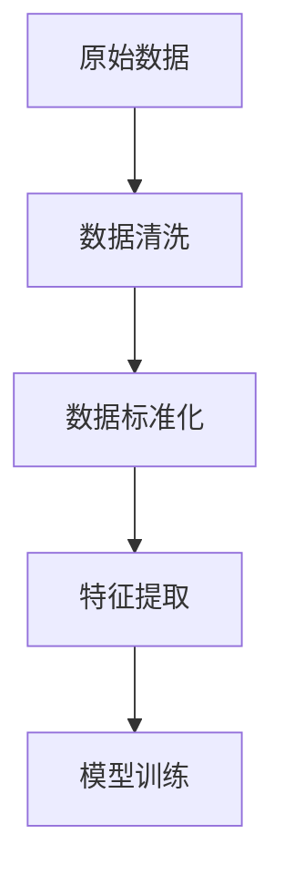
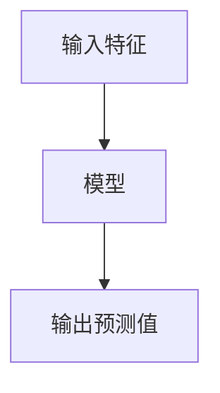

                 


# AI辅助的多资产类别收益率预测

> 关键词：AI技术、资产收益率预测、机器学习、金融数据分析、多资产类别

> 摘要：本文将详细探讨如何利用人工智能技术进行多资产类别收益率预测。从背景介绍、核心概念到具体算法实现，再到系统架构设计与项目实战，全面解析AI在金融领域的应用。通过本文，读者将能够理解AI在多资产预测中的作用，并掌握实际操作的方法。

---

# 第一部分: AI辅助的多资产类别收益率预测概述

## 第1章: AI辅助的多资产类别收益率预测背景介绍

### 1.1 问题背景

#### 1.1.1 传统资产收益率预测的局限性
传统金融分析依赖于历史数据和统计方法，但其在处理复杂多变的市场环境时存在诸多限制，例如：
- 数据量有限，难以捕捉复杂模式
- 人工分析耗时且容易受主观因素影响
- 预测结果的稳定性较差

#### 1.1.2 AI技术在金融领域的应用前景
AI技术的引入为金融分析带来了新的可能性，其优势包括：
- 高效的数据处理能力
- 精准的模式识别能力
- 自适应的动态调整能力

#### 1.1.3 多资产类别预测的复杂性与挑战
多资产类别预测涉及多个变量的交互作用，例如市场波动、经济指标、政策变化等，增加了预测的难度。

### 1.2 多资产类别定义与特点

#### 1.2.1 股票、债券、基金等主要资产类别概述
- **股票**：企业所有权的代表，收益与企业绩效密切相关。
- **债券**：债务工具，收益相对固定，风险较低。
- **基金**：通过集合资金进行投资，分散风险。

#### 1.2.2 各类资产收益率的影响因素
- **宏观经济因素**：GDP增长率、通货膨胀率、利率等。
- **市场情绪**：投资者心理对市场的影响。
- **公司基本面**：财务状况、管理团队等。

#### 1.2.3 资产类别间的相互关联性分析
资产类别之间并非孤立，例如股市下跌时资金可能流向债券，导致债券收益率下降。

### 1.3 收益率预测的核心目标与边界

#### 1.3.1 收益率预测的核心目标
- 提供未来收益率的估算值，辅助投资决策。

#### 1.3.2 预测的边界与适用场景
- 无法完全准确预测未来，但可以提供概率较高的参考。
- 适用于短期预测，长期预测难度较大。

#### 1.3.3 预测结果的解释与应用
- 预测结果需结合实际市场情况，避免机械使用。

### 1.4 本章小结
本章介绍了AI在多资产类别收益率预测中的背景、挑战及核心概念，为后续分析奠定了基础。

---

# 第二部分: AI辅助多资产收益率预测的核心概念与联系

## 第2章: AI与金融数据的关系

### 2.1 AI在金融数据分析中的作用

#### 2.1.1 数据特征提取
- 利用AI技术从大量数据中提取有用的特征，例如使用PCA进行降维。

#### 2.1.2 数据模式识别
- 通过机器学习算法识别数据中的隐藏模式，例如使用聚类分析发现市场细分。

#### 2.1.3 数据预测与优化
- 利用回归、分类等算法进行预测，并优化预测模型。

### 2.2 多资产数据流与模型构建

#### 2.2.1 数据流的ER实体关系图
```mermaid
erd
    客户: {客户ID, 姓名, 资产配置}
    资产: {资产ID, 资产名称, 资产类型}
    交易记录: {交易ID, 交易日期, 交易金额}
    预测模型: {模型ID, 模型名称, 模型类型}
    关系: 客户 -->> 资产, "持有关系"
          资产 -->> 交易记录, "交易记录"
          交易记录 -->> 预测模型, "训练数据"
```

#### 2.2.2 数据处理流程


#### 2.2.3 模型输入与输出关系


### 2.3 核心概念的数学模型

#### 2.3.1 资产收益率的数学表达
$$ R_i = r_i + \alpha_i + \beta_i (R_m - r_f) + \epsilon_i $$
其中：
- \( R_i \) 为资产收益率
- \( r_i \) 为无风险利率
- \( \alpha_i \) 为资产的特异风险
- \( \beta_i \) 为资产的系统性风险系数
- \( R_m \) 为市场平均收益率
- \( \epsilon_i \) 为随机误差项

#### 2.3.2 AI模型的输入特征
- 历史收益率
- 市场指数
- 宏观经济指标

#### 2.3.3 模型输出的解释
- 预测的未来收益率
- 预测的置信区间

## 第3章: AI驱动的金融数据处理流程

### 3.1 数据预处理

#### 3.1.1 数据清洗
- 处理缺失值：删除或填充缺失数据。
- 处理异常值：识别并处理异常点。

#### 3.1.2 数据标准化
- 使用Z-score标准化：
$$ x_{\text{标准化}} = \frac{x - \mu}{\sigma} $$
其中：
- \( \mu \) 为均值
- \( \sigma \) 为标准差

#### 3.1.3 数据增强
- 数据增强：通过增加噪声或改变时间频率来增强数据多样性。

### 3.2 特征工程

#### 3.2.1 常用特征提取方法
- 主成分分析（PCA）
- 线性判别分析（LDA）

#### 3.2.2 特征选择策略
- 基于统计的方法：如卡方检验。
- 基于模型的方法：如LASSO回归。

#### 3.2.3 特征组合与降维
- 使用特征组合方法：将多个特征组合成一个新的特征。

### 3.3 数据流与模型的关系

#### 3.3.1 数据流的可视化


#### 3.3.2 模型输入与输出的对应关系


#### 3.3.3 数据与模型的交互机制
- 数据输入：特征向量。
- 模型输出：预测值及概率。

---

# 第三部分: AI辅助多资产收益率预测的算法原理

## 第4章: 常用AI算法及其在收益率预测中的应用

### 4.1 线性回归模型

#### 4.1.1 线性回归的基本原理
线性回归是一种统计学方法，用于建立因变量与自变量之间的线性关系。

#### 4.1.2 线性回归的数学模型
$$ y = \beta_0 + \beta_1x + \epsilon $$

#### 4.1.3 线性回归的优缺点
- 优点：简单易懂，计算高效。
- 缺点：只能处理线性关系，对非线性关系表现不佳。

### 4.2 支持向量机

#### 4.2.1 SVM的基本原理
支持向量机是一种监督学习算法，适用于分类和回归问题。

#### 4.2.2 SVM的数学模型
$$ \text{minimize} \quad \frac{1}{2}\|w\|^2 + C\sum_{i=1}^n \xi_i $$
其中：
- \( w \) 为权重向量
- \( \xi_i \) 为松弛变量
- \( C \) 为惩罚参数

#### 4.2.3 SVM在非线性数据中的应用
- 使用核函数将数据映射到高维空间。

### 4.3 随机森林

#### 4.3.1 随机森林的基本原理
随机森林是一种基于决策树的集成学习方法。

#### 4.3.2 随机森林的数学模型
- 树的集合：
$$ \text{预测值} = \sum_{i=1}^n \text{树}_i(\text{输入}) $$

#### 4.3.3 随机森林在金融预测中的优势
- 抗过拟合能力强。
- 对特征重要性分析方便。

### 4.4 神经网络

#### 4.4.1 神经网络的基本原理
神经网络是一种模仿人脑结构的深度学习模型。

#### 4.4.2 神经网络的数学模型
- 损失函数：
$$ L = \frac{1}{n}\sum_{i=1}^n (y_i - \hat{y}_i)^2 $$
- 梯度下降：
$$ \theta = \theta - \eta \frac{\partial L}{\partial \theta} $$

#### 4.4.3 神经网络在多资产预测中的应用
- 处理非线性关系能力强。

---

## 第5章: 算法实现与优化

### 5.1 算法实现

#### 5.1.1 线性回归的Python实现
```python
import numpy as np
from sklearn.linear_model import LinearRegression

# 数据准备
X = np.array([1, 2, 3, 4, 5]).reshape(-1, 1)
y = np.array([2, 4, 5, 4, 6])

# 模型训练
model = LinearRegression()
model.fit(X, y)

# 预测
print(model.predict([[6]]))
```

#### 5.1.2 支持向量机的Python实现
```python
from sklearn.svm import SVR

# 数据准备
X = np.array([1, 2, 3, 4, 5]).reshape(-1, 1)
y = np.array([2, 4, 5, 4, 6])

# 模型训练
model = SVR(kernel='rb

